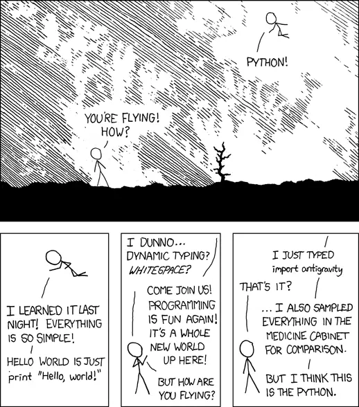

[XKCD:Python](http://xkcd.com/353/) import antigravity ...

_Crossposted from [https://jasdeepsingh.wordpress.com/2007/12/05/xkcdpython/](https://jasdeepsingh.wordpress.com/2007/12/05/xkcdpython/)_

---
### Comments:
#### [dinosaur fact](http://www.dailyfacts.org "djohnson@wcoil.com") - <time datetime="2007-12-17 14:36:29">Dec 1, 2007</time>

Guess who just brightened up my day? :) Thanks a lot!

