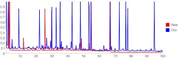

At my present job , Most of the time, I have to do changes in the legacy Java code to improve performance.

But this time i was asked to tell the extent of performance improvement due to my changes . I tried to use some Java Profiler , I tried [Eclipse TPTP](http://www.eclipse.org/tptp/) and [HPROF](http://java.sun.com/developer/TechTips/2000/tt0124.html) but due to complacency of the legacy application. I was not able to profile my changes.

So i decided to keep it simple . Log the timestamps and analyze the result. But the log generated by this was unable to show any subsequent improvement in performance as I had to log time in Milliseconds ( System.nanoTime () could not be used for Java 1.4) .

For better time precesion i googled and found this [timer library](http://www.javaworld.com/javaworld/javaqa/2003-01/01-qa-0110-timing.html?page=1) by Vladimir Roubstov.I tweaked it for my code and got the comprehesive log output.

Now to analyze the log, I wrote a python script that reads two log files and generates the time improvements in aggregation and for each run. This was the most exciting part.

```
for i in imap(lambda x,y:(x, y, x-y), [float(b) for b in new_list],[float(a) for a in old_list]):
              print '%f - %f = %f' % i 
```I wrote it in no time , [Python Rocks](http://www.google.com/search?q=python+rocks) . Then I decided to go one step further. What about plotting it on a graph. Straight away [Google Chart API](http://code.google.com/apis/chart/) came to my mind and there is [python wrapper](http://pygooglechart.slowchop.com/) to this. So I wrote this small function to produce graph for these logs.```
def draw_chart():
    from pygooglechart import Axis,SimpleLineChart
    chart = SimpleLineChart(600,200,
                        x_range=(0.000, 0.999), y_range=(0.000, 0.999))
    chart.set_colours(['ff0000', '0000ff'])
    chart.set_legend(['New','Old'])
    chart.add_data([float(a) for a in old_list])
    chart.add_data([float(b) for b in new_list])
    chart.set_axis_range(Axis.LEFT, 0.000, 0.999)
    chart.set_axis_range(Axis.BOTTOM, 1, 100)
    chart.download('D:\\my_data.png') 
```This is the graph generated for my data :```
[](http://jasdeepsingh.files.wordpress.com/2008/06/my_data1.png)
```The graph does not show much improvement though , but the post was about joys of python and APIs :)

**P.S.** : There are [Java backports](http://backport-jsr166.sourceforge.net/) for using 1.5 > features like System.nanoTime().

_Crossposted from [https://jasdeepsingh.wordpress.com/2008/06/12/joys-of-python-and-apis/](https://jasdeepsingh.wordpress.com/2008/06/12/joys-of-python-and-apis/)_

---
### Comments:
#### [manmahesh](http:// "excellence11@gmail.com") - <time datetime="2008-06-12 14:46:16">Jun 4, 2008</time>

I didnt quite understand all this, you were right, it is geeky, nerdy, intelligent - in short everything that I am not. He he he. koshish karaa'n ta samjh aa wi jau. But I can sure try - with help of course.
<hr />
