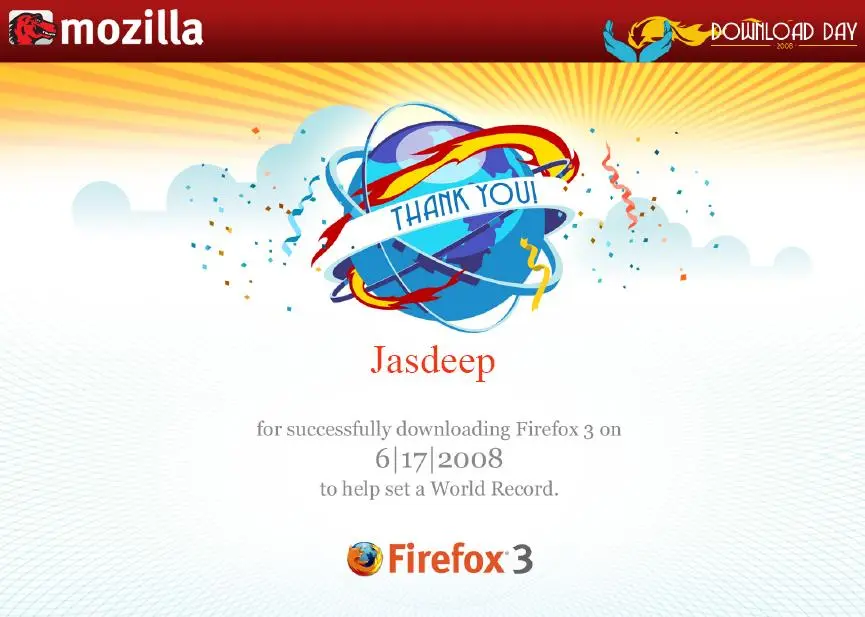

[Firefox](http://www.mozilla.com/en-US/firefox/) achieved the [world record](http://www.spreadfirefox.com/en-US/worldrecord/) for most number of downloads in a day. I was a downloader too. So i got this certificate From [Mozilla](http://www.mozilla.org/). I am part of a world record for a browser that changed the world of browsing,challenged the market hegemenoy of [Internet Explorer](http://en.wikipedia.org/wiki/Internet_Explorer) and created an ecosystem of applications around firefox with its [addons](https://addons.mozilla.org/en-US/firefox/) and [open source code](http://www.mozilla.org/hacking/coding-introduction.html).

\[wp\_caption id="attachment\_51" align="aligncenter" width="425" caption="firefox-certificate"\]\[/wp\_caption\]

If you are still using Internet Explorer, [Don't click the blue e](http://www.amazon.com/Dont-Click-Blue-Switching-Firefox/dp/0596009399) now. Download cool new [Firefox 3](http://www.mozilla.com/en-US/firefox/all.html) and be a part of a revolution, you will feel the difference.

_Crossposted from [https://jasdeepsingh.wordpress.com/2008/07/04/i-am-a-world-record-holder/](https://jasdeepsingh.wordpress.com/2008/07/04/i-am-a-world-record-holder/)_

---
### Comments:
#### [Manpreet](http://www.manmahesh.blogspot.com "excellence11@gmail.com") - <time datetime="2008-07-04 16:52:16">Jul 5, 2008</time>

me too me too me too

#### [harmeetsinghsidhu](http://harmeet.co.cc "harmeetsinghsidhu@yahoo.com") - <time datetime="2008-07-15 01:52:23">Jul 2, 2008</time>

even though i had downloaded the same.. i had not recieved the same.. anyways thinking to change that in photoshop... :)

#### [Jasdeep](http://jasdeepsingh.wordpress.com/ "jsbhangra@gmail.com") - <time datetime="2008-07-15 03:54:26">Jul 2, 2008</time>

Check this link http://www.spreadfirefox.com/en-US/worldrecord/certificate\_form and print yours...

#### [harmeetsinghsidhu](http://harmeet.co.cc "harmeetsinghsidhu@yahoo.com") - <time datetime="2008-07-16 15:31:50">Jul 3, 2008</time>

Thanks :)

