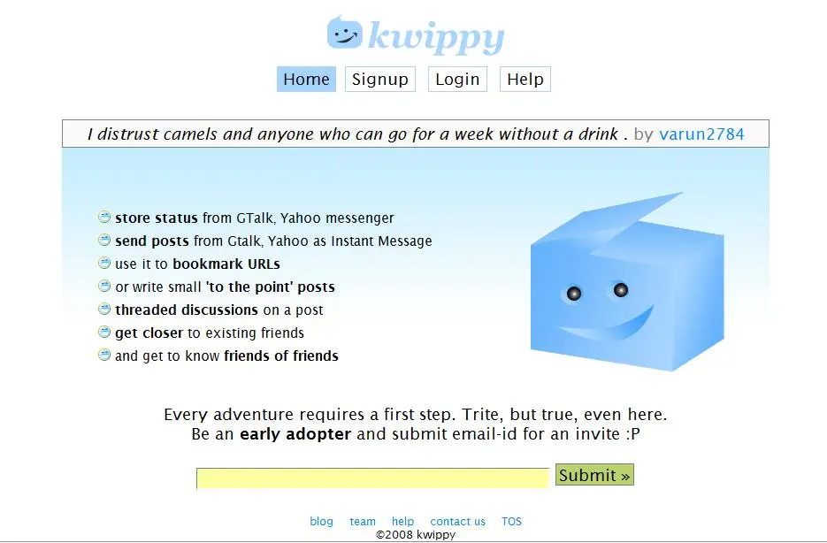

> **May be this shirt quote is witty enough, Some one will finally love me**

The origin of above quote is [xkcd](http://xkcd.com/23/) . Its human instinct to seek attention. Its deep rooted in our genes. The T-shirt quotes are one example. Same goes for the [IM](http://en.wikipedia.org/wiki/Instant_messaging) status.  The IM is yet another communication tool that has become part of our lives. Now we do set our IM statuses according to our mood or just for fun. So that friends around us might read our status message.

What about having an aggregation of all the status messages you ever set. [Kwippy](http://www.kwippy.com/) is here for that.

\[wp\_caption id="attachment\_52" align="alignleft" width="425" caption="kwippy"\]\[/wp\_caption\]

Just add Kwippy as buddy in your gtalk or yahoo messenger and get going with the storing the status messages from your IM messenger to your Kwippy account at web.

There are lot of features that Kwippy provides:

*   comment on the status messages.
*   share posts,links as instant messages.
*   have threaded discussions on a post
*   make more friends on the webosphere.

To dig more deep into [Kwippy](http://kwippy.com), its different that [twitter](http://twitter.com/), [pownce](http://pownce.com/) and other microblog services in away,I quote the [official kwippy blog](http://blog.kwippy.com/2008/04/07/kwippy/) for this:

> In kwippy, the whole focus is on the Instant Messenger. The friends list on the instant messenger is the most intimate friends list you can find, of all social networks. It gives the people in the list immediate access to your attention. People share their joys _(i got a raise)_, sorrows _(i flunked my english papers),_ their favorite links, and thousand other things through their status messages. And all these people also have a list of their closest friends on their list. And like in the real world when a real friend introduces you to another person, the chances that you hit it off are greater. There’s this trust thing which is automatic.

Moreover Kwippy is built on coolest technologies like [python](http://www.python.org/), [django](http://www.djangoproject.com/), [jQuery](http://jquery.com/), [Nginx](http://nginx.net/) and [memcached](http://www.danga.com/memcached/). They have loosely coupled the system into services, Their [blog post about its architecture](http://blog.kwippy.com/2008/07/03/technology-behind-kwippy-and-scaling/) speaks a lot about its quality of service and proclaims its bound to scale well.

I was following the twitter downtime discussions, some one was talking about Why twitter was built as a CMS why not as is messaging service ?.

I feel the same for Kwippy , Can they integrate concepts of messaging system to the kwippy architecture?

I have affinity for Kwippy because its Made in India , I have personally met the [Kwippy CEO/co-founder](http://www.kwippy.com/mayank/). The startup culture is not as happening and vibrant in India, Its on the brink of becoming a great startup environment, So Kwippy is yet another Indian startup that might become an cult/role model figure for startuppers.

Come on Kwippy dikha do !

[Follow me at kwippy](http://www.kwippy.com/jasdeep/)

_Crossposted from [https://jasdeepsingh.wordpress.com/2008/07/09/attention-guys-kwippy-here/](https://jasdeepsingh.wordpress.com/2008/07/09/attention-guys-kwippy-here/)_

---
### Comments:
#### [Manpreet](http://www.manmahesh.blogspot.com "excellence11@gmail.com") - <time datetime="2008-07-20 10:07:08">Jul 0, 2008</time>

Looks like I will have to try it too.

