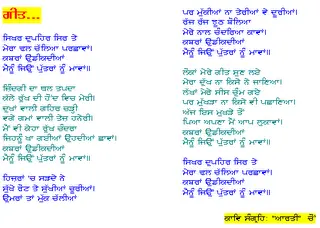
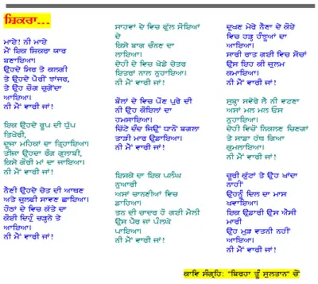

A Handful of Pains- Shiv Kumar batalvi

_Crossposted from [https://parchanve.wordpress.com/2006/05/17/a-handful-of-pains-shiv-kumar-batalvi/](https://parchanve.wordpress.com/2006/05/17/a-handful-of-pains-shiv-kumar-batalvi/)_

---
### Comments:
#### [ਜਸਵਿਂਦਰ ਸਿਂਘ]( "networkjas@gmail.com") - <time datetime="2009-10-28 15:20:12">Oct 3, 2009</time>

ਬਹੁਤ ਵਦਿਆ | ਸ਼ਿਵ ਕੁਮਾਰ ਇਕ Legend ਹੇ ਤਿ ਆਪ ਦਾ ਓਪਰਾਲਾ ਕਾਬਲੇਤਾਰਿਫ | ਇਕ ਗੁਜਾਰਸ਼ | ਜੇ ਹੋ ਸਕੇ ਤਾ ਸ਼ਿਵ ਜੀ ਦੀ ਕਵਿਤਾ "ਮਿਨੋ ਅਲਵਿਦਾ ਕਰੋ" ਵੀ ਓਪਰ ਪਾ ਦਿਓ ਧਂਨਵਾਦ

