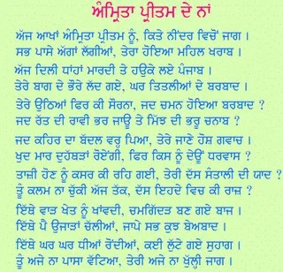
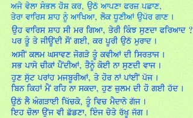
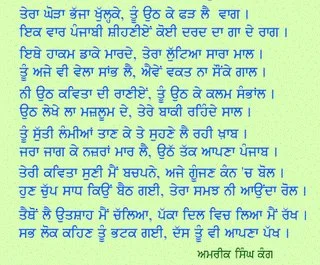

**Amreek Singh Kang- Amrit Preetam de Naam**

  

_Crossposted from [https://parchanve.wordpress.com/2005/12/06/amreek-singh-kang-amrit-preetam-de-naam/](https://parchanve.wordpress.com/2005/12/06/amreek-singh-kang-amrit-preetam-de-naam/)_

---
### Comments:
#### [Anonymous]( "") - <time datetime="2006-07-16 07:20:13">Jul 0, 2006</time>

bahut hi salhaun job kavita likhi hai amrik saab ne

#### [balwinder singh]( "jia_pota@yahoo.com") - <time datetime="2010-06-14 12:11:11">Jun 1, 2010</time>

sohnia kalma valio ise tra maboli di seva karde raho...................dhanvad

