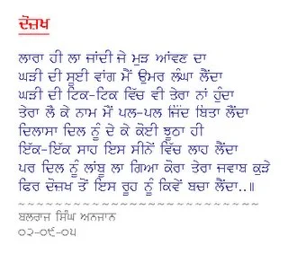

**Balraj Thind - Dozakh (Hell)** 

Content taken from [http://www.geocities.com/balrajthind78/kavita/poem\_02-09-05\_dozakh.gif](http://www.geocities.com/balrajthind78/kavita/poem_02-09-05_dozakh.gif)

_Crossposted from [https://parchanve.wordpress.com/2006/04/18/balraj-thind-dozakh-hell-con/](https://parchanve.wordpress.com/2006/04/18/balraj-thind-dozakh-hell-con/)_

---
### Comments:
#### [Anonymous]( "") - <time datetime="2006-04-28 09:17:17">Apr 5, 2006</time>

**Great Gr8**  
  
_  
es dard ka kay gam hai  
loog gaam se dara karta hai  
  
hasrat hai ke hum gaam  
ko bhi hasna sikha de  
  
jeena to usi ka sach(true)ha  
ke har sha(thing)ko muskurana sikha de  
_

#### [Lakhwinder Kaur]( "kaurlakhwinderdhaliwal49@gmail.com") - <time datetime="2018-10-05 01:34:33">Oct 5, 2018</time>

wah..!!!

