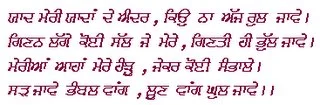

**Dard**  - _Quote by "**Gurmukh Singh musafir**_"

_Crossposted from [https://parchanve.wordpress.com/2006/01/03/dard-quote-by-gurmukh-singh-musafir/](https://parchanve.wordpress.com/2006/01/03/dard-quote-by-gurmukh-singh-musafir/)_

---
### Comments:
#### [satinder]( "") - <time datetime="2006-01-03 11:31:07">Jan 2, 2006</time>

hi jasdeep  
  
it is very nice collection  
  
plz visit www.pash.net  
also visit punjabi.org  
u got very good collection  
  
bye  
take care

#### [satinder]( "") - <time datetime="2006-01-03 11:32:16">Jan 2, 2006</time>

sorry its  
www.paash.net

#### [B S BRAR](http://indiatimes.com "bsbrar@indiatimes.com") - <time datetime="2011-07-12 12:24:28">Jul 2, 2011</time>

G S Musafir always leaves behind an impression of a lasting value. Rarae insights to his deep inner experiences.

