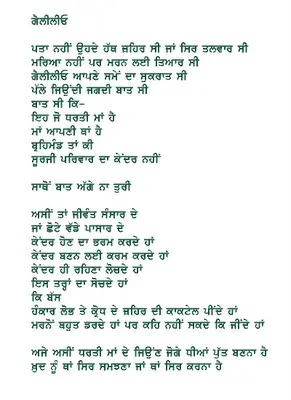

Jaswant Singh Zafar - Galileo 

http://jaswantzafar.blogspot.com/2006/03/punjabi-poems.html [Jaswant Singh Zafar](http://parchanve.wordpress.com/wp-admin/www.jaswantzafar.blogspot.com) is a poet,cartoonist and electrical engineer.

Galileo was a scientist who was murdered for saying the truth that "earth revolves around the son". Which was against earlier catholic ideas which stated that sun revoves round the earth. he was the inventor of telescope also.

_Crossposted from [https://parchanve.wordpress.com/2006/08/10/jaswant-singh-zafar-galileo/](https://parchanve.wordpress.com/2006/08/10/jaswant-singh-zafar-galileo/)_

---
### Comments:
#### [Anonymous]( "") - <time datetime="2006-08-11 04:40:31">Aug 5, 2006</time>

**Good good**  
_sadi soch da daeyra simat si  
tu sano nava rah dekheya hai  
ki hoeya je aaj tu nahi  
teri soch da, is tahrti te aaj v parcheya hai  
....._

#### [Amanpreet]( "") - <time datetime="2007-02-03 20:10:21">Feb 6, 2007</time>

22g kamal karti , aa bade wadiya posting kiti a ..........  
  
  
kush raho babeyoo

#### [n.navrahi](http://www.bhaskar.com "navrahi@gmail.com") - <time datetime="2008-04-27 12:06:59">Apr 0, 2008</time>

जसवंत जफर की कविता कमाल है नव्‍यवेश नवराही navrahi@gmail.com

#### [Jaswant Zafar](http://www.jaswantzafar.blogspot.com "jaszafar@yahoo.com") - <time datetime="2007-11-14 14:44:54">Nov 3, 2007</time>

It is nice to see my poem here. Thank you. Zafar

