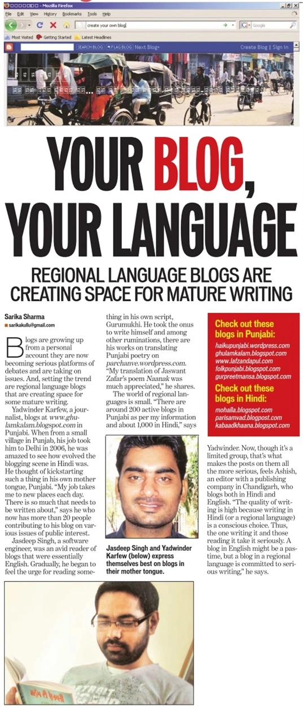

[Hindustan Times Chandigarh edition](http://epaper.hindustantimes.com//artMailDisp.aspx?article=28_08_2009_103_010&typ=1&pub=722) has featured ਸ਼ਬਦਾਂ ਦੇ ਪਰਛਾਂਵੇ… in an [article](http://epaper.hindustantimes.com//artMailDisp.aspx?article=28_08_2009_103_010&typ=1&pub=722) on regional language blogging.

ਇਹ ਖੁਸ਼ੀ ਦੀ ਗੱਲ ਹੈ ਕਿ ਮੇਨਸਟ੍ਰੀਮ ਮੀਡੀਆ ਨੇ ਪੰਜਾਬੀ ਬਲੌਗਿੰਗ  ਨੂੰ ਪਛਾਣਿਆ ਹੈ , ਅੰਗਰੇਜੀ ਬਲੌਗਿੰਗ ਪਹਿਲਾਂ ਹੀ ਇਕ ਮਹੱਤਵਪੂਰਨ ਸਥਾਨ ਹਾਸਿਲ ਕਰ ਚੁੱਕੀ ਹੈ, ਅਤੇ ਸੋਸ਼ਲ ਮੀਡੀਆ ਦੇ ਤੌਰ ਤੇ, ਕੌਨਵੈਨਸ਼ਨਲ ਮੀਡੀਆ ਨੂੰ ਟੱਕਰ ਦੇਣ ਦੇ ਕਾਬਿਲ ਹੈ, ਹਿੰਦੀ ਬਲੌਗਿੰਗ ਵੀ ਕਾਫੀ ਪਰਪੱਕ ਹੈ |

ਪੰਜਾਬੀ ਦੇ ਜਿਆਦਾਤਰ ਬਲੌਗ ਸਾਹਿਤ ਨਾਲ ਸੰਬਧਿਤ ਨੇ, ਉਮੀਦ ਹੈ ਆਉਣ ਵਾਲੇ ਸਮੇ ਵਿਚ ਪੰਜਾਬੀ ਬਲੌਗਿੰਗ ਦਾ ਘੇਰਾ ਹੋਰ ਵਿਸ਼ਾਲ ਹੋਵੇਗਾ, ਅਤੇ ਵਧ ਤੋਂ ਵੱਧ ਲੋਕ ਮਾਂ ਬੋਲੀ ਵਿਚ ਆਪਣੀ ਬੌਧਿਕ ਤਰਜਮਾਨੀ ਕਰਨਗੇ |

ਜਸਦੀਪ

[Read it in roman script](http://en.girgit.chitthajagat.in/wp.me/p4wof-4N)

\[caption id="attachment\_298" align="alignnone" width="479" caption="HT story on Punjabi blogs"\]\[/caption\]

[Read Full Story](http://epaper.hindustantimes.com//artMailDisp.aspx?article=28_08_2009_103_010&typ=1&pub=722)

_Crossposted from [https://parchanve.wordpress.com/2009/08/29/parchanve-featured-in-hindustan-times/](https://parchanve.wordpress.com/2009/08/29/parchanve-featured-in-hindustan-times/)_

---
### Comments:
#### [deepinder](http://folkpunjabi.blogspot.com/ "deepindersingh@rocketmail.com") - <time datetime="2009-10-01 17:40:21">Oct 4, 2009</time>

ਚੰਗੀ ਗੱਲ ਆ । ਪਰ ਯਾਰ ਇਹ "Read Full Story" ਪੂਰਾ ਕਿਉਂ ਨਹੀਂ ਖੁੱਲ੍ਹ ਰਿਹਾ?

