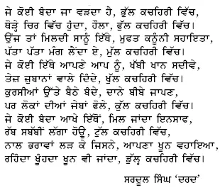

**Sardool Singh 'Dard' - Kachihari**

Content Taken from Sardool Singh Dard's Novel "Ikk See Shareefan"

_Crossposted from [https://parchanve.wordpress.com/2005/12/14/sardool-singh-dard-kachihari/](https://parchanve.wordpress.com/2005/12/14/sardool-singh-dard-kachihari/)_

---
### Comments:
#### [satinder]( "") - <time datetime="2005-12-16 13:31:25">Dec 5, 2005</time>

hi jasdeep  
i read ur collection  
**its a real fact** which this poem describe  
nice one

#### [Anonymous]( "") - <time datetime="2006-07-16 07:12:30">Jul 0, 2006</time>

bahut hi changi likhi hoyi kavita. Ajj de halaatan naal rubru karwaondi hai .

#### [paramjit]( "param354@gmail.com") - <time datetime="2014-07-25 14:19:02">Jul 5, 2014</time>

very nice

