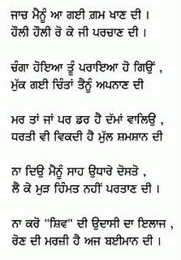

**Shiv Kumar Batalvi - Jaach Mainu Aa Gayee**

Picture content taken from [www.apnaorg.com](http://www.apnaorg.com)

_Crossposted from [https://parchanve.wordpress.com/2005/11/29/shiv-kumar-batalvi-jaach-mainu-aa-gayee/](https://parchanve.wordpress.com/2005/11/29/shiv-kumar-batalvi-jaach-mainu-aa-gayee/)_

---
### Comments:
#### [Anonymous]( "") - <time datetime="2005-12-03 06:54:48">Dec 6, 2005</time>

very touching ..  
Great! have you analyzed shiv made fame by his failure in love.  
  
Even failures can carry new success to u....  
  
Do add something inspirational in ur blog.  
  
good efforts.  
100 marks

#### [satinder]( "") - <time datetime="2005-12-16 13:31:39">Dec 5, 2005</time>

hi jasdeep  
ur this collection dil nu choo gai  
dard da badshah shiv kumar batalvi  
aj pher chaa gaya  
good effort & all the best

#### [er.shubhneet ghuman]( "er.shubhneetghuman@gmail.com") - <time datetime="2010-07-13 07:16:28">Jul 2, 2010</time>

S.S.AKAAL JASDEEP.................. tuhada bahut bahut thanks........... aj tan rooh nasheya gyi.......... super up collection God bless u punjab de putra

#### [Rajan]( "rcvapr@yahoo.com") - <time datetime="2010-03-31 00:06:58">Mar 3, 2010</time>

La jawab !

#### [ਸ਼ਮਸ਼ੇਰ ਸਿੰਘ ਸੰਧੂ, ਕੈਲਗਰੀ, ਕੈਨੇਡਾ]( "ssandhu37@yahoo.ca") - <time datetime="2011-07-28 01:30:01">Jul 4, 2011</time>

ਪੈਰ ਨੰਗੇ ਬਿਖਮ ਰਸਤਾ ਔਂਦਾ ਤੇਰੇ ਤੀਕ ਹੈ ਯਾਦ ਤੇਰੀ ਹੈ ਸਤਾਂਦੀ ਸੁਲਗਦੀ ਇਕ ਲੀਕ ਹੈ। ਨਾ ਕਦੀ ਰਸਤੇ ਤੇ ਵਿਛੀਆਂ ਫੁੱਲ ਕਲੀਆਂ ਇਸ਼ਕ ਦੇ ਨਾ ਕਿਸੇ ਜਾਣੀਹੈ ਵਿਥਯਾ ਦਿਲ ਦੀ ਕੀ ਤਹਿਕੀਕ ਹੈ। ਚਾਨਣਾ ਹੈ ਦਿਲ ਦਾ ਮੈਨੂੰ ਰਾਹ ਰਸਤੇ ਦੱਸਦਾ ਚਾਹਿ ਰਸਤਾ ਔਝੜੀਂ ਤੇ ਘੋਰ ਹੀ ਤਾਰੀਕ ਹੈ। ਬੰਦਸ਼ਾਂ ਤੇ ਬੇੜੀਆਂ ਨੇ ਭਾਗ ਮੇਰੇ ਹੀ ਸਦਾ ਇਸ਼ਕ ਪੈਰਾਂ ਮੇਰਿਆਂ ਨੂੰ ਦੇ ਰਿਹਾ ਤਹਿਰੀਕ ਹੈ। ਤੋੜਕੇ ਰਸਮਾਂ ਦੀ ਬੰਦਸ਼ ਵੇਗ ਆਏ ਚਾਲ ਵਿਚ ਖ਼ਾਰ ਚਾਹਿ ਨੇ ਵਿਛੇ ਮੰਜ਼ਲ ਵੀ ਹੁਣ ਨਜ਼ਦੀਕ ਹੈ। ਰਾਣਿਆਂ ਤੇ ਰਾਜਿਆਂ ਨੇ ਰਾਜ ਕੀਤਾ ਧਰਤ ਤੇ ਇਸ਼ਕ ਦਿਲ ਤੇ ਰਾਜ ਕਰਦਾ ਜੀਣਦਾ ਪਰਤੀਕ ਹੈ। ਪੁਲਸਰਾਤੋਂ ਲੰਘਣਾ ਸੁਣਦੇ ਹਾਂ ਮੁਸ਼ਕਲ ਹੈ ਬੜਾ ਪੁਲ ਮੁਹੱਬਤ ਦਾ ਪਿਆਰੇ ਓਸ ਤੋਂ ਬਾਰੀਕ ਹੈ। ਮੰਗਦੀ ਹੈ ਧਰਤ ਸਾਰੀ ਛਾਂਵ ਠੰਡੀ ਪਿਆਰ ਦੀ ਪਿਆਰ ਰੂਹਾਂ ਨੂੰ ਮਿਲਾਵੇ, ਰੱਬ ਦਾ ਪਰਤੀਕ ਹੈ। ਸ਼ਮਸ਼ੇਰ ਸੀੰਘ ਸੰਧੂ

