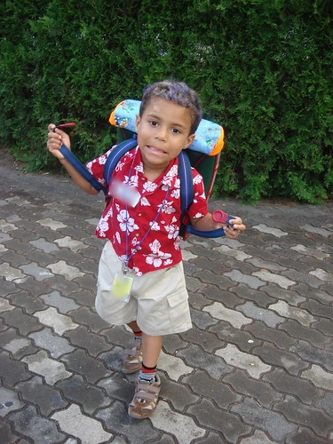

the ponderous school bags longer are the paths my feet are tiresome and shoulders inflamed carry so much of load are we donkeys ?

the teacher will come dictate his commandment : "open your books and recite after me" why to recite after him are we parrots ?

lets go, boy go lets get on our seats if we get little late what will it take ? the teacher will come and scold us well we are on the move of course , are we standing still ?

ਭਾਰੇ ਭਾਰੇ ਬਸਤੇ ਲੰਮੇ ਲੰਮੇ ਰਸਤੇ ਥੱਕ ਗਏ ਨੇ ਗੋਡੇ ਦੁਖਣ ਲੱਗ ਪਏ ਮੋਢੇ ਐਨਾ ਭਾਰ ਚੁਕਾਇਆ ਏ ਅਸੀਂ ਕੋਈ ਖੋਤੇ ਆਂ ?

ਟੀਚਰ ਜੀ ਆਉਣਗੇ ਆ ਕੇ ਹੁਕਮ ਸੁਣਾਉਣਗੇ : ਚਲੋ ਕਿਤਾਬਾਂ ਖੋਲ੍ਹੋ ਪਿੱਛੇ ਪਿੱਛੇ ਬੋਲੋ । ਪਿੱਛੇ ਪਿੱਛੇ ਬੋਲੀਏ ਅਸੀਂ ਕੋਈ ਤੋਤੇ ਆਂ ?

ਚਲੋ ਚਲੋ ਜੀ ਚੱਲੀਏ ਜਾ ਕੇ ਸੀਟਾਂ ਮੱਲੀਏ ਜੇਕਰ ਹੋ ਗਈ ਦੇਰ ਕੀ ਹੋਵੇਗਾ ਫੇਰ ਟੀਚਰ ਜੀ ਆਉਣਗੇ ਝਿੜਕਾਂ ਖ਼ੂਬ ਸੁਣਾਉਣਗੇ

ਤੁਰੇ ਹੀ ਤਾਂ ਜਾਨੇ ਆਂ ਅਸੀਂ ਕੋਈ ਖੜੋਤੇ ਆਂ ?

**Transliteration:** Bhare bhare baste Lame lame raste Thakk gaye ne gode Dukhan lag paye modhe Aina bhar chukaya ae Asin koi khote aan?

Teacher jee aange Aake hukam sunaonge Chalo kitaban kholo Picche picche bolo Picche picche boliye Asin koi tote aan?

Chalo chalo jee chaliye Jake seatan maliye Jekar ho gayee der Ki hovega pher Teacher jee aange Jhirkan khub sunaonge Ture hi tan jane aan Asin koi khalote aan?

**Source :** [Surjeet Patar](http://parchanve.wordpress.com/category/surjeet-patar/) is renowned Punjabi poet. Thanks to [Jay Pee](http://punjabpanorama.blogspot.com/2010/03/blog-post.html) for posting the original poem. English translation is by yours truly.

Indian Education system (especially elementery) is in deep disarray, It needs an revolutionary overhaul not just reforms, The privatization in the name of reforms is just making education more costly rather than qualitative.

Image Courtesy Flickr : http://farm2.static.flickr.com/1409/1246320084\_db6f7b706b.jpg

Nothing selected

Nothing selected

_Crossposted from [https://parchanve.wordpress.com/2010/03/17/baste/](https://parchanve.wordpress.com/2010/03/17/baste/)_

---
### Comments:
#### [ਡਾ. ਹਰਦੀਪ ਕੌਰ ਸੰਧੂ](http://punjabivehda.wordpress.com "punjabivehda@gmail.com") - <time datetime="2010-03-19 10:24:27">Mar 5, 2010</time>

ਨਾ ਖੋਤੇ ਆਂ, ਨਾ ਖੋਤੇ ਬਣੀਏ ਨਾ ਤੋਤੇ ਆਂ, ਨਾ ਤੋਤੇ ਬਣੀਏ ਚੱਲ ਆਜਾ ਸਿਸਟਮ ਸਾਰਾ ਚੇਂਜ ਕਰੀਏ ਸਮਝ ਕੇ ਪੜ੍ਹਨਾ ਆਪਾਂ ਸ਼ੁਰੂ ਕਰੀਏ ਟੀਚਰ ਜੀ ਦੇ ਹੁਕਮਾਂ ਦੀ ਆਪਾਂ ਕਦਰ ਕਰੀਏ ਨਾ ਖੜੋਤੇ ਆਂ, ਨਾ ਆਉਣ ਦੇਵਾਂਗੇ ਖੜੋਤ ਸਾਰਿਆਂ ਤੋਂ ਉਚਾ ਨਾਉਂ ਆਪਣਾ ਕਰੀਏ ਅੱਜ ਸੱਚਮੁੱਚ ਹੀ ਭਾਰਤੀ ਐਜੂਕੇਸ਼ਨ ਸਿਸਟਮ ਨੂੰ ਬਦਲਣ ਦੀ ਲੋੜ ਹੈ। ਆਜੋ ਸ਼ੁਰੂਆਤ ਆਪਾਂ ਕਰੀਏ।

#### [Snow Leopard](http://unpredictableblog.wordpress.com/ "prateek@crazyengineers.com") - <time datetime="2010-09-09 18:17:22">Sep 4, 2010</time>

A very good poem and an equally good comment by Dr. Hardeep. We certainly need to make changes in the system and we have to do it.

#### [B D Sharma]( "bdsharmabfc@yahoo.co.in") - <time datetime="2011-04-29 05:11:45">Apr 5, 2011</time>

Surely we feel honoured for being contemporary of such a great poet as Surjit Pattar.I really adore him

#### [jyoti]( "frndzz4evr_2k1@yahoo.ca") - <time datetime="2011-05-29 21:57:10">May 0, 2011</time>

absolutely brilliant. i was only 13 years old when this poem was published in a news paper and my dad recited it to me and my brother. currently 27 years old with a daughter and was talking to her about school those days and remembered this poem ,could only remember a few lines ,thought if i could find it somewhere and voila! i did. just thought i would share this as this poem left an unforgettable happy memory in my mind.

#### [Ajaypal Singh](http://mildly-unhinged.blogspot.com "Ajaypal264@gmail.com") - <time datetime="2012-02-16 09:23:09">Feb 4, 2012</time>

Another amazing piece of art by surjit patar and equally well written translation..I personally like this small piece very much and also wrote a translation sometime back, which perhaps might be a tad inaccurate, but beginner's blunders eh?... http://mildly-unhinged.blogspot.in/2011/12/heavy-heavy-satchels.html This says so much about how i felt during my entire stint in the education system.

#### [yaad brar]( "yaadbrar91@gmail.com") - <time datetime="2012-06-06 04:57:59">Jun 3, 2012</time>

vry nc ustaad g

#### [rupinder pal singh]( "rubalsinghak47@yahoo.in") - <time datetime="2012-12-01 11:17:19">Dec 6, 2012</time>

punjabi boli de mai sadke janda ha , te rabb da shukar karda ha ki mai punjabi ha te eho jahia dil nu khich paun waila parr ,likh te samj sakda ha.

#### [Roopak]( "roopakbatish786@gmail.com") - <time datetime="2017-07-16 13:18:27">Jul 0, 2017</time>

This poem was very famous our theatre guru Sh.Tony Batish played this poem with lot of punjab students and it is one my favorite poem.we missed our school time.

#### [Avneet Kaur](http://1022s2177 "hardevsinghrandhawa8360348989@gmail.com") - <time datetime="2018-10-30 18:54:36">Oct 2, 2018</time>

It is very wonderful to me

#### [Avneet Kaur](http://1022s2177 "hardevsinghrandhawa8360348989@gmail.com") - <time datetime="2018-10-30 18:55:52">Oct 2, 2018</time>

It is very wonderful to me

#### [Avneet Kaur](http://1022s2177 "hardevsinghrandhawa8360348989@gmail.com") - <time datetime="2018-10-30 18:56:43">Oct 2, 2018</time>

It is very wonderful to me that you are very smart and I am not sure what to do with typing this email

