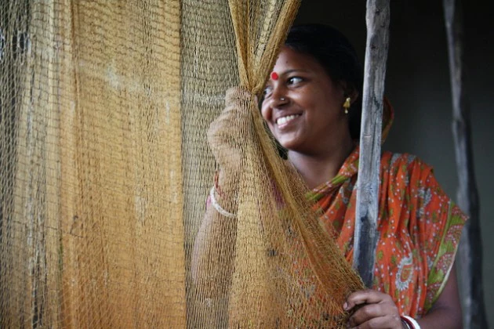

\[caption id="" align="alignnone" width="630"\] Image Courtesy : [UN Women/Anindit Roy- Chowdhury](http://www.flickr.com/photos/unwomen/6198350643/) \[/caption\]

\[soundcloud url="http://api.soundcloud.com/tracks/104361875" iframe="true" /\]

\[scribd id=158620284 key=key-pgi5o1yunfh3j7yfuvc mode=scroll\]

Mull Di Teevien is a short story written by British Punjabi author [Veena Verma](http://en.wikipedia.org/wiki/Veena_Verma) ( [Veena Verma in her village Budhladha](https://www.youtube.com/watch?v=zzlH1QQhb8M) ).  It is considered to be [among the best stories written in Punjabi](https://twitter.com/VehlaComrade/status/361592951173947394)

Story is about A Bengali woman who is 'bought' by a Punjabi truck driver. She stays at his village for some time. What happens when he tries to get rid of the 'Bought Woman'.

It was scanned and uploaded to internet by [Agampreet](https://twitter.com/VehlaComrade), I recorded the audio rendition of the story. Agampreet edited the recording.

\- Jasdeep +919988638850 jasdeep \[dot\] jogewala \[at\] gmail \[dot\] com

_Crossposted from [https://parchanve.wordpress.com/2013/08/07/mull-di-teevien/](https://parchanve.wordpress.com/2013/08/07/mull-di-teevien/)_

---
### Comments:
#### [Hari Jalota]( "hariom_jalota@yahoo.com") - <time datetime="2015-08-19 07:35:42">Aug 3, 2015</time>

Excellent,extra ordinary.Thnx

#### [armeenkaur](http://armeenkaur.wordpress.com "kaur.armeen@gmail.com") - <time datetime="2017-08-17 10:09:18">Aug 4, 2017</time>

which year was the book published in?

#### [Jasdeep](http://jasdeepsingh.wordpress.com/ "jsbhangra@gmail.com") - <time datetime="2017-08-17 10:59:13">Aug 4, 2017</time>

It was first published in 1992.

