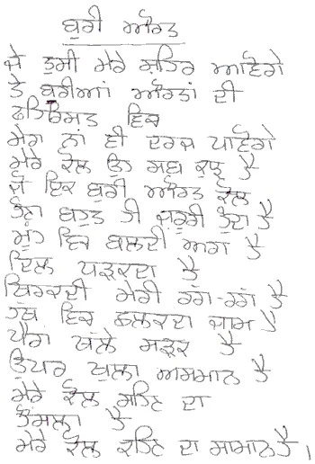

**Buri Aurat** Je tusiN mere shehar aavoge te buriaN aurtaN di fehrist vich mera naN vi darj paavoge mere kol oh sab kuch hai jo ikk buri aurat kol hona bohat hi jaroori hunda hai mooNh vich baldi agg hai dil dadhkada hai thirkadi meri rag rag hai hathth vich chalkada jaam hai pairaN thalle sadak hai uppar khulla asmaan hai mere kol sehan da hausala hai mere kol kehan da samaan hai

**WICKED WOMAN** If you come to my city you are bound to find my name in the roster of wicked women I have all that it takes to be as wicked as they come I have a goblet brimming over in my hand My laughter is known for its abandon Flames find a home in my mouth My hear beats and every nerve does a little dance The road is at my feet And just the sky above I have the courage to bear and express myself without fear

**Source:** [Nirupama Dutt](http://india.poetryinternationalweb.org/piw_cms/cms/cms_module/index.php?obj_id=7451) is well known Punjabi Poet and Journalist. The translation is also done by her. She has published one volume of poems – ਇੱਕ ਨਦੀ ਸਾਂਵਲੀ ਿਜਹੀ Ik Nadi Sanwali Jahi (A Stream Somewhat Dark) – for which she was awarded the Delhi Punjabi Akademi Award in 2000.She is part of many literary and women organizations in Delhi and Chandigarh. [Link to source of this poem](http://india.poetryinternationalweb.org/piw_cms/cms/cms_module/index.php?obj_id=7462)

_Crossposted from [https://parchanve.wordpress.com/2007/11/29/buriaurat/](https://parchanve.wordpress.com/2007/11/29/buriaurat/)_

---
### Comments:
#### [Sunita Ghosh]( "sunitas108@gmail.com") - <time datetime="2010-03-13 05:10:46">Mar 6, 2010</time>

Neeru, This is so much you ...frank and fearless... love you for what you are!

#### [Mampi](http://www.manmahesh.blogspot.com "excellence11@gmail.com") - <time datetime="2010-03-08 15:11:09">Mar 1, 2010</time>

I love this poem. THanks for posting it here. Happy women's day.

#### [Ankur Thatai](http://www.atimages.in "thataiankur@gmail.com") - <time datetime="2011-12-03 08:46:04">Dec 6, 2011</time>

Your words reached to me!!!!

