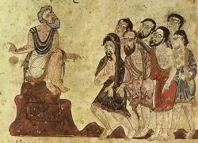

**ਚੁੱਪ ਕਰਕੇ ਕਰੀਂ ਗੁਜ਼ਾਰੇ ਨੂੰ **

ਸੱਚ ਸੁਣਕੇ ਲੋਕ ਨਾਂ ਸਹਿੰਦੇ ਨੇ, ਸੱਚ ਆਖਿਆ ਤੇ ਗੱਲ ਪੈਂਦੇ ਨੇ ਫਿਰ ਸੱਚੇ ਪਾਸ ਨਾਂ ਬਹਿੰਦੇ ਨੇ, ਸੱਚ ਮਿੱਠਾ ਆਸ਼ਿਕ ਪਿਆਰੇ ਨੂੰ ਚੁੱਪ ਕਰਕੇ ਕਰੀਂ ਗੁਜ਼ਾਰੇ ਨੂੰ

ਸੱਚ ਸ਼ਰਾ ਕਰੇ ਬਰਬਾਦੀ ਏ, ਸੱਚ ਆਸ਼ਿਕ ਦੇ ਘਰ ਸ਼ਾਦੀ ਏ ਸੱਚ ਕਰਦਾ ਨਵੀਂ ਆਬਾਦੀ ਏ, ਜਿਹਾ ਸ਼ਰਾ ਤਰੀਕਤ ਹਾਰੇ ਨੂੰ ਚੁੱਪ ਕਰਕੇ ਕਰੀਂ ਗੁਜ਼ਾਰੇ ਨੂੰ

ਚੁੱਪ ਆਸ਼ਿਕ ਤੋਂ ਨਾਂ ਹੁੰਦੀ ਏ, ਜਿਸ ਆਈ ਸੱਚ ਸੁਗੰਧੀ ਏ ਜਿਸ ਮਾਹਲ ਸੁਹਾਗ ਦੀ ਗੁੰਦੀ ਏ, ਛੱਡ ਦੁਨੀਆਂ ਕੂੜ ਪਸਾਰੇ ਨੂੰ ਚੁੱਪ ਕਰਕੇ ਕਰੀਂ ਗੁਜ਼ਾਰੇ ਨੂੰ

ਬੁੱਲਾ ਸ਼ਾਹ ਸੱਚ ਹੁਣ ਬੋਲੇ ਹੈ, ਸੱਚ ਸ਼ਰਾ ਤਰੀਕਤ ਫੋਲੇ ਹੈ ਗੱਲ ਚੌਥੇ ਪਦ ਦੀ ਖੋਲੇ ਹੈ, ਜਿਹਾ ਸ਼ਰਾ ਤਰੀਕੇ ਹਾਰੇ ਨੂੰ ਚੁੱਪ ਕਰਕੇ ਕਰੀਂ ਗੁਜ਼ਾਰੇ ਨੂੰ -  ਬੁੱਲੇ ਸ਼ਾਹ

**Chup kareke kareen guzaare nu**

Sach sunke lok na sehnde ne, sach aakhiye te gal painde ne Phir sache paas na behnde ne, sach mitha aashiq pyaare nu Chup kareke kareen guzaare nu

Sach shara kare barbaadi ai, sach aashiq de ghar shaadi ai Sach karda naveen abaadi ai, jiha shara tareekat hare nu Chup kareke kareen guzaare nu

Chup aashiq to na hundi ai, jis aayi sach sugandhi ai Jis maahl suhaag di gundi ai, chadd duniya kood pasaare nu Chup kareke kareen guzaare nu

Bulla Shah sach hun bole hai, sach shara tareekat phole hai Gal chauthe pad di khole hai, jiha shara tareeke haare nu Chup kareke kareen guzaare nu

\- Bulle Shah

**Stay silent to survive. **

People cannot stand to hear the truth. They are at your throat if you speak it. They keep away from those who speak it. But truth is sweet to its lovers!

Truth destroys shara. Brings rapture to its lovers, And unexpected riches, Which shara obscures. Stay silent to survive.

Those lovers cannot remain silent Who have inhaled the fragrance of truth. Those who have plaited love into their lives, Leave this world of falsehood. Stay silent to survive

Bulla Shah speaks the truth. He uncovers the truth of shara. He opens the path to the fourth level, Which shara obscures. Stay silent to survive.

\- Bulle Shah, _Translated by Sana Saleem_

**Get along by keeping silent.**

When they hear the truth, people can not endure it. If you tell the truth, they fall on you. Then they sit beside a truthful person. Truth is sweat ti the dear lover.

Truth destroys the law. Truth is delight of the lover's house. Truth makes things flourish anew. It is like law for the follower of the way.

Silence is impossible for the lover who has experienced the perfume of truth, and who has plaited the garland of married bliss. Forsake the world;s false expanse.

Bulle Shah now speaks of reality. He examines the truth of the law and the way. He reveals the secret of the fourth state. It is like the law for the follower of the way.

\- Bulle Shah, _Translated by Christopher Shackle_

_ਸ਼ਰਾ, Shara :  Sharia, or sharia law, is the Islamic legal system\[1\] derived from commands in the basic texts of Islam, the Quran and Hadith_

_ਤਰੀਕਤ Tariqat  : a school or order of Sufism, or especially for the mystical teaching and spiritual practices of such an order with the aim of seeking ḥaqīqah "ultimate truth". Tariqat in the Four Spiritual Stations: The Four Stations, sharia, tariqa, haqiqa._

_ਸ਼ਾਦੀ shaadi : happiness_

_ਚੌਥੇ ਪਦ fourth level:  The fourth station, marifa, which is considered "unseen", is actually the center of the haqiqa region. It's the essence of all four stations._

\[soundcloud url="https://api.soundcloud.com/tracks/24758057" params="auto\_play=false&" width="100%" iframe="true" /\] _Chup kareke kareen guzaare nu sung by Wadali Brothers_

\[soundcloud url="https://api.soundcloud.com/tracks/169289897" params="color=ff5500&auto\_play=false&hide\_related=false&show\_comments=true&show\_user=true&show\_reposts=false" width="100%" height="166" iframe="true" /\] _Najam Hussain Syed's essay on Bulle Shah's poetry_

**Source: **Kalaam [Baba Bulle Shah](http://en.wikipedia.org/wiki/Bulleh_Shah) (1680–1757) a Punjabi Sufi poet, humanist and philosopher English Translation by [Sana Saleem, ](http://sanasaleem.com/) Pakistani Writer Originally posted at [http://sanasaleem.com/2008/10/03/chup-karke-kareen-guzaare-nu-stay-silent-to-survive/](http://sanasaleem.com/2008/10/03/chup-karke-kareen-guzaare-nu-stay-silent-to-survive/)

**Picture: **[Mansur Al Hallaj](http://en.wikipedia.org/wiki/Mansur_Al-Hallaj) (858 - 922 ) addressing an audience. A mystic, revolutionary writer and teacher of Sufism, famous for his saying: "I am the Truth" (Ana 'l-Ḥaqq), which is confused by orthodox Muslims for a claim to divinity and was executed after being accused of heresy.

**Update ( 31-05-2015) : **Added translation by [Christopher Shackle](http://en.wikipedia.org/wiki/Christopher_Shackle). Scholar of Modern Languages of South Asia.  His book on Bulle Shah's work by [Murty Classical Library of India](http://www.murtylibrary.com/) is available at [Amazon.in](http://www.amazon.in/Sufi-Lyrics-Bullhe-Shah/dp/067442784X/ref=tmm_pap_swatch_0), [Flipkart.com](http://www.flipkart.com/sufi-lyrics-murty-classical-library-english/p/itme3f4zaczmwnhb) and [hup.harvard.edu](http://www.hup.harvard.edu/catalog.php?isbn=9780674427747)

_Crossposted from [https://parchanve.wordpress.com/2015/05/30/chup-kareke-kareen-guzaare-nu/](https://parchanve.wordpress.com/2015/05/30/chup-kareke-kareen-guzaare-nu/)_

---
### Comments:
#### [girlsguidetosurvival](http://girlsguidetosurvival.wordpress.com "girlsguidetosurvival@gmail.com") - <time datetime="2015-05-31 14:10:11">May 0, 2015</time>

Thank you for sharing. DG

