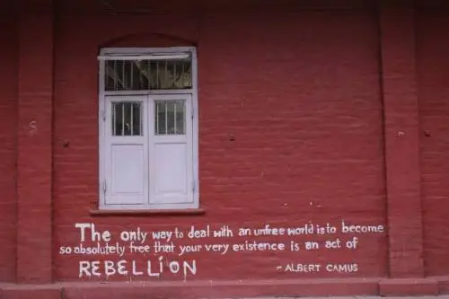

\[youtube https://www.youtube.com/watch?v=xO6xrEH\_NsE\]

**ਅਸੀਂ ਲੜਾਂਗੇ ਸਾਥੀ**

ਅਸੀਂ ਲੜਾਂਗੇ ਸਾਥੀ, ਉਦਾਸ ਮੌਸਮ ਲਈ ਅਸੀਂ ਲੜਾਂਗੇ ਸਾਥੀ, ਗ਼ੁਲਾਮ ਸੱਧਰਾਂ ਲਈ ਅਸੀਂ ਚੁਣਾਂਗੇ ਸਾਥੀ, ਜ਼ਿੰਦਗੀ ਦੇ ਟੁਕੜੇ ਹਥੌੜਾ ਹੁਣ ਵੀ ਚਲਦਾ ਹੇ,ਉਦਾਂਸ਼ ਅਹਿਰਨ 'ਤੇ ਸਿਆੜ ਹੁਣ ਵੀ ਵਗਦੇ ਨੇ, ਚੀਕਦੀ ਧਰਤੀ 'ਤੇ ਇਹ ਕੰਮ ਸਾਡਾ ਨਹੀਂ ਬਣਦਾ, ਸਵਾਲ ਨੱਚਦਾ ਹੈ ਸਵਾਲ ਦੇ ਮੌਰਾਂ ਤੇ ਚੜ੍ਹ ਕੇ ਅਸੀਂ ਲੜਾਂਗੇ ਸਾਥੀ ਕਤਲ ਹੋਏ ਜਜ਼ਬਿਆਂ ਦੀ ਕਸਮ ਖਾ ਕੇ ਬੁਝੀਆਂ ਹੋਈਆਂ ਨਜ਼ਰਾਂ ਦੀ ਕਸਮ ਖਾ ਕੇ ਹੱਥਾਂ 'ਤੇ ਪਏ ਰੱਟਣਾਂ ਦੀ ਕਸਮ ਖਾ ਕੇ ਅਸੀਂ ਲੜਾਂਗੇ ਸਾਥੀ ਅਸੀਂ ਲੜਾਂਗੇ ਤਦ ਤੱਕ ਕਿ ਵੀਰੂ ਬੱਕਰੀਆਂ ਵਾਲਾ ਜਦੋਂ ਤੱਕ ਬੱਕਰੀਆਂ ਦਾ ਮੂਤ ਪੀਂਦਾ ਹੈ ਖਿੜੇ ਹੋਏ ਸਰ੍ਹੋਂ ਦੇ ਫੁੱਲਾਂ ਨੂੰ ਜਦੋਂ ਤੱਕ ਵਾਹੁਣ ਵਾਲੇ ਆਪ ਨਹੀਂ ਸੁੰਘਦੇ ਕਿ ਸੁੱਜੀਆਂ ਅੱਖੀਆਂ ਵਾਲੀ ਪਿੰਡ ਦੀ ਅਧਿਆਪਕਾ ਦਾ ਪਤੀ ਜਦੋਂ ਤੱਕ ਜੰਗ ਤੋਂ ਪਰਤ ਨਹੀਂ ਆਉਂਦਾ ਜਦੋਂ ਤੱਕ ਪੁਲਸ ਦੇ ਸਿਪਾਹੀ ਆਪਣੇ ਹੀ ਭਰਾਵਾਂ ਦਾ ਗਲਾ ਘੁੱਟਣ ਤੇ ਬਾਧਕ ਹਨ ਕਿ ਬਾਬੂ ਦਫਤਰਾਂ ਵਾਲੇ ਜਦੋਂ ਤੱਕ ਲਹੂ ਦੇ ਨਾਲ ਹਰਫ ਪਾਉਂਦੇ ਹਨ… ਅਸੀਂ ਲੜਾਂਗੇ ਜਦ ਤੱਕ ਦੁਨੀਆ 'ਚ ਲੜਨ ਦੀ ਲੋੜ ਬਾਕੀ ਹੈ… ਜਦੋਂ ਬੰਦੂਕ ਨਾ ਹੋਈ, ਓਦੋਂ ਤਲਵਾਰ ਹੋਵੇਗੀ ਜਦੋਂ ਤਲਵਾਰ ਨਾ ਹੋਈ, ਲੜਨ ਦੀ ਲਗਨ ਹੋਵੇਗੀ ਲੜਨ ਦੀ ਜਾਚ ਨਾ ਹੋਈ, ਲੜਨ ਦੀ ਲੋੜ ਹੋਵੇਗੀ ਤੇ ਅਸੀਂ ਲੜਾਂਗੇ ਸਾਥੀ…………. ਅਸੀਂ ਲੜਾਂਗੇ ਕਿ ਲੜਨ ਬਾਝੋਂ ਕੁਝ ਵੀ ਨਹੀਂ ਮਿਲਦਾ ਅਸੀਂ ਲੜਾਂਗੇ ਕਿ ਹਾਲੇ ਤੱਕ ਲੜੇ ਕਿਉਂ ਨਹੀਂ ਅਸੀਂ ਲੜਾਂਗੇ ਆਪਣੀ ਸਜ਼ਾ ਕਬੂਲਣ ਲਈ ਲੜ ਕੇ ਮਰ ਚੁੱਕਿਆਂ ਦੀ ਯਾਦ ਜ਼ਿੰਦਾ ਰੱਖਣ ਲਈ ਅਸੀਂ ਲੜਾਂਗੇ ਸਾਥੀ…

\- ਅਵਤਾਰ ਸਿੰਘ ਪਾਸ਼

**हम लड़ेंगे साथी**

हम लड़ेंगे साथी, उदास मौसम के लिये हम लड़ेंगे साथी, गुलाम इच्छाओं के लिये हम चुनेंगे साथी, जिंदगी के टुकड़े हथौड़ा अब भी चलता है, उदास निहाई पर हल अब भी चलता हैं चीखती धरती पर यह काम हमारा नहीं बनता है, प्रश्न नाचता है प्रश्न के कंधों पर चढ़कर हम लड़ेंगे साथी कत्ल हुए जज्बों की कसम खाकर बुझी हुई नजरों की कसम खाकर हाथों पर पड़े घट्टों की कसम खाकर हम लड़ेंगे साथी हम लड़ेंगे तब तक जब तक वीरू बकरिहा बकरियों का मूत पीता है खिले हुए सरसों के फूल को जब तक बोने वाले खुद नहीं सूंघते कि सूजी आंखों वाली गांव की अध्यापिका का पति जब तक युद्ध से लौट नहीं आता जब तक पुलिस के सिपाही अपने भाईयों का गला घोटने को मजबूर हैं कि दफतरों के बाबू जब तक लिखते हैं लहू से अक्षर हम लड़ेंगे जब तक दुनिया में लड़ने की जरुरत बाकी है जब तक बंदूक न हुई, तब तक तलवार होगी जब तलवार न हुई, लड़ने की लगन होगी लड़ने का ढंग न हुआ, लड़ने की जरूरत होगी और हम लड़ेंगे साथी हम लड़ेंगे कि लड़े बगैर कुछ नहीं मिलता हम लड़ेंगे कि अब तक लड़े क्यों नहीं हम लड़ेंगे अपनी सजा कबूलने के लिए लड़ते हुए जो मर गए उनकी याद जिंदा रखने के लिए हम लड़ेंगे…

\- अवतार सिंह पाश

**We Shall Fight, Comrade**

We shall fight, comrade, for the unhappy times We shall fight, comrade, for the bottled-up desires We shall gather up, comrade, the fragments of our lives The hammer still falls on the bare anvil Furrows are still made in the clayey soil Is it our duty to fight? We shall forget this question And fight, comrade We swear by our crushed desires We swear by our hopes turned to ashes We swear by our horny hands We shall fight, comrade We shall fight Until Veeru the goatherd Has to drink goat piss Until those who till the land Cannot inhale the fragrance of mustard blossoms Until the swollen-eyed school teacher’s husband Does not return from the war front Until the police constables are duty bound To strangulate their own brethren Until the babus keep writing on their files In human blood We shall fight Until there are reasons for us to fight If we don’t have the gun, we shall have the sword If we don’t have the sword, we shall have the passion If we don’t know the art, we shall have the reason And we shall fight, comrade… We shall fight Because one gets nothing without a fight We shall fight Wondering why we did not fight until now We shall fight To acknowledge our guilt To keep alive the memory of those who died fighting We shall fight, comrade…

\- Avtar Singh Paash

**Credits:** Original poem in Punjabi by revolutionary poet [Avtar Singh Paash](http://en.wikipedia.org/wiki/Pash) Photograph from Graffiti from the FTII strike. Courtesy [Scroll.in](http://scroll.in/article/734625/photos-graffiti-from-the-ftii-strike-expresses-students-fears-%E2%80%92-and-hopes) English Translation by [Tirlok Chand Ghai](http://ghai-tc.blogspot.in/). Couresy [INTERACTIONS](http://ghai-tc.blogspot.in/2015/03/pash-punjabi-revolutionary-poet_23.html) Hindi Translation is by [Professor Chaman Lal](https://drchaman.wordpress.com/). Courtesy  [हाशिया](https://haashiya.wordpress.com/2007/10/30/%E0%A4%A4%E0%A5%8B-%E0%A4%B9%E0%A4%AE%E0%A5%87%E0%A4%82-%E0%A4%A6%E0%A5%87%E0%A4%B6-%E0%A4%95%E0%A5%80-%E0%A4%B8%E0%A5%81%E0%A4%B0%E0%A4%95%E0%A5%8D%E0%A4%B7%E0%A4%BE-%E0%A4%B8%E0%A5%87-%E0%A4%96/) Musical Performance by [Indian Peoples Theatre Association (IPTA)](https://en.wikipedia.org/wiki/Indian_People's_Theatre_Association), JNU, New Delhi

_Crossposted from [https://parchanve.wordpress.com/2015/06/23/asin-larhange-saathi/](https://parchanve.wordpress.com/2015/06/23/asin-larhange-saathi/)_