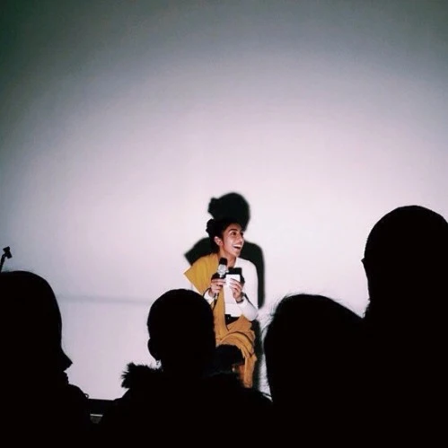

**the art of being empty**

emptying out of my mothers belly was my first act of disappearance learning to shrink for a family who likes their daughters invisible was the second the art of being empty is simple believe them when they say you are nothing repeat it to yourself like a wish _i am nothing i am nothing i am nothing_ so often the only reason you know you’re still alive is from the heaving of your chest

\- Rupi Kaur

**sakhne hon di kala **

apni maaN di kukh choN gair hazir hona mere sakhne hon da pehla wakia si te dooja parivaar jisnu appnia dheeaN nu akhoN ohle rakhna hi pasand hai de vaaste apne aap nu seemat rakhan di sikhia

sakhne hon di kala saral hai

jadon oh kehnde ne tooN kujh vi nahi vishvash karo \[haaN beeba, tu fazool ain. tu kuch vi nahi\] te apne aap laii duhrao kisse khahash di taraN _main kuch vi nahi_ _main kuch vi nahi_ _main kuch vi nahi_

bohat waar ikko ikk kaaran jisto pata lagda hai ki tusiN hale vi jionidaN 'ch hon tuhadi hikk vichli dhadkan hunda hai

\- Rupi Kaur

**ਸੱਖਣੇ ਹੋਣ ਦੀ ਕਲਾ**

ਆਪਣੀ ਮਾਂ ਦੀ ਕੁੱਖ ਚੋਂ ਗੈਰ ਹਾਜ਼ਿਰ ਹੋਣਾ ਮੇਰੇ ਸੱਖਣੇ ਹੋਣ ਦਾ ਪਹਿਲਾ ਵਾਕਿਆ ਸੀ ਤੇ ਦੂਜਾ ਪਰਿਵਾਰ ਜਿਸ ਨੂੰ ਆਪਣੀਆਂ ਧੀਆਂ ਅੱਖੋਂ ਓਹਲੇ ਰੱਖਣਾ ਹੀ ਪਸੰਦ ਹੈ ਦੇ ਵਾਸਤੇ ਆਪਣੇ ਆਪ ਨੂੰ ਸੀਮਤ ਰੱਖਣ ਦੀ ਸਿੱਖਿਆ

ਸੱਖਣੇ ਹੋਣ ਦੀ ਕਲਾ ਸਾਦ ਮੁਰਾਦੀ ਹੈ ਜਦੋਂ ਉਹ ਕਹਿੰਦੇ ਨੇ ਤੂੰ ਕੁਝ ਵੀ ਨਹੀਂ ਵਿਸ਼ਵਾਸ਼ ਕਰੋ (ਹਾਂ ਬੀਬਾ, ਤੂੰ ਫਜੂਲ ਐਂ , ਤੂੰ ਕੁਝ ਵੀ ਨਹੀਂ) ਤੇ ਆਪਣੇ ਆਪ ਲਈ ਦੁਹਰਾਓ ਕਿਸੇ ਖਾਹਿਸ਼ ਦੀ ਤਰਾਂ _ਮੈਂ  ਕੁਝ  ਵੀ  ਨਹੀਂ _ _ਮੈਂ  ਕੁਝ  ਵੀ  ਨਹੀਂ _ _ਮੈਂ  ਕੁਝ  ਵੀ  ਨਹੀਂ _

ਬਹੁਤ ਵਾਰ

ਇੱਕੋ ਇੱਕ ਕਾਰਨ ਜਿਸ ਤੋਂ ਪਤਾ ਲਗਦਾ ਹੈ ਕਿ ਤੁਸੀਂ ਹਾਲੇ ਵੀ ਜਿਓਂਦਿਆਂ 'ਚ ਹੋਂ ਤੁਹਾਡੀ ਹਿੱਕ ਵਿਚਲੀ ਧੜਕਣ ਹੁੰਦੀ ਹੈ

\- ਰੂਪੀ ਕੌਰ

_ਅੰਗਰੇਜੀ ਤੋਂ ਪੰਜਾਬੀ ਉਲੱਥਾ : [ਜਸਦੀਪ ](https://parchanve.wordpress.com/category/translators/jasdeep/)_

\[soundcloud url="https://api.soundcloud.com/tracks/191889705" params="color=ff5500&auto\_play=false&hide\_related=false&show\_comments=true&show\_user=true&show\_reposts=false" width="100%" height="166" iframe="true" /\] 'the art of being empty' sung by Keerat Kaur

\[youtube https://www.youtube.com/watch?v=GQ-ifgoFCdw\] Kirpa, a film about a 23-year-old art student struggling to fulfill the wishes of her parents while pursuing her dreams of being an artist. Written by Rupi Kaur, Directed by Kiran Rai

**About**

Original poem in English by Poet and Artist [Rupi Kaur](http://www.rupikaur.com/). She is a spoken word poet based in Toronto, Ontario. She devours words, art, metaphors, bodies of water, genuine people, and story telling. She enjoys crafting the world around her through her poems, specifically focusing on the struggle of women in society.

Sung by painter, illustrator and singer [Keerat Kaur](https://soundcloud.com/keeratkaur)

Punjabi Translation by [Jasdeep](https://parchanve.wordpress.com/category/translators/jasdeep/)

Photograph from Rupi Kaur's website.

Short film Kirpa, directed by actor and director [Kiran Rai](http://kayray.co/)

_Crossposted from [https://parchanve.wordpress.com/2015/07/15/sakhne-hon-di-kala/](https://parchanve.wordpress.com/2015/07/15/sakhne-hon-di-kala/)_