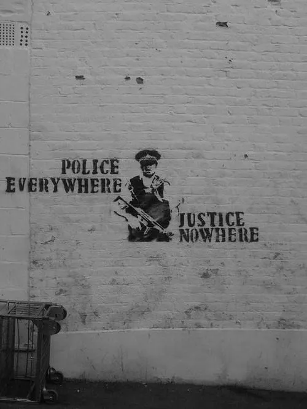

_Tomorrow someone will arrest you. And will say the evidence is that there was some problematic book in your house._

_Tomorrow someone will arrest you. And your friends will see, on TV, the media calling you terrorist because the police do._

_Tomorrow someone will arrest you. They’ll scare all lawyers. The one who takes up your case will be arrested next week_

_Tomorrow someone will arrest you. Your friends will find you active on Facebook a day later. Police logged in as you._

_Tomorrow someone will arrest you. Your friends will find that it’ll take 4 days to find 1000 people to sign a petition._

_Tomorrow someone will arrest you. Your little child will learn what UAPA[1](#footnote "Jump to Footnotes") stands for. Your friends will learn of Sec.13._

_Tomorrow someone will arrest you. You’ll be a “leftist” to people. You will be ultra-left for the leftists. No one will speak._

_Tomorrow someone will arrest you. The day after that, you will be considered a “terrorist” for life._

_Tomorrow someone will arrest you. The police will prepare a list of names. Anyone who’d protest will be named._

_Tomorrow someone will arrest you. You’ll be warned. You’ll be a warning to everyone putting their hand into the corporate web._

_Tomorrow someone will arrest you. Your home will be searched tonight. You will be taken for questioning now. Stop speaking._

_Tomorrow someone will arrest you. The court, in a rare gesture, will give you the benefit of bail. The police will rearrest you in another case._

_Tomorrow someone will arrest your children. You will be underground. Some measures are essential to keep a democracy alive._

_Long Live Silence._

_— Meena Kandasamy_

ਕੱਲ੍ਹ ਨੂੰ ਤੁਹਾਨੂੰ ਕੋਈ ਗ੍ਰਿਫਤਾਰ ਕਰ ਲਵੇਗਾ। ਇਹ ਕਹਿਕੇ ਕਿ ਤੁਹਾਡੇ ਘਰੋਂ ਕੋਈ ਖਤਰਨਾਕ ਕਿਤਾਬ ਬਰਾਮਦ ਹੋਈ ਹੈ।

ਕੱਲ੍ਹ ਨੂੰ ਤੁਹਾਨੂੰ ਕੋਈ ਗ੍ਰਿਫ਼ਤਾਰ ਕਰ ਲਵੇਗਾ। ਅਤੇ ਤੁਹਾਡੇ ਦੋਸਤ ਤੁਹਾਡੇ ਬਾਰੇ ਟੀਵੀ ਤੋਂ ਜਾਨਣਗੇ, ਕਿ ਤੁਸੀਂ ਅੱਤਵਾਦੀ ਹੋ, ਕਿਉਂਕਿ ਪੁਲਿਸ ਨੇ ਇਹੀ ਕਿਹਾ ਹੈ।

ਕੱਲ੍ਹ ਨੂੰ ਤੁਹਾਨੂੰ ਕੋਈ ਗ੍ਰਿਫ਼ਤਾਰ ਕਰ ਲਵੇਗਾ। ਸਾਰੇ ਵਕੀਲ ਡਰਾ ਦਿੱਤੇ ਜਾਣਗੇ, ਜੇ ਕਿਸੇ ਨੇ ਭੁੱਲ ਭੁਲੇਖੇ ਤੁਹਾਡਾ ਕੇਸ ਲੈ ਲਿਆ, ਉਹਦੀ ਗ੍ਰਿਫਤਾਰੀ ਅਗਲੇ ਹਫ਼ਤੇ ਹੋ ਜਾਵੇਗੀ।

ਕੱਲ੍ਹ ਨੂੰ ਤੁਹਾਨੂੰ ਕੋਈ ਗ੍ਰਿਫ਼ਤਾਰ ਕਰ ਲਵੇਗਾ। ਇੱਕ ਦਿਨ ਬਾਅਦ ਦੋਸਤ ਤੁਹਾਨੂੰ ਫੇਸਬੁੱਕ 'ਤੇ ਐਕਟਿਵ ਦੇਖਣਗੇ, ਪੁਲਿਸ  ਤੁਹਾਡੀ ਥਾਂ ਤੇ ਲੌਗ-ਇਨ ਹੋਵੇਗੀ।

ਕੱਲ੍ਹ ਨੂੰ ਤੁਹਾਨੂੰ ਕੋਈ ਗ੍ਰਿਫ਼ਤਾਰ ਕਰ ਲਵੇਗਾ। ਤੁਹਾਡੇ ਦੋਸਤਾਂ ਨੂੰ ਪਤਾ ਲੱਗੇਗਾ ਕਿ ਇੱਕ ਪਟੀਸ਼ਨ 'ਤੇ 1000 ਲੋਕਾਂ ਦੇ ਹਸਤਾਖਰ ਕਰਵਾਉਣ ਲਈ 4 ਦਿਨ ਲੱਗਣਗੇ।

ਕੱਲ੍ਹ ਨੂੰ ਤੁਹਾਨੂੰ ਕੋਈ ਗ੍ਰਿਫ਼ਤਾਰ ਕਰ ਲਵੇਗਾ। ਤੁਹਾਡੇ ਨਿੱਕੇ ਨਿਆਣੇ ਨੂੰ ਪਤਾ ਲੱਗੇਗਾ ਕਿ ਯੂ.ਏ.ਪੀ.ਏ.[1](#footnote "Jump to Footnotes") ਕੀ ਸ਼ੈਅ ਹੈ। ਤੁਹਾਡੇ ਦੋਸਤ ਸੈਕਸ਼ਨ 13 ਬਾਰੇ ਜਾਨਣਗੇ।

ਕੱਲ੍ਹ ਨੂੰ ਤੁਹਾਨੂੰ ਕੋਈ ਗ੍ਰਿਫ਼ਤਾਰ ਕਰ ਲਵੇਗਾ। ਤੁਸੀਂ ਲੋਕਾਂ ਵਾਸਤੇ  'ਖੱਬੇ ਪੱਖੀ' ਹੋਵੋਂਗੇ, ਤੇ ਖੱਬੇ-ਪੱਖੀਆਂ ਵਾਸਤੇ 'ਅੱਤ-ਖੱਬੇ-ਪੱਖੀ'। ਕੋਈ ਨਹੀਂ ਬੋਲੇਗਾ।

ਕੱਲ੍ਹ ਨੂੰ ਤੁਹਾਨੂੰ ਕੋਈ ਗ੍ਰਿਫ਼ਤਾਰ ਕਰ ਲਵੇਗਾ। ਉਸਤੋਂ ਅਗਲੇ ਦਿਨ, ਤੁਸੀਂ ਜ਼ਿੰਦਗੀ ਭਰ ਲਈ 'ਅੱਤਵਾਦੀ' ਬਣ ਜਾਓਂਗੇ।

ਕੱਲ੍ਹ ਨੂੰ ਤੁਹਾਨੂੰ ਕੋਈ ਗ੍ਰਿਫ਼ਤਾਰ ਕਰ ਲਵੇਗਾ। ਪੁਲਿਸ ਨਾਵਾਂ ਦੀ ਫਹਿਰਿਸਤ ਬਣਾਵੇਗੀ, ਜੋ ਕੋਈ ਵਿਰੋਧਭਰੀ ਆਵਾਜ਼ ਉਠਾਵੇਗਾ, ਉਸ ਦਾ ਨਾਂ ਇਸ ਵਿੱਚ ਜੁੜ ਜਾਵੇਗਾ।

ਕੱਲ੍ਹ ਨੂੰ ਤੁਹਾਨੂੰ ਕੋਈ ਗ੍ਰਿਫ਼ਤਾਰ ਕਰ ਲਵੇਗਾ। ਤੁਹਾਨੂੰ ਚੇਤਾਵਨੀ ਮਿਲੇਗੀ, ਅਤੇ ਤੁਸੀਂ, ਜੋ ਕੋਈ ਵੀ ਕਾਰਪੋਰੇਟ ਤਾਣੇ ਬਾਣੇ ਦਾ ਪਰਦਾਫਾਸ਼ ਕਰਨ ਵਿੱਚ ਹੱਥ ਅਜ਼ਮਾ ਰਿਹਾ ਹੈ, ਵਾਸਤੇ ਚੇਤਾਵਨੀ ਹੋਵੋਂਗੇ।

ਕੱਲ੍ਹ ਨੂੰ ਤੁਹਾਨੂੰ ਕੋਈ ਗ੍ਰਿਫ਼ਤਾਰ ਕਰ ਲਵੇਗਾ। ਤੁਹਾਡਾ ਘਰ ਅੱਜ ਰਾਤ ਫਰੋਲਿਆ ਜਾਵੇਗਾ, ਹੁਣ ਤੁਹਾਨੂੰ ਸਵਾਲ ਜਵਾਬ ਲਈ ਲੈ ਜਾਇਆ ਜਾਵੇਗਾ, ਬੋਲਣਾ ਬੰਦ ਕਰ ਦਿਓ।

ਕੱਲ੍ਹ ਨੂੰ ਤੁਹਾਨੂੰ ਕੋਈ ਗ੍ਰਿਫ਼ਤਾਰ ਕਰ ਲਵੇਗਾ। ਅਦਾਲਤ, ਇੱਕ ਦੁਰਲੱਭ ਖੈਰਾਤ ਵਾਂਙ, ਤੁਹਾਨੂੰ ਜਮਾਨਤ ਦਾ ਦਾਨ ਬਖਸ਼ੇਗੀ। ਪੁਲਿਸ ਤੁਹਾਨੂੰ ਕਿਸੇ ਹੋਰ ਕੇਸ ਵਿੱਚ ਮੁੜ ਗ੍ਰਿਫ਼ਤਾਰ ਕਰ ਲਵੇਗੀ।

ਕੱਲ੍ਹ ਨੂੰ ਤੁਹਾਡੇ ਬੱਚਿਆਂ ਨੂੰ ਕੋਈ ਗ੍ਰਿਫ਼ਤਾਰ ਕਰ ਲਵੇਗਾ। ਤੁਸੀਂ ਰੂਹਪੋਸ਼ ਹੋਵੋਂਗੇ। ਕੁਝ ਤਰੀਕੇ ਜਮਹੂਰੀਅਤ ਜਿਓੂਂਦੀ ਰੱਖਣ ਲਈ ਜ਼ਰੂਰੀ ਹੁੰਦੇ ਨੇ।

ਖ਼ਾਮੋਸ਼ੀ ਜ਼ਿੰਦਾਬਾਦ!

\- ਮੀਨਾ ਕੰਦਾਸਾਮੀ _ਅੰਗਰੇਜੀ ਤੋਂ ਪੰਜਾਬੀ ਉਲੱਥਾ : [ਜਸਦੀਪ ](https://parchanve.wordpress.com/category/translators/jasdeep/)_

#### Footnotes

1\. [UAPA](https://en.wikipedia.org/wiki/Unlawful_Activities_(Prevention)_Act "UAPA") stands for Unlawful Activities (Prevention) Act. It penalizes people for 'any act with intent to threaten or likely to threaten the unity, integrity, security or ­sovereignty of India' and includes the following sub section '(o) unlawful activity, in relation to an individual or association, means any action taken by such individual or association (whether by committing an act or by words, either spoken or written, or by signs or by visible representation or otherwise),' making it possible for the Government authorities to detain activists and stifle voices of dissent.

[Meena Kandasamy](http://en.wikipedia.org/wiki/Meena_Kandasamy) (born 1984) is an Indian poet, fiction writer, translator and activist who is based in Chennai, Tamil Nadu, India. Most of her works are centered on feminism and the anti-caste Caste Annihilation Movement of the contemporary Indian milieu.

ਮੀਨਾ ਕੰਦਾਸਾਮੀ  ਮਦਰਾਸ, ਤਮਿਲਨਾਡੂ  ਤੋਂ ਅੰਗਰੇਜੀ ਕਵੀ, ਲੇਖਕ, ਅਨੁਵਾਦਕਾਰ ਅਤੇ ਸਮਾਜਿਕ ਕਾਰਕੁਨ ਹੈ। ਮੀਨਾ ਦਾ ਕੰਮ ਨਾਰੀਵਾਦ ਅਤੇ ਜਾਤਪਾਤ ਵਿਰੋਧੀ ਸੰਘਰਸ਼ਾਂ ਨਾਲ ਸਾਂਝ ਭਿਆਲੀ ਰੱਖਦਾ ਹੈ।

Original poem was posted in an article '[The End of Tomorrow](https://lareviewofbooks.org/essay/end-of-tomorrow)' by Manas Bhattacharjee at  [Los Angeles Review of Books](https://lareviewofbooks.org/)

Punjabi translation is by [Jasdeep](https://parchanve.wordpress.com/category/translators/jasdeep/).

**Photo:  **Wall painting by elusive British graffiti artist Banksy (Posted on [pinterest](https://www.pinterest.com/pin/445786063095050508/) by JMB and on by [blindesitesoicety](http://blindsidesociety.com/a-week-in-streetart-december-2014/) by CarlosAlvarez37)

_Crossposted from [https://parchanve.wordpress.com/2015/12/24/tomorrow-someone-will-arrest-you/](https://parchanve.wordpress.com/2015/12/24/tomorrow-someone-will-arrest-you/)_

---
### Comments:
#### [Sarawjeet "Sarv"](http://sarawjeetsarv.wordpress.com "sarawjeetsarv@gmail.com") - <time datetime="2015-12-24 17:53:51">Dec 4, 2015</time>

Scary but true situation!

