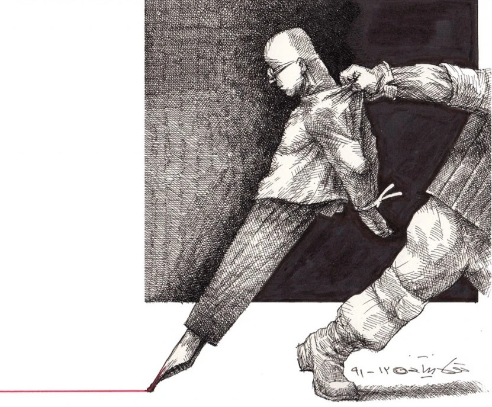

**ਆਪਣੀ ਅਸੁੱਰਖਿਆ 'ਚੋਂ **

ਜੇ ਦੇਸ਼ ਦੀ ਸੁਰੱਖਿਆ ਏਹੋ ਹੁੰਦੀ ਹੈ ਕਿ ਬੇ-ਜ਼ਮੀਰੀ ਜ਼ਿੰਦਗੀ ਲਈ ਸ਼ਰਤ ਬਣ ਜਾਵੇ ਅੱਖ ਦੀ ਪੁਤਲੀ 'ਚ ' ਹਾਂ ' ਤੋਂ ਬਿਨਾ ਕੋਈ ਵੀ ਸ਼ਬਦ ਅਸ਼ਲੀਲ ਹੋਵੇ ਤੇ ਮਨ ਬਦਕਾਰ ਘੜੀਆਂ ਸਾਹਮਣੇ ਡੰਡੌਤ 'ਚ ਝੁਕਿਆ ਰਹੇ ਤਾਂ ਸਾਨੂੰ ਦੇਸ਼ ਦੀ ਸੁਰੱਖਿਆ ਤੋਂ ਖਤਰਾ ਹੈ

ਅਸੀਂ ਤਾਂ ਦੇਸ਼ ਨੂੰ ਸਮਝੇ ਸਾਂ ਘਰ ਵਰਗੀ ਪਵਿੱਤਰ ਸ਼ੈਅ ਜਿਹਦੇ ਵਿੱਚ ਹੁਸੜ ਨਹੀਂ ਹੁੰਦਾ ਮਨੁੱਖ ਵਰ੍ਹਦੇ ਮੀਹਾਂ ਦੀ ਗੂੰਜ਼ ਵਾਂਗ ਗਲੀਆਂ 'ਚ ਵਹਿੰਦਾ ਹੈ ਕਣਕ ਦੀਆਂ ਬੱਲੀਆਂ ਵਾਂਗ ਖੇਤੀਂ ਝੂਮਦਾ ਹੈ ਅਸਮਾਨ ਦੀ ਵਿਸ਼ਾਲਤਾ ਨੂੰ ਅਰਥ ਦਿੰਦਾ ਹੈ

ਅਸੀਂ ਤਾਂ ਦੇਸ਼ ਨੂੰ ਸਮਝੇ ਸਾਂ ਜੱਫੀ ਵਰਗੇ ਅਹਿਸਾਸ ਦਾ ਨਾਂ ਅਸੀਂ ਤਾਂ ਦੇਸ਼ ਨੂੰ ਸਮਝੇ ਸਾਂ ਕੰਮ ਵਰਗਾ ਨਸ਼ਾ ਕੋਈ ਅਸੀਂ ਤਾਂ ਦੇਸ਼ ਨੂ ਸਮਝੇ ਸਾਂ ਕੁਰਬਾਨੀ ਜਿਹੀ ਵਫ਼ਾ ਪਰ ਜੋ ਦੇਸ਼ ਰੂਹ ਦੀ ਵਗਾਰ ਦਾ ਕਾਰਖਾਨਾ ਹੈ ਪਰ ਜੋ ਦੇਸ਼ ਉੱਲੂ ਬਣਨ ਦਾ ਪ੍ਰਯੋਗ ਘਰ ਹੈ ਤਾਂ ਉਸਤੋਂ ਸਾਨੂੰ ਖਤਰਾ ਹੈ ਜੇ ਦੇਸ਼ ਦਾ ਅਮਨ ਏਹੋ ਹੁੰਦੈ ਕਿ ਕਰਜ਼ੇ ਦੇ ਪਹਾੜਾਂ ਤੋਂ ਰਿੜਦਿਆਂ ਪੱਥਰਾਂ ਵਾਂਗ ਟੁੱਟਦੀ ਰਹੇ ਹੋਂਦ ਸਾਡੀ ਕਿ ਤਨਖਾਹਾਂ ਦੇ ਮੂੰਹ 'ਤੇ ਥੁੱਕਦਾ ਰਹੇ ਕੀਮਤਾਂ ਦਾ ਬੇਸ਼ਰਮ ਹਾਸਾ ਕਿ ਆਪਣੇ ਲਹੂ ਵਿੱਚ ਨਹਾਉਣਾ ਹੀ ਤੀਰਥ ਦਾ ਪੁੰਨ ਹੋਵੇ ਤਾਂ ਸਾਨੂੰ ਅਮਨ ਤੋਂ ਖਤਰਾ ਹੈ

ਜੇ ਦੇਸ਼ ਦੀ ਸੁਰੱਖਿਅਤਾ ਏਹੋ ਹੁੰਦੀ ਹੈ ਕਿ ਹਰ ਹੜਤਾਲ ਨੂ ਫੇਹ ਕੇ ਅਮਨ ਨੂੰ ਰੰਗ ਚੜ੍ਹਨਾ ਹੈ ਕਿ ਸੂਰਮਗਤੀ ਬੱਸ ਹੱਦਾਂ 'ਤੇ ਮਾਰ ਪਰਵਾਨ ਚੜ੍ਹਨੀ ਹੈ ਕਲਾ ਦਾ ਫੁੱਲ ਬੱਸ ਰਾਜੇ ਦੀ ਖਿੜਕੀ ਵਿਚ ਖਿੜਨਾ ਹੈ ਅਕਲ ਨੇ ਹੁਕਮ ਦੇ ਖੂਹੇ ਤੇ ਗਿੜ ਕੇ ਧਰਤ ਸਿੰਜਣੀ ਹੈ ਕਿਰਤ ਨੇ ਰਾਜ ਮਹਿਲਾਂ ਦੇ ਦਰੀਂ ਖਰਕਾ ਹੀ ਬਣਨਾ ਹੈ ਤਾਂ ਸਾਨੂੰ ਦੇਸ਼ ਦੀ ਸੁਰੱਖਿਅਤਾ ਤੋਂ ਖਤਰਾ ਹੈ

\- _ਪਾਸ਼_

**aapnī asurãkhiata nuñ**

je desh di surãkhia eho hundī hai ke be-zameerī jindagi laī sharāt ban jāve akh di putlī 'ch 'haañ' toñ binañ koī vī shabd ashleel hove te man badkaar ghaḌīaañ saahmne dandaut 'ch jhukiā rahe taañ saanu desh dī surãkhia toñ khatra hai

asiñ taañ desh nuñ samjhe saañ ghar vargi pavittar shai jihde vich husaḌ nahiñ huñda manukh varhde meeñhañ dī gooñj vaañg galiañ 'ch vahiñda hai kanak dīaañ ballīaañ vaañg khetiñ jhoomda hai asmaan dī vishaalta nuñ arth diñda hai

asiñ taañ desh nuñ samjhe saañ japhī varge ahisaas da naañ asiñ taañ desh nuñ samjhe saañ kamm varga koī nasha asiñ taañ desh nuñ samjhe saañ kurbaani jihī vafa par jo desh rooh dī vagaar da kaarkhaana hai par jo desh ullu baṆan da paryog ghar hai taañ us toñ saanu khatra hai je desh da aman eho hundai ke karze de pahaḌaañ toñ riḌdiaañ pathrañ vaañg tuttdī rahe hoñd saadī ke tankhahaañ de mooñh te thukkda rahe keemtaañ da beshãrm haasa ke aapne lahu vich nahauna hī tīrath da punn hove taañ saanu aman toñ khatra hai

je desh dī surãkhiata eho hundī hai ke har haḌtaal nuñ feh ke aman nuñ rañg chaḌna hai ke sooramgati bass haddañ 'te maar parwaan chaḌnī hai kala da phull bass raaje dī khiḌkī vich khiḌna hai akal ne hukam de khoohe te giḌke dharat sinjani hai kirãt ne raaj mahilaañ de darīñ kharka hī baṆna hai taañ saanu desh dī surãkhiata toñ khatra hai

\- Paash

**अपनी असुरक्षा से**

यदि देश की सुरक्षा यही होती है कि बिना जमीर होना ज़िन्दगी के लिए शर्त बन जाए आँख की पुतली में हाँ के सिवाय कोई भी शब्द अश्लील हो और मन बदकार पलों के सामने दण्डवत झुका रहे तो हमें देश की सुरक्षा से ख़तरा है ।

हम तो देश को समझे थे घर-जैसी पवित्र चीज़ जिसमें उमस नहीं होती आदमी बरसते मेंह की गूँज की तरह गलियों में बहता है गेहूँ की बालियों की तरह खेतों में झूमता है और आसमान की विशालता को अर्थ देता है

हम तो देश को समझे थे आलिंगन-जैसे एक एहसास का नाम हम तो देश को समझते थे काम-जैसा कोई नशा हम तो देश को समझते थे कुरबानी-सी वफ़ा लेकिन गर देश आत्मा की बेगार का कोई कारख़ाना है गर देश उल्लू बनने की प्रयोगशाला है तो हमें उससे ख़तरा है

गर देश का अमन ऐसा होता है कि कर्ज़ के पहाड़ों से फिसलते पत्थरों की तरह टूटता रहे अस्तित्व हमारा और तनख़्वाहों के मुँह पर थूकती रहे क़ीमतों की बेशर्म हँसी कि अपने रक्त में नहाना ही तीर्थ का पुण्य हो तो हमें अमन से ख़तरा है

गर देश की सुरक्षा को कुचल कर अमन को रंग चढ़ेगा कि वीरता बस सरहदों पर मर कर परवान चढ़ेगी कला का फूल बस राजा की खिड़की में ही खिलेगा अक़्ल, हुक्म के कुएँ पर रहट की तरह ही धरती सींचेगी तो हमें देश की सुरक्षा से ख़तरा है ।

_\- पाश (चमन लाल द्वारा हिंदी अनुवाद )_

**Lines to Our Own Insecurity**

If there be the terms for the security of a nation the precondition of life is to have no conscience any word other than 'Yes'  be obscene to naked eye the mind should bow to reverence to unjust moments Then the security of the nation is a direct threat to us

We had thought of nation as a pious home where there is no place for gloom A person is free to flow in the streets like rain and thunder and give meaning to immensity of the sky

We had thought of the nation as a fond embrace We had thought of the nation as joyous as work We had thought of the nation as loyal as sacrifice But  if the nation becomes a workshop to strip us of our souls if it becomes a laboratory to turn us into fools Then we are threatened indeed If the peace of the nation be such that our identity be broken like stones rolling down a borrowed mountain The forever rising prices mock brazenly at our wages Bathing in our own blood be our pilgrimage Then we are threatened by this peace

If the security of the nation demands that every protest be extinguished in the name of peace Courage means only dying at the border Art should blossom only at the despot's window Intellect should be put to use only by order And labour will only be a sweeper outside the citadel Then the security of the  nation is direct threat to us

\- _Paash ( Translated by Nirupma Dutt )_

**Source:** Original in Punjabi by revolutionary poet [Avtar Singh Paash](http://en.wikipedia.org/wiki/Pash), He was gunned down by Khalistani militants in 1988. Translation by [Nirupma Dutt](http://en.wikipedia.org/wiki/Nirupama_Dutt)

Cartoon by Iranian political cartoonist [Touka Neyestani](https://en.wikipedia.org/wiki/Touka_Neyestani)

Hindi Translation from [Kavita Kosh](http://kavitakosh.org/kk/%E0%A4%85%E0%A4%AA%E0%A4%A8%E0%A5%80_%E0%A4%85%E0%A4%B8%E0%A5%81%E0%A4%B0%E0%A4%95%E0%A5%8D%E0%A4%B7%E0%A4%BE_%E0%A4%B8%E0%A5%87_/_%E0%A4%AA%E0%A4%BE%E0%A4%B6)

_Crossposted from [https://parchanve.wordpress.com/2010/04/29/lines-to-insecuirity/](https://parchanve.wordpress.com/2010/04/29/lines-to-insecuirity/)_

---
### Comments:
#### [Agam]( "agam.preet@hotmail.com") - <time datetime="2011-01-24 01:04:25">Jan 1, 2011</time>

Awesome, thanks very much.

#### [freepunjabiwallpaper](http://freepunjabiwallpaper.wordpress.com "preet91119@gmail.com") - <time datetime="2010-08-12 02:02:07">Aug 4, 2010</time>

very nice dear

