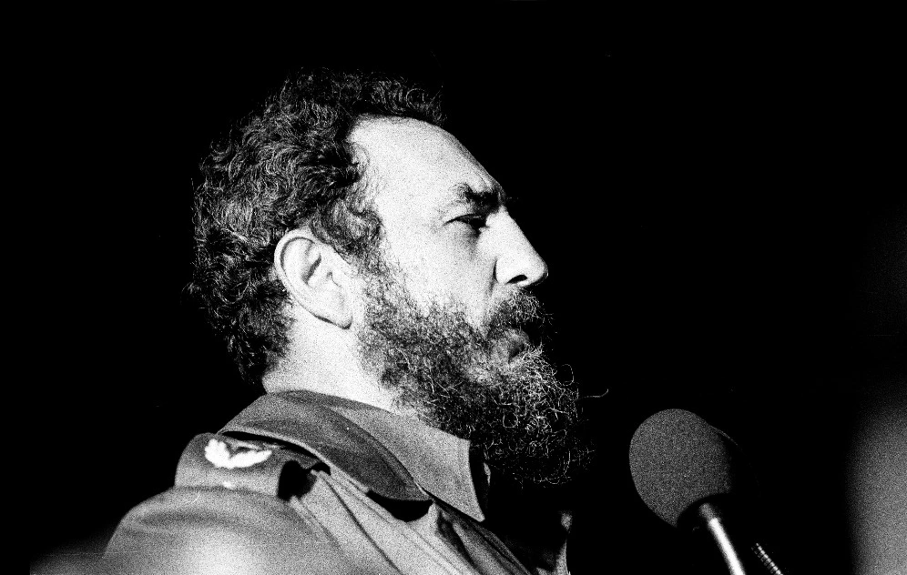

-------------------------------------------------------------------------------------

**Fidel**
---------

His enemies say he was an uncrowned king who confused unity with unanimity.And in that his enemies are right.

And in that his enemies are right.

His enemies say that if Napoleon had a newspaper like _Granma_, no Frenchman would have learned of the disaster at Waterloo. And in that his enemies are right.

His enemies say that he exercised power by talking a lot and listening little, because he was more used to hearing echoes than voices.

And in that his enemies are right.

But some things his enemies do not say: it was not to pose for the history books that he bared his breast to the invaders’ bullets, he faced hurricanes as an equal, hurricane to hurricane, he survived 637 attempts on his life, his contagious energy was decisive in making a country out of a colony, and it was not by Lucifer’s curse or God’s miracle that the new country managed to outlive 10 U.S. presidents, their napkins spread in their laps, ready to eat it with knife and fork.And his enemies never mention that Cuba is one rare country that does not compete for the World Doormat Cup.

And they do not say that the revolution, punished for the crime of dignity, is what it managed to be and not what it wished to become. Nor do they say that the wall separating desire from reality grew ever higher and wider thanks to the imperial blockade, which suffocated a Cuban-style democracy, militarized society, and gave the bureaucracy, always ready with a problem for every solution, the alibis it needed to justify and perpetuate itself.

And they do not say that in spite of all the sorrow, in spite of the external aggression and the internal high-handedness, this distressed and obstinate island has spawned the least unjust society in Latin America.

And his enemies do not say that this feat was the outcome of the sacrifice of its people, and also of the stubborn will and old-fashioned sense of honor of the knight who always fought on the side of the losers, like his famous colleague in the fields of Castile.

\- Eduardo Galeano

   _Translated from Spanish by [Mark Fried](http://www.goodreads.com/author/show/217843.Mark_Fried)_

**ਫ਼ੀਦੇਲ**
---------

ਉਸਦੇ ਦੁਸ਼ਮਣ ਕਹਿੰਦੇ ਨੇ ਕਿ ਉਹ ਬੇਤਾਜ਼ ਬਾਦਸ਼ਾਹ ਸੀ ਜੋ ਲੋਕ ਏਕਤਾ ਨੂੰ ਸਰਬਸੰਮਤੀ  ਹੀ ਸਮਝਦਾ ਸੀ ।

ਤੇ ਇਸ ਗੱਲ ਤੇ ਉਸਦੇ ਦੁਸ਼ਮਣ ਸਹੀ ਹਨ।

ਉਸਦੇ ਦੁਸ਼ਮਣਾਂ ਮੁਤਾਬਿਕ ਜੇ ਨੈਪੋਲੀਅਨ ਕੋਲ ਗ੍ਰੈਨਮਾ ਵਰਗਾ ਅਖ਼ਬਾਰ ਹੁੰਦਾ, ਤਾਂ ਫਰਾਂਸੀਸੀ ਲੋਕਾਂ ਨੂੰ ਵਾਟਰਲੂ ਦੇ ਦੁਖਾਂਤ ਦੀ ਕੋਈ ਖ਼ਬਰ ਨਹੀਂ ਹੋਣੀ ਸੀ।

ਤੇ ਇਸ ਗੱਲ ਤੇ ਉਸਦੇ ਦੁਸ਼ਮਣ ਸਹੀ ਹਨ।

ਉਸਦੇ ਦੁਸ਼ਮਣ ਆਖਦੇ ਨੇ ਕਿ ਉਹ ਰਾਜ ਕਰਦਿਆਂ ਸੁਣਦਾ ਘੱਟ ਸੀ ਤੇ ਬੋਲਦਾ ਜ਼ਿਆਦਾ, ਕਿਉਂਕਿ ਉਹ ਆਜ਼ਾਦ ਅਵਾਜ਼ਾਂ ਨਾਲੋਂ ਆਪਣੀ ਆਵਾਜ਼ ਸੁਣਨ ਦਾ ਆਦੀ ਸੀ।

ਤੇ ਇਸ ਗੱਲ ਤੇ ਉਸਦੇ ਦੁਸ਼ਮਣ ਸਹੀ ਹਨ।

ਪਰ ਕੁਝ ਗੱਲਾਂ ਜੋ ਉਸਦੇ ਦੁਸ਼ਮਣ ਨਹੀਂ ਆਖਦੇ: ਉਸਨੇ ਆਪਣੀ ਹਿੱਕ ਇਤਿਹਾਸ ਦੇ ਪੰਨਿਆਂ 'ਚ ਦਰਜ ਹੋਣ ਲਈ ਨਹੀਂ, ਪਰ ਬਾਹਰਲੇ ਧਾੜਵੀਆਂ ਦੀਆਂ ਗੋਲੀਆਂ ਸਾਹਮਣੇ ਡਾਹੀ ਸੀ, ਉਸਨੇ ਤੂਫ਼ਾਨਾਂ ਨੂੰ ਸਾਹਵੇਂ ਹੋ ਕੇ ਸਿੱਝਿਆ ਹੈ, ਤੂਫ਼ਾਨ ਦਰ ਤੂਫ਼ਾਨ।

ਉਸਨੇ ਆਪਣੀ ਜ਼ਿੰਦਗੀ ਤੇ ਹੋਏ 637 ਹਮਲੇ ਨਜਿੱਠੇ ਨੇ, ਉਸਦੀ ਮਾਣਮੱਤੀ ਊਰਜਾ ਫ਼ੈਸਲਾਕੁੰਨ ਹੋਈ ਹੈ ਇੱਕ ਬਸਤੀ ਵਿੱਚੋਂ ਇੱਕ ਮੁਲਕ ਉਪਜਿਆ, ਤੇ ਇਹ ਨਾਂ ਤਾਂ ਸ਼ੈਤਾਨ ਦਾ ਸਰਾਪ ਸੀ ਤੇ ਨਾ ਕੋਈ ਰੱਬੀ ਚਮਤਕਾਰ ਕਿ ਇਹ ਨਵਾਂ ਮੁਲਕ 10 ਅਮਰੀਕੀ ਰਾਸ਼ਟਰਪਤੀਆਂ ਤੋਂ ਵੱਧ ਚਿਰ ਜੀਵਿਆ; ਉਹਨਾਂ ਦੇ ਖਾਣੇ ਦੇ ਰੁਮਾਲ ਉਹਨਾਂ ਦੀਆਂ ਝੋਲੀਆਂ 'ਚ ਵਿਛੇ ਰਹਿ ਗਏ, ਇਸ ਮੁਲਕ ਨੂੰ ਛੁਰੀ ਕਾਂਟੇ ਨਾਲ ਖਾਣ ਦੀ ਤਾਕ ਵਿੱਚ।

ਤੇ ਉਸਦੇ ਦੁਸ਼ਮਣ ਕਦੇ ਇਹ ਨਹੀਂ ਦਸਦੇ ਕਿ ਕਿਊਬਾ ਵਾਹਿਦ ਮੁਲਕ ਹੈ ਜਿਹੜਾ ਸੰਸਾਰ ਪੈਰਦਾਨ ਮੁਕਾਬਲੇ ਵਿੱਚ ਹਿੱਸਾ ਨਹੀਂ ਲੈਂਦਾ।

ਤੇ ਉਹ ਇਹ ਨਹੀਂ ਦਸਦੇ ਕਿ ਇਨਕਲਾਬ, ਮਾਣ ਨਾਲ ਜਿਉਣ ਦੇ ਕਸੂਰ ਦੀ ਸਜ਼ਾ ਭੁਗਤਦਾ ਹੋਇਆ, ਇਹੋ ਬਣ ਸਕਿਆ, ਉਹ ਨਹੀਂ ਜੋ ਚਾਹਿਆ ਗਿਆ ਸੀ। ਨਾਂ ਹੀ ਉਹ ਇਹ ਦਸਦੇ ਨੇ ਕਿ ਇੱਛਾ ਅਤੇ ਅਸਲੀਅਤ ਨੂੰ ਵੰਡਦੀ ਕੰਧ ਹੋਰ ਉੱਚੀ ਹੁੰਦੀ ਗਈ। ਅਤੇ ਸਾਮਰਾਜੀ ਨਾਕਾਬੰਦੀ ਦੀ ਮਿਹਰਬਾਨੀ ਸਦਕਾ, ਕਿਊਬਾਈ ਜ਼ਮਹੂਰੀਅਤ ਦਾ ਦਮ ਘੁੱਟਿਆ ਗਿਆ, ਸਮਾਜ ਦਾ ਫ਼ੌਜ਼ੀਕਰਨ ਹੋਇਆ, ਅਤੇ ਹਰੇਕ ਹੱਲ ਨਾਲ ਇੱਕ ਨਵੀਂ ਮੁਸ਼ਕਿਲ ਪੈਦਾ ਕਰਨ ਲਈ ਕਾਹਲੀ ਨੌਕਰਸ਼ਾਹੀ ਨੂੰ ਬਹਾਨਾ ਮਿਲਿਆ ਆਪਣੀ ਚਿਰਕਾਲੀ ਸਥਾਪਨਾ ਦਾ।

ਅਤੇ ਉਹ ਇਹ ਨਹੀਂ ਦਸਦੇ ਕਿ ਐਨੇ ਦੁੱਖਾਂ ਦੇ ਬਾਵਜੂਦ, ਬਾਹਰਲੇ ਹਮਲਾਵਰੀ ਰੁਖ਼ ਅਤੇ ਅੰਦਰੂਨੀ ਜ਼ਿਆਦਤੀ  ਦੇ ਬਾਵਜੂਦ, ਇਹ ਹਮ੍ਹਾਤੜ ਪਰ ਜ਼ਿੱਦੀ ਟਾਪੂ ਲਾਤੀਨੀ ਅਮਰੀਕਾ ਦਾ ਸਭ ਤੋਂ ਘੱਟ ਬੇਇਨਸਾਫ਼ ਸਮਾਜ ਸਿਰਜਣ ਵਿੱਚ ਕਾਮਯਾਬ ਹੋਇਆ ਹੈ।

ਅਤੇ ਉਸ ਦੇ ਦੁਸ਼ਮਣ ਇਹ ਨਹੀਂ ਦਸਦੇ ਕਿ ਇਹ ਕਮਾਲ ਇਸ ਮੁਲਕ ਦੇ ਲੋਕਾਂ ਦੀਆਂ ਕੁਰਬਾਨੀਆਂ ਦਾ ਨਤੀਜਾ ਹੈ, ਅਤੇ ਇੱਕ ਸੂਰਮੇ ਦੀ ਰਵਾਇਤੀ ਅਣਖ ਅਤੇ ਦ੍ਰਿੜ ਨਿਸ਼ਚੈ ਦਾ ਜੋ ਹਮੇਸ਼ਾ ਨਿਤਾਣਿਆਂ ਵਾਸਤੇ ਲੜਿਆ, ਕਾਸਟੀਅਲ ਦੇ ਰਣ ਵਿੱਚ ਲੜੇ ਆਪਣੇ ਮਸ਼ਹੂਰ ਸਾਥੀ ਦੀ ਤਰਾਂ।

\- ਐਦੁਆਰਦੋ ਗਾਲਿਆਨੋ _ ਅੰਗਰੇਜ਼ੀ ਤੋਂ ਪੰਜਾਬੀ ਉਲੱਥਾ : [ਜਸਦੀਪ](https://parchanve.wordpress.com/category/translators/jasdeep/)_

 

[Eduardo Galeano](https://en.wikipedia.org/wiki/Eduardo_Galeano) (3 September 1940 – 13 April 2015) was an Uruguayan journalist, writer and novelist considered, among other things, "global soccer's pre-eminent man of letters" and "a literary giant of the Latin American left". He is best-known for his work Las venas abiertas de América Latina (Open Veins of Latin America, 1971)

[Fidel Castro](https://en.wikipedia.org/wiki/Fidel_Castro) (August 13, 1926 – November 25, 2016) was a Cuban politician and revolutionary who governed the Republic of Cuba as Prime Minister from 1959 to 1976 and then as President from 1976 to 2008.

[ਐਦੁਆਰਦੋ ਗਾਲਿਆਨੋ](https://lalkaar.wordpress.com/jaadumai-zindgi-l-40-2015/) (3  ਸਤੰਬਰ 1940 – 13 ਅਪ੍ਰੈਲ 2015) ਉਰੂਗੁਏ ਦਾ ਇੱਕ ਪੱਤਰਕਾਰ, ਲੇਖਕ ਅਤੇ ਪ੍ਰਸਿੱਧ ਨਾਵਲਕਾਰ ਸੀ|

[ਫ਼ੀਦੇਲ ਕਾਸਤਰੋ](https://pa.wikipedia.org/wiki/%E0%A8%AB%E0%A8%BC%E0%A9%80%E0%A8%A6%E0%A9%87%E0%A8%B2_%E0%A8%95%E0%A8%BE%E0%A8%B8%E0%A8%A4%E0%A8%B0%E0%A9%8B) (13 ਅਗਸਤ 1926 - 25 ਨਵੰਬਰ 2016) ਕਿਊਬਾ ਦਾ ਇੱਕ ਕਮਿਊਨਿਸਟ ਇਨਕਲਾਬੀ ਅਤੇ ਸਿਆਸਤਦਾਨ ਸੀ  । ਉਹ 1959 ਤੋਂ ਲੈਕੇ 1976 ਤੱਕ ਕਿਊਬਾ ਦਾ ਪ੍ਰਧਾਨ ਮੰਤਰੀ ਅਤੇ ਫਿਰ 1976 ਤੋਂ ਲੈਕੇ 2008 ਤੱਕ ਰਾਸ਼ਟਰਪਤੀ ਰਿਹਾ ।

_The original passage is excerpted from Eduardo Galeano’s history of humanity, _[Mirrors](http://www.amazon.com/dp/1568586124/ref=nosim/?tag=tomdispatch-20)_(Nation Books)._

Punjabi translation is by [Jasdeep](https://parchanve.wordpress.com/category/translators/jasdeep/).

**Photo: '**Fidel Castro speaking in Havana, 1978' posted on [Wikipedia/Flickr](https://en.wikipedia.org/wiki/Fidel_Castro#/media/File:Fidelcastro1978.jpg) by [Marcelo Montecino](https://www.flickr.com/people/marcelo_montecino/)

_Crossposted from [https://parchanve.wordpress.com/2016/12/09/fidel/](https://parchanve.wordpress.com/2016/12/09/fidel/)_