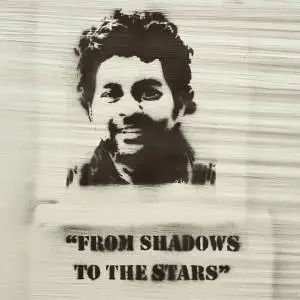

**One Day**

One day you will understand why I was aggressive. On that day, you will understand why I have not just served social interests. One day you will get to know why I apologised. On that day, you will understand there are traps beyond the fences. One day you will find me in the history. In the bad light, in the yellow pages. And you will wish I was wise. But at the night of that day, you will remember me, feel me and you will breathe out a smile. And on that day, I will resurrect.

_— Rohith Vemula_

**ਇੱਕ ਦਿਨ**

ਇੱਕ ਦਿਨ ਤੁਹਾਨੂੰ ਸਮਝ ਆਵੇਗੀ ਕਿ ਮੈਂ ਤੱਤ ਭੜੱਥਾ ਕਿਓਂ ਸੀ ਇੱਕ ਦਿਨ ਤੁਹਾਨੂੰ ਸਮਝ ਆਵੇਗੀ ਕਿ ਮੈ ਸਮਾਜਕ ਸਰੋਕਾਰਾਂ ਦੀ ਜੀ ਹਜ਼ੂਰੀ ਕਿਉਂ ਨਹੀਂ ਕੀਤੀ । ਇੱਕ ਦਿਨ ਤੁਹਾਨੂੰ ਪਤਾ ਲੱਗੇ ਗਾ ਕਿ ਮੈਂ ਮੁਆਫ਼ੀ ਕਿਉਂ ਮੰਗੀ । ਓਸ ਦਿਨ ਤੁਹਾਨੂੰ ਸਮਝ ਆਵੇਗੀ ਕਿ ਵਾੜਾਂ ਤੋਂ ਪਰੇ ਫੰਦੇ ਨੇ । ਇੱਕ ਦਿਨ ਮੈਂ ਤੁਹਾਨੂੰ ਇਤਿਹਾਸ ਵਿੱਚ ਮਿਲਾਂਗਾ ਮੀਣੀ ਰੌਸ਼ਨੀ 'ਚ, 'ਬੁਰੀਆਂ' ਕਿਤਾਬਾਂ ਦੇ ਪੀਲੇ ਵਰਕਿਆਂ 'ਚ ਅਤੇ ਤੁਸੀਂ ਸੋਚੋਂਗੇ ਕਿ ਕਾਸ਼ ਮੈਂ ਸਿਆਣਾ ਹੁੰਦਾ ਪਰ ਉਸ ਦਿਨ ਦੀ ਰਾਤ ਨੂੰ ਤੁਸੀਂ ਮੈਨੂੰ ਯਾਦ ਕਰੋਂਗੇ, ਮਹਿਸੂਸ ਕਰੋਂਗੇ ਅਤੇ ਤੁਹਾਡੇ ਮੂੰਹ ਤੇ ਇੱਕ ਮੁਸਕੁਰਾਹਟ ਖਿੜੇਗੀ ਤੇ ਓਸ ਦਿਨ, ਮੈਂ ਪੁਨਰਜਨਮ ਲਵਾਂਗਾ।_\-  ਰੋਹਿਤ  ਵੇਮੂਲਾ _

_ਅੰਗਰੇਜ਼ੀ ਤੋਂ ਪੰਜਾਬੀ ਉਲੱਥਾ : [ਜਸਦੀਪ](https://parchanve.wordpress.com/category/translators/jasdeep/)_

[Rohith Vemula](https://en.wikipedia.org/wiki/Suicide_of_Rohith_Vemula) was a PhD student at University of Hyderbad, who committed suicide on 17th January 2016, after he along with his four comrades was rusticated from the hostel and his fellowship was suspended for"raising issues under the banner of Ambedkar Students Association (ASA)" by the University Administration. His death sparked protests and outrage from across India.

ਰੋਹਿਤ  ਵੇਮੂਲਾ  ਹੈਦਰਾਬਾਦ ਯੂਨੀਵਰਸਿਟੀ ਵਿੱਚ ਪੀ ਐੱਚ ਡੀ  ਖੋਜਾਰਥੀ ਸੀ , ਜਿਸ ਨੇ 17 ਜਨਵਰੀ 2017 ਨੂੰ ਖ਼ੁਦਕੁਸ਼ੀ ਕਰ ਲਈ ਸੀ| ਯੂਨੀਵਰਸਿਟੀ ਪ੍ਰਬੰਧਕਾਂ ਦੇ ਅਣਮਨੁੱਖੀ ਵਤੀਰੇ ਤਹਿਤ ਉਸਨੂੰ ਮਿਲਦਾ  ਵਜ਼ੀਫਾ ਏਸ  ਕਰਕੇ ਰੋਕ ਦਿੱਤਾ ਗਿਆ ਸੀ ਕਿਉਂਕਿ ਉਹ "ਅੰਬਦੇਕਰ ਸਟੂਡੈਂਟ ਐਸੋਸ਼ੀਏਸ਼ਨ ਦੇ ਬੈਨਰ ਹੇਠ  ਹੱਕਾਂ ਵਾਸਤੇ ਆਵਾਜ਼ ਉਠਾ ਰਿਹਾ ਸੀ " ਅਤੇ ਉਸਦੇ 4 ਸਾਥੀਆਂ ਸਮੇਤ  ਉਸਨੂੰ ਹੋਸਟਲ ਤੋਂ ਵੀ ਬਾਹਰ ਕੱਢ ਦਿੱਤਾ ਗਿਆ ਸੀ | ਉਸਦੀ ਮੌਤ ਤੋਂ ਬਾਅਦ ਪੂਰੇ ਦੇਸ਼ ਵਿਚ ਜਾਤ ਪਾਤ ਅਧਾਰਿਤ ਵਿਤਕਰੇ ਖ਼ਿਲਾਫ਼ ਇੱਕ ਲੋਕ ਲਹਿਰ ਉੱਭਰੀ, ਜੋ ਸਾਲ ਬਾਅਦ ਵੀ ਰੋਹਿਤ ਦੇ ਕਾਤਲਾਂ ਖਿਲਾਫ ਐਕਸ਼ਨ, ਉਚੇਰੀ ਸਿੱਖਿਆ ਵਿੱਚ ਬੇਹਤਰੀ ਅਤੇ ਜਾਤ ਪਾਤ ਅਧਾਰਿਤ ਵਿਤਕਰੇ ਖਿਲਾਫ ਠੋਸ ਇਨਸਾਫਮੁਖੀ ਕਾਨੂੰਨ ਲਾਗੂ ਕਰਨ ਲਈ  ਜੱਦੋ ਜਹਿਦ ਕਰ ਰਹੀ ਹੈ |

Punjabi translation is by [Jasdeep](https://parchanve.wordpress.com/category/translators/jasdeep/).

**Photo: **Graffiti at Hyderabad Central University, courtesy [Koonal Duggal](https://www.facebook.com/koonal.duggal)

_Crossposted from [https://parchanve.wordpress.com/2017/01/18/one-day/](https://parchanve.wordpress.com/2017/01/18/one-day/)_

---
### Comments:
#### [nsdnl](http://mypunjabipoetry.wordpress.com "nchahal.case@gmail.com") - <time datetime="2017-06-14 19:23:09">Jun 3, 2017</time>

ਬਹੁਤ ਵਧੀਆ ਬਿਅਾਨ ਕੀਤਾ ਏ ਜੀ

#### [http://mypunjabipoetry.wordpress.com](http://mypunjabipoetry.wordpress.com "nchahal.case@gmail.com") - <time datetime="2017-06-15 11:32:46">Jun 4, 2017</time>

ਚੰਗਾ ਸਾਹਿਤ ਪੜਨਾ ਤੇ ਫੇਰ ਓਸਨੂੰ ਸਰੋਤਿਆਂ ਅੱਗੇ ਪੇਸ਼ ਕਰਨਾ...ਲਾਜਵਾਬ ਕੰਮ ਕਰ ਰਹੇ ਹੋ

#### [http://mypunjabipoetry.wordpress.com](http://mypunjabipoetry.wordpress.com "nchahal.case@gmail.com") - <time datetime="2017-06-15 11:33:57">Jun 4, 2017</time>

ਚੰਗਾ ਸਾਹਿਤ ਪੜਨਾ ਤੇ ਫੇਰ ਓਸਨੂੰ ਸਰੋਤਿਆਂ ਅੱਗੇ ਪੇਸ਼ ਕਰਨਾ...ਲਾਜਵਾਬ ਕੰਮ ਕਰ ਰਹੇ ਹੋ ।

