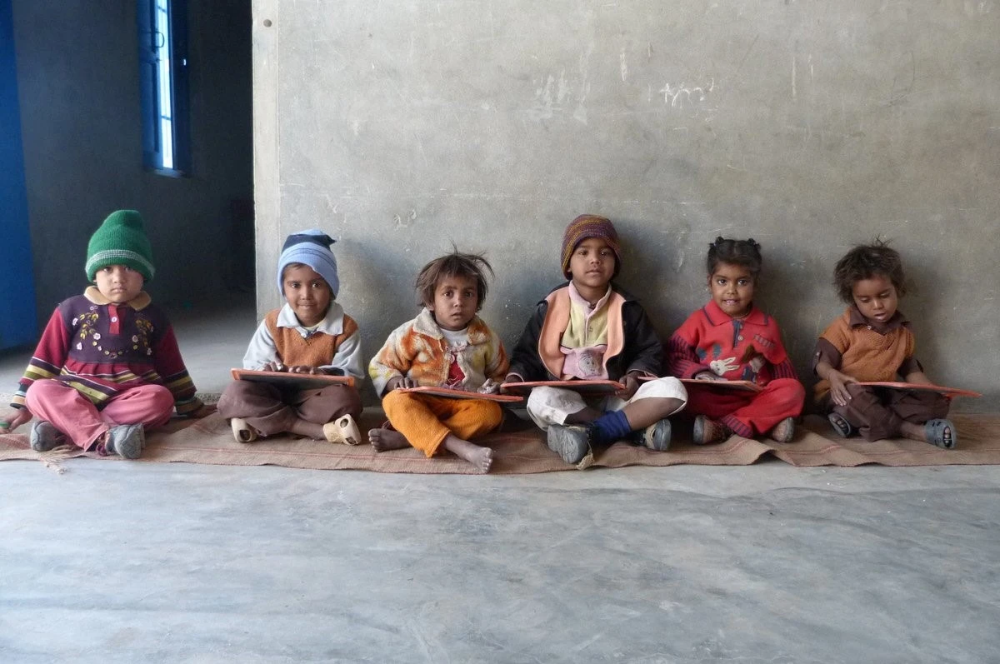

ਮੇਰੇ ਕੋਲ ਪੜ੍ਹਨ ਆਉਂਦੇ ਬੱਚਿਆਂ ਦੇ ਕੁੜਤੇ ਅਕਸਰ ਪਾਟੇ ਹੁੰਦੇ ਕਾਜਾਂ ਕਾਲਰਾਂ ਜੇਬਾਂ ਕੋਲੋਂ

ਇਕ-ਅਧ ਬਟਨ ਜੇ ਲੱਗਿਆ ਹੋਵੇ ਲਾਲ ਪੀਲੇ ਕਾਲੇ ਧਾਗੇ ਨਾਲ ਉਹ ਵੀ ਖੁਲ੍ਹਿਆ ਹੁੰਦਾ ਹੈ

ਇਹਨਾ ਦੇ ਪੈਰਾਂ ਕੋਲ ਕਿਸੇ ਕਲੱਬ ਵੱਲੋਂ ਮਿਲੇ ਬੂਟਾਂ ਦਾ ਮਿਹਣਾ ਹੈ ਐਸ ਸੀ , ਬੀ ਸੀ ਨੂੰ ਮਿਲਦੇ ਵਜੀਫੇ ਦੀ ਉਡੀਕ

ਮੇਰੇ ਕੋਲ ਪੜ੍ਹਨ ਆਉਂਦੇ ਬੱਚੇ ਕਿਉਂ ਰਹਿ ਜਾਂਦੇ ਉਹੋ ਜਿਹੇ ਜਿਹੋ ਜਿਹੇ ਉਹ ਆਉਂਦੇ ਘਰੋਂ ਬਲਕਿ ਘਰੋਂ ਆਏ ਮਾਸੂਮ ਪੜ੍ਹ ਪੜ੍ਹ ਹੋਰ ਵੀ ਢੀਠ ਹੋ ਜਾਂਦੇ ਪਹਿਲਾਂ ਨਾਲੋਂ ਵੱਧ ਵਿਗੜ ਜਾਂਦੇ

ਨਹੀਂ ਭਾਉਂਦੇ ਰਤਾ ਵੀ ਮੁਖ ਅਧਿਆਪਕ ਨੂੰ ਚੰਗੇ ਨਹੀਂ ਲਗਦੇ ਸਭ ਭੈਣ ਜੀਆਂ ਨੂੰ ਮੇਰੇ ਕੋਲ ਪੜ੍ਹਨ ਆਉਂਦੇ ਬੱਚੇ ਬਹੁਤ ਸਹਿਜ ਲੈਂਦੇ ਨੇ ਗਧੇ ਸੂਰ ਉਲੂ ਜਿਹੇ ਵਿਸ਼ੇਸ਼ਣ ਮਿਡ ਡੇ ਮੀਲ ਨਾਲ ਪਾਣੀ ਵਾਂਙ ਪੀ ਜਾਂਦੇ ਨੇ

ਮੇਰੇ ਕੋਲ ਪੜ੍ਹਨ ਆਉਂਦੇ ਬੱਚੇ ਜਾਣਨ ਕਿੰਨਾ ਕੁਝ ਮੇਰੇ ਨਾਲੋਂ ਵੱਧ ਫਿਰ ਵੀ ਸੁਣਦੇ ਰਹਿਣ ਚੁੱਪ-ਚਾਪ ਮੈਨੂੰ

ਜਿਵੇਂ ਕਿਤੇ ਬੈਠਾ ਹੋਵਾਂ ਮੈਂ ਵੀ ਵਿਚਕਾਰ ਇਹਨਾ ਦੇ ਪੜਾਉਂਦਿਆਂ ਅਕਸਰ ਲਗਦਾ ਮੈਨੂੰ ੦

ਮੇਰੇ ਕੋਲ ਪੜ੍ਹਨ ਆਉਂਦੇ ਬੱਚੇ ਕਿੰਨੇ ਭੋਲੇ ਸਿੱਧੇ ਸਾਦੇ ਆਪਣੇ ਵਰਗੇ ਆਪ

ਨਹੀਂ ਇਹਨਾ ਕੋਲ ਕੋਈ ਸਲੀਕਾ ਸਲੂਟ ਮਾਫ਼ ਕਰਨਾ ਧੰਨਵਾਦ

ਉਹ ਮੂੰਹ ਫੱਟ ਨੇ ਜਿਵੇਂ ਜੀਅ ਆਵੇ ਬੋਲਦੇ ਨੇ ਗਾਲਾਂ ਕਢਦੇ ਤੁਰਦੇ ਨੇ ਪੱਥਰਾਂ ਨੂੰ ਠੁਡੇ ਮਾਰਦੇ ਖੇਡਦੇ ਨੇ ਨਸੀਬਾਂ ਦੀ ਗੇਂਦ ਦਾ ਕੈਚ ਛਡਦੇ ਲੜਦੇ ਨੇ ਗਲਮੇ ‘ਚ ਹੱਥ ਪਾ ਲੈਂਦੇ

ਪਿਆਰ ਕਰਨ ਦਾ ਇਹੋ ਢੰਗ

ਮੇਰੇ ਕੋਲ ਪੜ੍ਹਨ ਆਉਂਦੇ ਬੱਚਿਆਂ ਦਾ ਰਹਿ ਰਹਿ ਕੇ ਮੋਹ ਕਿਉਂ ਆ ਰਿਹਾ ਹੈ ਮੈਨੂੰ ਅੱਜ ੦

ਚਾਹਾਂ ਦੋਸਤਾਂ ਵਾਂਙ ਤੁਰਾਂ ਮੋਢਿਆਂ ਦੁਆਲੇ ਹੱਥ ਪਾ ਆਪਣੇ ਵਿਦਿਆਰਥੀਆਂ ਨਾਲ

ਪਰ ਮੈਂ ਖਿਝ ਜਾਂਦਾ ਅਕਸਰ ਇਹਨਾ ‘ਤੇ

ਮੇਰੀ ਇਹ ਖਿਝ ਕਿਸ ਵਾਸਤੇ ਹੈ ?

ਉਹ ਜੇ ਲੱਤ ਮੁਕੀ ਹੁੰਦੇ ਇਕ ਦੂਜੇ ਦੀ ਮਾਂ ਭੈਣ ਇਕ ਕਰਦੇ ਬੈਂਚਾਂ ਉਪਰ ਨੱਚਦੇ ਉਚੜੀਆਂ ਕੂਹਣੀਆਂ ਗਿੱਟੇ ਗੋਡਿਆਂ ਦੇ ਜ਼ਖਮਾਂ ਨੂੰ ਪੱਟੀ ਨਾ ਬੰਨ੍ਹਦੇ

ਇਹਦੇ ‘ਚ ਇਹਨਾ ਦਾ ਕੀ ਕਸੂਰ ? ਮੈਂ ਕਿਸ ਤੋਂ ਡਰਦਾ ਹਾਂ ?

ਭਾਸ਼ਣ ਦਿੰਦਾ ਹਾਂ

ਚੁੱਪ ਹੋ ਜਾਂਦੇ ਜਿਵੇਂ ਕਦੇ ਬੋਲੇ ਹੀ ਨਾ ਹੋਣ ਸੁਣਦੇ ਮੈਨੂੰ

ਮੈਂ ਦਸਦਾ ਆਪਣੇ ਜਮਾਤੀ ਬਲਵੰਤ ਭਾਟੀਏ ਬਾਰੇ ਪਿਉ ਜੁਤੀਆਂ ਸਿਉਂਦਾ ਇਹਦਾ ਛੁੱਟੀ ਵਾਲੇ ਦਿਨ ਦਿਹਾੜੀ ਕਰਦਾ ਬਲਵੰਤ ਫੀਸ ਭਰਦਾ ਅੱਜ ਬੈਂਕ ਮੈਨੇਜਰ

ਤੁਸੀਂ ਵੀ ਪੜ੍ਹੋ

ਮੈਂ ਦਸਦਾ ਆਪਣੇ ਦੋਸਤ ਰਾਣੇ ਬਾਰੇ ਅਰਥ-ਸ਼ਾਸ਼ਤਰ ਦਾ ਪ੍ਰੋਫੈਸਰ ਵੀ ਇਹਦੇ ਪੁੱਛੇ ਪ੍ਰਸ਼ਨਾਂ ਤੋਂ ਤ੍ਰਹਿੰਦਾ ਛੁੱਟੀ ਇਹਦੀ ਲੰਘਦੀ ਬੱਠਲ ਚੱਕਦਿਆਂ ਇੱਟਾਂ ਢੋਂਹਦਿਆਂ ਅੱਜ ਕੱਲ ਹਾਈਕੋਰਟ ਇਹਤੋਂ ਪੁੱਛ ਪੁੱਛ ਕੰਮ ਕਰਦੀ ਚੰਡੀਗੜ੍ਹ ‘ਚ ਨਿਵੇਲੀ ਕੋਠੀ

ਤੁਸੀਂ ਵੀ ਪੜ੍ਹੋ

ਮੈਂ ਆਪਣਾ ਜ਼ਿਕਰ ਛੋਂਹਦਾ ਚੁੱਪ ਕਰ ਜਾਂਦਾ ਆਖਦਾ ਮੁੜ ਮੁੜ

ਤੁਸੀਂ ਵੀ ਪੜ੍ਹੋ ੦

ਮੇਰੇ ਕੋਲ ਪੜ੍ਹਨ ਆਉਂਦੇ ਬੱਚਿਆਂ ਦੇ ਸੁਪਨੇ

ਕਿੰਨੇ ਸਾਫ ਦਿਸਦੇ ਮੱਥਿਆਂ ‘ਚ ਵਜਦੇ ਸਿਰ ਪਾੜ ਦਿੰਦੇ

ਅਸਲ ‘ਚ

ਅਜੇ ਤਕ ਨਹੀਂ ਬਣੀ ਕੋਈ ਖੁਰਦਬੀਨ ਜੋ ਦੇਖ ਸਕੇ ਮੇਰੇ ਕੋਲ ਪੜ੍ਹਨ ਆਉਂਦੇ ਬੱਚਿਆਂ ਦੇ ਸੁਪਨੇ ੦

ਮੇਰੇ ਕੋਲ ਪੜ੍ਹਨ ਆਉਂਦੇ ਬੱਚੇ ਸ਼ਰਾਰਤੀ ਨੇ ਸਿਰੇ ਦੇ ਸ਼ਰਾਰਤੀ

ਆਖਦੇ ਅਧਿਆਪਕ ਸਿਰ ਫੜ੍ਹ ਲੈਂਦੇ

ਮਨ ਹੀ ਮਨ ਸੋਚਦਾ ਕਵੀ-ਮਨ ਸ਼ੁਕਰ ਹੈ ਇਹਨਾ ਕੋਲ ਕੁਝ ਤਾਂ ਹੈ ।।

( ਨਵੀਂ ਕਾਵਿ-ਕਿਤਾਬ ' ਸਿਆਹੀ ਘੁਲ਼ੀ ਹੈ ' ਵਿਚੋਂ )

**The children who come to learn from me**

The children who come to learn from me wear clothes often tattered from collars, pockets, button openings

If by chance A button is  in place sewn with a red, yellow or black thread It would be open

A pair of shoes taunt their feet given away by a charity club In a hope of stipend entitled for SC/BC category

The children who come to learn from me Why do they remain the same Same as they come from their home Rather, they are innocent when they come But schooling makes them more stubborn More spoiled

Head teacher Does not like them at all Women teachers Despise them The children who come to learn from me take adjectives like ass, pig, idiot like water with  a mid-day meal

The children who come to learn from me Know a lot more than me Yet, they listen to me Blankl faced

While teaching I feel As if, I am Sitting along with them too

੦

The children who come to learn from me How sweet, innocent and simple They are

They don’t possess any civility or salutation to say thank you, please

They are outspoken Straight form heart They speak, they curse They walk, kicking the stones away They play, missing the catch of theball of destiny They fight, they grab collars

This is the way they love,the same The children who come to learn from me

Why am I getting affectionate Today?

੦

I wish I can walk like friends with my arms around the shoulders of my students

But I often get irritated at them What for?

If they quarrel They curse like a sailor

They dance on classroom benches They don’t mind dressing the wounded  knees or elbows

What is their crime in it? What am I afraid of?

I lecture

Listening to me They go silent As if they have never spoken

I tell them about My classmate _Balwant Bhatia_ His father made shoes In holidays he worked as a laborer To pay his school fee Now, he is a bank manager

You should study too

I tell them about My friend _Rana_ Even professor of economics Dreaded questions asked by him On a holiday He would carry bricks at construction sites These days, high court Works on his whims He just got a new _kothi_ in Chandigarh

You should study too

I begin to tell my own story But I stop

I keep telling them You should study too

੦

Dreams of The children who come to learn from me

How bright they must be Mind boggling

Actually

There is no microscope Built yet That can see Dreams of Children who come to learn from me

੦

Children who come to learn from me Are very mischievous Mischievous beyond limit

Teachers say this and Get tense

Poetic mind ponders At least, they have something.

**Postscript:** [Gurpreet](http://parchanve.wordpress.com/category/gurpreet-mansa/) teaches Punjabi at Government school in Mansa district. [This poem](http://gurpreetmansa.blogspot.com/2011/10/blog-post_05.html) is from his third anthology 'siaahi ghuli hai' ( ink is imbued). Its interesting he has used ਙ rather than ਗ in ਦੋਸਤਾਂ ਵਾਂਙ ਤੁਰਾਂ.

**English Translation:** [Jasdeep](https://parchanve.wordpress.com/category/translators/jasdeep/)

**Photo**: Pre-School Kids by [Jasdeep](https://parchanve.wordpress.com/category/translators/jasdeep/) (https://www.facebook.com/photo.php?fbid=10150494059425651&set=a.10150426797685651.609092.554685650&type=1&permPage=1)

_Crossposted from [https://parchanve.wordpress.com/2011/10/11/children-who-come-to-learn-gurpreet/](https://parchanve.wordpress.com/2011/10/11/children-who-come-to-learn-gurpreet/)_

---
### Comments:
#### [ਸਾਥੀ ਟਿਵਾਣਾ]( "sathitiwana@gmail.com") - <time datetime="2011-10-14 21:09:25">Oct 5, 2011</time>

ਗੁਰ ਪ੍ਰੀਤ ਜੀ ਬਹੁਤ ਹੀ ਵਧੀਆ ਕਵਿਤਾ ਹੈ। ਕਾਵਿ ਪੁਸਤਕ 'ਸਿਆਹੀ ਘੁਲ਼ੀ ਹੈ' ਨੂੰ ਜੀ ਆਇਆਂ।

#### [girlsguidetosurvival](http://girlsguidetosurvival.wordpress.com "girlsguidetosurvival@gmail.com") - <time datetime="2011-10-16 18:16:18">Oct 0, 2011</time>

ਏਹ ਸੁਪਨੇ ਹੀ ਨੇ ਜੋ ਉਸ ਪਾਰ ਲੈ ਜਾਂਦੇ ਨੇ... ਨਵੀਂ ਕਾਵਿ ਪੁਸਤਕ ਦਾ ਸਵਗਤ ਤੇ ਬਧਾਈ Peace, Desi Girl

#### [babbar]( "punjabibaaz@gmail.com") - <time datetime="2011-11-04 08:54:02">Nov 5, 2011</time>

bahut wadia veer ji...keep it up

#### [Gurpreet Matharu](http://preetludhianvi.blogspot.com/ "matharu789@gmail.com") - <time datetime="2011-12-05 07:16:56">Dec 1, 2011</time>

bahut hi umda rachna...Thanks to admin for sharing

#### [gurnaib maghania](http://adsasd "gmaghania@gmail.com") - <time datetime="2011-10-30 02:18:25">Oct 0, 2011</time>

bahut kmal j ....

#### [Shiv Bhatti](http://www.facebook.com/bhattishiv "bhattishiv@yahoo.com") - <time datetime="2012-11-04 09:55:33">Nov 0, 2012</time>

bahu th vadiya kavita mere kol parn aunde bache .......ਇਹਨਾ ਦੇ ਪੈਰਾਂ ਕੋਲ ਕਿਸੇ ਕਲੱਬ ਵੱਲੋਂ ਮਿਲੇ ਬੂਟਾਂ ਦਾ ਮਿਹਣਾ ਹੈ ਐਸ ਸੀ , ਬੀ ਸੀ ਨੂੰ ਮਿਲਦੇ ਵਜੀਫੇ ਦੀ ਉਡੀਕ......................ਮੈਂ ਦਸਦਾ ਆਪਣੇ ਜਮਾਤੀ ਬਲਵੰਤ ਭਾਟੀਏ ਬਾਰੇ ਪਿਉ ਜੁਤੀਆਂ ਸਿਉਂਦਾ ਇਹਦਾ ਛੁੱਟੀ ਵਾਲੇ ਦਿਨ ਦਿਹਾੜੀ ਕਰਦਾ ਬਲਵੰਤ ਫੀਸ ਭਰਦਾ ਅੱਜ ਬੈਂਕ ਮੈਨੇਜਰ ਤੁਸੀਂ ਵੀ ਪੜ੍ਹੋ ਮੈਂ ਦਸਦਾ ਆਪਣੇ ਦੋਸਤ ਰਾਣੇ ਬਾਰੇ ਅਰਥ-ਸ਼ਾਸ਼ਤਰ ਦਾ ਪ੍ਰੋਫੈਸਰ ਵੀ ਇਹਦੇ ਪੁੱਛੇ ਪ੍ਰਸ਼ਨਾਂ ਤੋਂ ਤ੍ਰਹਿੰਦਾ ਛੁੱਟੀ ਇਹਦੀ ਲੰਘਦੀ ਬੱਠਲ ਚੱਕਦਿਆਂ ਇੱਟਾਂ ਢੋਂਹਦਿਆਂ ਅੱਜ ਕੱਲ ਹਾਈਕੋਰਟ ਇਹਤੋਂ ਪੁੱਛ ਪੁੱਛ ਕੰਮ ਕਰਦੀ ਚੰਡੀਗੜ੍ਹ ‘ਚ ਨਿਵੇਲੀ ਕੋਠੀ ਤੁਸੀਂ ਵੀ ਪੜ੍ਹੋ................sir balwant bhatia and rana tuhade frndz aaa

#### [Shiv Bhatti](http://www.facebook.com/bhattishiv "bhattishiv@yahoo.com") - <time datetime="2012-11-04 10:03:03">Nov 0, 2012</time>

sir ji mainu kitho kitab milngi siahi ghuli hai

#### [manteshveer@876](http://gmail "mann.gurpreet87@gmail.com") - <time datetime="2013-04-11 12:26:07">Apr 4, 2013</time>

sidhi dil ch wajji ..

#### [tanya]( "tanyavirk@yahoo.com") - <time datetime="2013-07-28 05:22:25">Jul 0, 2013</time>

mere kol padan aaunde bache is a trye story of rural punjab its beautifully compiled by poet with very natural and true thoughts awesome work

#### [Deep Jagdeep](https://plus.google.com/102391707680723899182 "deepjagdeepsingh@gmail.com") - <time datetime="2013-10-16 08:37:31">Oct 3, 2013</time>

ਅੱਛਾ ਜੀ

#### [Aman Gill](http://raagwap.com "vipgill786@yahoo.com") - <time datetime="2014-07-20 15:51:09">Jul 0, 2014</time>

wah ji wah kya baat aa....kamaal krti

#### [Pardeep kaur]( "5180@gmail.com") - <time datetime="2014-10-02 11:57:02">Oct 4, 2014</time>

Bahut vadia kavita likhi hai g...

#### [nsdnl](http://mypunjabipoetry.wordpress.com "nchahal.case@gmail.com") - <time datetime="2017-06-14 19:24:47">Jun 3, 2017</time>

nice

