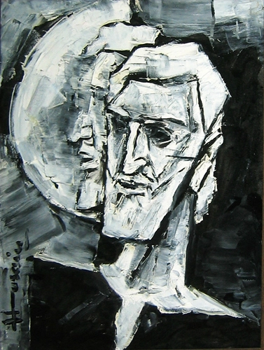

\[caption id="attachment\_813" align="alignnone" width="377"\] Self Portrait- M. F. Hussain\[/caption\]

**ਮਕਬੂਲ ਫਿਦਾ ਹੁਸੈਨ**

ਇਕ ਬੱਚਾ ਸੁੱਟਦਾ ਹੈ ਮੇਰੇ ਵੱਲ ਰੰਗ ਬਰੰਗੀ ਗੇਂਦ

ਤਿੰਨ ਟੱਪੇ ਖਾ ਔਹ ਗਈ ਔਹ ਗਈ

ਮੈਂ ਆਪਣੇ 'ਤੇ ਹਸਦਾ ਹਾਂ ਗੇਂਦ ਨੂੰ ਬੁੱਚਣ ਲਈ ਬੱਚਾ ਹੋਣਾ ਪਵੇਗਾ ।। ०

ਨੰਗੇ ਪੈਰਾਂ ਦਾ ਸਫ਼ਰ ਮੁਕਣਾ ਨਹੀਂ ਇਹ ਰਹਿਣਾ ਹੈ ਸਦਾ ਜਵਾਨ

ਲੰਬੇ ਬੁਰਸ਼ ਦਾ ਇਕ ਸਿਰਾ ਆਕਾਸ਼ 'ਤੇ ਚਿਮਨੀਆਂ ਟੰਗਦਾ ਹੈ ਦੂਜਾ ਸਿਰਾ ਧਰਤੀ ਨੂੰ ਰੰਗਦਾ ਹੈ

ਉਹ ਜਦੋਂ ਵੀ ਅੱਖਾਂ ਮੀਚੇ ਦੇਖਦਾ ਹੈ ਅਧਿਆਪਕ ਦੇ ਬਲੈਕ ਬੋਰਡ ਤੋਂ ਪਹਿਲਾਂ ਆ ਬਹਿੰਦਾ ਉਹਦੀ ਪੈਨਸਲ 'ਤੇ ਤੋਤਾ ।। ०

ਨੰਗੇ ਪੈਰਾਂ ਦੇ ਸਫ਼ਰ 'ਚ ਰਲੀ ਹੁੰਦੀ ਹੈ ਧੂੜ੍ਹ ਮਿੱਟੀ ਦੀ ਮਹਿਕ ਮਚਦੇ ਪੈਰਾਂ ਹੇਠ ਵਿਛ ਜਾਂਦੀ ਹਰੇ ਰੰਗ ਦੀ ਛਾਂ

ਸਿਆਲੀ ਦਿਨਾਂ 'ਚ ਵਿਛ ਜਾਂਦੀ ਧੁੱਪ ਰਾਹਾਂ 'ਚ ਨੰਗੇ ਪੈਰ ਨਹੀਂ ਪਾਏ ਜਾ ਸਕਦੇ ਪਿੰਜਰੇ 'ਚ ਨੰਗੇ ਪੈਰਾਂ ਦਾ ਹਰ ਕਦਮ ਸੁਤੰਤਰ ਲਿਪੀ ਦਾ ਸੁਤੰਤਰ ਵਰਣ

ਪੜ੍ਹਨ ਲਈ ਨੰਗਾ ਹੋਣਾ ਪਵੇਗਾ ਮੈਂ ਡਰ ਜਾਂਦਾ ।। ०

ਇਕ ਵਾਰ ਉਹਦੀ ਦੋਸਤ ਨੇ ਤੋਹਫੇ ਵਜੋਂ ਦਿੱਤੀਆਂ ਦੋ ਜੋੜੀਆਂ ਬੂਟਾਂ ਦੀਆਂ ਨਰਮ ਰੂੰ ਜਿਹਾ ਲੈਦਰ

ਕਿਹਾ ਉਹਨੇ ਪਾ ਇਹਨਾ ਨੂੰ ਬਾਜਾਰ ਚੱਲੀਏ

ਪਾ ਲਿਆ ਉਹਨੇ ਇਕ ਪੈਰ 'ਚ ਕਾਲਾ ਦੂਜੇ ਪੈਰ 'ਚ ਭੁਰੇ ਰੰਗ ਦਾ ਬੂਟ

ਇਹ ਕਲਾਕਾਰ ਦੀ ਯਾਤਰਾ ਹੈ ।। ०

ਸ਼ੁਰੂਆਤ ਰੰਗਾਂ ਦੀ ਸੀ ਤੇ ਆਖਰ ਉਹ ਰਲ ਗਿਆ ਰੰਗਾਂ 'ਚ

ਰੰਗਾਂ 'ਤੇ ਕੋਈ ਮੁਕੱਦਮਾ ਨਹੀਂ ਕਰ ਸਕਦਾ ਹੱਦ ਸਰਹੱਦ ਦਾ ਕੀ ਅਰਥ ਰੰਗਾਂ ਲਈ

ਦੁਨੀਆਂ ਦੇ ਕਿਸੇ ਕੋਨੇ ਆਹ ਹੁਣੇ ਵਾਹ ਰਿਹਾ ਹੋਵੇਗਾ

ਕੋਈ ਬੱਚਾ ਆਪਣੇ ਸਿਆਹੀ ਲਿਬੜੇ ਹੱਥਾਂ ਨਾਲ ਨੀਲੇ ਕਾਲੇ ਘੁੱਗੂ ਘੋੜੇ

ਰੰਗਾਂ ਦੀ ਕੋਈ ਕਬਰ ਨਹੀਂ ਹੁੰਦੀ ।। ०

\-  ਗੁਰਪ੍ਰੀਤ ਮਾਨਸਾ

**मकबूल फ़िदा हुसैन **

एक बच्चा फेंकता है मेरी ओर रंग बिरंगी गेंद

तीन ठप्पे खा ओ गई ओ गई

मैं हँसता हूँ अपने आप पर गेंद को कैच करने के लिए बच्चा होना पड़ेगा ० नंगे पैरों का सफ़र ख़त्म नहीं होगा यह रहेगा हमेशा के लिए

लम्बे बुर्श का एक सिरा आकाश में चिमनिया टाँगता दूसरा धरती को रंगता है

वो जब भी ऑंखें बंद करता मिट्टी का तोता

एक बच्चा फेंकता है मेरी ओर रंग बिरंगी गेंद

तीन ठप्पे खा ओ गई ओ गई

मैं हँसता हूँ अपने आप पर गेंद को कैच करने के लिए बच्चा होना पड़ेगा ० नंगे पैरों का सफ़र ख़त्म नहीं होगा वो रहेगा हमेशा के लिए

लम्बे बुर्श का एक सिरा आकाश में चिमनिया टाँगता दूसरा धरती को रंगता है

वो जब भी ऑंखें बंद करता मिट्टी का तोता उड़ान भरता कागत पर पेंट की लड़की हंसने लगती ० नंगे पैरों के सफ़र में मिली होती धूल मिट्टी की महक

जलते पैरों तले फ़ैल जाती हरे रंग की छाया सर्दी के दिनों में धूप हो जाती गलीचा

नंगे पैर नहीं पाए जा सकते किसी पिंजरे में

नंगे पैरों का हर कदम स्वतंत्र लिपि का स्वतन्त्र वरण

पढ़ने के लिए नंगा होना पड़ेगा मैं डर जाता ० एक बार उसकी दोस्त ने दी तोहफे के तौर पर दो जोड़ा बूट नर्म लैदर

कहा उसने बाज़ार चलते हैं पहनो ये बूट

पहन लिया उसने एक पैर में भूरा दूसरे में काला

कलाकार की यात्रा है यह ० शुरूआत रंगो की थी और आखिर भी हो गई रंग

रंगों पर कोई मुकद्दमा नहीं हो सकता हदों सरहदों का क्या अर्थ रंगों के लिए

संसार के किसी कोने में बना रहा होगा कोई बच्चा स्याही संसार के किसी कोने में अभी बना रहा होगा कोई बच्चा अपने नन्हे हाथों से नीले काले घुग्गू घोड़े

रंगों की कोई कब्र नहीं होती . ०

\- गुरप्रीत मानसा

\- _हिंदी अनुवाद: सुरिंदर मोहन शर्मा _

**Maqbool Fida Hussain**

A child Throws A colorful ball Towards me

It bounced thrice Went away Afar

I laugh at myself To catch the ball I will have to be a child again. ○

The bare feet journey Will not end It will be forever Young

One end of the long brush Places chimneys on the sky The other end colors the earth

Whenever he closes eyes The mud sparrow begins  to fly The girl drawn on paper Begins to smile ○

This bare feet journey is mixed with the essence of earthy dust Beneath the burning feet spreads the green shade In the cold winter days spreads the sunshine in the paths

Bare feet can’t be put in a cage Every step of the bare feet Is a free character of a free script

One needs to get bare to read I fear. ○

Once a friend gifted him Two pair of shoes Leather as soft as a cotton swab

He said Wearing it Let’s go to the bazaar

He wore Black in one foot Brown in the other

This is the journey of an artist. ○

He began with colors And at last He got immersed In colors

Nobody can sue the colors What does borders and boundaries mean for colors

In any part of the world Just now, A child might be drawing With his ink riddled hands Blue black Absurd figures

The colors don’t have a grave.

\- Gurpreet Mansa

_\- English Translation by Jasdeep_

* * *

Original poem in Punjabi by [Gurpreet Mansa](http://parchanve.wordpress.com/category/gurpreet-mansa/)

Translation to Hindi by [Surinder Mohan Sharma](https://www.facebook.com/surendramohan.sharma.3/posts/813945701977271?fref=nf) Translation to English by [Jasdeep](http://parchanve.wordpress.com/category/translators/jasdeep/) Picture is taken from the website of [RL Fine Arts](http://www.rlfinearts.com/exhibitions/past/m.f.-husain-selected-works)

_Crossposted from [https://parchanve.wordpress.com/2015/09/17/maqbool-fida-hussain/](https://parchanve.wordpress.com/2015/09/17/maqbool-fida-hussain/)_

---
### Comments:
#### [gurudutt]( "guruduttmd@gmail.com") - <time datetime="2015-09-18 05:51:00">Sep 5, 2015</time>

very very sweet

