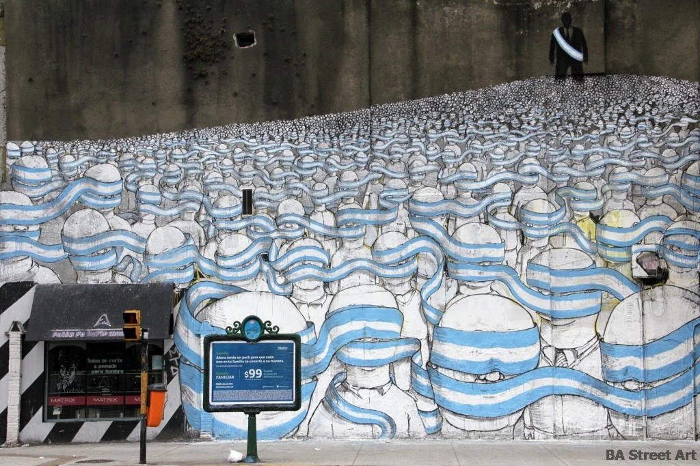

**The Station of the Blind**

_“Let me not lie. There was a crowd of 200 people._”

_~_ Ashok, shop owner

They did not see anything.

They did not see the two bodies

With blood all over them.

They did not see the two bodies

Taken away.

They did not see what they saw.

They saw what they did not see.

Their paralysed eyes

Became hidden cameras,

Hiding from the scene of crime.

Hiding from light.

There cannot be a single reason

For 200 people to not see.

Except turning blind together.

There were 200 motives

And one secret --

Deciding to go blind.

Someone put off a giant switch

To darken the stage

And the colour of blood.

They did not believe what they saw

To escape what they saw.

They will store what they clicked

In a dark room they’ll visit in secret

To keep their guilt alive.

200 blindfolded photographers

Sold their eyes

To hands that killed the sun.

**©** **Manash Firaq \[June 27, 2017\]**

**ਅੰਨ੍ਹਿਆਂ ਦਾ ਸਟੇਸ਼ਨ**

"ਮੈਂ ਝੂਠ ਨਹੀਂ ਬੋਲਦਾ, 200 ਕੁ ਜਣਿਆਂ ਦੀ ਭੀੜ ਸੀ ਉੱਥੇ।" - ਅਸ਼ੋਕ, ਦੁਕਾਨਦਾਰ

ਉਨ੍ਹਾਂ ਕੁੱਝ ਨਹੀਂ ਦੇਖਿਆ ਦੇਖੇ ਨਹੀਂ ਉਨ੍ਹਾਂ ਨੇ ਲਹੂ ਨਾਲ ਲੱਥਪੱਥ ਦੋ ਜਣੇ ਦੇਖੇ ਨਹੀਂ ਉਨ੍ਹਾਂ ਨੇ ਧੂਹ ਕੇ ਲਿਜਾਏ ਜਾਂਦੇ ਦੋ ਲੋਥੜੇ ਉਹ ਨਾ ਦੇਖਿਆ ਉਨ੍ਹਾਂ ਨੇ ਜੋ ਹੋ ਰਿਹਾ ਸੀ ਉਹ ਦੇਖਿਆ ਉਨ੍ਹਾਂ ਨੇ ਜੋ ਹੈ ਨਹੀਂ ਸੀ

ਸੁੰਨ ਹੋਈਆਂ ਅੱਖਾਂ ਬਣ ਗਈਆਂ ਚੋਰ ਕੈਮਰੇ ਮੌਕਾ-ਏ-ਵਾਰਦਾਤ ਤੋਂ ਲੁਕ ਗਈਆਂ ਚਾਨਣ ਤੋਂ ਓਹਲੇ ਹੋ ਗਈਆਂ

ਕੋਈ ਇੱਕ ਵਜ੍ਹਾ ਤਾਂ ਹੋ ਨਹੀਂ ਸਕਦੀ 200 ਜਣਿਆਂ ਦੇ ਇਸ ਤਰਾਂ ਇਕੱਠਿਆਂ ਅੰਨ੍ਹੇ ਹੋ ਜਾਣ ਦੀ ਦੋ ਸੌ ਇਰਾਦੇ ਪਰ ਇੱਕ ਹੀ ਸੀ ਰਾਜ਼ – ਅੱਖੋਂ ਅੰਨ੍ਹੇ ਹੋ ਜਾਣ ਦਾ ਫ਼ੈਸਲਾ

ਜਿਉਂ ਕਿਸੇ ਦਿੱਤੀ ਬੱਤੀ ਬੁਝਾ ਮੰਚ ਤੇ ਹਨੇਰਾ ਕਰਨ ਲਈ ਲਹੂ ਦੀ ਲੋਅ ਲਕੋਣ ਲਈ ਉਨ੍ਹਾਂ ਆਪਣੇ ਦੇਖੇ ਤੇ ਨਾ ਕੀਤਾ ਯਕੀਨ

ਦੇਖੇ ਹੋਏ ਤੋਂ ਭਗੌੜੇ ਹੋਣ ਲਈ ਸਾਂਭ ਲੈਣਗੇ ਉਹ ਵਾਪਰੇ ਦ੍ਰਿਸ਼ ਦੀਆਂ ਤਸਵੀਰਾਂ ਇੱਕ ਹਨੇਰੇ ਕਮਰੇ ‘ਚ ਜਿੱਥੇ ਚੋਰੀ ਚੋਰੀ ਜਾਣਗੇ ਆਪਣੇ ਗੁਨਾਹ ਨੂੰ ਜਿਉਂਦਾ ਰੱਖਣ ਲਈ ਦੋ ਸੌ ਅੱਖ ਵਿਹੂਣੇ ਫੋਟੋਗ੍ਰਾਫਰ ਵੇਚ ਦਿੱਤੀਆਂ ਆਪਣੀਆਂ ਅੱਖਾਂ ਜਿਹਨਾਂ ਨੇ ਉਹਨਾਂ ਚੰਦਰੇ ਹੱਥਾਂ ਨੂੰ ਕਤਲ ਕੀਤਾ ਸੂਰਜ ਜਿਨ੍ਹਾਂ ਨੇ

**ਪੰਜਾਬੀ ਤਰਜ਼ਮਾ: ਅਮਨ ਦੀਪ/ ਅੰਤਰਪ੍ਰੀਤ ਸਿੰਘ** \[soundcloud url="https://api.soundcloud.com/tracks/330754631" params="auto\_play=false&hide\_related=false&show\_comments=true&show\_user=true&show\_reposts=false&visual=true" width="100%" height="200" iframe="true" /\] _Recitation in Punjabi by Aman Deep Caur_ The poem was originally published in [Public Pool](http://www.publicpool.org/dope/manash-firaq-bhattacharjee/) : _One Space For All Poets_ Reproduced here with the permission of the poet. **Poet:** Manash Firaq Bhattacharjee is a poet, writer, translator and political science scholar from Jawaharlal Nehru University.  He teaches poetry at Ambedkar University, New Delhi.

**Punjabi Translators:** Aman Deep Caur is a research scholar at Punjab University, Chandigarh. Antarpreet Singh is a poet and activist in Chandigarh.

**Photograph:** A mural painted by Italian street artist Blu in Buenos Aires featuring thousands of figures with their eyes covered by one endless blindfold in the colours of the Argentine flag. The flock of people seem to be obediently following their leader, a dark figure, who stands above them wearing a presidential sash and a suit and tie. Source: [Buenos Aires Street Art](http://buenosairesstreetart.com/2011/11/blu-in-buenos-aires/)

_Crossposted from [https://parchanve.wordpress.com/2017/07/16/the-station-of-the-blind/](https://parchanve.wordpress.com/2017/07/16/the-station-of-the-blind/)_

---
### Comments:
#### [https://mypunjabipoetry.wordpress.com](https://mypunjabipoetry.wordpress.com "nchahal.case@gmail.com") - <time datetime="2017-07-16 19:24:30">Jul 0, 2017</time>

very very nicely described

