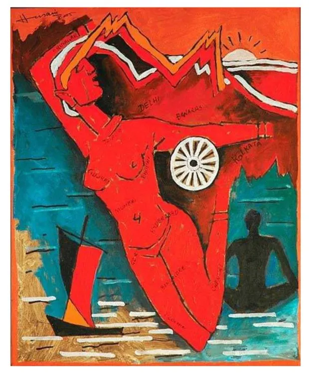

**यदि तुम्हारे घर के एक कमरे में आग लगी हो**

"यदि तुम्हारे घर के एक कमरे में आग लगी हो तो क्या तुम दूसरे कमरे में सो सकते हो? यदि तुम्हारे घर के एक कमरे में लाशें सड़ रहीं हों तो क्या तुम दूसरे कमरे में प्रार्थना कर सकते हो? यदि हाँ तो मुझे तुम से कुछ नहीं कहना है।

देश कागज पर बना नक्शा नहीं होता कि एक हिस्से के फट जाने पर बाकी हिस्से उसी तरह साबुत बने रहें और नदियां, पर्वत, शहर, गांव वैसे ही अपनी-अपनी जगह दिखें अनमने रहें। यदि तुम यह नहीं मानते तो मुझे तुम्हारे साथ नहीं रहना है।

इस दुनिया में आदमी की जान से बड़ा कुछ भी नहीं है न ईश्वर न ज्ञान न चुनाव कागज पर लिखी कोई भी इबारत फाड़ी जा सकती है और जमीन की सात परतों के भीतर गाड़ी जा सकती है।

जो विवेक खड़ा हो लाशों को टेक वह अंधा है जो शासन चल रहा हो बंदूक की नली से हत्यारों का धंधा है यदि तुम यह नहीं मानते तो मुझे अब एक क्षण भी तुम्हें नहीं सहना है।

याद रखो एक बच्चे की हत्या एक औरत की मौत एक आदमी का गोलियों से चिथड़ा तन किसी शासन का ही नहीं सम्पूर्ण राष्ट्र का है पतन।

ऐसा खून बहकर धरती में जज्ब नहीं होता आकाश में फहराते झंडों को काला करता है। जिस धरती पर फौजी बूटों के निशान हों और उन पर लाशें गिर रही हों वह धरती यदि तुम्हारे खून में आग बन कर नहीं दौड़ती तो समझ लो तुम बंजर हो गये हो- तुम्हें यहां सांस लेने तक का नहीं है अधिकार तुम्हारे लिए नहीं रहा अब यह संसार।

आखिरी बात बिल्कुल साफ किसी हत्यारे को कभी मत करो माफ चाहे हो वह तुम्हारा यार धर्म का ठेकेदार, चाहे लोकतंत्र का स्वनामधन्य पहरेदार

\-  सर्वेश्वरदयाल सक्सेना _असम \[ 1982 में समता संगठन द्वारा आयोजित ‘असम-बचाओ साइकिल यात्रा’ के मौके पर सर्वेश्वरदयाल सक्सेना ने यह कविता साइकिल यात्रियों को लिख दी थी । \]_

**If a Room in Your House Caught Fire**

If a room in your house caught fire Could you just sleep in some other room?

If a room in your house was filled with rotting corpses Could you just pray in some other room?

If yes then I have nothing to say to you

A nation is created on paper but it is not a map where one section rips the rest remaining whole and rivers, mountains, cities, villages still appear, each in their places blissfully unaware

If this is something you don’t believe then I want nothing to do with you

There’s nothing in this world greater than human life not God nor knowledge nor elections Anything written on paper can be ripped up and buried within the seven layers of earth

Judgment that props itself up on corpses is blind

Government that comes from the barrel of a gun is run by murderers

If you don’t accept this then I don’t have to put up with you for even one second

Remember the murder of a child the death of a woman a man’s body ragged with bullets belongs to no government whatsoever it’s the downfall of an entire nation

When blood is shed like this the earth does not soak it up it blackens the flags fluttering in the sky

If earth imprinted with the marks of army boots where bodies fall does not turn to fire and course through your veins then understand this you have become a wasteland you haven’t even got the right to breathe here this world no longer exists for you

And finally to be perfectly clear: Never forgive a murderer whether he is your friend a gate-keeper of religion or a self-anointed guardian of democracy

\-_ Sarveshwar Dayal Saxena \[ Originally titled 'Assam', Written in 1982 for the "Save Assam Cycle Rally" \]_

_\- English Translation by Daisy Rockwell_

**ਦੇਸ਼ ਕਾਗ਼ਜ਼ ਤੇ ਬਣਿਆ ****ਨਕਸ਼ਾ ਹੀ ਨਹੀਂ ਹੁੰਦਾ।**

ਜੇਕਰ ਤੁਹਾਡੇ ਘਰ ਦੇ ਇੱਕ ਕਮਰੇ ਚ ਅੱਗ ਲੱਗੀ ਹੋਵੇ ਤਾਂ ਕੀ ਤੁਸੀਂ ਦੂਸਰੇ ਕਮਰੇ ਵਿੱਚ ਸੌਂ ਸਕਦੇ ਹੋ? ਜੇਕਰ ਤੁਹਾਡੇ ਘਰ ਦੇ ਇੱਕ ਕਮਰੇ ਵਿੱਚ ਲਾਸ਼ਾਂ ਸੜ ਰਹੀਆਂ ਹੋਣ ਤਾਂ ਕੀ ਤੁਸੀਂ ਦੂਸਰੇ ਕਮਰੇ ਵਿੱਚ ਅਰਾਧਨਾ ਕਰ ਸਕਦੇ ਹੋ? ਜੇਕਰ ਹਾਂ ਤਾਂ ਮੈਂ ਤੁਹਾਨੂੰ ਕੁਝ ਨਹੀਂ ਕਹਿਣਾ। ਦੇਸ਼ ਕਾਗ਼ਜ਼ ਤੇ ਬਣਿਆ ਨਕਸ਼ਾ ਨਹੀਂ ਹੁੰਦਾ।

ਕਿ ਇੱਕ ਹਿੱਸੇ ਦੇ ਪਾਟ ਜਾਣ ਨਾਲ ਬਾਕੀ ਹਿੱਸੇ ਉਵੇਂ ਹੀ ਸਲਾਮਤ ਰਹਿਣ। ਤੇ ਨਦੀਆਂ , ਪਹਾੜ, ਸ਼ਹਿਰ , ਪਿੰਡ ਉਵੇਂ ਹੀ ਆਪੋ ਆਪਣੇ ਥਾਂ ਟਿਕੇ ਦਿਸਣ ਅਣਮੰਨੇ ਰਹਿ ਕੇ ਵੀ। ਜੇਕਰ ਤੁਸੀਂ ਇਹ ਨਹੀਂ ਮੰਨਦੇ ਤਾਂ ਮੈਂ ਤੁਹਾਡੇ ਨਾਲ ਨਹੀਂ ਰਹਿਣਾ। ਇਸ ਦੁਨੀਆ ਵਿੱਚ ਆਦਮੀ ਦੀ ਜਾਨ ਤੋਂ ਵੱਡਾ ਕੁਝ ਵੀ ਨਹੀਂ ਹੈ। ਨਾ ਰੱਬ ਨਾ ਗਿਆਨ ਨਾ ਚੋਣਾਂ।

ਕਾਗ਼ਜ਼ ਤੇ ਲਿਖੀ ਕੋਈ ਵੀ ਇਬਾਰਤ ਪਾੜੀ ਜਾ ਸਕਦੀ ਹੈ। ਤੇ ਜ਼ਮੀਨ ਦੀਆਂ ਸੱਤ ਤਹਿਆਂ ਵਿਚਕਾਰ ਗੱਡੀ ਜਾ ਸਕਦੀ ਹੈ।

ਜਿਹੜਾ ਵਿਵੇਕ ਖੜ੍ਹਾ ਹੋਵੇ ਲਾਸ਼ਾਂ ਨਾਲ ਢਾਸਣਾ ਲਾ ਕੇ ਉਹ ਅੰਨ੍ਹਾ ਹੈ। ਜੋ ਸ਼ਾਸਨ ਚੱਲ ਰਿਹਾ ਹੋਵੇ ਬੰਦੂਕ ਦੀ ਨਾਲੀ ਨਾਲ ਉਹ ਹੱਤਿਆਰਿਆਂ ਦਾ ਧੰਦਾ ਹੈ। ਜੇਕਰ ਤੁਸੀਂ ਨਹੀਂ ਮੰਨਦੇ ਤਾਂ ਮੈਂ ਤੁਹਾਨੂੰ ਇੱਕ ਪਲ ਵੀ ਬਰਦਾਸ਼ਤ ਨਹੀਂ ਕਰਨਾ।

ਯਾਦ ਰੱਖੋ! ਇੱਕ ਬੱਚੇ ਦੀ ਹੱਤਿਆ ਇੱਕ ਔਰਤ ਦੀ ਮੌਤ ਇੱਕ ਆਦਮੀ ਦਾ ਗੋਲੀਆਂ ਵਿੰਨ੍ਹਿਆ ਜਿਸਮ ਕਿਸੇ ਸ਼ਾਸਨ ਦਾ ਨਹੀਂ ਪੂਰੇ ਰਾਸ਼ਟਰ ਦੀ ਤਬਾਹੀ ਹੈ।

ਏਦਾਂ ਡੁੱਲ੍ਹਿਆ ਖ਼ੂਨ ਧਰਤੀ ਵਿੱਚ ਨਹੀਂ ਜੀਰਦਾ। ਅੰਬਰ ਵਿੱਚ ਝੂਮਦੇ ਝੰਡੇ ਨੂੰ ਕਲੰਕਿਤ ਕਰਦਾ ਹੈ।

ਜਿਸ ਧਰਤੀ ਤੇ ਫੌਜੀ ਬੂਟਾਂ ਦੇ ਨਿਸ਼ਾਨ ਹੋਣ ਤੇ ਉਨ੍ਹਾਂ ਤੇ ਲਾਸ਼ਾਂ ਡਿੱਗ ਰਹੀਆਂ ਹੋਣ ਉਹ ਧਰਤੀ ਜੇਕਰ ਤੁਹਾਡੇ ਖ਼ੂਨ ਨਾਲ ਅਗਨ ਬਣ ਕੇ ਨਹੀਂ ਦੌੜਦੀ ਤਾਂ ਸਮਝ ਲਵੋ ਤੁਸੀਂ  ਬੰਜਰ ਹੋ ਗਏ ਹੋ।

ਤੁਹਾਨੂੰ ਜਿੱਥੇ ਸਾਹ ਲੈਣ ਦਾ ਨਹੀਂ ਹੈ ਅਧਿਕਾਰ ਤੁਹਾਡੇ ਲਈ ਨਹੀਂ ਰਹਿ ਗਿਆ ਹੁਣ ਇਹ ਸੰਸਾਰ

ਮੁੱਕਦੀ ਗੱਲ ਬਿਲਕੁਲ ਸਾਫ਼ ਕਿਸੇ ਕਾਤਲ ਨੂੰ ਕਦੇ ਨਾ ਕਰੋ ਮਾਫ਼ ਚਾਹੇ ਉਹ ਹੋਵੇ ਤੁਹਾਡਾ ਯਾਰ ਧਰਮ ਦਾ ਠੇਕੇਦਾਰ। ਚਾਹੇ ਲੋਕਤੰਤਰ ਦਾ ਮਾਣਮੱਤਾ ਪਹਿਰੇਦਾਰ।

_\- ਸਰਵੇਸ਼ਵਰ ਦਿਆਲ ਸਕਸੈਨਾ \[ਮੂਲ ਸਿਰਲੇਖ  "ਅਸਾਮ " ਹੇਠ  ਅਸਾਮ ਬਚਾਓ ਸਾਈਕਲ  ਯਾਤਰਾ ਵਾਸਤੇ  1982 ਵਿਚ ਲਿਖੀ ਗਈ  \]_

_\-ਪੰਜਾਬੀ ਰੂਪ:  ਗੁਰਭਜਨ ਗਿੱਲ_

Hindi Orginal was [posted](https://facebook.com/story.php?story_fbid=10156132723270021&id=634625020) on facebook by writer [Annie Zaidi](https://en.wikipedia.org/wiki/Annie_Zaidi). American writer, translator and painter [Daisy Rockwell](http://www.daisyrockwell.com/) [posted](https://facebook.com/story.php?story_fbid=887620614710348&id=232018003603949) the English translation. Punjabi writer [Jaswant Singh Zafar](https://parchanve.wordpress.com/category/authors/jaswant-zafar/) [posted](https://facebook.com/story.php?story_fbid=852828754873107&id=100004379700451) the Punjabi translation by [Gurbhajan Gill](https://pa.wikipedia.org/wiki/%E0%A8%97%E0%A9%81%E0%A8%B0%E0%A8%AD%E0%A8%9C%E0%A8%A8_%E0%A8%97%E0%A8%BF%E0%A9%B1%E0%A8%B2).

Information about the original title from the [Samajwadi Jan Parishad](https://samatavadi.wordpress.com/2012/07/26/ahom_sarveshvardayal_saksena/) Blog.

Photo: MF Hussain's painting Mother India. Image Courtesy [Bharat Mata Artifact](https://u.osu.edu/johnson6323hseportfolio/2016/04/15/bharat-mata-artifact/) page on Ohio State University

_Crossposted from [https://parchanve.wordpress.com/2017/07/22/if-a-room-of-your-house-caught-fire/](https://parchanve.wordpress.com/2017/07/22/if-a-room-of-your-house-caught-fire/)_