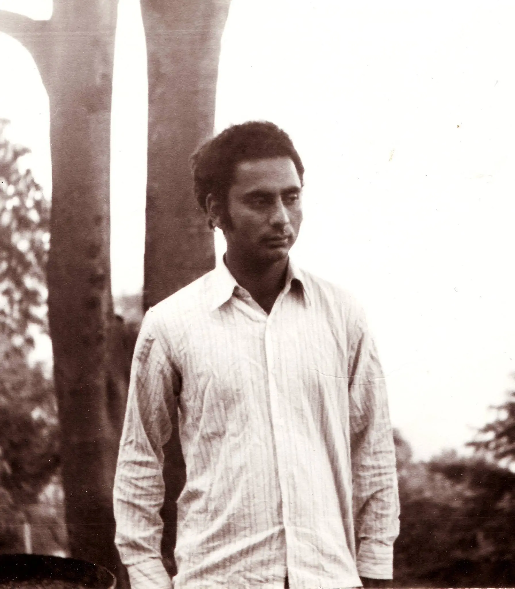

**ਸਭ ਤੋਂ ਖ਼ਤਰਨਾਕ**

ਕਿਰਤ ਦੀ ਲੁੱਟ ਸਭ ਤੋਂ ਖ਼ਤਰਨਾਕ ਨਹੀਂ ਹੁੰਦੀ ਪੁਲਸ ਦੀ ਕੁੱਟ ਸਭ ਤੋਂ ਖ਼ਤਰਨਾਕ ਨਹੀਂ ਹੁੰਦੀ ਗੱਦਾਰੀ-ਲੋਭ ਦੀ ਮੁੱਠ ਸਭ ਤੋਂ ਖ਼ਤਰਨਾਕ ਨਹੀਂ ਹੁੰਦੀ

ਬੈਠੇ ਸੁੱਤਿਆਂ ਫੜੇ ਜਾਣਾ-ਬੁਰਾ ਤਾਂ ਹੈ ਡਰੂ ਜਿਹੀ ਚੁੱਪ ਵਿੱਚ ਮੜ੍ਹੇ ਜਾਣਾ - ਬੁਰਾ ਤਾਂ ਹੈ ਸਭ ਤੋਂ ਖਤਰਨਾਕ ਨਹੀਂ ਹੁੰਦਾ

ਕਪਟ ਦੇ ਸ਼ੋਰ ਵਿਚ ਸਹੀ ਹੁੰਦਿਆਂ ਵੀ ਦਬ ਜਾਣਾ, ਬੁਰਾ ਤਾਂ ਹੈ ਕਿਸੇ ਜੁਗਨੂੰ ਦੀ ਲੋਅ ਵਿਚ ਪੜ੍ਹਨ ਲੱਗ ਜਾਣਾ - ਬੁਰਾ ਤਾਂ ਹੈ ਕਚੀਚੀ ਵੱਟ ਕੇ ਬੱਸ ਵਕਤ ਕੱਢ ਜਾਣਾ - ਬੁਰਾ ਤਾਂ ਹੈ ਸਭ ਤੋਂ ਖ਼ਤਰਨਾਕ ਨਹੀਂ ਹੁੰਦਾ ।

ਸਭ ਤੋਂ ਖ਼ਤਰਨਾਕ ਹੁੰਦਾ ਹੈ ਮੁਰਦਾ ਸਾਂਤੀ ਨਾਲ ਭਰ ਜਾਣਾ, ਨਾ ਹੋਣਾ ਤੜਪ ਦਾ, ਸਭ ਸਹਿਣ ਕਰ ਜਾਣਾ ਘਰਾਂ ਤੋਂ ਨਿਕਲਣਾ ਕੰਮ ਤੇ ਤੇ ਕੰਮ ਤੋਂ ਘਰ ਜਾਣਾ, ਸਭ ਤੋਂ ਖ਼ਤਰਨਾਕ ਹੁੰਦਾ ਹੈ ਸਾਡੇ ਸੁਪਨਿਆਂ ਦਾ ਮਰ ਜਾਣਾ ।

ਸਭ ਤੋਂ ਖ਼ਤਰਨਾਕ ਉਹ ਘੜੀ ਹੁੰਦੀ ਹੈ ਤੁਹਾਡੇ ਗੁੱਟ 'ਤੇ ਚਲਦੀ ਹੋਈ ਵੀ ਜੋ ਤੁਹਾਡੀ ਨਜ਼ਰ ਦੇ ਲਈ ਖੜ੍ਹੀ ਹੁੰਦੀ ਹੈ ।

ਸਭ ਤੋਂ ਖ਼ਤਰਨਾਕ ਉਹ ਅੱਖ ਹੁੰਦੀ ਹੈ ਜੋ ਸਭ ਦੇਖਦੀ ਹੋਈ ਵੀ ਠੰਢੀ ਯੱਖ਼ ਹੁੰਦੀ ਹੈ ਜਿਸ ਦੀ ਨਜ਼ਰ ਦੁਨੀਆ ਨੂੰ ਮੁਹੱਬਤ ਨਾਲ ਚੁੰਮਣਾ ਭੁੱਲ ਜਾਂਦੀ ਹੈ ਜੋ ਚੀਜ਼ਾਂ 'ਚੋਂ ਉਠਦੀ ਅੰਨ੍ਹੇਪਣ ਦੀ ਭਾਫ਼ ਉੱਤੇ ਡੁਲ੍ਹ ਜਾਂਦੀ ਹੈ ਜੋ ਨਿੱਤ ਦਿਸਦੇ ਦੀ ਸਾਧਾਰਣਤਾ ਨੂੰ ਪੀਂਦੀ ਹੋਈ ਇਕ ਮੰਤਕਹੀਣ ਦੁਹਰਾਅ ਦੇ ਗਧੀ-ਗੇੜ ਵਿਚ ਹੀ ਰੁਲ ਜਾਂਦੀ ਹੈ ।

ਸਭ ਤੋਂ ਖ਼ਤਰਨਾਕ ਉਹ ਚੰਨ ਹੁੰਦਾ ਹੈ ਜੋ ਹਰ ਕਤਲ ਕਾਂਡ ਦੇ ਬਾਅਦ ਸੁੰਨ ਹੋਏ ਵਿਹੜਿਆਂ ਵਿੱਚ ਚੜ੍ਹਦਾ ਹੈ ਪਰ ਤੁਹਾਡੀਆਂ ਅੱਖਾਂ ਨੂੰ ਮਿਰਚਾਂ ਵਾਂਗ ਨਹੀਂ ਲੜਦਾ ਹੈ ।

ਸਭ ਤੋਂ ਖ਼ਤਰਨਾਕ ਉਹ ਗੀਤ ਹੁੰਦਾ ਹੈ ਤੁਹਾਡੇ ਕੰਨਾਂ ਤੱਕ ਪਹੁੰਚਣ ਲਈ ਜਿਹੜਾ ਕੀਰਨਾ ਉਲੰਘਦਾ ਹੈ ਡਰੇ ਹੋਏ ਲੋਕਾਂ ਦੇ ਬਾਰ ਮੂਹਰੇ- ਜੋ ਵੈਲੀ ਦੀ ਖੰਘ ਖੰਘਦਾ ਹੈ ।

ਸਭ ਤੋਂ ਖ਼ਤਰਨਾਕ ਉਹ ਰਾਤ ਹੁੰਦੀ ਹੈ ਜੋ ਪੈਂਦੀ ਹੈ ਜਿਊਂਦੀ ਰੂਹ ਦਿਆਂ ਆਕਾਸ਼ਾਂ 'ਤੇ ਜਿਹਦੇ ਵਿਚ ਸਿਰਫ਼ ਉੱਲੂ ਬੋਲਦੇ ਗਿੱਦੜ ਹਵਾਂਕਦੇ ਚਿਪਟ ਜਾਂਦੇ ਸਦੀਵੀ ਨ੍ਹੇਰ ਬੰਦ ਬੂਹਿਆਂ ਚੁਗਾਠਾਂ 'ਤੇ

ਸਭ ਤੋਂ ਖ਼ਤਰਨਾਕ ਉਹ ਦਿਸ਼ਾ ਹੁੰਦੀ ਹੈ ਜਿਹਦੇ ਵਿੱਚ ਆਤਮਾ ਦਾ ਸੂਰਜ ਡੁੱਬ ਜਾਵੇ ਤੇ ਉਸ ਦੀ ਮਰੀ ਹੋਈ ਧੁੱਪ ਦੀ ਕੋਈ ਛਿਲਤਰ ਤੁਹਾਡੇ ਜਿਸਮ ਦੇ ਪੂਰਬ 'ਚ ਖੁੱਭ ਜਾਵੇ । ਕਿਰਤ ਦੀ ਲੁੱਟ ਸਭ ਤੋਂ ਖ਼ਤਰਨਾਕ ਨਹੀਂ ਹੁੰਦੀ ਪੁਲਸ ਦੀ ਕੁੱਟ ਸਭ ਤੋਂ ਖ਼ਤਰਨਾਕ ਨਹੀਂ ਹੁੰਦੀ ਗੱਦਾਰੀ-ਲੋਭ ਦੀ ਮੁੱਠ ਸਭ ਤੋਂ ਖ਼ਤਰਨਾਕ ਨਹੀਂ ਹੁੰਦੀ ।

_\-  ਅਵਤਾਰ ਸਿੰਘ ਪਾਸ਼ _

https://www.youtube.com/watch?v=XJQu7-Id0R4

_ਪਾਸ਼ ਨੇ ਆਪਣੀ ਕਵਿਤਾ 'ਸਭ ਤੋਂ ਖ਼ਤਰਨਾਕ' ਇੰਡੀਅਨ ਵਰਕਰਜ਼ ਐਸੋਸੀਏਸ਼ਨ ਵੱਲੋਂ ਕਰਵਾਏ ਗਏ  ਸ਼ਹੀਦੀ ਦਿਵਸ ਯਾਦਗਾਰੀ ਇਕੱਠ ਵਿੱਚ  5 ਅਪ੍ਰੈਲ 1987 ਨੂੰ  ਸਮਰਫੀਲਡ ਕਮਿਊਨਿਟੀ ਸੈਂਟਰ ਸਮੈੱਥਵਿਕ, ਇੰਗਲੈਂਡ ਵਿਖੇ ਪੜ੍ਹੀ | _

**سبھ توں خطرناک**

کرت دی لٹّ سبھ توں خطرناک نہیں ہندی پولیس دی کٹّ سبھ توں خطرناک نہیں ہندی گداری-لوبھ دی مٹھّ سبھ توں خطرناک نہیں ہندی

بیٹھے ستیاں پھڑے جانا-برا تاں ہے ڈرو جہی چپّ وچّ مڑھے جانا -برا تاں ہے سبھ توں خطرناک نہیں ہندا

کپٹ دے شور وچ صحیح ہندیاں وی دب جانا، برا تاں ہے کسے جگنوں دی لوء وچ پڑھن لگّ جانا - برا تاں ہے کچیچی وٹ کے بس وقت کڈ لینا - برا تاں ہے سبھ توں خطرناک نہیں ہندا ۔

سبھ توں خطرناک ہندا ہے مردہ سانتی نال بھر جانا، نہ ہونا تڑپ دا، سبھ سہن کر جانا گھراں توں نکلنا کم تے تے کم توں گھر جانا، سبھ توں خطرناک ہندا ہے ساڈے سپنیاں دا مر جانا ۔

سبھ توں خطرناک اوہ گھڑی ہندی ہے تہاڈے گٹّ 'تے چلدی ہوئی وی جو تہاڈی نظر دے لئی کھڑی ہندی ہے ۔

سبھ توں خطرناک اوہ اکھ ہندی ہے جو سبھ دیکھدی ہوئی وی ٹھنڈھی یخّ ہندی ہے جس دی نظر دنیا نوں محبت نال چمنا بھلّ جاندی ہے جو چیزاں 'چوں اٹھدی انھیپن دی بھاف اتے ڈلھ جاندی ہے جو نت دسدے دی سادھارنتا نوں پیندی ہوئی اک منتکہین دہراء دے گدھی-گیڑ وچ ہی رل جاندی ہے ۔

سبھ توں خطرناک اوہ چن ہندا ہے جو ہر قتل کانڈ دے بعد سنّ ہوئے وہڑیاں وچّ چڑھدا ہے پر تہاڈیاں اکھاں نوں مرچاں وانگ نہیں لڑدا ہے ۔

سبھ توں خطرناک اوہ گیت ہندا ہے تہاڈے کناں تکّ پہنچن لئی جہڑا کیرنا النگھدا ہے ڈرے ہوئے لوکاں دے بار موہرے- جو ویلی دی کھنگھ کھنگھدا ہے ۔

سبھ توں خطرناک اوہ رات ہندی ہے جو پیندی ہے جیؤندی روح دیاں آکاشاں 'تے جہدے وچ صرف الو بولدے گدڑ ہوانکدے چپٹ جاندے سدیوی نھیر بند بوہیاں چگاٹھاں 'تے

سبھ توں خطرناک اوہ دشا ہندی ہے جہدے وچّ آتما دا سورج ڈبّ جاوے تے اس دی مری ہوئی دھپّ دی کوئی چھلتر تہاڈے جسم دے پورب 'چ کھبھّ جاوے ۔ کرت دی لٹّ سبھ توں خطرناک نہیں ہندی پولیس دی کٹّ سبھ توں خطرناک نہیں ہندی گداری-لوبھ دی مٹھّ سبھ توں خطرناک نہیں ہندی ۔

_اوتار سنگھ پاش_

**सबसे ख़तरनाक**

मेहनत की लूट सबसे ख़तरनाक नहीं होती पुलिस की मार सबसे ख़तरनाक नहीं होती ग़द्दारी और लोभ की मुट्ठी सबसे ख़तरनाक नहीं होती

बैठे-बिठाए पकड़े जाना बुरा तो है सहमी-सी चुप में जकड़े जाना बुरा तो है सबसे ख़तरनाक नहीं होता

कपट के शोर में सही होते हुए भी दब जाना बुरा तो है जुगनुओं की लौ में पढ़ना मुट्ठियां भींचकर बस वक्‍़त निकाल लेना बुरा तो है सबसे ख़तरनाक नहीं होता

सबसे ख़तरनाक होता है मुर्दा शांति से भर जाना तड़प का न होना सब कुछ सहन कर जाना घर से निकलना काम पर और काम से लौटकर घर आना सबसे ख़तरनाक होता है हमारे सपनों का मर जाना

सबसे ख़तरनाक वो घड़ी होती है आपकी कलाई पर चलती हुई भी जो आपकी नज़र में रुकी होती है

सबसे ख़तरनाक वो आंख होती है जिसकी नज़र दुनिया को मोहब्‍बत से चूमना भूल जाती है और जो एक घटिया दोहराव के क्रम में खो जाती है

सबसे ख़तरनाक वो चांद होता है जो हर हत्‍याकांड के बाद वीरान हुए आंगन में चढ़ता है लेकिन आपकी आंखों में मिर्चों की तरह नहीं पड़ता

सबसे ख़तरनाक वो गीत होता है जो मरसिए की तरह पढ़ा जाता है आतंकित लोगों के दरवाज़ों पर गुंडों की तरह अकड़ता है

सबसे ख़तरनाक वो दिशा होती है जिसमें आत्‍मा का सूरज डूब जाए और जिसकी मुर्दा धूप का कोई टुकड़ा आपके जिस्‍म के पूरब में चुभ जाए

मेहनत की लूट सबसे ख़तरनाक नहीं होती पुलिस की मार सबसे ख़तरनाक नहीं होती ग़द्दारी और लोभ की मुट्ठी सबसे ख़तरनाक नहीं होती । -_अवतार सिंह पाश - अनुवाद: चमन लाल _

https://www.youtube.com/watch?v=7LqGxiQ5psc

_नीलेश मिश्रा की आवाज़ में पाश की कविता 'सब से ख़तरनाक '_

 

**The Most Dangerous**

Most treacherous is not the robbery of hard earned wages Most horrible is not the torture by the police. Most dangerous is not the graft for the treason and greed. To be caught while asleep is surely bad surely bad is to be buried in silence But it is not most dangerous.

To remain dumb and silent in the face of trickery Even when just, is definitely bad Surely bad is reading in the light of a firefly But it is not most dangerous

Most dangerous is To be filled with dead peace Not to feel agony and bear it all, Leaving home for work And from work return home Most dangerous is the death of our dreams.

Most dangerous is that watch Which run on your wrist But stand still for your eyes.

Most dangerous is that eye Which sees all but remains frostlike, The eye that forgets to kiss the world with love, The eye lost in the blinding mist of the material world. That sinks the simple meaning of visible things And is lost in the meaning return of useless games.

Most dangerous is the moon Which rises in the numb yard After each murder, But does not pierce your eyes like hot chillies.

Most dangerous is the song Which climbs the mourning wail In order to reach your ears And repeats the cough of an evil man At the door of the frightened people.

Most dangerous is the night Falling in the sky of living souls, Extinguishing them all In which only owls shriek and jackals growl, And eternal darkness covers all the windows.

Most heinous is the direction In which the sun of the soul light Pierces the east of your body.

Most treacherous is not the robbery of hard earned wages

Most horrible is not the torture of police Most dangerous is not graft taken for greed and treason.

_\- Avtar Singh Pash - Translation by Dr.Satnam Singh Sandhu_

More English translations of the poem by:

*   [Trilok Chand Ghai](http://ghai-tc.blogspot.com/2014/03/pash-punjabi-revolutionary-poet-six.html)
*   [Suresh Sethi](https://sotosay.wordpress.com/2011/03/11/pash-the-most-dangerous-thing/)
*   [Jasz Gill](http://feelingbuddhaful.com/translation-paash-poem/)
*   [Manash Firaq](http://indianculturalforum.in/2017/07/29/warning-dangerous-poet-paash-manash-bhattacharjee/)

More Translations and Resources at [apnaorg.com](http://apnaorg.com/translations/pash/) and [paash.wordpress.com](https://paash.wordpress.com/category/paash-in-english/)

[ਅਵਤਾਰ ਸਿੰਘ 'ਪਾਸ਼' ](http://pa.wikipedia.org/wiki/%E0%A8%AA%E0%A8%BE%E0%A8%B8%E0%A8%BC)\[9ਸਤੰਬਰ1950 - 23ਮਾਰਚ1988\] ਪੰਜਾਬੀ ਦੀ ਕ੍ਰਾਂਤੀਕਾਰੀ ਕਵਿਤਾ ਦਾ ਮੂਹਰਲੀ ਕਤਾਰ ਦਾ ਕਵੀ ਸੀ |  ਨਕਸਲਬਾੜੀ ਲਹਿਰ  ਨਾਲ ਉੁਸਦੇ ਸੰਬੰਧਾਂ  ਕਰਕੇ ਉਸਨੂੰ ਜੇਲ ਵੀ ਕੱਟਣੀ ਪਈ | 23ਮਾਰਚ1988 ਨੁੰ  ਖ਼ਾਲਿਸਤਾਨੀ ਅੱਤਵਾਦੀਆਂ ਨੇ ਉਸ ਨੂੰ ਕਤਲ ਕਰ ਦਿੱਤਾ | ਪਾਸ਼ ਦੀਆਂ  ਕਵਿਤਾਵਾਂ ਦਾ ਉਲੱਥਾ ਹਿੰਦੀ ,ਕੰਨੜ, ਉੜੀਆ,ਮਰਾਠੀ ਤੇ ਹੋਰ ਕਈ ਭਾਸ਼ਾਂਵਾ ਵਿੱਚ  ਹੋ  ਚੁੱਕਿਆ ਹੈ |

[**Avtar Singh  'Pash'**](http://www.punjabi-kavita.com/Avtar-Singh-Pash.php) (9 September-23 March 1988) was born in a middle-class peasant family in village Talwandi Salem, Distt. Jallandhar (Punjab). His father Sohan Singh Sandhu, who was a soldier, used to compose poetry. Pash is one of the major poets of Naxalite Movement. In 1972 he started a magazine named 'Siar' and in 1973 founded 'Punjabi Sahit Te Sabhiachar Manch. His poetic works are Loh Katha (1971), Uddade Bazan Magar (1974), Saade Samian Vich (1978), Khilre Hoey Varkey (1989, posthumously).

**Update 25th July 2017**

*   [RSS wants Pash banished from NCERT textbook](http://www.tribuneindia.com/news/nation/now-rss-wants-pash-banished-from-ncert-textbook/441890.html)
*   Full Punjabi Text from [Punjabi Kavita](http://www.punjabi-kavita.com/) , More poems by [Pash](http://www.punjabi-kavita.com/AvtarSinghPash.php)
*   Hindi Translation (Probably By Chaman Lal), more Hindi Translations here at [Kavita Kosh](http://kavitakosh.org/kk/%E0%A4%AA%E0%A4%BE%E0%A4%B6)
*   Pash's photograph (Taken in the year 1974) from [Kitab Trinjan](https://www.facebook.com/KitabTrinjan/photos/a.543369669018528.116841.539522636069898/1556239554398196/?type=3&theater) Facebook page
*   Pash reciting the poem at [Loh Katha](https://www.youtube.com/channel/UC0krslolbDPpiOG5rM01hdQ) You Tube Channel
*   Neelesh Misra reciting the Hindi translation of the poem in [Gaon Connection](https://www.youtube.com/channel/UCy4rsUzwespkNvjMI1coX8A) You Tube Channel

 

_Crossposted from [https://parchanve.wordpress.com/2007/07/10/sabh-ton-khatarnak/](https://parchanve.wordpress.com/2007/07/10/sabh-ton-khatarnak/)_

---
### Comments:
#### [satnam]( "satnam_bai@yahoo.co.in") - <time datetime="2008-10-10 08:38:26">Oct 5, 2008</time>

ghar to duur baith k v jado asi paash bai nu pad de ha ta mann nu sakuun milda hai te uh tanda fir jud jandia ne jehdia kade kade aaj de mahole wich thilia pa gaia ne.asi mehnet kar rahe ha ta jo apne bdarua de pae purnea te chal sakea..... satnam singh

#### [Bollywood film on Paash &laquo; Paash](http://paash.wordpress.com/2009/12/11/bollywood-film-on-paash-2/ "") - <time datetime="2009-12-11 18:44:04">Dec 5, 2009</time>

\[...\] Read More                                                                     ਸਿਲਵਰ ਸਕਰੀਨ ‘ਤੇ ਪਾਸ਼ ਦੇ ਆਉਣ ਦੀ ਸਾਨੂੰ ਸਭਨੂੰ ਉਡੀਕ ਰਹੇਗੀ। ਉਮੀਦ ਹੈ ਕਿ ਅਨੁਰਾਗ ਕਸ਼ਯਮ ਵੀ ਇਸ ਇਤਿਹਾਸਕ ਜ਼ਿੰਮੇਂਵਾਰੀ ਨੂੰ ਸਮਝਦੇ ਤੇ ਪਛਾਣਦੇ ਹੋਏ ਲੋਕਾਂ ਦੀਆਂ ਉਮੀਦਾਂ ‘ਤੇ ਖਰ੍ਹੇ ਉਤਰਨਗੇ। \[...\]

#### [G Gill](http://gillmks.wordpress.com "gillmks@hotmail.com") - <time datetime="2010-11-07 18:58:39">Nov 0, 2010</time>

ਭਾਵੇਂ ਮੈਂ ਪਾਸ਼ ਨੂ ਬਹੁਤਾ ਨਹੀ ਪੜਿਆ ਪਰ ਜਦੋ ਵੀ ਮੈਂ ਇਹ ਕਵਿਤਾ ਪੜਦਾ ਹਾਂ ਜਾਂ ਸੁਣਦਾਂ ਹਾਂ ਮੇਰੇ ਤੇ ਇਕ ਅਜੀਬ ਜਿਹਾ ਅਸਰ ਕਰ ਜਾਂਦੀ ਹੈ, ਜਿਸ ਨੂੰ ਨਾਂ ਤਾਂ ਮੈਂ ਲਿਖਕੇ ਬਿਆਨ ਕਰ ਸਕਦਾ ਹਾਂ ਤੇ ਨਾ ਹੀ ਬੋਲ ਕੇ....

#### [Elaine Mark](http://www.facebook.com/elainechinagirl "elainechinagirl@yahoo.ca") - <time datetime="2011-08-14 18:38:20">Aug 0, 2011</time>

Beautiful! Thank you for the translation! Sharing such "peaces" (pieces) allow us to open to more cultural writings, more wisdom, more knowledge...and that transcends our everyday "dangerous things". :)

#### [Paash- Sab ton Khatarnak | ਸ਼ਬਦਾਂ ਦੇ ਪਰਛਾਂਵੇ](https://parchanve.wordpress.com/2006/03/17/paash-sab-ton-khatarnak-kirat-di-lutt-sab-ton/ "") - <time datetime="2017-07-25 16:48:30">Jul 2, 2017</time>

\[…\] Read the full poem on ਸਭ ਤੋਂ ਖ਼ਤਰਨਾਕ / सब से ख़तरनाक \[…\]

