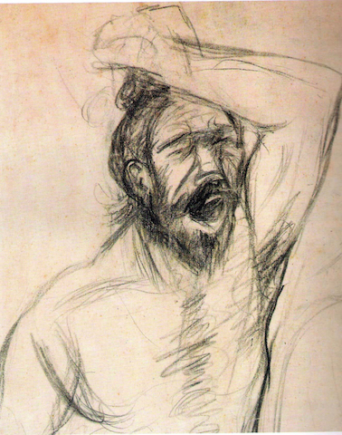

  _Cheekh_ by SL Parashar

[Repost](https://parchanve.wordpress.com/2013/08/16/tobha-tek-singh/): Tobha Tek Singh is famous shorty story by [Saadat Hasan Manto](http://en.wikipedia.org/wiki/Saadat_Hasan_Manto). He has been called the greatest short story writer of the Indian subcontinent. He was born in 1912 in Punjab and went on to become a radio and film scriptwriter, journalist and short story writer. His stories were highly controversial and he was tried for obscenity six times during his career. After Partition, Manto moved to Lahore with his wife and three daughters. He died there in 1955.

\[youtube=http://www.youtube.com/watch?v=kE4OYy5qHvA\]

Rendition by Zia Mohyeddin (YouTube)

\[soundcloud url="http://api.soundcloud.com/tracks/105687205" iframe="true" /\]

Rendition by Zia Mohyeddin (SoundCloud)

\[scribd id=160667510 key=key-1cy1zsqb9t62ow0fyzgz mode=scroll\]

Hindi Text, Courtesy [Frances W. Pritchett Columbia.edu](http://www.columbia.edu/itc/mealac/pritchett/01glossaries/delacy/tobateksingh_text_hindi.pdf)

\[scribd id=160642533 key=key-co7ntow93romto45exj mode=scroll\]

Urdu Text, Courtesy [Frances W. Pritchett Columbia.edu](http://www.columbia.edu/itc/mealac/pritchett/01glossaries/delacy/tobateksingh_text_urdu.pdf)

\[scribd id=160671159 key=key-21yo1pyu6g6xagydhaf8 mode=scroll\]

English translation by Aatish Taseer, Courtesy [Random House Blog](http://randomhouseindia.wordpress.com/2009/11/24/sadat-hasan-manto-toba-tek-singh/)

\[scribd id=356339048 key=key-bG5AMrTjgoAbcT6v1Oaz mode=scroll\]

Punjabi translation by unknown, Courtesy [Punjabi Kavita](http://www.punjabi-kavita.com/TobhaTekSinghSaadatHasanManto.php)

_Crossposted from [https://parchanve.wordpress.com/2017/08/15/tobha-tek-singh-by-saadat-hasan-manto/](https://parchanve.wordpress.com/2017/08/15/tobha-tek-singh-by-saadat-hasan-manto/)_