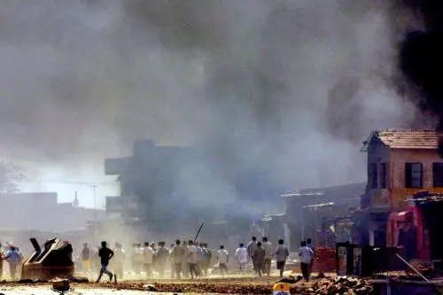

**ਫਸਾਦ **

ਸ਼ਹਿਰ ਕੋਈ ਵੀ ਹੋਵੇ ਭਵੰਡੀ, ਮੇਰਠ ਜਾਂ ਨਾਗਪੁਰ ਪੱਜ ਕੋਈ ਵੀ ਹੋਵੇ ਮਸਜਿਦ ਦੇ ਗੁੰਬਦ ਤੋਂ ਉੱਚਾ ਵਾਜੇ ਦਾ ਸ਼ੋਰ ਪਿੱਪਲ ਦੇ ਟਾਹਣੇ ਤੋਂ ਉੱਚਾ ਤਾਜੀਆਂ ਦਾ ਜਲੂਸ ਗਊ ਮਾਤਾ ਦੀ ਰੱਖਿਆ ਬੱਚਿਆਂ ਦਾ ਪਤੰਗ ਲੁੱਟਣ ਤੇ ਝਗੜਾ ਜਾਂ ਕੋਈ ਹੋਰ ਪਹਿਲਾਂ ਹੀ ਤਿਆਰ ਹੁੰਦੇ ਨੇ ਛੁਰੇ ਬਰਛੇ ਪਸਤੌਲ ਤੇ ਦਸਤੀ ਬੰਬ|

ਸ਼ਹਿਰ ਕੋਈ ਵੀ ਹੋਵੇ ਪੱਜ ਕੋਈ ਵੀ ਹੋਵੇ ਧਰਮ ਨਿਰਪਖਤਾ ਦਾ ਤਕਾਜ਼ਾ ਹੈ ਫਿਰਕਿਆਂ ਦਾ ਨਾ ਲੈਣਾ ਠੀਕ ਨਹੀਂ ਇੱਕੋ ਤਰ੍ਹਾਂ ਛਪਦੀ ਹੇ ਵਾਰਦਾਤ ਦੀ ਖ਼ਬਰ ਜਿਸਨੂੰ ਪੜ੍ਹਕੇ ਦੁਖ ਹੋਣਾ ਅੱਖਾਂ ਚੋਂ ਅੱਥਰੂ ਟਪਕਣਾ ਜਾਂ ਖੂਨ ਖੌਲਣਾ ਤਾਂ ਕਿਤੇ ਰਿਹਾ ਹੁਣ ਤਾਂ ਇਹਨਾਂ ਵਿਚੋਂ ਕੁਝ ਵੀ ਨਾ ਹੋਣ ਤੇ ਸ਼ਰਮ ਵੀ ਨਹੀਂ ਆਉਂਦੀ

ਮੈਂ ਜਾਣਦਾ ਹਾਂ ਸਰਕਾਰੀ ਅੰਕੜਿਆਂ ਅਖ਼ਬਾਰੀ ਅੰਦਾਜ਼ਿਆਂ ਤੇ ਮਰਨ ਵਾਲਿਆਂ ਦੀ ਅਸਲ ਗਿਣਤੀ ਵਿਚ ਕਿਨਾ ਫਰਕ ਹੁੰਦਾ ਹੈ. ਕੁਝ ਦਿਨ ਬੇਹਿੱਸ ਜਹੀ ਬਹਿਸ ਹੋਏਗੀ ਕਰੜੇ ਅਨੁਸਾਸ਼ਨ ਬਾਰੇ ਨਿਰਪੱਖ ਪ੍ਰਸਾਸ਼ਨ ਬਾਰੇ ਇੱਕ ਦੂਜੇ ਦੀ ਗੱਲ ਸਮਝਣ ਤੇ ਸਹਿਣ ਬਾਰੇ ਮਿਲ ਜੁਲ ਕੇ ਰਹਿਣ ਬਾਰੇ|

ਅਦਾਲਤੀ ਪੜਤਾਲ ਸ਼ੁਰੂ ਹੋਣ ਤੇ ਹੜਤਾਲ ਖੁਲ੍ਹ ਜਾਏਗੀ ਪੜਤਾਲ ਦੀ ਰਿਪੋਟ ਲਿਖੀ ਜਾਣ ਤੀਕ ਬਹੁਤ ਸਾਰੇ ਲੋਕਾਂ ਨੂੰ ਕਿੰਝ ਕਦ ਹੋਈ ਵਾਰਦਾਤ ਭੁਲ ਜਾਏਗੀ ਉਦੋਂ ਤਕ ਹੋਰ ਬਹੁਤ ਕੁਝ ਹੋਇਆ ਹੋਏਗਾ ਕਿਸੇ ਹੋਰ ਸ਼ਹਿਰ ਵਿਚ ਕਿਸੇ ਹੋਰ ਪੱਜ ਹੇਠ

\- [**_ਸੋਹਨ ਸਿੰਘ ਮੀਸ਼ਾ_**](http://pa.wikipedia.org/wiki/%E0%A8%B8%E0%A9%8B%E0%A8%B9%E0%A8%A3_%E0%A8%B8%E0%A8%BF%E0%A9%B0%E0%A8%98_%E0%A8%AE%E0%A9%80%E0%A8%B8%E0%A8%BC%E0%A8%BE)

**Riots**

the city can be any Meerut, Nagpur or Bhivandi the excuse can be any the high volume of the Mosque's loud speakers the loud _Tazia_ procession by the branch of _Peepal_ tree the protection of Holy Cow the fight between children over flying kites or some other the knives, spears, revolvers and bombs are ready, beforehand.

the city can be any the excuse can be any It is a matter of 'secularism' It is not appropriate to name the communities a similar news report is published every time on reading which a feeling of pain or to be tearful or the boiling blood is a far cry nowadays, one is not even ashamed on the absence of an emotional response

I understand how the numbers reported in government records or, in newspaper records differ than the the actual number of people died. for few days there will be inflated debates about tough governance, impartial administration, to understand each other's faith, to be tolerant, to live harmoniously.

after the court investigation starts the curfew will be relaxed. till the report of the investigation gets written many people will forget when and how the atrocity had happened till then, a lot would have happened in some other city on some other excuse

_\-_ [_Sohan Singh Meesha_](http://www.thesikhencyclopedia.com/biographies/famous-sikh-personalities/misha-sohan-singh-1934-1987)

\- _Translated into English by  [Jasdeep Singh](http://parchanve.wordpress.com/category/translators/jasdeep/)_

**References:**

[**ਸੋਹਨ ਸਿੰਘ ਮੀਸ਼ਾ**](http://pa.wikipedia.org/wiki/%E0%A8%B8%E0%A9%8B%E0%A8%B9%E0%A8%A3_%E0%A8%B8%E0%A8%BF%E0%A9%B0%E0%A8%98_%E0%A8%AE%E0%A9%80%E0%A8%B8%E0%A8%BC%E0%A8%BE) (1934–1986) ਪੰਜਾਬੀ ਕਵਿਤਾ ਦੇ ਆਧੁਨਿਕ ਦੌਰ ਦਾ ਉੱਘਾ, ਰੁਮਾਂਟਿਕ ਭਰਮ-ਭੁਲੇਖੇ ਤੋੜਨ ਵਾਲਾ ਯਥਾਰਥਵਾਦੀ ਕਵੀ ਸੀ।

[Sohan Singh Meesha](http://www.thesikhencyclopedia.com/biographies/famous-sikh-personalities/misha-sohan-singh-1934-1987) (1934-1986) was a famous, realist Punjabi poet.

Original poem was posted on inimitable Facebook page [ਦਿਲ ਦੀ ਕਵਿਤਾ](https://www.facebook.com/pages/%E0%A8%A6%E0%A8%BF%E0%A8%B2-%E0%A8%A6%E0%A9%80-%E0%A8%95%E0%A8%B5%E0%A8%BF%E0%A8%A4%E0%A8%BE/152520204762735?fref=ts)

The posted photograph is a [2002 file photograph of rioters in Ahmedabad](http://www.thehindu.com/news/the-india-cables/2002-riots-an-internal-gujarati-matter-modi-told-american-diplomat/article1559532.ece) courtesy Associated Press/The Hindu.

_Crossposted from [https://parchanve.wordpress.com/2014/11/03/riots/](https://parchanve.wordpress.com/2014/11/03/riots/)_