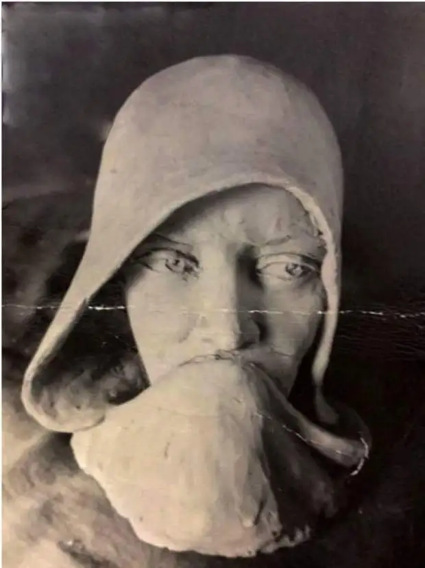

  Sculpture By SL Prasher in Ambala Refugee Camp 1948

**ਸਿੱਖਣੀ ਫ਼ਾਤਿਮਾ ਬੀਬੀ ਉਰਫ਼ ਜਿੰਦਾਂ**

ਪਿੰਡ ਚੀਚੋਕੀ ਮੱਲ੍ਹੀਆਂ ਨਜ਼ਦੀਕ ਲਹੌਰ

ਜਦ ਸ਼ੇਖ਼ੂਪੁਰ ਦੇ ਹੀਰਾ ਸਿੰਘ ਦੀ ਧੀ ਜਿੰਦਾਂ ਨੂੰ ਸੀ ਸਾਲ ਸੋਲ੍ਹਵਾਂ  ਲੱਗਾ

ਇਹ ਗੱਲ ਓਦੋਂ ਦੀ ਹੈ

ਜਦ ਨਾਨਕ ਦੇ ਮੱਥੇ ਦੇ ਉੱਤੇ

ਕਿਸੇ ਮੁਜਾਹਿਦ ਚੰਨ ਤੇ ਤਾਰਾ ਖੁਣਿਆ

ਪੰਜ ਨਦੀਆਂ ਰੱਤ ਉੱਛਲ਼ੀ

ਹੱਥ ਦੀਆਂ ਪੰਜੇ ਉਂਗਲ਼ਾਂ ਇੱਕੋ ਜਿਹੀਆਂ ਹੋਈਆਂ

ਲੋਕੀਂ ਘਰ ਬੈਠੇ ਪਰਦੇਸੀ ਹੋਏ

ਗੁਰੂ ਦੇ ਘਰ ਤੋਂ ਗੁਰੂ ਕੀ ਨਗਰੀ

ਜਾਂਦੀ ਰੇਲ ਦੀ ਗੱਡੀ ਰਸਤੇ ਰੋਕੀ ਚੀਚੋ ਮੱਲ੍ਹੀਆਂ

ਇਸਮਤ ਰੋਲ਼ੀ ਕੱਖ ਨ ਛੱਡਿਆ

ਬੁੜ੍ਹੀਆਂ ਬੱਚੇ ਬੰਦੇ ਡੱਕਰੇ ਕਰ ਕਰ ਸੁੱਟੇ

ਕੰਜਕਾਂ ਕੁੜੀਆਂ ਹੱਥੋ ਹੱਥੀਂ ਵਿਕੀਆਂ

ਪਿੰਡ ਦਾ ਮੁੱਲਾਂ ਰੱਬ ਦਾ ਬੰਦਾ

ਰਾਹ ਵਿਚ ਰੁਲ਼ਦੀ ਜਿੰਦਾਂ ਨੂੰ ਘਰ ਲੈ ਆਇਆ

ਉਸਨੇ ਉਸਨੂੰ ਕਰ ਲੀਤਾ

ਜਿੰਦਾਂ ਤੋਂ ਉਹ ਹੋਈ ਫ਼ਾਤਿਮਾ

ਸਿੱਖਣੀ ਨੇ ਫਿਰ ਸੁੱਲੇ ਜੰਮੇ

ਚਾਰ ਪੁੱਤਰ ਪੰਜ ਧੀਆਂ

ਹੌਲ਼ੀ ਹੌਲ਼ੀ ਹਉਕੇ ਮੁੱਕੇ ਹੰਝੂ ਸੁੱਕੇ

ਲੋਕੀਂ ਹੁਣ ਵੀ ਉਹਨੂੰ ਸਿੱਖਣੀ ਆਖ ਸੱਦਾਂਦੇ

ਰੀਲ ਯਾਦਾਂ ਦੀ ਟੁੱਟਦੀ ਜੁੜਦੀ ਚਲਦੀ ਰਹਿੰਦੀ

ਚੀਕਾਂ ਦੀ ਆਵਾਜ਼ ਨਾ ਸੁਣਦੀ

ਅੱਖੀਆਂ ਰੋਵਣ ਪਰ ਅੱਥਰੂ ਨਹੀਂ ਹਨ

ਬੁੜ੍ਹੀ ਫ਼ਾਤਿਮਾ ਆਂਹਦੀ:

ਨਾ ਰੋ ਬਾਊ

ਹੰਝ ਵਹਾਵਣ ਦਾ ਕੀ ਫ਼ਾਇਦਾ ਹੈ?

ਨਿਤ ਉਡੀਕਾਂ ਆਹ ਦਿਨ ਆਇਆ

ਸਾਹ ਆਖ਼ਰੀ ਕਦ ਆਉਣਾ ਹੈ

ਜਦ ਵੀ ਆਇਆ ਬੜਾ ਹੀ ਮਿੱਠਾ ਹੋਣਾ

\-ਅਮਰਜੀਤ ਚੰਦਨ

**سِکھنی فاطمہ بیبی عُرف جنداں**

پنِڈ چیچوکی ملیاں نزدیک لہور

جد شیخوپور دے ہیرا سنگھ دی دِھی جِنداں نوں سی سال سولھواں لگا

ایہہ گلّ اودوں دی ہے

جد نانک دے متھے دے اُتے

کسے مجاہد چن تے تارا کُھڻیا

پنج ندیاں رتّ اُچھلی

ہتھ دیاں پنجے اُنگلاں اِکّو جہیاں ہوئیاں

لوکیں گھر بیٹھے پردیسی ہوئے

گورو دے گھر توں گورو کی نگری

جاندی ریل دی گڈی رستے روکی چیچو ملیاں

عصمت رولی ککھّ نہ چھڈیا

بڑھیاں بچے بندے ڈکرے کر کر سُٹّے

کنجکاں کُڑیاں ہتھو ہتھیں وِ کیاں

پنڈ دا مُلاں ربّ دا بندہ

راہ وچ رُلدی جِنداں نوں گھر لے آیا

اُس نے اُس نوں کر لیتا

جِنداں توں اوہ ہوئی فاطمہ

سِکھنی نے پھر سُلے جمے

چار پُتر پنج دِھیاں

ہولی ہولی ہؤکے مکُے

ہنجّو سُکّے

لوکیں ہُن وی اوہنوں سِکھنی آکھ سداندے

ریل یاداں دی ٹُٹدی جُڑدی چلدی رہندی

چِیکاں دی آواز نہ سُندی

اکھیاں روون پر اتھرو نہیں ہن

بُڑھی فاطمہ آنہدی:

نہ رو باؤ

ہنجھ وہائون دا کیہ فائدہ ہے؟

نِت اُڈیکاں آہہ دن آیا

ساہ آخری کد آؤنا ہے

جد وی آیا بڑا ہی مِٹھا ہونا

۔امرجیت چندن

**Sikhni Fatima Bibi Alias Jindan** When Jindãn daughter of Hira Singh of Sheikhupur had turned sixteen,

Mujahids scratched the moon and star on Nanak’s forehead with knives.

All the rivers of the Punjab overflowed with blood,

all five fingers became equal,

the people turned into foreigners in their own homes.

Jindan daughter of Hira Singh was on a train from Nankana to Amritsar, when

Mujahids stopped it at Chichoki Malhiãn near Lahore

and hacked to death her father and all men and children.

The women, both old and young, they abducted.

Young Jindãn, was passed from man to man

to man.

A God-fearing Mullah of the village took Jindãn home

and gave her a new name. A Muslim name, Fatima.

From then on, in her own village, she is known as Sikhni – that Sikh woman.

Film reel of memories runs all the time,

the reel snaps and is then rejoined.

The Sikhni’s weeping was muted.

The Sikhni’s eyes wept dry tears.

The Sikhni bore the Mullah four sons and five daughters.

The Sikhni’s eyes wept more dry tears.

The old Sikhni, Fatima, consoles me:

“Don’t cry, my brother.

What’s the point?

It’s taken a lifetime to reach this moment.

When I breathe my last

It will bring nothing but eternal relief.”

•

\-[Amarjit Chandan](https://parchanve.wordpress.com/category/authors/amarjit-chandan/)

 _Translated from the original in Punjabi by the poet with Vanessa Gebbie_

Originally posted on inimitable Facebook Page [Kitab Trinjan - a platform to share themes on Punjabi Language, Literature, History, Culture & Art](https://www.facebook.com/KitabTrinjan/?fref=ts)

_Crossposted from [https://parchanve.wordpress.com/2017/09/01/sikhni-fatima-bibi-alias-jindan/](https://parchanve.wordpress.com/2017/09/01/sikhni-fatima-bibi-alias-jindan/)_