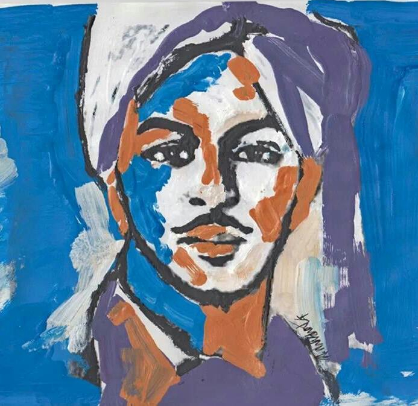

\[caption id="attachment\_1175" align="alignnone" width="693"\] _Bhagat Singh by Dhrupadi Ghosh (2014)_\[/caption\]

ਫ਼ਿਰਕੂ ਦੰਗੇ ਅਤੇ ਉਨ੍ਹਾਂ ਦਾ ਇਲਾਜ
=============================

\[_1919 ਦੇ ਜ਼ਲ੍ਹਿਆਂਵਾਲ਼ੇ ਕਾਂਡ ਤੋਂ ਬਾਅਦ ਅੰਗਰੇਜ਼ੀ ਸਰਕਾਰ ਨੇ ਫਿਰਕੂ ਵੰਡੀਆਂ ਦੀ ਸਿਆਸਤ ਤੇਜ ਕਰ ਦਿੱਤੀ ਸੀ। ਇਸੇ ਦੇ ਅਸਰ ਹੇਠ 1924 ਵਿੱਚ ਕੋਹਾਟ ਦੇ ਮੁਕਾਮ ‘ਤੇ ਬਹੁਤ ਹੀ ਗ਼ੈਰ ਇਨਸਾਨੀ ਢੰਗ ਨਾਲ਼ ਮੁਸਲਮਾਨ ਹਿੰਦੂ ਦੰਗੇ ਹੋਏ। ਇਸ ਦੇ ਬਾਅਦ ਕੌਮੀ ਸਿਆਸੀ ਚੇਤਨਾ ਵਿੱਚ ਫਿਰਕੂ ਫਸਾਦਾਂ ‘ਤੇ ਖ਼ੂਬ ਬਹਿਸ ਚੱਲੀ। ਇਨ੍ਹਾਂ ਨੂੰ ਖ਼ਤਮ ਕਰਨ ਦੀ ਲੋੜ ਤਾਂ ਸਭ ਨੇ ਮਹਿਸੂਸ ਕੀਤੀ ਪਰ ਕਾਂਗਰਸ ਆਗੂਆਂ ਨੇ ਸਿਰਫ ਮੁਸਲਮਾਨ, ਹਿੰਦੂ ਆਗੂਆਂ ਵਿੱਚ ਸੁਲਾਹਨਾਮਾ ਲਿਖਾ ਕੇ ਫਸਾਦਾਂ ਨੂੰ ਰੋਕਣ ਦੇ ਯਤਨ ਕੀਤੇ।  ਇਸ ਮੌਕੇ ਸ਼ਹੀਦ ਭਗਤ ਸਿੰਘ ਨੇ ਇਹ ਲੇਖ ਲਿਖਿਆ ਜੋ ਜੂਨ, 1927 ਦੇ ‘ਕਿਰਤੀ’ ਵਿੱਚ ਛਪਿਆ ਸੀ।  ਅੱਜ ਲਗਭਗ 90 ਸਾਲ ਬੀਤਣ ਮਗਰੋਂ ਵੀ ਇਸ ਵਿਚਲੇ ਵਿਚਾਰ ਬਹੁਤ ਸਾਰਥਕਤਾ ਰੱਖਦੇ ਹਨ।_  - ਸੰਪਾਦਕ  ਲਲਕਾਰ \]

ਭਾਰਤ-ਵਰਸ਼ ਦੀ ਇਸ ਵੇਲੇ ਬੜੀ ਤਰਸਯੋਗ ਹਾਲਤ ਹੈ। ਇੱਕ ਧਰਮ ਦੇ ਪਿਛਲੱਗ-ਦੂਜੇ ਧਰਮ ਦੇ ਜਾਨੀ ਦੁਸ਼ਮਣ ਹਨ। ਹੁਣ ਤਾਂ ਇੱਕ ਧਰਮ ਦੇ ਹੋਣਾ ਹੀ ਦੂਜੇ ਧਰਮ ਦੇ ਕੱਟੜ ਵੈਰੀ ਹੋਣਾ ਹੈ। ਜੇ ਇਸ ਗੱਲ ਦਾ ਅਜੇ ਵੀ ਯਕੀਨ ਨਾ ਹੋਵੇ ਤਾਂ ਲਾਹੌਰ ਦੇ ਤਾਜ਼ੇ ਫਸਾਦ ਹੀ ਦੇਖ ਲਉ। ਕਿੱਦਾਂ ਮੁਸਲਮਾਨਾਂ ਨੇ ਬੇਗੁਨਾਹ ਸਿੱਖਾਂ, ਹਿੰਦੂਆਂ ਦੇ ਆਹੂ ਲਾਹੇ ਹਨ ਤੇ ਕਿੱਦਾਂ ਸਿੱਖਾਂ ਨੇ ਵੀ ਵਾਹ ਲੱਗਦੀ ਕੋਈ ਕਸਰ ਨਹੀਂ ਛੱਡੀ ਹੈ। ਇਹ ਆਹੂ ਇਸ ਲਈ ਨਹੀਂ ਲਾਹੇ ਗਏ ਹਨ ਕਿ ਫਲਾਣਾਂ ਪੁਰਸ਼ ਦੋਸ਼ੀ ਹੈ, ਸਗੋਂ ਇਸ ਲਈ ਕਿ ਫਲਾਣਾ ਪੁਰਸ਼ ਹਿੰਦੂ ਹੈ, ਜਾਂ ਸਿੱਖ ਹੈ ਜਾਂ ਮੁਸਲਮਾਨ ਹੈ। ਬੱਸ, ਕਿਸੇ ਦਾ ਸਿੱਖ ਜਾਂ ਹਿੰਦੂ ਹੋਣਾ ਮੁਸਲਮਾਨਾਂ ਦੇ ਕਤਲ ਕਰਨ ਲਈ ਕਾਫ਼ੀ ਸੀ ਅਤੇ ਇਸੇ ਤਰ੍ਹਾਂ ਹੀ ਕਿਸੇ ਪੁਰਸ਼ ਦਾ ਮੁਸਲਮਾਨ ਹੋਣਾ ਹੀ, ਉਸ ਦੀ ਜਾਨ ਲੈਣ ਲਈ ਕਾਫ਼ੀ ਦਲੀਲ ਸੀ। ਜਦ ਇਹੋ ਜੇਹੀ ਹਾਲਤ ਹੋਵੇ ਤਾਂ ਹਿੰਦੁਸਤਾਨ ਦਾ ਅੱਲਾ ਹੀ ਬੇਲੀ ਹੈ।

ਇਸ ਹਾਲਤ ਵਿੱਚ ਹਿੰਦੋਸਤਾਨ ਦਾ ਭਵਿੱਖ ਬੜਾ ਕਾਲ਼ਾ ਨਜ਼ਰ ਆਉਂਦਾ ਹੈ। ਇਨ੍ਹਾਂ ‘ਧਰਮਾਂ’ ਨੇ ਭਾਰਤ-ਵਰਸ਼ ਦਾ ਬੇੜਾ ਗਰਕ ਕਰ ਛੱਡਿਆ ਹੈ ਅਤੇ ਅਜੇ ਪਤਾ ਨਹੀਂ ਹੈ ਕਿ ਇਹ ਧਾਰਮਕ ਫ਼ਸਾਦ ਭਾਰਤ-ਵਰਸ਼ ਦਾ ਕਦੋਂ ਖਹਿੜਾ ਛੱਡਣਗੇ। ਇਨ੍ਹਾਂ ਫ਼ਸਾਦਾਂ ਨੇ ਸੰਸਾਰ ਦੀਆਂ ਅੱਖਾਂ ਵਿੱਚ ਹਿੰਦੁਸਤਾਨ ਨੂੰ ਬਦਨਾਮ ਕਰ ਛੱਡਿਆ ਹੈ ਅਤੇ ਅਸਾਂ ਵੇਖਿਆ ਹੈ ਕਿ ਇਸ ਅੰਧ-ਵਿਸ਼ਵਾਸੀ ਵਹਿਣ ਵਿੱਚ ਸਭ ਵਹਿ ਜਾਂਦੇ ਹਨ। ਕੋਈ ਵਿਰਲਾ ਹੀ ਹਿੰਦੂ, ਮੁਸਲਮਾਨ ਜਾਂ ਸਿੱਖ ਹੁੰਦਾ ਹੈ ਜਿਹੜਾ ਆਪਣਾ ਦਿਮਾਗ਼ ਠੰਡਾ ਰੱਖਦਾ ਹੈ, ਬਾਕੀ ਸਭ ਦੇ ਸਭ ਇਹ ਨਾਮ ਧਰੀਕ ਧਰਮੀ ਆਪਣੇ ਨਾਮ ਧਰੀਕ ਧਰਮ ਦਾ ਰੋਅਬ ਕਾਇਮ ਰੱਖਣ ਲਈ ਡੰਡੇ-ਸੋਟੇ, ਤਲਵਾਰਾਂ, ਛੁਰੀਆਂ ਹੱਥ ਵਿੱਚ ਫੜ ਲੈਂਦੇ ਹਨ ਤੇ ਆਪਸ ਵਿੱਚੀਂ ਸਿਰ ਪਾੜ-ਪਾੜ ਕੇ ਮਰ ਜਾਂਦੇ ਹਨ। ਰਹਿੰਦੇ-ਖੂੰਹਦੇ ਕੁੱਝ ਤਾਂ ਫਾਹੇ ਲੱਗ ਜਾਂਦੇ ਹਨ ਅਤੇ ਕੁੱਝ ਜੇਲ੍ਹਾਂ ਵਿੱਚ ਸੁੱਟ ਦਿੱਤੇ ਜਾਂਦੇ ਹਨ। ਏਦਾਂ ਖ਼ੂਨ-ਖ਼ਰਾਬਾ ਹੋਣ ‘ਤੇ ਇਨ੍ਹਾਂ ‘ਧਰਮੀਆਂ’ ਉਪਰ ਅੰਗਰੇਜ਼ੀ ਡੰਡਾ ਵਰ੍ਹਦਾ ਹੈ ਤੇ ਫਿਰ ਇਨ੍ਹਾਂ ਦੇ ਦਿਮਾਗ਼ ਦਾ ਕੀੜਾ ਟਿਕਾਣੇ ਆ ਜਾਂਦਾ ਹੈ।

ਜਿੱਥੋਂ ਤੱਕ ਵੇਖਿਆ ਗਿਆ ਹੈ, ਇਨ੍ਹਾਂ ਫ਼ਸਾਦਾਂ ਪਿੱਛੇ ਫਿਰਕੂ ਲੀਡਰਾਂ ਅਤੇ ਅਖ਼ਬਾਰਾਂ ਦਾ ਹੱਥ ਹੈ। ਇਸ ਵੇਲ਼ੇ ਹਿੰਦੁਸਤਾਨ ਦੇ ਲੀਡਰਾਂ ਨੇ ਉਹ ਗਹੋ-ਗਾਲ ਛੱਡੀ ਹੈ ਕਿ ਚੁੱਪ ਹੀ ਭਲੀ ਹੈ। ਉਹੋ ਲੀਡਰ ਜਿਹਨਾਂ ਨੇ ਹਿੰਦੁਸਤਾਨ ਨੂੰ ਅਜ਼ਾਦ ਕਰਾਉਣ ਦਾ ਭਾਰ ਆਪਣੇ ਸਿਰ ‘ਤੇ ਚੁੱਕਿਆ ਹੋਇਆ ਸੀ ਅਤੇ ਜਿਹੜੇ ‘ਸਾਂਝੀ ਕੌਮੀਅਤ’ ਅਤੇ ‘ਸਵਰਾਜ ਸਵਰਾਜ’ ਦੇ ਦੱਮਗਜੇ ਮਾਰਦੇ ਨਹੀਂ ਸਨ ਥੱਕਦੇ, ਉਹੋ, ਜਾਂ ਤਾਂ ਆਪਣੀਆਂ ਸਿਰੀਆਂ ਲੁਕਾਈ ਚੁੱਪ-ਚਾਪ ਬੈਠੇ ਹਨ ਜਾਂ ਏਸੇ ਧਰਮਵਾਰ ਵਹਿਣ ਵਿੱਚ ਹੀ ਵਹਿ ਗਏ ਹਨ। ਸਿਰੀਆਂ ਲੁਕਾ ਕੇ ਬੈਠਣ ਵਾਲ਼ੇ ਲੀਡਰਾਂ ਦੀ ਗਿਣਤੀ ਵੀ ਥੋੜ੍ਹੀ ਹੈ ਪਰ ਉਹ ਲੀਡਰ ਜਿਹੜੇ ਫ਼ਿਰਕੂ ਲਹਿਰ ਵਿੱਚ ਜਾ ਰਲ਼ੇ ਹਨ ਉਹੋ ਜਿਹੇ ਤਾਂ ਬਹੁਤ ਹਨ। ਉਹੋ ਜਿਹੇ ਤਾਂ ਇੱਕ ਇੱਟ ਪੁੱਟਿਆਂ ਸੌ ਨਿੱਕਲ਼ਦੇ ਹਨ। ਇਸ ਵੇਲ਼ੇ ਉਹ ਆਗੂ ਜਿਹੜੇ ਕਿ ਦਿਲੋਂ ਸਾਂਝਾ ਭਲਾ ਚਾਹੁੰਦੇ ਹਨ, ਅਜੇ ਬਹੁਤ ਬਹੁਤ ਹੀ ਥੋੜ੍ਹੇ ਹਨ ਅਤੇ ਧਰਮ-ਵਾਰ ਲਹਿਰ ਦਾ ਇਤਨਾ ਪ੍ਰਬਲ ਹੜ੍ਹ ਆਇਆ ਹੈ ਕਿ ਉਹ ਵੀ ਇਸ ਹੜ੍ਹ ਨੂੰ ਠੱਲ੍ਹ ਨਹੀਂ ਪਾ ਸਕੇ ਹਨ। ਇਉਂ ਜਾਪਦਾ ਹੈ ਕਿ ਹਿੰਦੁਸਤਾਨ ਵਿੱਚ ਤਾਂ ਲੀਡਰੀ ਦਾ ਦੀਵਾਲ਼ਾ ਨਿੱਕਲ਼ ਗਿਆ ਹੈ।

ਦੂਜੇ ਸੱਜਣ ਜਿਹੜੇ ਫਿਰਕੂ ਅੱਗ ਨੂੰ ਭੜਕਾਉਣ ਵਿੱਚ ਖ਼ਾਸ ਹਿੱਸਾ ਲੈਂਦੇ ਰਹੇ ਹਨ ਉਹ ਅਖ਼ਬਾਰਾਂ ਵਾਲ਼ੇ ਹਨ।

ਅਖ਼ਬਾਰ-ਨਵੀਸੀ ਦਾ ਪੇਸ਼ਾ ਜਿਹੜਾ ਕਦੇ ਬੜਾ ਉੱਚਾ ਸਮਝਿਆ ਜਾਂਦਾ ਸੀ ਅੱਜ ਬਹੁਤ ਹੀ ਗੰਦਾ ਹੋਇਆ ਹੈ। ਇਹ ਲੋਕ ਇੱਕ ਦੂਜੇ ਦੇ ਬਰਖ਼ਲਾਫ਼ ਬੜੇ ਮੋਟੇ-ਮੋਟੇ ਸਿਰਲੇਖ ਦੇ ਕੇ ਲੋਕਾਂ ਦੇ ਜਜ਼ਬਾਤ ਭੜਕਾਉਂਦੇ ਹਨ ਤੇ ਆਪਸ ਵਿੱਚੀਂ ਡਾਂਗੋ-ਸੋਟੀ ਕਰਾਉਂਦੇ ਹਨ। ਇੱਕ ਦੋ ਥਾਈਂ ਨਹੀਂ ਕਿੰਨੀ ਥਾਂਈ ਹੀ ਇਸ ਲਈ ਫ਼ਸਾਦ ਹੋਇਆ ਹੈ ਕਿ ਸਥਾਨਕ ਅਖ਼ਬਾਰਾਂ ਨੇ ਬੜੇ ਭੜਕੀਲੇ ਲੇਖ ਲਿਖੇ ਸਨ। ਉਹ ਲਿਖਾਰੀ ਜਿਨ੍ਹਾਂ ਨੇ ਇਨ੍ਹਾਂ ਦਿਨਾਂ ਵਿੱਚ ਦਿਲ ਤੇ ਦਿਮਾਗ਼ ਠੰਡੇ ਰੱਖੇ ਹਨ ਉਹ ਬਹੁਤ ਹੀ ਘੱਟ ਹਨ।

ਅਖ਼ਬਾਰਾਂ ਦਾ ਅਸਲੀ ਫਰਜ਼ ਤਾਂ ਵਿੱਦਿਆ ਦੇਣੀ, ਤੰਗ-ਦਿਲੀ ਵਿੱਚੋਂ ਲੋਕਾਂ ਨੂੰ ਕੱਢਣਾ, ਤੁਅੱਸਬ ਦੂਰ ਕਰਨਾ, ਆਪਸ ਵਿੱਚ ਪ੍ਰੇਮ ਮਿਲ਼ਾਪ ਪੈਦਾ ਕਰਨਾ ਅਤੇ ਹਿੰਦੁਸਤਾਨ ਦੀ ਸਾਂਝੀ ਕੌਮੀਅਤ ਬਣਾਉਣਾ ਸੀ, ਪਰ ਇਹਨਾਂ ਨੇ ਆਪਣਾ ਫਰਜ਼ ਇਨ੍ਹਾਂ ਸਾਰੇ ਹੀ ਅਸੂਲਾਂ ਦੇ ਉਲਟ ਬਣਾ ਲਿਆ ਹੈ। ਇਹਨਾਂ ਆਪਣਾ ਮੁੱਖ ਮੰਤਵ ਅਗਿਆਨ ਭਰਨਾ, ਤੰਗ ਦਿਲੀ ਦਾ ਪ੍ਰਚਾਰ ਕਰਨਾ, ਤੁਅੱਸਬ ਬਣਾਉਣਾ, ਲੜਾਈ ਝਗੜੇ ਕਰਾਉਣਾ ਅਤੇ ਹਿੰਦੁਸਤਾਨ ਦੀ ਸਾਂਝੀ ਕੌਮੀਅਤ ਨੂੰ ਤਬਾਹ ਕਰਨਾ ਬਣਾ ਲਿਆ ਹੋਇਆ ਹੈ। ਏਹੋ ਕਾਰਨ ਹੈ ਕਿ ਭਾਰਤ ਵਰਸ਼ ਦੀ ਵਰਤਮਾਨ ਦਸ਼ਾ ਦਾ ਖ਼ਿਆਲ ਕਰਕੇ ਰੱਤ ਦੇ ਹੰਝੂ ਆਉਣ ਲੱਗ ਜਾਂਦੇ ਹਨ ਤੇ ਦਿਲ ਵਿੱਚ ਸਵਾਲ ਉੱਠਦਾ ਹੈ ਕਿ ਹਿੰਦੁਸਤਾਨ ਦਾ ਕੀ ਬਣੂੰ?

ਜਿਹੜੇ ਸੱਜਣ ਨਾ-ਮਿਲਵਰਤਣ ਦੇ ਦਿਨਾਂ ਦੇ ਜੋਸ਼ ਅਤੇ ਉਭਾਰ ਨੂੰ ਜਾਣਦੇ ਹਨ, ਉਨ੍ਹਾਂ ਨੂੰ ਇਹ ਹਾਲਤ ਵੇਖ ਕੇ ਰੋਣ ਆਉਂਦਾ ਹੈ। ਕਿੱਥੇ ਉਹ ਦਿਨ ਸਨ ਕਿ ਅਜ਼ਾਦੀ ਦੀ ਝਲਕ ਸਾਹਮਣੇ ਪਈ ਨਜ਼ਰ ਆਉਂਦੀ ਸੀ ਕਿ ਕਿੱਥੇ ਅੱਜ ਆਹ ਦਿਨ ਹਨ ਕਿ ਸਵਰਾਜ ਸੁਪਨਾ ਜਿਹਾ ਹੋਇਆ ਹੋਇਆ ਹੈ। ਬਸ, ਏਹੋ ਹੀ ਤੀਜਾ ਲਾਭ ਹੈ, ਜਿਹੜਾ ਇਨ੍ਹਾਂ ਫ਼ਸਾਦਾਂ ਨਾਲ਼, ਪਾਰਟੀ-ਜਾਬਰ ਸ਼ਾਹੀ ਨੂੰ ਹੋਇਆ ਹੈ। ਉਹੋ ਨੌਕਰਸ਼ਾਹੀ ਜਿਸ ਦੀ ਹੋਂਦ ਨੂੰ ਖ਼ਤਰਾ ਪਿਆ ਹੋਇਆ ਸੀ, ਕਿ ਉਹ ਕੱਲ੍ਹ ਵੀ ਨਹੀਂ ਹੈ, ਪਰਸੋਂ ਵੀ ਨਹੀਂ, ਅੱਜ ਇੰਨੀਆਂ ਮਜ਼ਬੂਤ ਜੜ੍ਹਾਂ ਤੇ ਬੈਠੀ ਹੈ ਕਿ ਉਸ ਨੂੰ ਹਿਲਾਣਾ ਕੋਈ ਮਾੜਾ ਮੋਟਾ ਕੰਮ ਨਹੀਂ ਹੈ।

ਜੇ ਇਹਨਾਂ ਫ਼ਿਰਕੂ ਫ਼ਸਾਦਾਂ ਦਾ ਜੜ੍ਹ ਕਾਰਨ ਲੱਭੀਏ ਤਾਂ ਸਾਨੂੰ ਤਾਂ ਇਹ ਕਾਰਨ ਆਰਥਕ ਹੀ ਜਾਪਦਾ ਹੈ। ਨਾ ਮਿਲਵਰਤਣ ਦੇ ਦਿਨਾਂ ਵਿੱਚ ਲੀਡਰਾਂ ਅਤੇ ਅਖ਼ਬਾਰ ਨਵੀਸਾਂ ਨੇ ਢੇਰ ਕੁਰਬਾਨੀਆਂ ਕੀਤੀਆਂ ਸਨ। ਉਨ੍ਹਾਂ ਦੀ ਆਰਥਕ ਦਸ਼ਾ ਖ਼ਰਾਬ ਹੋ ਗਈ ਸੀ। ਨਾ-ਮਿਲਵਰਤਣ ਦੇ ਮੱਧਮ ਪੈ ਜਾਣ ਪਿੱਛੋਂ ਲੀਡਰਾਂ ‘ਤੇ ਬੇ-ਇਤਬਾਰੀ ਜਿਹੀ ਹੋ ਗਈ, ਜਿਸ ਨਾਲ਼ ਅੱਜਕੱਲ੍ਹ ਦੇ ਬਹੁਤਿਆਂ ਫਿਰਕੂ ਲੀਡਰਾਂ ਦੇ ਧੰਦਿਆਂ ਦਾ ਨਾਸ ਹੋ ਗਿਆ। ਸੰਸਾਰ ਵਿੱਚ ਜਿਹੜਾ ਕੰਮ ਸ਼ੁਰੂ ਹੁੰਦਾ ਹੈ ਉਸ ਦੀ ਤਹਿ ਵਿੱਚ ਪੇਟ ਦਾ ਸੁਆਲ ਜ਼ਰੂਰ ਹੁੰਦਾ ਹੈ। ਕਾਰਲ ਮਾਰਕਸ ਦੇ ਵੱਡੇ-ਵੱਡੇ ਤਿੰਨ ਅਸੂਲਾਂ ਵਿੱਚੋਂ ਇਹ ਇੱਕ ਮੁੱਖ ਅਸੂਲ ਹੈ। ਇਸ ਅਸੂਲ ਦੇ ਕਾਰਨ ਹੀ ਤਬਲੀਗ, ਤਕਜ਼ੀਮ ਅਤੇ ਸ਼ੁਧੀ ਆਦਿ ਸੰਗਠਨ ਸ਼ੁਰੂ ਹੋਏ ਤੇ ਏਸੇ ਕਾਰਨ ਹੀ ਅੱਜ ਸਾਡੀ ਉਹ ਦੁਰਦਸ਼ਾ ਹੋਈ ਜਿਹੜੀ ਕਿ ਬਿਆਨਾਂ ਤੋਂ ਬਾਹਰ ਹੈ।

ਬਸ ਸਾਰੇ ਫ਼ਸਾਦਾਂ ਦਾ ਇਲਾਜ ਜੇ ਕੋਈ ਹੋ ਸਕਦਾ ਹੈ ਤਾਂ ਉਹ ਹਿੰਦੁਸਤਾਨ ਦੀ ਆਰਥਕ ਦਸ਼ਾ ਦੇ ਸੁਧਾਰ ਨਾਲ਼ ਹੀ ਹੋ ਸਕਦਾ ਹੈ। ਕਿਉਂਕਿ ਭਾਰਤ-ਵਰਸ਼ ਦੇ ਆਮ ਲੋਕਾਂ ਦੀ ਆਰਥਕ ਹਾਲਤ ਇੰਨੀ ਭੈੜੀ ਹੈ ਕਿ ਇੱਕ ਪੁਰਸ਼ ਨੂੰ ਕੋਈ ਚਾਰ ਆਨੇ ਦੇ ਕੇ ਦੂਜੇ ਨੂੰ ਬੇਇੱਜ਼ਤ ਕਰਵਾ ਸਕਦਾ ਹੈ। ਭੁੱਖ ਤੇ ਦੁੱਖ ਤੋਂ ਆਤਰ ਹੋ ਕੇ ਮਨੁੱਖ ਸਭ ਅਸੂਲ ਛਿੱਕੇ ‘ਤੇ ਟੰਗ ਦਿੰਦਾ ਹੈ। ਸੱਚ ਹੈ, ਮਰਦਾ ਕੀ ਨਹੀਂ ਕਰਦਾ।

ਪਰ ਵਰਤਮਾਨ ਹਾਲਤ ਵਿੱਚ ਆਰਥਕ ਸੁਧਾਰ ਹੋਣਾ ਅਤੀ ਕਠਿਨ ਹੈ। ਕਿਉਂਕਿ ਸਰਕਾਰ ਬਦੇਸ਼ੀ ਹੈ ਤੇ ਏਹੋ ਹੀ ਲੋਕਾਂ ਦੀ ਹਾਲਤ ਨੂੰ ਨਹੀਂ ਸੁਧਰਨ ਦੇਂਦੀ ਹੈ। ਇਸ ਲਈ ਏਸੇ ਦੇ ਪਿੱਛੇ ਹੀ ਹੱਥ ਧੋ ਕੇ ਪੈਣਾ ਚਾਹੀਦਾ ਹੈ। ਕਿ ਜਦ ਤੱਕ ਇਹ ਬਦਲ ਨਾ ਜਾਵੇ ਅਰਾਮ ਨਹੀਂ ਲੈਣਾ ਚਾਹੀਦਾ ਹੈ।

ਲੋਕਾਂ ਨੂੰ ਆਪਸ ‘ਚ ਲੜਨ ਤੋਂ ਰੋਕਣ ਲਈ ਜਮਾਤੀ ਚੇਤਨਾ ਦੀ ਲੋੜ ਹੈ, ਗਰੀਬਾਂ, ਕਿਰਤੀਆਂ ਤੇ ਕਿਸਾਨਾਂ ਨੂੰ ਸਾਫ਼ ਸਮਝਾ ਦੇਣਾ ਚਾਹੀਦਾ ਹੈ ਕਿ ਤੁਹਾਡੇ ਅਸਲੀ ਦੁਸ਼ਮਣ ਸਰਮਾਏਦਾਰ ਹਨ ਇਸ ਲਈ ਤੁਹਾਨੂੰ ਇਹਨਾਂ ਦੇ ਹੱਥਕੰਡਿਆਂ ਤੋਂ ਬਚ ਕੇ ਰਹਿਣਾ ਚਾਹੀਦਾ ਹੈ ਤੇ ਇਨ੍ਹਾਂ ਦੇ ਹੱਥ ‘ਤੇ ਚੜ੍ਹ ਕੇ ਕੁੱਝ ਨਹੀਂ ਕਰਨਾ ਚਾਹੀਦਾ ਹੈ। ਸੰਸਾਰ ਦੇ ਸਾਰੇ ਗ਼ਰੀਬਾਂ ਦੇ ਭਾਵੇਂ ਉਹ ਕਿਸੇ ਜਾਤ, ਨਸਲ, ਮਜ਼ਹਬ, ਕੌਮ ਦੇ ਹੋਣ, ਹੱਕ ਇੱਕੋ ਹੀ ਹਨ। ਤੁਹਾਡਾ ਭਲਾ ਇਸ ਵਿੱਚ ਹੈ ਕਿ ਤੁਸੀਂ ਧਰਮ, ਰੰਗ, ਨਸਲ ਅਤੇ ਕੌਮ ਅਤੇ ਮੁਲਕ ਦੇ ਭਿੰਨ-ਭੇਦ ਮਿਟਾ ਕੇ ਇਕੱਠੇ ਹੋ ਜਾਓ ਅਤੇ ਸਰਕਾਰ ਦੀ ਤਾਕਤ ਨੂੰ ਆਪਣੇ ਹੱਥ ਵਿੱਚ ਲੈਣ ਦੇ ਯਤਨ ਕਰੋ। ਇਹਨਾਂ ਯਤਨਾਂ ਨਾਲ਼ ਤੁਹਾਡਾ ਕੋਈ ਹਰਜ਼ ਨਹੀਂ ਹੋਵੇਗਾ ਕਿਸੇ ਦਿਨ ਨੂੰ ਤੁਹਾਡੇ ਸੰਗਲ਼ ਜ਼ਰੂਰ ਕੱਟੇ ਜਾਣਗੇ ਤੇ ਤੁਹਾਨੂੰ ਆਰਥਕ ਅਜ਼ਾਦੀ ਮਿਲ਼ ਜਾਵੇਗੀ।

ਜਿਨ੍ਹਾਂ ਲੋਕਾਂ ਨੂੰ ਰੂਸ ਦੇ ਇਤਿਹਾਸ ਦਾ ਪਤਾ ਹੈ ਉਹ ਜਾਣਦੇ ਹਨ ਕਿ ਜ਼ਾਰ ਦੇ ਵੇਲ਼ੇ ਉੱਥੇ ਵੀ ਏਹੋ ਹਿੰਦੋਸਤਾਨ ਵਾਲ਼ੀ ਹਾਲਤ ਸੀ, ਉੱਥੇ ਵੀ ਕਿੰਨੇ ਹੀ ਫ਼ਿਰਕੇ ਸਨ ਜਿਹੜੇ ਆਪਸ ਵਿੱਚ ਛਿੱਤਰ-ਪੋਲਾ ਹੀ ਖੜਕਾਉਂਦੇ ਰਹਿੰਦੇ ਸਨ। ਪਰ ਜਿਸ ਦਿਨ ਤੋਂ ਕਿਰਤੀ-ਰਾਜ ਹੋਇਆ ਹੈ ਉੱਥੇ ਨਕਸ਼ਾ ਹੀ ਬਦਲ ਗਿਆ ਹੈ। ਹੁਣ ਉੱਥੇ ਕਦੇ ਫ਼ਸਾਦ ਹੋਏ ਹੀ ਨਹੀਂ, ਹੁਣ ਉੱਥੇ ਹਰ ਇੱਕ ਨੂੰ ‘ਇਨਸਾਨ’ ਸਮਝਿਆ ਜਾਂਦਾ ਹੈ ‘ਧਰਮੀ’ ਨਹੀਂ। ਜ਼ਾਰ ਦੇ ਵੇਲ਼ੇ ਲੋਕਾਂ ਦੀ ਆਰਥਕ ਦਸ਼ਾ ਬਹੁਤ ਹੀ ਭੈੜੀ ਸੀ। ਇਸ ਲਈ ਸਭ ਫ਼ਸਾਦ-ਝਗੜੇ ਹੁੰਦੇ ਸਨ। ਪਰ ਹੁਣ ਰੂਸੀਆਂ ਦੀ ਆਰਥਕ ਹਾਲਤ ਸੁਧਰ ਗਈ ਹੈ ਅਤੇ ਉਹਨਾਂ ਵਿੱਚ ਜਮਾਤੀ-ਚੇਤਨਾ ਘਰ ਕਰ ਗਈ ਹੈ ਇਸ ਲਈ ਉੱਥੇ ਹੁਣ ਤਾਂ ਕਦੇ ਕੋਈ ਫ਼ਸਾਦ ਸੁਣਨ ਵਿੱਚ ਹੀ ਨਹੀਂ ਆਏ।

ਇਹਨਾਂ ਫ਼ਸਾਦਾਂ ਵਿੱਚ ਉਂਝ ਤਾਂ ਬੜੇ ਦਿਲ ਢਾਹੁੰਣ ਵਾਲ਼ੇ ਸਮਾਚਾਰ ਸੁਣੇ ਜਾਂਦੇ ਹਨ ਪਰ ਕਲਕੱਤੇ ਦੇ ਫ਼ਸਾਦਾਂ ਵਿੱਚ ਇੱਕ ਗੱਲ ਬੜੀ ਖ਼ੁਸ਼ੀ ਵਾਲ਼ੀ ਸੁਣੀ ਗਈ ਸੀ। ਉਹ ਇਹ ਸੀ ਕਿ ਉੱਥੇ ਹੋਏ ਫ਼ਸਾਦਾਂ ਵਿੱਚ ਟਰੇਡ ਯੂਨੀਅਨਾਂ ਦੇ ਕਿਰਤੀਆਂ ਨੇ ਕੋਈ ਹਿੱਸਾ ਨਹੀਂ ਲਿਆ ਸੀ ਅਤੇ ਨਾ ਉਹ ਆਪਸ ਵਿੱਚ ਗੁੱਥਮ-ਗੁੱਥਾ ਹੋਏ ਸਨ। ਸਗੋਂ ਉਹ ਬੜੇ ਪ੍ਰੇਮ ਨਾਲ਼ ਸਾਰੇ ਹੀ ਹਿੰਦੂ-ਮੁਸਲਮਾਨ ਇਕੱਠੇ ਮਿੱਲਾਂ ਆਦਿ ਵਿੱਚ ਰਹਿੰਦੇ-ਬਹਿੰਦੇ ਸਨ ਤੇ ਫ਼ਸਾਦ ਰੋਕਣ ਦੇ ਵੀ ਯਤਨ ਕਰਦੇ ਰਹੇ ਸਨ। ਇਹ ਇਸ ਲਈ ਕਿ ਉਹਨਾਂ ਵਿੱਚ ਜਮਾਤੀ-ਚੇਤਨਾ ਆਈ ਹੋਈ ਸੀ ਤੇ ਉਹ ਆਪਣੇ ਜਮਾਤੀ ਫਾਇਦਿਆਂ ਨੂੰ ਭਲੀ-ਭਾਂਤ ਜਾਣਦੇ ਸਨ। ਜਮਾਤੀ-ਚੇਤਨਾ ਦਾ ਇਹ ਸੋਹਣਾ ਰਾਹ ਹੈ ਜਿਹੜਾ ਕਿ ਫ਼ਸਾਦ ਰੋਕ ਸਕਦਾ ਹੈ।

ਇਹ ਖ਼ੁਸ਼ੀ ਦੀ ਸੋਅ ਸਾਡੇ ਕੰਨੀ ਪਈ ਹੈ ਕਿ ਭਾਰਤ ਦੇ ਨੌਜਵਾਨ ਹੁਣ ਉਹੋ ਜਿਹੇ ਧਰਮਾਂ ਤੋਂ ਜਿਹੜੇ ਕਿ ਆਪਸ ਵਿੱਚ ਲੜਾਉਣਾ ਤੇ ਨਫ਼ਰਤ ਕਰਨਾ ਸਿਖਲਾਂਦੇ ਹਨ, ਤੰਗ ਆ ਕੇ ਹੱਥ ਧੋਈ ਜਾਂਦੇ ਹਨ ਤੇ ਉਨ੍ਹਾਂ ਵਿੱਚ ਇੰਨੀ ਖੁੱਲ੍ਹ-ਦਿਲੀ ਆ ਗਈ ਹੈ ਕਿ ਉਹ ਭਾਰਤ-ਵਰਸ਼ ਦੇ ਪੁਰਸ਼ਾਂ ਨੂੰ ਧਰਮ ਦੀ ਨਿਗਾਹ ਨਾਲ਼ ਹਿੰਦੂ ਜਾਂ ਮੁਸਲਮਾਨ ਜਾਂ ਸਿੱਖ ਨਹੀਂ ਵੇਖਦੇ ਸਗੋਂ ਹਰ ਇੱਕ ਨੂੰ ਪਹਿਲਾਂ ਇਨਸਾਨ ਸਮਝਦੇ ਹਨ ਤੇ ਫਿਰ ਹਿੰਦੁਸਤਾਨੀ। ਭਾਰਤ-ਵਰਸ਼ ਦੇ ਗੱਭਰੂਆਂ ਵਿੱਚ ਇਨ੍ਹਾਂ ਖ਼ਿਆਲਾਂ ਦਾ ਆਉਣਾ ਦੱਸਦਾ ਹੈ ਕਿ ਭਾਰਤ-ਵਰਸ਼ ਦਾ ਅੱਗਾ ਬੜਾ ਚਮਕੀਲਾ ਹੈ ਅਤੇ ਭਾਰਤ ਵਾਸੀਆਂ ਨੂੰ ਇਹ ਫ਼ਸਾਦ ਆਦਿ ਹੁੰਦੇ ਵੇਖ ਕੇ ਘਬਰਾ ਨਹੀਂ ਜਾਣਾ ਚਾਹੀਦਾ ਹੈ, ਸਗੋਂ ਤਿਆਰ-ਬਰ-ਤਿਆਰ ਹੋ ਕੇ ਵਾਹ ਲਾਉਣੀ ਚਾਹੀਦੀ ਹੈ ਕਿ ਐਸਾ ਵਾਯੂ-ਮੰਡਲ ਪੈਦਾ ਹੋ ਜਾਵੇ ਜਿਸ ਨਾਲ਼ ਕਿ ਫ਼ਸਾਦ ਹੋਣ ਹੀ ਨਾ।

1914-15 ਦੇ ਸ਼ਹੀਦਾਂ ਨੇ ਧਰਮ ਨੂੰ ਸਿਆਸਤ ਤੋਂ ਵੱਖਰਾ ਕਰ ਦਿੱਤਾ ਹੋਇਆ ਸੀ। ਉਹ ਸਮਝਦੇ ਸਨ ਕਿ ਧਰਮ ਪੁਰਸ਼ਾਂ ਦਾ ਆਪਣਾ-ਆਪਣਾ ਵੱਖਰਾ ਕਰਤੱਵ ਹੈ ਤੇ ਇਸ ਵਿੱਚ ਦੂਜੇ ਦਾ ਕੋਈ ਦਖ਼ਲ ਨਹੀਂ। ਨਾ ਹੀ ਇਸ ਨੂੰ ਰਾਜਨੀਤੀ ਵਿੱਚ ਘੁਸੇੜਨਾ ਚਾਹੀਦਾ ਹੈ ਕਿਉਂਕਿ ਇਹ ਸਰਬੱਤ ਨੂੰ ਸਾਂਝੇ ਇੱਕ ਥਾਂ ਮਿਲ਼ਕੇ ਕੰਮ ਨਹੀਂ ਕਰਨ ਦੇਂਦਾ। ਇਸੇ ਲਈ ਹੀ ਉਹ ਗ਼ਦਰ ਵਰਗੀ ਲਹਿਰ ਵਿੱਚ ਵੀ ਇੱਕ-ਮੁੱਠ ਅਤੇ ਇੱਕ ਜਾਨ ਰਹੇ ਸਨ ਤੇ ਜਿੱਥੇ ਸਿੱਖ ਵਧ-ਵਧ ਕੇ ਫ਼ਾਂਸੀਆਂ ‘ਤੇ ਟੰਗੇ ਗਏ ਸਨ ਉੱਥੇ ਹਿੰਦੂਆਂ ਤੇ ਮੁਸਲਮਾਨਾਂ ਨੇ ਵੀ ਕੋਈ ਘੱਟ ਨਹੀਂ ਗੁਜ਼ਾਰੀ ਸੀ।

ਇਸ ਵੇਲ਼ੇ ਕੁੱਝ ਹਿੰਦੋਸਤਾਨੀ ਆਗੂ ਵੀ ਮੈਦਾਨ ਵਿੱਚ ਨਿੱਤਰੇ ਜਾਪਦੇ ਹਨ ਜਿਹੜੇ ਕਿ ਧਰਮ ਨੂੰ ਰਾਜਨੀਤੀ ਤੋਂ ਅਲੱਗ ਕਰਨਾ ਚਾਹੁੰਦੇ ਹਨ। ਝਗੜੇ ਮੁਕਾਉਣ ਦਾ ਇਹ ਵੀ ਇਕ ਸੋਹਣਾ ਇਲਾਜ ਹੈ ਅਤੇ ਅਸੀਂ ਇਸਦੀ ਪ੍ਰੋੜਤਾ ਕਰਦੇ ਹਾਂ ਜੇ ਧਰਮ ਨੂੰ ਵੱਖਰਿਆਂ ਕਰ ਦਿੱਤਾ ਜਾਵੇ ਤਾਂ ਅਸੀਂ ਰਾਜਨੀਤੀ ਉੱਤੇ ਸਾਰੇ ਇਕੱਠੇ ਹੋ ਸਕਦੇ ਹਾਂ, ਧਰਮਾਂ ਵਿੱਚ ਭਾਵੇਂ ਅਸੀਂ ਵੱਖਰੇ-ਵੱਖਰੇ ਹੀ ਹੋਈਏ।

ਸਾਡਾ ਖ਼ਿਆਲ ਹੈ ਕਿ ਹਿੰਦੋਸਤਾਨ ਦੇ ਸੱਚੇ ਦਰਦੀ ਇਹਨਾਂ ਦੱਸੇ ਇਲਾਜਾਂ ਵੱਲ ਜ਼ਰੂਰ ਗਹੁ ਕਰਨਗੇ ਅਤੇ ਹਿੰਦੁਸਤਾਨ ਦਾ ਜਿਹੜਾ ਆਤਮਘਾਤ ਹੋ ਰਿਹਾ ਹੈ, ਇਸ ਤੋਂ ਇਸ ਨੂੰ ਬਚਾ ਲੈਣਗੇ।

_\- ਭਗਤ ਸਿੰਘ (1928)_

साम्प्रदायिक दंगे और उनका इलाज
==============================

\[ _1919 के जालियँवाला बाग हत्याकाण्ड के बाद ब्रिटिष सरकार ने साम्प्रदायिक दंगों का खूब प्रचार शुरु किया। इसके असर से 1924 में कोहाट में बहुत ही अमानवीय ढंग से हिन्दू-मुस्लिम दंगे हुए। इसके बाद राष्ट्रीय राजनीतिक चेतना में साम्प्रदायिक दंगों पर लम्बी बहस चली। इन्हें समाप्त करने की जरूरत तो सबने महसूस की, लेकिन कांग्रेसी नेताओं ने हिन्दू-मुस्लिम नेताओं में सुलहनामा लिखाकर दंगों को रोकने के यत्न किये।__इस समस्या के निश्चित हल के लिए क्रान्तिकारी आन्दोलन ने अपने विचार प्रस्तुत किये। प्रस्तुत लेख जून, 1928 के ‘किरती’ में छपा। यह लेख इस समस्या पर शहीद भगतसिंह और उनके साथियों के विचारों का सार है।_ – सं.  \]

भारत वर्ष की दशा इस समय बड़ी दयनीय है। एक धर्म के अनुयायी दूसरे धर्म के अनुयायियों के जानी दुश्मन हैं। अब तो एक धर्म का होना ही दूसरे धर्म का कट्टर शत्रु होना है। यदि इस बात का अभी यकीन न हो तो लाहौर के ताजा दंगे ही देख लें। किस प्रकार मुसलमानों ने निर्दोष सिखों, हिन्दुओं को मारा है और किस प्रकार सिखों ने भी वश चलते कोई कसर नहीं छोड़ी है। यह मार-काट इसलिए नहीं की गयी कि फलाँ आदमी दोषी है, वरन इसलिए कि फलाँ आदमी हिन्दू है या सिख है या मुसलमान है। बस किसी व्यक्ति का सिख या हिन्दू होना मुसलमानों द्वारा मारे जाने के लिए काफी था और इसी तरह किसी व्यक्ति का मुसलमान होना ही उसकी जान लेने के लिए पर्याप्त तर्क था। जब स्थिति ऐसी हो तो हिन्दुस्तान का ईश्वर ही मालिक है।

ऐसी स्थिति में हिन्दुस्तान का भविष्य बहुत अन्धकारमय नजर आता है। इन ‘धर्मों’ ने हिन्दुस्तान का बेड़ा गर्क कर दिया है। और अभी पता नहीं कि यह धार्मिक दंगे भारतवर्ष का पीछा कब छोड़ेंगे। इन दंगों ने संसार की नजरों में भारत को बदनाम कर दिया है। और हमने देखा है कि इस अन्धविश्वास के बहाव में सभी बह जाते हैं। कोई बिरला ही हिन्दू, मुसलमान या सिख होता है, जो अपना दिमाग ठण्डा रखता है, बाकी सब के सब धर्म के यह नामलेवा अपने नामलेवा धर्म के रौब को कायम रखने के लिए डण्डे लाठियाँ, तलवारें-छुरें हाथ में पकड़ लेते हैं और आपस में सर-फोड़-फोड़कर मर जाते हैं। बाकी कुछ तो फाँसी चढ़ जाते हैं और कुछ जेलों में फेंक दिये जाते हैं। इतना रक्तपात होने पर इन ‘धर्मजनों’ पर अंग्रेजी सरकार का डण्डा बरसता है और फिर इनके दिमाग का कीड़ा ठिकाने आ जाता है।

यहाँ तक देखा गया है, इन दंगों के पीछे साम्प्रदायिक नेताओं और अखबारों का हाथ है। इस समय हिन्दुस्तान के नेताओं ने ऐसी लीद की है कि चुप ही भली। वही नेता जिन्होंने भारत को स्वतन्त्रा कराने का बीड़ा अपने सिरों पर उठाया हुआ था और जो ‘समान राष्ट्रीयता’ और ‘स्वराज्य-स्वराज्य’ के दमगजे मारते नहीं थकते थे, वही या तो अपने सिर छिपाये चुपचाप बैठे हैं या इसी धर्मान्धता के बहाव में बह चले हैं। सिर छिपाकर बैठने वालों की संख्या भी क्या कम है? लेकिन ऐसे नेता जो साम्प्रदायिक आन्दोलन में जा मिले हैं, जमीन खोदने से सैकड़ों निकल आते हैं। जो नेता हृदय से सबका भला चाहते हैं, ऐसे बहुत ही कम हैं। और साम्प्रदायिकता की ऐसी प्रबल बाढ़ आयी हुई है कि वे भी इसे रोक नहीं पा रहे। ऐसा लग रहा है कि भारत में नेतृत्व का दिवाला पिट गया है।

दूसरे सज्जन जो साम्प्रदायिक दंगों को भड़काने में विशेष हिस्सा लेते रहे हैं, अखबार वाले हैं। पत्रकारिता का व्यवसाय, किसी समय बहुत ऊँचा समझा जाता था। आज बहुत ही गन्दा हो गया है। यह लोग एक-दूसरे के विरुद्ध बड़े मोटे-मोटे शीर्षक देकर लोगों की भावनाएँ भड़काते हैं और परस्पर सिर फुटौव्वल करवाते हैं। एक-दो जगह ही नहीं, कितनी ही जगहों पर इसलिए दंगे हुए हैं कि स्थानीय अखबारों ने बड़े उत्तेजनापूर्ण लेख लिखे हैं। ऐसे लेखक बहुत कम है जिनका दिल व दिमाग ऐसे दिनों में भी शान्त रहा हो।

अखबारों का असली कर्त्तव्य शिक्षा देना, लोगों से संकीर्णता निकालना, साम्प्रदायिक भावनाएँ हटाना, परस्पर मेल-मिलाप बढ़ाना और भारत की साझी राष्ट्रीयता बनाना था लेकिन इन्होंने अपना मुख्य कर्त्तव्य अज्ञान फैलाना, संकीर्णता का प्रचार करना, साम्प्रदायिक बनाना, लड़ाई-झगड़े करवाना और भारत की साझी राष्ट्रीयता को नष्ट करना बना लिया है। यही कारण है कि भारतवर्ष की वर्तमान दशा पर विचार कर आंखों से रक्त के आँसू बहने लगते हैं और दिल में सवाल उठता है कि ‘भारत का बनेगा क्या?’

जो लोग असहयोग के दिनों के जोश व उभार को जानते हैं, उन्हें यह स्थिति देख रोना आता है। कहाँ थे वे दिन कि स्वतन्त्राता की झलक सामने दिखाई देती थी और कहाँ आज यह दिन कि स्वराज्य एक सपना मात्रा बन गया है। बस यही तीसरा लाभ है, जो इन दंगों से अत्याचारियों को मिला है। जिसके अस्तित्व को खतरा पैदा हो गया था, कि आज गयी, कल गयी वही नौकरशाही आज अपनी जड़ें इतनी मजबूत कर चुकी हैं कि उसे हिलाना कोई मामूली काम नहीं है।

यदि इन साम्प्रदायिक दंगों की जड़ खोजें तो हमें इसका कारण आर्थिक ही जान पड़ता है। असहयोग के दिनों में नेताओं व पत्राकारों ने ढेरों कुर्बानियाँ दीं। उनकी आर्थिक दशा बिगड़ गयी थी। असहयोग आन्दोलन के धीमा पड़ने पर नेताओं पर अविश्वास-सा हो गया जिससे आजकल के बहुत से साम्प्रदायिक नेताओं के धन्धे चौपट हो गये। विश्व में जो भी काम होता है, उसकी तह में पेट का सवाल जरूर होता है। कार्ल मार्क्स के तीन बड़े सिद्धान्तों में से यह एक मुख्य सिद्धान्त है। इसी सिद्धान्त के कारण ही तबलीग, तनकीम, शुद्धि आदि संगठन शुरू हुए और इसी कारण से आज हमारी ऐसी दुर्दशा हुई, जो अवर्णनीय है।

बस, सभी दंगों का इलाज यदि कोई हो सकता है तो वह भारत की आर्थिक दशा में सुधार से ही हो सकता है दरअसल भारत के आम लोगों की आर्थिक दशा इतनी खराब है कि एक व्यक्ति दूसरे को चवन्नी देकर किसी और को अपमानित करवा सकता है। भूख और दुख से आतुर होकर मनुष्य सभी सिद्धान्त ताक पर रख देता है। सच है, मरता क्या न करता। लेकिन वर्तमान स्थिति में आर्थिक सुधार होेना अत्यन्त कठिन है क्योंकि सरकार विदेशी है और लोगों की स्थिति को सुधरने नहीं देती। इसीलिए लोगों को हाथ धोकर इसके पीछे पड़ जाना चाहिये और जब तक सरकार बदल न जाये, चैन की सांस न लेना चाहिए।

लोगों को परस्पर लड़ने से रोकने के लिए वर्ग-चेतना की जरूरत है। गरीब, मेहनतकशों व किसानों को स्पष्ट समझा देना चाहिए कि तुम्हारे असली दुश्मन पूँजीपति हैं। इसलिए तुम्हें इनके हथकंडों से बचकर रहना चाहिए और इनके हत्थे चढ़ कुछ न करना चाहिए। संसार के सभी गरीबों के, चाहे वे किसी भी जाति, रंग, धर्म या राष्ट्र के हों, अधिकार एक ही हैं। तुम्हारी भलाई इसी में है कि तुम धर्म, रंग, नस्ल और राष्ट्रीयता व देश के भेदभाव मिटाकर एकजुट हो जाओ और सरकार की ताकत अपने हाथों मंे लेने का प्रयत्न करो। इन यत्नों से तुम्हारा नुकसान कुछ नहीं होगा, इससे किसी दिन तुम्हारी जंजीरें कट जायेंगी और तुम्हें आर्थिक स्वतन्त्राता मिलेगी।

जो लोग रूस का इतिहास जानते हैं, उन्हें मालूम है कि जार के समय वहाँ भी ऐसी ही स्थितियाँ थीं वहाँ भी कितने ही समुदाय थे जो परस्पर जूत-पतांग करते रहते थे। लेकिन जिस दिन से वहाँ श्रमिक-शासन हुआ है, वहाँ नक्शा ही बदल गया है। अब वहाँ कभी दंगे नहीं हुए। अब वहाँ सभी को ‘इन्सान’ समझा जाता है, ‘धर्मजन’ नहीं। जार के समय लोगों की आर्थिक दशा बहुत ही खराब थी। इसलिए सब दंगे-फसाद होते थे। लेकिन अब रूसियों की आर्थिक दशा सुधर गयी है और उनमें वर्ग-चेतना आ गयी है इसलिए अब वहाँ से कभी किसी दंगे की खबर नहीं आयी।

इन दंगों में वैसे तो बड़े निराशाजनक समाचार सुनने में आते हैं, लेकिन कलकत्ते के दंगों मंे एक बात बहुत खुशी की सुनने में आयी। वह यह कि वहाँ दंगों में ट्रेड यूनियन के मजदूरों ने हिस्सा नहीं लिया और न ही वे परस्पर गुत्थमगुत्था ही हुए, वरन् सभी हिन्दू-मुसलमान बड़े प्रेम से कारखानों आदि में उठते-बैठते और दंगे रोकने के भी यत्न करते रहे। यह इसलिए कि उनमें वर्ग-चेतना थी और वे अपने वर्गहित को अच्छी तरह पहचानते थे। वर्गचेतना का यही सुन्दर रास्ता है, जो साम्प्रदायिक दंगे रोक सकता है।

यह खुशी का समाचार हमारे कानों को मिला है कि भारत के नवयुवक अब वैसे धर्मों से जो परस्पर लड़ाना व घृणा करना सिखाते हैं, तंग आकर हाथ धो रहे हैं। उनमें इतना खुलापन आ गया है कि वे भारत के लोगों को धर्म की नजर से-हिन्दू, मुसलमान या सिख रूप में नहीं, वरन् सभी को पहले इन्सान समझते हैं, फिर भारतवासी। भारत के युवकों में इन विचारों के पैदा होने से पता चलता है कि भारत का भविष्य सुनहला है। भारतवासियों को इन दंगों आदि को देखकर घबराना नहीं चाहिए। उन्हें यत्न करना चाहिए कि ऐसा वातावरण ही न बने, और दंगे हों ही नहीं।

1914-15 के शहीदों ने धर्म को राजनीति से अलग कर दिया था। वे समझते थे कि धर्म व्यक्ति का व्यक्तिगत मामला है इसमें दूसरे का कोई दखल नहीं। न ही इसे राजनीति में घुसाना चाहिए क्योंकि यह सरबत को मिलकर एक जगह काम नहीं करने देता। इसलिए गदर पार्टी जैसे आन्दोलन एकजुट व एकजान रहे, जिसमें सिख बढ़-चढ़कर फाँसियों पर चढ़े और हिन्दू मुसलमान भी पीछे नहीं रहे।

इस समय कुछ भारतीय नेता भी मैदान में उतरे हैं जो धर्म को राजनीति से अलग करना चाहते हैं। झगड़ा मिटाने का यह भी एक सुन्दर इलाज है और हम इसका समर्थन करते हैं।

यदि धर्म को अलग कर दिया जाये तो राजनीति पर हम सभी इकट्ठे हो सकते है। धर्मों में हम चाहे अलग-अलग ही रहें।

हमारा ख्याल है कि भारत के सच्चे हमदर्द हमारे बताये इलाज पर जरूर विचार करेंगे और भारत का इस समय जो आत्मघात हो रहा है, उससे हमे बचा लेंगे।

\- _भगत सिंह (जून 1928)_

Communal Riots and Their Solutions
==================================

\[_After the Jallianwala Bagh Massacre, the British government aggravated the politics of communal division of India. The effect of this was seen shortly afterwards, resulting in the horrendous riots between Hindus and Muslims in Kohat. Following this, a long debate ensued on the communal riots in the national political consciousness. The need to put an end to such riots was felt by all, but all that the Congress politicians did to put an end to this was a lame formal agreement among the Hindu and Muslim leaders. The revolutionary movement_ too _put forward its views to provide a definitive solution to the problem. This article by Bhagat Singh was published in ‘Kirti’ in 1927. Today, even after almost 90 years, the views presented here hold significance._\]

The condition of India has now become pathetic. The followers of one religion have become bitter enemies of the followers of the other religion. The enmity between the people of religious groups have increased so much so, that to belong to one particular religion is reason enough for becoming enemy of the other religion. If someone has any doubts about the seriousness of the situation, they should look at the recent riots of Lahore. How Muslims killed innocent Hindus and Sikhs and how Sikhs have been unsparing in their killings. These mutual killings have not been resorted by the killers to award punishment to someone found guilty of some crime, but for the simple reason that someone was either Hindu, Sikh or Muslim. For Muslims, it has been enough to kill if someone was either Hindu or Sikh and likewise to be a Muslim was sufficient argument for him to be killed. In this situation, God alone knows what will happen to India.

Today India’s future seems extremely bleak. These religions have screwed India and one does not know when India will be freed from these communal riots. These riots have shamed India at the world stage and we have seen that in the deluge of superstitions, everyone gets swept away. During these riots, hardly do you see examples of a Hindu, Muslim or a Sikh who keeps his head cool while the rest pick up rods, sticks, swords and knives to maintain their dominance and eventually kill each other in this pursuit of dominance. Then there are some who get hanged and others who are thrown in prison. After all this bloodshed, the English Government shines its rod on these “defenders of religion” which seem to cure their mental illness.

During these times, the role of communal leaders and newspapers have also been observed in instigating these riots. In these times of communal hatred, the leaders of India have decided to remain quiet. These are the same leaders who claim to pioneer the great responsibility of liberating the country and these are the very same leaders who had been talking about “common nationality” and had been vociferously demanding “Swaraj” (self-rule), and these are the same leaders who have decided to remain mum with their heads bowed down in shame. Some of them are even getting swayed by the rage of religious bigotry. There are many leaders who are hiding their faces during these times, but you can find numerous other leaders who have openly become communal. There are very few leaders who sincerely worry and think about everyone. Even these sincere leaders are unable to stop the strong influx of communality. It appears that Indian leadership has become completely bankrupt!

The other instrument of fomenting and inciting communal violence are the people writing for the newspapers. The profession of journalism was once considered to be respectable but today it is in a dirty mess. These people write against another community with big bold headlines which provoke the constant feeling of hatred and enmity among communities. It is not a stray accusation, one can look at numerous examples where communal riots have taken place as provocations from writings in these newspapers. There were very few reporters who could boast of a balanced poise in their minds and hearts during these turbulent times.

The real duty of the newspapers was to educate, to cleanse the minds of people, take them out of the rut of narrow sectarian grooves of thought and perception, and to wash and scrap out communal feelings in order to invest them with feelings of amity and communal harmony, to bridge the gap and build mutual trust, bring about real rapprochement for advancing the cause of “common nationalism” but they have been doing exactly opposite, leading to the division in the objective of “common nationalism”. This is the very reason that makes me cry tears of blood when I think of present India and wonder “What will happen to India?”

During the time of Non-cooperation movement, the people who were known and respected for their zealousness have become pitiable. Where are those days when we glimpsed of independence right in-front of our eyes? And look at the times today where independence has again become a distant dream! This is the third and final benefit that these riots have given to its perpetrators! During the Non-cooperation days, the bureaucracy whose existence was under threat has now deepened its roots which has become unshakable in the present circumstances.

The root cause of communal violence is probably economic. During the time of non-cooperation movement, leaders and reporters made huge sacrifices for the cause of the movement. As a result of these sacrifices, their economic conditions deteriorated considerably. When non-cooperation movement lost its steam, people lost trust on its leaders, as many of the present “communal leaders” had become economically bankrupt. Whatever happens in the world, money can easily be traced as the reason for that event. This is one of the three key principles of Marxian theories. The rise of “Tablighi” and “Shudhi” organization can be attributed to this principle of Marx and this also happens to be the main reason why we have become so indescribably pathetic.

So, if there is any solution to communal riots, it can only be achieved through improvement of economic condition in India. Actually, the economic condition of a common man in India is so bad that anyone can give quarter of a rupee to other person and offend a third person. Struggling through hunger and suffering and given an option between do or die, people often keep their principles aside and why wouldn’t they? But in present circumstances, changes in economic condition is extremely difficult because the government is foreign who is least interested in the betterment of economic conditions of people. This is the very reason why people should target and protest against the foreign government until this government changes.

To prevent people from fighting each other, “class consciousness” is the need of the day. The poor labourers and the farmers must be clearly taught that their real enemies are the capitalists. So, you should be careful of their tricks and should not follow them blindly. The poor of the world, regardless of race, colour, religion or nation have the same rights. Your well-being is in erasing the discrimination based on colour, creed, race, religion, regionalism and unite together to try and take the power of government into your hands. By trying so, you are not going to lose anything but one day your shackles will break freeing you from economic despondency.

Those who know about the history of Russia, will tell you that during the time of Tsar the situation there was quite similar with communities spreading lies against each other. But the day Bolsheviks came into power in Russia, their whole situation changed. Since then there have been no reports of riots from Russia. Now, every person is considered as human and they are not limited by their religious identities. During the time of Tsar, the economic situation of people was miserable which gave rise to riots and communal violence but today the economic conditions of the Russians have improved considerably with increased awareness about economic classes. Since this change, there has been no reports of communal violence and riots from Russia.

Usually, riots bring about extremely depressing news, but during one of these riots in Calcutta there was an extremely pleasing report. The workers of trade union didn’t play any part in those riots and neither did they participate in the communal skirmishes but the Hindus and Muslims would work in factories showing remarkable amity and they also participated in diffusing the situation. This happened because the workers were class-conscious and they understood their interests as a group. This beautiful example of class consciousness is a way with which we can stop communal violence.

We have heard this joyous news that the youth of India are now fleeing away from those religions which teach hatred and communal violence. They have become so open in their outlook that they don’t look at people as Hindus, Muslims or Sikh but first as a human being and then as Indians. With the rise of these thoughts in the youth of India, I see hope for the future of India. Indians should not get upset at the news of these riots, but they should seek to not built a communal environment which results in riots.

The martyrs of 1914-15 had separated religion from politics. They understood that religion is the personal matter of an individual which needed no interference from other. But they all agreed that religion should not enter politics because it does not allow people to work together for a common cause. This was the reason why during the revolution called by ‘Gadar Party’, people remained united. Here Sikhs, Hindus and Muslims were put on gallows for the cause of revolution.

Today there are new politicians who have entered the fight for freedom, who want to separate religion from politics. This is a beautiful way to cure the malaise of communal violence.

Even though we have different religious beliefs, if we separate religion from politics we all can stand together in the matter of politics and national cause.

We hope that the true sympathizers of India will think over our solutions and will save India from following the path of self-destruction.

\- _Bhagat Singh (June 1928)_

* * *

Punjabi text from [Lalkaar blog](https://lalkaar.wordpress.com/firku-dange-l-37-2015/) ([ਪੀ.ਡੀ.ਐਫ਼ ਲਾਹੋ](https://parchanve.files.wordpress.com/2017/09/bhagat-singh-firku-dange-ate-ohna-da-ilaaj-punjabi.pdf)) Hindi text from  [Marxists.org](https://www.marxists.org/hindi/bhagat-singh/1928/sampradayik-dangen.htm) ([पी.डी.एफ़ उतारें](https://parchanve.files.wordpress.com/2017/09/bhagat-singh-samparadaik-dange-aur-unka-ilaaj.pdf)) English text from [Leafletldh blog](https://leafletldh.wordpress.com/communal-riots-and-their-solutions-%E2%80%A2bhagat-singh/) ([Download PDF](https://parchanve.files.wordpress.com/2017/09/bhagat-singh-communal-riots-and-their-solution-english.pdf))

_Crossposted from [https://parchanve.wordpress.com/2017/09/28/communal-riots/](https://parchanve.wordpress.com/2017/09/28/communal-riots/)_