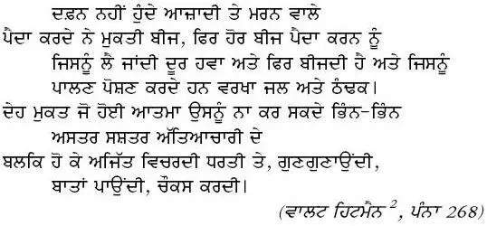

Not a grave of the murder'd for freedom, but grows seed for freedom, in its turn to bear seed,

Which the winds carry afar and re-sow, and the rains and the snows nourish.

Not a disembodied spirit can the weapons of tyrants let loose,

But it stalks invisibly over the earth, whispering, coun- seling, cautioning.

* * *

[Original poem](http://whitmanarchive.org/published/LG/1871/poems/190) by [Walt Whitman](http://en.wikipedia.org/wiki/Walt_Whitman)(1812-1819 ) an American poet is taken from [Shaheed Bhagat Singh's Jail Diary](http://www.box.net/shared/zgrxsj9uom)

[Download](http://www.box.net/shared/zgrxsj9uom) Bhagat Singh' Jail Diary .

_Crossposted from [https://parchanve.wordpress.com/2007/09/26/shaheed-bhagat-singh-nu/](https://parchanve.wordpress.com/2007/09/26/shaheed-bhagat-singh-nu/)_

---
### Comments:
#### [sandeep madaan]( "ssandymadaan89@gmail.com") - <time datetime="2009-08-28 07:19:16">Aug 5, 2009</time>

Main dunia vich sab tu uchi jaga is sheed veer nu diti hai te isde vichar parr ke khud ek scha desh bhagat ban gaya haa te uss muke di paal vich hai k main desh lai jaan de is veere de raste chala main air force de piolet banan d teyari kar raha han

#### [rajdeep singh grewal]( "lotus236016@gmail.com") - <time datetime="2009-04-07 05:49:41">Apr 2, 2009</time>

bhagat singh da nam sun ke mere sharirr ander kambni shara pendi va . mera sina hor mann nal phull janda va

#### [raj]( "sher_punjabi92@yahoo.com") - <time datetime="2008-01-24 09:41:21">Jan 4, 2008</time>

i love bhagat singh ji

#### [taranvir singh]( "gill.taranvirsingh@gmail.com") - <time datetime="2008-05-14 12:03:39">May 3, 2008</time>

just stop sohle gaune hun time a saheedan de paye poorneya te chalan da just clapping from the boundry line does not help so please think kite kalle beh ke socheo ki jo ohne aazzadi chahi si oh milli a ke nahin je nahin tan fir sadda farz banda a ke ohna diyan kurbaniyan nu waste na kariye just stop think what is going on in our cvountry our state plz reply me i m waiting

#### [Jasdeep](http://jasdeepsingh.wordpress.com/ "jsbhangra@gmail.com") - <time datetime="2008-05-14 12:28:08">May 3, 2008</time>

@taranvir singh Gud to see a radical guy here , Ya i know , Jo ohna ne chaahiaa see oh nahin hoya. Wat steps according to you should be taken to make the nation a better place. Wat are you doing in this respect .

#### [onkar]( "onkartmfl@yahoo.com") - <time datetime="2008-06-17 17:11:39">Jun 2, 2008</time>

i love him so much. i go daily to khatkar kalan, the birthplace of SHAHEED. AUR SAR KHUD HE SHARDHA SE JHUK JATA HAI

#### [mela singh](http://google "melasingh63@yahoo.com") - <time datetime="2008-08-13 07:58:23">Aug 3, 2008</time>

Main dunia vich sab tu uchi jaga is sheed veer nu diti hai te isde vichar parr ke khud ek scha desh bhagat ban gaya haa te uss muke di paal vich hai k main desh lai jaan de is veere de raste chala main air force de piolet banan d teyari kar raha han

#### [mohinder pal jit singh mann]( "saloudisinghade@hotmail.com") - <time datetime="2008-08-14 08:44:55">Aug 4, 2008</time>

s.bhagat singh is ji na kavel punjab balke pur hindustan de atma han . S. BHAGAT SINGH shahed nahe oh sade ajj de suraj han jena de shadad da nikh ajj sara bhart manda ha . par ajj de natama ne dash nu ke kha sab jande ne ajj fer lod e oouse bhagat singh ji de lekhan kahe nal kuch nahe hona kuch karo sorry je kuch galat lekh deta TA JAI HIND S.BHAGAT SINGH IS ALIVE IN OUR

#### [meera sandal]( "meera1982@hotmail.co.uk") - <time datetime="2008-09-27 19:58:52">Sep 6, 2008</time>

mera janam khatkar kalan vich hoya te hun main England vich rehndi haan mainu maan hai ke jis dharti te shaheed bhagat singh ji varge farishte ne kadam rakheya oos dharti da sukh main bhi maneya par mainu oodo bara hi dukh hunda hai jado England vich vasde kayee punjabi puchde ne ke bhagat singh kaun hai te eh gal sun ke mai sochdi ha ke je sadi pujabiat nu sade punjabi hi nahi janange ta hor kaun njane ga?

#### [malkiet]( "excuse99_me@yahoo.com") - <time datetime="2009-06-05 09:24:32">Jun 5, 2009</time>

bhagat singh har punjabi di rooh e har punjabi vich usdi ankh hai bas lod hai ankh jgaun di .....?? sgo eh nhi ke apa us soorme nu bhul jaye akha num hon jis punjabi diya us sheed nu chete kr ke hulna nhi usna jiunda rakhna e khud ch us soorme nu

#### [mani]( "mani_jam63@yahoo.com") - <time datetime="2010-08-25 11:13:59">Aug 3, 2010</time>

hi, friends i think we should post and talk such expressive k jo v pade usda dil kare desh layi kuch karan da. i m too fan of bhagat singh. mera boht mann aa to do sumthing good 4 country. and i will definately do. so friends have oath 2gether. and say we r rebel. "Inquilab Zindabad."

#### [Manish Ramudamu]( "rohan_ragwan@rediffmail.com") - <time datetime="2010-03-15 15:25:24">Mar 1, 2010</time>

shaheedo ke mazaro pe lagenge har baras mele, watan pe mitne walon ka baki yahi nisha hoga.

#### [RAHUL DEVAGN]( "rahuldevgan23@gmail.com") - <time datetime="2010-08-06 10:12:13">Aug 5, 2010</time>

parnam shaheeda nu

#### [awtarengill]( "awtarengill@gmail.com") - <time datetime="2010-08-24 00:46:15">Aug 2, 2010</time>

Shaheed Bhagat Singh nun kissi rabbi labaade ya ahinsa de naqab dee darkaar nahin si. Usda vada gunnah ehi si ke usne sach bolia, sach jeevya te sach vaaste qurbaani ditti...maut dian akhaan vich akhaan paa ke! Desh di azadi vaaste jeevea te azaadi de supne lainde hoe jaan ditti. Usdi bhvikh darshi soch nu slaam hee keeti ja sakhdi hai.---Awtar Engill

#### [balwant]( "balwantsalalia@yahoo.co.in") - <time datetime="2009-11-23 09:48:06">Nov 1, 2009</time>

Lod hai ajj shaeed BHAGAT SINGH de kahe raste te chalan di, par ajj de neta log apnia hi jeba bharan lage hoye ne, main ajj di youth nu request karda haan ke oh sab shaheed BHAGAT SINGH di soch nu apnoun thanx

#### [sandeep singh]( "allpunjabione@gmail.com") - <time datetime="2011-03-20 10:45:55">Mar 0, 2011</time>

bhagat singh de vicharan vichon ik......"bharat de nojwano! apne bharam chhado, nidar ho k haqikat da sahmna kro ate sangharshan ,kathnaiea te balidana to na ghabrao. maiyeawad, kismatwad,ishwarwad aadi nu mai chand lotuan wallo sadharan janta nu bhuchlaon lai khoji gai zehrili ghutti to vadh kuj nahin samjda"

#### [RAJINDER39]( "rajindertilak@yahoo.com") - <time datetime="2011-07-08 15:14:22">Jul 5, 2011</time>

he was a great son of punjab. now a great need of him in india for freedom from black british of our own

#### [RAJINDER39]( "rajindertilak@yahoo.com") - <time datetime="2011-07-08 15:16:22">Jul 5, 2011</time>

INQUILAB ZINDABAD

#### [nav gill]( "gillnav11@yahoo.com") - <time datetime="2011-07-13 08:43:12">Jul 3, 2011</time>

sanu maan hai sardar.bhagat singh ji te ohna karke sada duniya te wakhra maan hai asi chaatti choori karke tur dee aan...jadon jatt da naam lai da aa tan maarre bandhya de v saah challan lagg jande ne..."fakar a kaum" lahu ubaalle maran lagg janda g karda fir koi gora maar dai a ja k...

#### [ਗੁਰਤੇਗ ਸਿੰਘ ਕਹਰਖ]( "Rush.smc@live.com") - <time datetime="2012-01-24 09:14:33">Jan 2, 2012</time>

Dil hola jeha ho jaanda kar k yaad ਸ਼ਹੀਦ ਭਗਤ ਸਿੰਘ ਨੂੰ

#### [rishi]( "tejinderpkwl@gmail.com") - <time datetime="2011-12-09 16:27:32">Dec 5, 2011</time>

main tuhade saria de jajbe di kadar karda han.par main ik gal kehni chauhna han.kirpa karke dil te na layeo.te ik baar soch ke dekheo.asal vich apane andar bhagat singh prati sirf aadar hi hai,par usne apne aap da aadar karan layi tan keh hi nahi si roz khatkarr kalan vich jaake matha tekan naal kujh vi nahi hon laga.bhagat singh tan khud nastik si.usnu parnaam karan naal kujh vi nahi hon laga te na hi is gal naal farak penda hai ke tusi kithe janam leya kyonki usde pind vich janam len naal tusi us varge nahi ban jaoge ''sorry for that''.te naal hi sanu eh vi dekhna chahida hai ke bhagat singh kis lakash layi lad reha si.jekar tusi samjhde hon ke oh sirf azadi si tan tusi ahut bade bhulekhe vich ho,hun bhagat singh tan vapas aa nahi sakda par tusi us varge jaroor ban sakde ho,ajkal political leader usda naam vi bahaut istemaal kar rahe ne,sanu ehna di pehchaan karni pavegi te uhna virudh aawaz uthoni pavegi.tusi bhagat singh nu saravuch mande ho par supna tusi pilot banan da lai rahe ho ki eh hi si us shaheed da khawab ke tusi is punjivadi dhanche da ik purja bano te ohna lokan di sewa karo jo doosreya nu lutde ne.jago asi bhabuk nahi hona sago ik vichardharak ladai ladni hai tan jo ik behtar samaj sirjya ja sake.jekar koi doubt hai tan mainu contact kar sakde ho(tejinderpkwl@gmail.com).lal salam.

#### [amrit]( "as70786@gmail.com") - <time datetime="2014-12-26 18:07:05">Dec 5, 2014</time>

sir please send full story in punjabi/hindi i read this story but never know another

#### [Princess]( "shuntypuneet7980@gmail.com") - <time datetime="2016-07-20 15:42:17">Jul 3, 2016</time>

U r gr8

#### [sahil]( "sahilooo280@gmail.com") - <time datetime="2014-10-05 05:38:25">Oct 0, 2014</time>

jo zakhm tu nay diye thay woh bhertay jatay hain charhay hoay thay jo dariya utartay jatay hain yeh ahel\_e\_shahr\_e\_wafa hain ajab bahar parust sarooo kay phool faseelo’n pay dhertay jatay hain nahi hai aur tu kuch bhi hamaray hatoo’n main siva\_ye\_arz\_e\_tamman na so kertay jata hain ajeeb loog hain , yeh ahel\_e\_intezaar kay jo khud apni aag main jul kar sa’nwertay jatay hain najanay kaun si basti kay hain yeh bashindey! nazar uthatey nahi aur guzertay jatay hain yeh aaj shaher pay utri hay kis bala ki raat charaagh apni lawoo’n say mukertay jatay hain darakht shaam ko lagtay hain shaher say amjad kay shaakh shaakh parinday utartay jatay hain.

#### [Rajinder singh](http://rajnarmana@yahoo.com "rajnirmana@gmail.com") - <time datetime="2015-02-19 01:17:10">Feb 4, 2015</time>

sheed bhagat singh ji di soch te on da main dilo stikar krda ha.. jo ona ne desh lai kita o ik scha krantikari hi kr skda hai.. pr dost ki eh oh punjab ya desh hai jis khatr ona ne apni jaan nisawr kr diti nhi yr sb kuj ohi hai sirf te sirf skla bdliaan ne ..

#### [Kulwindersingh]( "Kulwindersingh98031@email.com") - <time datetime="2015-02-15 12:31:06">Feb 0, 2015</time>

Sikh as great

#### [King Randhawa](http://gmail "Kingrandhawa6@gmail.com") - <time datetime="2016-06-30 15:52:37">Jun 4, 2016</time>

Bandooka suto kitabban chukow baghat Singh parda vi si

#### [karman grewal]( "karmangrewal@yahoo.com") - <time datetime="2016-05-10 15:57:45">May 2, 2016</time>

Bhagat Singh anakh ha punjabiayan di ,pehra dine as asin ohndi soch ute ,ohvi kise maan da put ci jehra jaan vaar gya desh kom ute Salaam bhagat Singh de jigre lyi

#### [karman]( "karmangrewal@yahoo.com") - <time datetime="2016-05-10 15:52:24">May 2, 2016</time>

Ur right I am with u

#### [Siddarth Bajaj]( "siddarthbajaj008@gmail.com") - <time datetime="2016-01-05 14:24:28">Jan 2, 2016</time>

Veer aapa sarean nu kathe hike India vich isde lyi ek movement chalani chahidi hai ki shaheedan nu v saade te maan hive

#### [varinder ajnala]( "nishu2309@gmail.com") - <time datetime="2016-02-14 15:41:01">Feb 0, 2016</time>

par aje tak menu clear ni hoya 14 Feb nu kee ghatna wapri c pls dasso

#### [harmanpreet singh]( "harmanbhamara12@gmail.com") - <time datetime="2017-02-21 20:27:49">Feb 2, 2017</time>

Inquilab zindabad Bhagat Singh zindabad Sardar Udham Singh jindabad Chandrashekhar Azad zindabad Raj Guru zindabad. Sukhdev Singh zindabad Lala lajpatrai zindabad Subhash Chandra Bose zindabad

