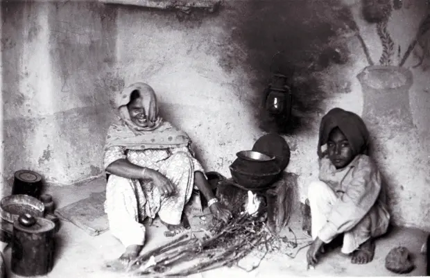

**ਨਾਚ**

ਜਦੋਂ ਮਜੂਰਨ ਤਵੇ ਤੇ ਦਿਲ ਨੂੰ ਪਕਾਉਂਦੀ ਹੈ ਚੰਨ ਟਾਹਲੀ ਥੀਂ ਹੱਸਦਾ ਹੈ ਬਾਲ ਛੋਟੇ ਨੂੰ ਪਿਓ ਬਹਿ ਕੇ ਵਰਾਉਂਦਾ ਹੈ ਕੌਲੀ ਵਜਾਉਂਦਾ ਹੈ ਤੇ ਬਾਲ ਜਦ ਦੂਜਾ ਵੱਡਾ ਤੜਾਗੀ ਦੇ ਘੁੰਗਰੂ ਵਜਾਉਂਦਾ ਹੈ ਤੇ ਨੱਚਦਾ ਹੈ ਇਹ ਗੀਤ ਨਹੀਂ ਮਰਦੇ ਨਾ ਦਿਲਾਂ ਚੋਂ ਨਾਚ ਮਰਦੇ ਨੇ.... |

**Dance**

When the laborer woman Roasts her heart on the tawa The moon laughs from behind the tree The father amuses the younger one Making music with bowl and plate The older one tinkles the bells Tied to his waist And he dances These songs do not die nor either the dance in the heart … ◊

**ਜ਼ਾਤ**

ਮੈਨੂੰ ਪਿਆਰ ਕਰਦੀਏ ਪਰ-ਜ਼ਾਤ ਕੁੜੀਏ ਸਾਡੇ ਸਕੇ ਮੁਰਦੇ ਵੀ ਇਕ ਥਾਂ ਨਹੀਂ ਜਲਾਉਂਦੇ

**Caste**

You love me, do you? Even though you belong to another caste But do you know our elders do not even cremate their dead at the same place? ◊

**ਸ਼ਬਦ**

ਸ਼ਬਦ ਤਾਂ ਕਹੇ ਜਾ ਚੁੱਕੇ ਹਨ ਅਸਾਥੋਂ ਵੀ ਬਹੁਤ ਪਹਿਲਾਂ ਤੇ ਅਸਾਥੋਂ ਵੀ ਬਹੁਤ ਪਿੱਛੋਂ ਦੇ ਅਸਾਡੀ ਹਰ ਜ਼ਬਾਨ ਜੇ ਹੋ ਸਕੇ ਤਾਂ ਕੱਟ ਲੈਣਾ ਪਰ ਸ਼ਬਦ ਤਾਂ ਕਹੇ ਜਾ ਚੁੱਕੇ ਹਨ।

**Words**

Words have been uttered long before us and for long after us Chop off every tongue if you can but the words have still been uttered ♦

* * *

Punjabi original by [Lal Singh Dil,](https://en.wikipedia.org/wiki/Lal_Singh_Dil) (1943 – 2007) one of the major revolutionary Punjabi poets.

Translated from the Punjabi by [Nirupama Dutt](https://en.wikipedia.org/wiki/Nirupama_Dutt), a poet, journalist and Author.

Translations Courtesy: [Pratilipi](http://pratilipi.in/these-songs-do-not-die-lal-singh-dil/)

Picture: Woman and Child (1978 )_by_ [Marek Jakubowski](mmjakubowski@bulldoghome.com), Courtesy [Uddari Art ](https://uddariart.wordpress.com/2008/08/28/woman-by-marek-jakubowski/)

_Crossposted from [https://parchanve.wordpress.com/2017/09/30/ih-geet-nahi-marde/](https://parchanve.wordpress.com/2017/09/30/ih-geet-nahi-marde/)_

---
### Comments:
#### [Navneet](http://sunnijindemeriye.wordpress.com "canavneetkaur@gmail.com") - <time datetime="2017-11-04 12:56:27">Nov 6, 2017</time>

Thank you ji 🙏

#### [karamjeet singh]( "karamjeetpatran@gmail.com") - <time datetime="2017-10-26 11:14:25">Oct 4, 2017</time>

bahut vadia ji

#### [Navneet](http://sunnijindemeriye.wordpress.com "canavneetkaur@gmail.com") - <time datetime="2017-10-04 08:30:55">Oct 3, 2017</time>

ਬਹੁਤ ਖ਼ੂਬ

