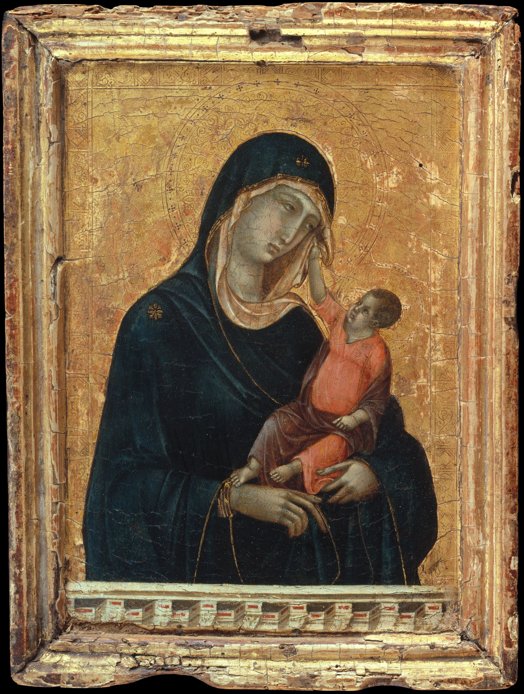

\[caption id="attachment\_media-20" align="alignnone" width="2808"\] Duccio di Buoninsegna (Italian, active by 1278–died 1318 Siena) - Madonna and Child\[/caption\]

**ਮਾਂ ਨੂੰ**

ਮੈਂ ਮਾਂ ਨੂੰ ਪਿਆਰ ਕਰਦਾ ਹਾਂ ਇਸ ਕਰਕੇ ਨਹੀਂ ਕਿ ਉਸਨੇ ਜਨਮ ਦਿੱਤਾ ਹੈ ਮੈਨੂੰ ਕਿ ਉਸਨੇ ਪਾਲਿਆ ਪੋਸਿਆ ਹੈ ਮੈਨੂੰ ਇਸ ਕਰਕੇ ਕਿ ਉਸਨੂੰ ਆਪਣੇ ਦਿਲ ਦੀ ਗੱਲ ਕਹਿਣ ਲਈ ਸ਼ਬਦਾਂ ਦੀ ਲੋੜ ਨਹੀਂ ਪੈਂਦੀ ਮੈਨੂੰ ||

**Maan Nu**

main maan nu piaar karda haan is karke nahin ki usne janam ditta hai mainu ki usne paaliaa posiaa hai mainu is karke ki usnu aapne dil dee gall kehan laee shabdaan dee lorh nahin paindee mainu ||

**Mother**

I love mother Not because that she gave birth to me Or because that she brought me up But because To speak my heart to her I don’t need words

**Source:** The poem is written by [Gurpreet Mansa](http://gurpreetsukhan.wordpress.com/). He teaches Punjabi at a school near [Mansa](http://mansa.nic.in/) . This poem is taken from his book "Akaaran" published in 2001

English Translation by [Jasdeep](https://parchanve.wordpress.com/category/translators/jasdeep/)

_Crossposted from [https://parchanve.wordpress.com/2008/10/22/maan-nu/](https://parchanve.wordpress.com/2008/10/22/maan-nu/)_

---
### Comments:
#### [ਥੈਲਾ ਬੋਰੀ / Bag &laquo; ਸ਼ਬਦਾਂ ਦੇ ਪਰਛਾਂਵੇ&#8230;](http://parchanve.wordpress.com/2009/03/04/bag/ "") - <time datetime="2009-03-04 11:10:51">Mar 3, 2009</time>

\[...\] is done by me. The poem is written by poet Gurpreet . Check his other poems in this blog 1. Maan Nu 2. Saahan Varga 3. \[...\]

#### [ਖਿਆਲ / Khiaal &laquo; ਸ਼ਬਦਾਂ ਦੇ ਪਰਛਾਂਵੇ&#8230;](http://parchanve.wordpress.com/2009/02/17/%e0%a8%96%e0%a8%bf%e0%a8%86%e0%a8%b2-khiaal/ "") - <time datetime="2009-02-17 13:19:13">Feb 2, 2009</time>

\[...\] is done by me. The poem is written by poet Gurpreet . Check his other poems in this blog 1. Maan Nu 2. Saahan Varga \[...\]

#### [Manpreet](http://www.manmahesh.blogspot.com "excellence11@gmail.com") - <time datetime="2008-10-22 18:03:44">Oct 3, 2008</time>

ਵਾਹ, ਬਹੁਤ ਸੁੰਦਰ ।

#### [Gurinderjit Singh](http://gurinderjit.blogspot.com "guri@khalsa.com") - <time datetime="2008-10-23 01:55:19">Oct 4, 2008</time>

This is so beautiful, however opposite to Surjit Patar's Meri maa nu meri kavita samajh na aayee...

#### [Deepinder Singh](http://folkpunjabi.blogspot.com "deepindersingh@rocketmail.com") - <time datetime="2008-10-24 05:55:14">Oct 5, 2008</time>

ਬਹੁਤ ਪਿਆਰੀ ਕਵਿਤਾ, ਵੈਸੇ ਵੀ...... ਸ਼ਬਦ ਤਾਂ "ਗੱਲਾਂ" ਕਹਿਣ ਵਾਸਤੇ ਨੇ, ਦਿਲ ਦੀਆਂ ਤਾਂ ਰਮਜ਼ਾਂ ਹੁੰਦੀਆਂ ਨੇ ।ਤੇ ਮਾਂ ਤੋਂ ਵੱਧ ਇਹ ਰਮਜ਼ਾਂ ਕੌਣ ਬੁੱਝ ਸਕਦੈ ?

#### [Supreet]( "supreetsahota@yahoo.com") - <time datetime="2008-10-24 15:40:09">Oct 5, 2008</time>

Ik tukk vich hi kujh ajeha keh ditta maa baarey ki uss baare soch 2 moti pata nahin kithon ehnaa akhaan vich aaye te ikk ruhaani jeha ehsaas de gaye. Muaaf karna mein tareef layee lafaz nahin jutaa paayee. Bas ik ehsaas hai jo duaa dena chahunda hai ki eh kalam jo ruhaaniyat de rishteaan nu enni khoobi naal lafzaan vich piro rahi hai oh chaldi rahe te oh rooh jis nu maa di mamta da enna dungha ehsaas hai oh jiundi vasdi rahe.

#### [Jaswant Zafar](http://www.jaswantzafar.blogspot.com "jaszafar@yahoo.com") - <time datetime="2008-10-25 02:38:43">Oct 6, 2008</time>

Gurpreet de 'Sukhan' hon da hun pata lagga

#### [gillmks](http://gillmks.wordpress.com "gillmks@hotmail.com") - <time datetime="2010-10-31 18:43:18">Oct 0, 2010</time>

Hi ਜਸਦੀਪ ਮੈਂ ਤੁਹਾਡਾ Profile ਅਤੇ Blog ਪੜਿਆ, ਬਹੁਤ ਹੀ ਚੰਗਾ ਲੱਗਾ, ਅਸਲ ਵਿੱਚ ਮੈਂ ਵੀ ਪੰਜਾਬ ਦੇ ਇਕ ਦੂਰ ਦੁਰਾਡੇ ਜਹੇ ਪਿੰਡ ਦੇ ਕੱਚੇ ਰਾਹਾਂ ਦੀ ਰੇਤ ਵਿੱਚ ਖੇਡਿਆ, ਜਵਾਨ ਹੋਇਆ ਅਤੇ ਹੁਣ ਲੰਦਨ ਵਰਗੇ ਪੱਥਰਾਂ ਦੇ ਸ਼ਹਿਰ ਆ ਵਸਿਆ ਹਾਂ | ਤਰੱਕੀ ਦੇ ਏਸ 50 ਸਾਲ ਦੇ ਫਾਸਲੇ ਨੂੰ 8 - 9 ਘੰਟਿਆਂ ਦੀ ਉਡਾਨ ਵਿੱਚ ਤਹਿ ਕਰਨਾ ਮੈਂ ਜਾਣਦਾ ਹਾਂ ਯਾਂ ਮੇਰਾ ਰੱਬ | ਬਹੁਤੇ ਲੋਕਾਂ ਨੂੰ ਇਸ ਦਾ ਕੋਈ ਫ਼ਰਕ ਨਹੀ ਪੈਂਦਾ ਪਰ ਜਿੰਨਾ ਨੂੰ ਪੈਂਦਾ, ਬਹੁਤ ਹੀ ਪੈਂਦਾ ਹੈ | ਤੁਹਾਡਾ ਆਪਣੇ ਸ਼ੌਂਕ ਨੂੰ ਨਵਾਂ ਰੰਗ ਦੇਣ ਦਾ ਇਹ ਉਪਰਾਲਾ ਤਾਰੀਫ਼ ਦੇ ਕਾਬਿਲ ਹੈ | ਆਪਣੇ ਸ਼ੌਂਕ ਦੀ ਏਸ ਅੱਗ ਨੂੰ ਪੰਜਾਬ ਵੱਲੋਂ ਆਓਂਦੇ ਹਵਾ ਦੇ ਬੁਲਿਆ ਨਾਲ ਹਮੇਸ਼ਾ ਧੁਖਦੀ ਰੱਖਣਾ | G Gill

#### [money]( "phulkasidhu@yahoo.com") - <time datetime="2010-06-17 15:16:48">Jun 4, 2010</time>

vadia

#### [Hardeep Singh]( "happysihu47@yahoo.co.in") - <time datetime="2012-03-13 13:27:14">Mar 2, 2012</time>

ਸਤ੍ਸ਼੍ਰੀ ਅਕਾਲ ਵੀਰ ਜੀ ਜਸਦੀਪ ਇ ਕਵਿਤਾ ਮੈਨੂ ਵੀ ਬਹੁਤ ਚੰਗੀ ਲੱਗੀ ਪਰ ਉਸ ਤੋ ਵੀ ਚੰਗੀ ਲੱਗੀ ਤੁਹਾਡੀ 50 ਸਾਲ ਏ ਫਾਸਲੇ ਨੂ 8 - 9 ਘੰਟੇ ਵਿਚ ਤੈ ਕਰਨ ਦੀ ਗੱਲ ਬਾਈ ਜੀ ਮੈਂ ਵੀ ਇਕ ਸਾਲ ਪਹਿਲਾ ਚੰਗੀ ਜਿੰਦਗੀ ਦੀ ਤਲਾਸ਼ ਵਿਚ ਇਥੇ ਆ ਗਯਾ ਸੀ

#### [yaad brar]( "yaadbrar91@gmail.com") - <time datetime="2012-06-06 05:00:13">Jun 3, 2012</time>

spchless

#### [Singh Mani]( "Maindersingh81@yahoo.in") - <time datetime="2014-03-16 13:08:12">Mar 0, 2014</time>

ਦੁਨੀਆ ਤੇ ਸਬ ਰਿਸ਼ਤੇ ਙੂਠੇ ਨੇ ਇਕੋ ਸੱਚਾ ਰਿਸ਼ਤਾ ਮਾਂ ਦਾ

#### [simran]( "simu@gmail.com") - <time datetime="2015-05-01 08:25:16">May 5, 2015</time>

Maa de bina duniya da koi v sukh sukh nahi hunda

