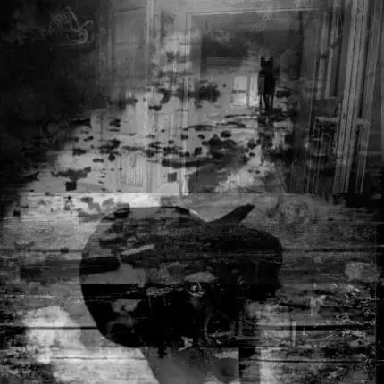

ਰਾਤ ਕੁਝ ਭੌਂਕਦੇ ਕੁੱਤੇ ਸੀ ਤੇ ਖ਼ਾਮੋਸ਼ੀ ਸੀ ਕੋਈ ਤਲਵਾਰ ਸਿਰ ਉੱਤੇ ਸੀ ਤੇ ਖ਼ਾਮੋਸ਼ੀ ਸੀ

ਬਾਹਰ ਸੁੰਨਸਾਨ 'ਚ ਲਗਦਾ ਸੀ ਕੋਈ ਤੁਰਦਾ ਹੈ ਬਾਕੀ ਸਭ ਨੀਂਦ ਵਿਗੁੱਤੇ ਸੀ ਤੇ ਖ਼ਾਮੋਸ਼ੀ ਸੀ

ਅੱਜ ਕਿਤੇ ਸਫ਼ਰ ਨ ਕੀਤਾ ਨ ਕਿਤੇ ਆਇ ਗਏ ਕੰਡੇ ਲੂੰ ਲੂੰ 'ਚ ਪਰੁੱਤੇ ਸੀ ਤੇ ਖ਼ਾਮੋਸ਼ੀ ਸੀ

ਅਪਣੇ ਲਾਗੇ ਸਾਂ ਪਿਆ ਆਪ ਹੀ ਮੈਂ ਕਫ਼ਨ ਸਮੇਤ ਸੋਗ ਦਾ ਭਾਰ ਮਿਰੇ ਉੱਤੇ ਸੀ ਤੇ ਖ਼ਾਮੋਸ਼ੀ ਸੀ

ਮਰ ਚੁੱਕੀ ਮਾਂ ਸੀ ਉਦ੍ਹੇ ਵੈਣ 'ਚ ਮੇਰਾ ਨਾਂ ਸੀ ਸੁਣਦੇ ਸਭ ਲੋਕ ਨਿਪੁੱਤੇ ਸੀ ਤੇ ਖ਼ਾਮੋਸ਼ੀ ਸੀ

ਜੀ 'ਚ ਆਉਂਦਾ ਸੀ ਕਿਸੇ ਬੂਹੇ 'ਤੇ ਦਸਤਕ ਬਣ ਜਾਂ ਬਸ ਇਹੋ ਸ਼ੌਕ ਕਰੁੱਤੇ ਸੀ ਤੇ ਖ਼ਾਮੋਸ਼ੀ ਸੀ

\-  _ਹਰਿਭਜਨ ਸਿੰਘ_

Stray dogs kept wailing through the night And there was silence A dagger kept hanging above my head And there was silence

Outside, ‘twas deafening stillness It felt someone was walking The rest seemed wrecked in sleep And there was silence

Today there were no journeys We didn’t go anywhere, we didn’t return Pore after pore there was a thorny stitch And there was silence

I lay next to my own body Me along with my shroud Carrying the burden of mourning And there was silence

Mother had died In her wails was heard my name Childless, all those people were listening And outside there was silence

My heart would pound with longing I wanted to be a knock on the door Such indeed was the unseasonal wish And outside there was silence

_    - Translated by Madan Gopal Singh_

http://www.youtube.com/watch?v=waCMCWXkSjs

**Credits:**

ਕਵਿਤਾ: ਹਰਿਭਜਨ ਸਿੰਘ (1920-2002) Poetry: [Harbhajan Singh](http://www.apnaorg.com/poetry/harbhajan/haribhajan_main_index_roman.htm) (1920-2002)

ਅੰਗਰੇਜ਼ੀ ਅਨੁਵਾਦ ਅਤੇ ਤਸਵੀਰ: ਮਦਨ ਗੋਪਾਲ ਸਿੰਘ English translation and the picture: [Madan Gopal Singh](https://www.facebook.com/madangopal.singh)

Further reading: Unni sau churasi ਉੱਨੀ ਸੌ ਚੁਰਾਸੀ, Harbhajan Singh, Poems on 1984, Edited and Introduced by Amarjit Chandan, Ludhiana: Chetna Prakashan. 2017

Courtesy [Kitab Trinjan](https://www.facebook.com/KitabTrinjan/photos/a.953145028040988/2155636704458475/?type=3&theater)

_Crossposted from [https://parchanve.wordpress.com/2018/12/19/1237/](https://parchanve.wordpress.com/2018/12/19/1237/)_