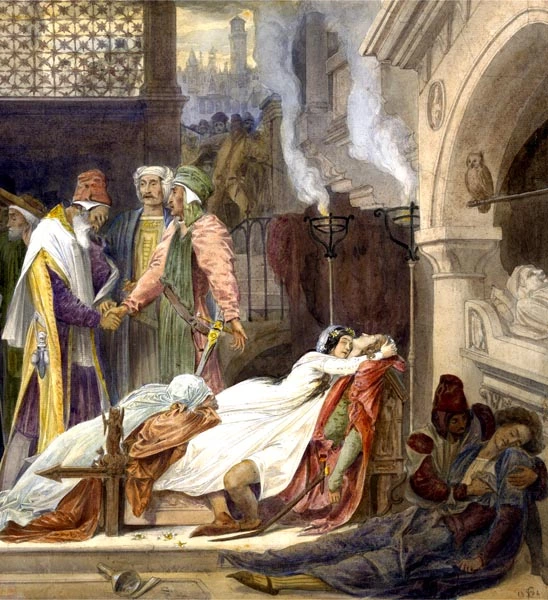

ਕੋਈ ਮਾਂ ਨਹੀਂ ਚਾਹੁੰਦੀ ਲਹੂ ਜ਼ਮੀਨ ਤੇ ਡੁੱਲੇ

ਹਰ ਮਾਂ ਚਾਹੁੰਦੀ ਏ ਧੀਆਂ ਪੁੱਤਰ ਤੇ ਵਧਦੀਆਂ ਫੁੱਲਦੀਆਂ ਫਸਲਾਂ

ਹਰ ਮਾਂ ਚਾਹੁੰਦੀ ਏ ਲੋਹਾ ਕੋਈ ਲਾਹੇਵੰਦਾ ਔਜ਼ਾਰ ਬਣੇ ਜਾਂ ਸਾਜ਼ ਦੀ ਤਾਰ ਬਣੇ

ਕੋਈ ਮਾਂ ਨਹੀਂ ਚਾਹੁੰਦੀ ਲੋਹਾ ਹਥਿਆਰ ਬਣੇ

ਪਰ ਜਦੋਂ ਲਹੂ ਖੌਲਦਾ ਏ ਤਾਂ ਲੋਹੇ ਨੂੰ ਹਥਿਆਰ ਬਣਾ ਲੈਂਦਾ ਏ  ਤੇ ਹਾਂ ਕਦੀ ਮਾਵਾਂ ਆਪਣੀ ਹੱਥੀਂ ਵੀ ਪੁੱਤਾਂ ਨੂੰ ਅਣਖ ਦੀ ਜੰਗ ਲੜਨ ਤੋਰਦੀਆਂ ਨੇ

ਲਹੂ ਜਮੀਨ ਤੇ ਡੁੱਲਦਾ ਏ ਜ਼ਮੀਨ ਲਹੂ ਨੂੰ ਜੀਰ ਲੈਂਦੀ ਏ ਉਸ  ਨੂੰ ਤੱਤਾਂ ਵਿਚ ਬਦਲ ਲੈਂਦੀ ਏ

ਕੁਦਰਤ ਲਈ ਮੌਤ ਦਾ ਅਰਥ ਮੌਤ ਨਹੀਂ ਕੁਦਰਤ ਲਈ ਮੌਤ ਦਾ ਅਰਥ ਤੱਤਾਂ ਦਾ ਰੂਪ ਬਦਲਣਾ ਕੁਦਰਤ ਲਈ ਮੌਤ ਦਾ ਅਰਥ ਇੱਕ ਹੋਰ ਜਨਮ

ਪਰ ਮਾਂਵਾਂ ਲਈ ਕੁਦਰਤ ਲਈ ਮੌਤ ਦਾ ਅਰਥ ਹੈ ਕੁੱਖਾਂ ਚੋਂ ਜਾਏ ਦਾ ਅੰਤਹੀਣ ਅੰਧਕਾਰ ਵਿਚ  ਡੁੱਬ ਜਾਣਾ

The poem is taken from Surjeet Patar's Punjabi Adaptation "Agg de Kalirey (ਅੱਗ ਦੇ ਕਲੀਰੇ)" of Spanish playwright [Federico García Lorca](http://en.wikipedia.org/wiki/Federico_Garc%C3%ADa_Lorca)'s play [Bodas de Sangre ('Blood Wedding')](http://en.wikipedia.org/wiki/Bodas_de_sangre)

Picture: ‘The Reconciliation of the Montagues and the Capulets’,Frederic Leighton, 1830–1896, British The Yale Centre for British Art

_Crossposted from [https://parchanve.wordpress.com/2007/01/22/maut-de-arth/](https://parchanve.wordpress.com/2007/01/22/maut-de-arth/)_

---
### Comments:
#### [Amanpreet]( "") - <time datetime="2007-02-03 20:13:36">Feb 6, 2007</time>

badi mehnat kiti je,  
veseea kam tusi bohat wadiya kita a...

#### [sukhjinder]( "harpreet.gagan68@gmail.com") - <time datetime="2011-10-10 23:56:39">Oct 1, 2011</time>

ਮੇਰੀ ਮਾਂ ਨੂੰ ਇਹ ਧੋਖਾ ਸੀ ਮੈਂ ਪਹਿਲੇ ਦਿਨ ਹੀ ਪਾਂਧੇ ਨੂੰ ਪੜਾ ਕੇ ਪਰਤ ਆਵਾਂਗਾ ਉਹ ਨਹੀ ਸੀ ਜਾਣਦੀ ਕਿ ਆਦਮ ਖੋਰ ਸ਼ਹਿਰਾਂ ਵਿੱਚ ਅਜਕਲ ਵਿਦਿਆਲੇ ਨਹੀਂ ਕਿ ਆਦਮ ਖੇਰ ਸ਼ਹਿਰਾਂ ਵਿੱਚ ਮਹਿਜ ਪਰਮਾਣ ਪੱਤਰ ਛਾਪਣ ਦੀਆਂ ਸਵੈ-ਚਾਲਕ ਮਸੀਨਾਂ ਹਨ ਜੇ ਏਨਾ ਜਾਣਦੀ ਹੁੰਦੀ ਤਾਂ ਉਸ ਮੈਨੂੰ ਵਰਜ ਦੇਣਾ ਸੀ ਮੇਰਾ ਇਤਰਾਜ ਏਨਾ ਹੈ- ਮੇਰੇ ਅਧਿਆਪਕ ਮੇਰੀ ਠੀਕ ਚਲਦੀ ਨਬਜ ਤੇ ਇਤਬਾਰ ਨਹੀ ਕਰਦੇ ਬੜਾ ਮੁਸਕਲ ਹੈ ਅਪਨੇ ਆਪ ਨੂੰ ਟੁੱਟੀ ਘੜੀ ਸੰਗ ਸੁਰ ਕਰ ਲੈਣਾ ਮੈਂ ਕਿਹੜੇ ਯੁੱਗ ਦਾ ਜਾਇਆ ਹਾਂ ਮੈਂ ਕਿਹੜੇ ਸ਼ਹਿਰ ਆਇਆ ਹਾਂ ਮੇਰਾ ਕੋਈ ਨਾਂ ਨਹੀਂ ਹੈ ਮੇਰਾ ਇੱਕ ਰੋਲ ਨੰਬਰ ਹੈ ਮੇਰਾ ਕੋਈ ਥਾਂ ਨਹੀ ਹੈ ਪਰ ਇੱਕ ਰੂਮ ਨੰਬਰ ਹੈ ਕਿ ਮੇਰੀ ਨਜਰ ਦਾ ਇੱਕ ਕਾਸਨੀ ਟੋਟਾ- ਕੋਈ ਪੁਸਤਕ ਨਿਗਲ ਗਈ ਹੈ ਕਿ ਮੇਰੀ ਹੋਂਦ ਪਿਛਲਾ ਬੈਂਚ ਬਣ ਕੇ ਰਹਿ ਗਈ ਹੈ ਮੇਰੀ ਦੋਸਤ ਕੁੜੀ ਇਤਰਾਜ ਕਰਦੀ ਹੈ ਮੈਂ ਉਸਦੇ ਮਹਿਕਦੇ ਵਾਲਾਂ ਮੈ ਉਸਦੇ ਹੱਸਦਿਆਂ ਬੁੱਲਾਂ 'ਤੇ ਕੋਈ ਨਜਮ ਨਹੀਂ ਲਿਖਦਾ ਤੇ ਮੇਰੇ ਯਾਰ ਜੋ ਮੇਰੇ ਜਿਸਮ ਦੇ ਘੇਰੇ 'ਚ ਉੱਗੇ ਜਾਂਗਲੀ ਫੁੱਲ ਹਨ ਉਹ ਮੇਰਾ ਮੂੰਹ ਚਿੜਾਉਂਦੇ ਹਨ ਤੇ ਮੈਨੂੰ ਠਿੱਠ ਕਰਨ ਲਈ ਉਹ ਮੇਰੇ ਜਿਸਮ ਤੇ ਇਹ ਲਿਖ ਦਿੰਦੇ ਹਨ "ਅੰਦਰ ਕੋਈ ਨਹੀਂ ਹੈ" "ਅੰਦਰ ਕੋਈ ਨਹੀਂ ਹੈ" (Dr.amitoj)

