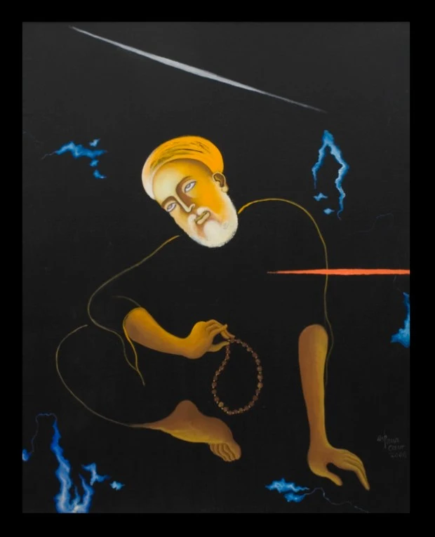

\[caption id="attachment\_1221" align="alignnone" width="620"\] Nanak: Journeys (2006) by Arpana Caur\[/caption\]

**ਨਾਨਕ**

ਮਾਫ਼ ਕਰਨਾ ਸਾਡੇ ਲਈ ਬਹੁਤ ਮੁਸ਼ਕਿਲ ਹੈ ਨਾਨਕ ਦੀ ਅਸਲੀ  ਤਸਵੀਰ ਦਾ ਧਿਆਨ ਧਰਨਾ ਪੈਂਡੇ ਦੀ ਧੂੜ ਨਾਲ ਲੱਥ ਪੱਥ ਪਿੰਜਣੀਆਂ ਤਿੜਕੀਆਂ ਅੱਡੀਆਂ ਨ੍ਹੇਰੀ ਨਾਲ ਉਲ੍ਝੀ ਖੁਸ਼੍ਕ ਦਾਹ੍ੜੀ ਤੇ ਚਿਹਰੇ ਦੀਆਂ ਉਭਰੀਆਂ ਹੱਡੀਆਂ ਦੇ ਡੂਂਘ 'ਚ ਦਗਦੀਆਂ ਮਘਦੀਆਂ ਤੇਜ਼ ਅੱਖਾਂ ਅੱਖਾਂ ਜੋ - ਪਰਿਵਾਰ ਨੂੰ ਸਰਕਾਰ ਨੂੰ ਤੇ ਹਰ ਸੰਸਕਾਰ ਨੂੰ ਟਿੱਚ ਜਾਣਦੀਆਂ ਬਹੁਤ ਖਤਰਨਾਕ ਸਿੱਧ ਹੋ ਸਕਦੈ ਸਾਡੇ ਲਈ ਅਸ੍ਲੀ ਨਾਨਕ

ਸਾਨੂੰ ਤਾਂ ਸੋਭਾ ਸਿੰਘੀ ਮੂਰਤਾਂ ਵਾਲਾ ਨਾਨਕ ਹੀ ਸੂਟ ਕਰਦਾ ਹੈ ਸ਼ਾਂਤ ਲੀਨ ਲਕਸ਼ਮੀ ਦੇਵੀ ਵਾਂਗ ਉਠਾਇਆ ਹੱਥ ਹੱਥ 'ਚੋਂ ਫੁਟਦੀ ਮਿਹਰ ਤੇ ਅੱਖਾਂ 'ਚੋਂ ਡੁੱਲ ਡੁੱਲ ਪੈਂਦੀ ਕੋਮਲਤਾ ਸਨ ਸਿਲ੍ਕੀ ਸ਼ਫਾਫ ਦਾਹ੍ੜੀ ਗੋਲ ਮਟੋਲ ਗੋਰੀਆਂ ਗੁਲਾਬੀ ਗੱਲ੍ਹਾਂ ਫੇਅਰ ਐਂਡ ਲਵਲੀ ਸੁਰਖ ਟਿਪਸੀ  ਹੋਂਠ ਮੁਲਾਇਮ ਜੈਮਿਨੀ ਪੈਰ ਕੂਲੇ ਬਾਰਬੀ ਹੱਥ ਪੈਗੰਬਰੀ ਵਸਤਰਾਂ ਦਾ ਏਰੀਅਲੀ ਨਿਖਾਰ

ਸਾਡੇ ਇਨ੍ਹਾਂ ਘਰਾਂ ਦੀਆਂ ਕੰਧਾਂ ਤੇ ਨਾਨਕ ਦੇ ਸੋਭਾ ਸਿੰਘੀ ਚਿੱਤਰ ਹੀ ਟਿਕ ਸਕਦੇ ਰਾਹਾਂ ਨੂੰ ਰੱਦ ਕਰਨ ਵਾਲੇ ਖਤਰਨਾਕ ਨਾਨਕ ਦੀ ਅਸ੍ਲੀ ਤਸਵੀਰ ਦਾ ਭਾਰ ਸਾਡੀ ਕੋਈ ਕੰਧ ਨਹੀਂ ਝੱਲ ਸਕਦੀ ਮਾਫ਼ ਕਰਨਾ ਅਸੀਂ ਮਰ ਮਰ ਕੇ ਬਣਾਏ ਘਰ ਨਹੀਂ ਢੁਆਉਣੇ ਮਸਾਂ ਮਸਾਂ ਰੱਬ ਤੋਂ ਲਾਏ ਨਿਆਣੇ ਹੱਥੋਂ ਨਹੀਂ ਗੁਆਉਣੇ ਅਸੀਂ ਅਸਲੀ  ਨਾਨਕ ਦੀ ਤਸਵੀਰ ਦਾ ਧਿਆਨ ਨਹੀਂ ਧਰ ਸਕਦੇ ਮਾਫ਼ ਕਰਨਾ

\- _ਜਸਵੰਤ ਸਿੰਘ ਜ਼ਫਰ _

**Nanak**

Excuse us It’s quite hard for us to envisage the true picture of Nanak Legs messed up with the dust of the winding path cracked heals dry beard entangled by turbulent winds skin toughened in extreme weathers hollowed cheeks eyes popping from the facial bone structure dazzling and sharp

Eyes, which refute- the hierarchy the monarchy and clergy The real Nanak can prove fatal to us Such Nanak, we can’t even dream Who can shatter homely institutions can spoil our kids

Can create quests to point feet towards [Kaaba](http://www.gurmat.info/sms/smspublications/gurunanakforchildren/chapter6/) Consequently our legs can be fractured or chopped and may instigate us for many more wrong deeds For instance We may assess the hollowness of religious symbolism we may bring out a manifesto to divert the flows to challenge propriety We are wary of this preposterous Nanak

All we want is success succor solace

We desire luxurious graces

flourishing family tree yielding fruits of wealth Nanak depicted in Sobha Singh’s portraits is well suited for us

Cool

and calm

hand raised like goddess Lakshmi

ensuing blessing from the palm

eyes overflowing with genteel grace White _Sun-Silky_ beard glowing chubby cheeks _Fair and Lovely_ rosy _Tipsy_ lips soft _Gemini_ feet delicate _Barbie_ hands _Ariel_ cleaned messianic robes

The walls of our homes can only hold Nanak in the pictures of Sobha Singh’s style Dangerous Nanak’s true picture who rejected the well-traversed paths is too momentous for our walls Excuse us we can’t afford ruining of homes those we created with labour of blood We can’t afford to lose kids those we got with prayers

We can not envisage the real picture of Nanak Excuse us please.

\-  _Jaswant Singh Zafar_ \-  _Translated from Punjabi by Jasdeep Singh with Manpreet Kaur and Jaswant Singh Zafar_

\[youtube https://www.youtube.com/watch?v=zwfA60hqxkY\]

* * *

**Source**: Excerpts from poem 'Naanak' by poet/cartoonist [Jaswant Singh Zafar ( ਜਸਵੰਤ ਸਿੰਘ ਜ਼ਫਰ )](http://jaswantzafar.blogspot.com/) 's second poetry book "Asin naanak de ki lagde haan ".

A bilingual edition of Jaswant Singh Zafar's poems '[The Other Shore of Words](http://www.hook2book.com/the-other-shore-of-words)' was published in 2016.  Available at Chetna Parkashan, Punjabi Bhavan, Ferozepur Road,  Ludhiana, Punjab 141001 Phone: 0161 241 3613 Or Online at [hook2book](http://www.hook2book.com/the-other-shore-of-words)

_Crossposted from [https://parchanve.wordpress.com/2008/04/04/naanak/](https://parchanve.wordpress.com/2008/04/04/naanak/)_

---
### Comments:
#### [deepinder](http://folkpunjabi.blogspot.com "deepindersingh@rocketmail.com") - <time datetime="2009-01-08 15:40:00">Jan 4, 2009</time>

ਜਸਦੀਪ ਜੀ, ਬੇਹਤਰੀਨ ਕਵਿਤਾ, ਠੀਕ ਹੀ ਕਹਿੰਦੇ ਨੇ ਕਿ ਜ਼ਫਰ ਹੋਣਾ ਨੇ ਬਾਬੇ ਨਾਨਕ ਨੂੰ ਸੋਭਾ ਸਿੰਘ ਦੇ ਫਰੇਮ ਤੋਂ ਮੁਕਤ ਕੀਤੈ... ਕੀ ਇਹੋ ਕਵਿਤਾ "ਅਸੀਂ ਨਾਨਕ ਦੇ ਕੀ ਲਗਦੇ ਹਾਂ" ਹੈ? ਕੀ ਇਹ ਪੂਰੀ ਕਵਿਤਾ ਹੈ?

#### [Jasdeep](http://jasdeepsingh.wordpress.com/ "jsbhangra@gmail.com") - <time datetime="2009-01-09 05:59:19">Jan 5, 2009</time>

@deepinder ਬਾਕਾਇਦਾ ਬੇਹਤਰੀਨ ਐ ਜੀ.. ਇਸ ਕਵਿਤਾ ਦਾ ਸਿਰਲੇਖ 'ਨਾਨਕ' ਹੀ ਐ, ਤੇ ਇਹ ਕਾਫੀ ਲੰਬੀ ਹੋਣ ਕਰਕੇ , ਕੁਝ ਪਹਿਰੇ ਨਹੀਂ ਪੋਸਟ ਹੋ ਸਕੇ.. ਜਫਰ ਜੀ ਦੀ ਸਾਰੀ ਕਿਤਾਬ ਈ must read ਐ |

#### [Manpreet](http://www.manmahesh.blogspot.com "excellence11@gmail.com") - <time datetime="2008-05-24 04:00:03">May 6, 2008</time>

This poem by Zafar is my all time favorite. WOnderful to read it here. Keep it up.

#### [surjit](http://gurushabad1.blogspot.com "gurushabad1@yahoo.co.in") - <time datetime="2008-05-27 12:06:37">May 2, 2008</time>

Truthful words: ..'we can not idolize the real image of Naanak Excuse us ..' Really wonderful Blog. God bless.

#### [Jasdeep](http://jasdeepsingh.wordpress.com/ "jsbhangra@gmail.com") - <time datetime="2008-06-05 10:12:27">Jun 4, 2008</time>

@Manpreet It deserves to be favorite. @Surjit Thanks for appreciation.

#### [nawanshahr](http://www.twitter.com/jaspreet309 "jaspreet309@gmail.com") - <time datetime="2010-11-23 10:27:54">Nov 2, 2010</time>

wadheya hai ji. Par babbe nanak de chehre te ik roohani noor bi c beshaq saadgi nal jude c. Thx jina gareeba de ghar babba chal k aunda c, Chhad k saag loona khana chaunda c

#### [kamal]( "kkchandok@hotmail.com") - <time datetime="2012-09-12 21:59:23">Sep 3, 2012</time>

love it love it love it...in fact i love his book asi nanak de ki lagde haan

#### [Sarbjit Singh Khaira](http://www.facebook.com/Sarbjit.Singh.Khaira "gopikhhaira@hotmail.com") - <time datetime="2011-11-10 04:21:12">Nov 4, 2011</time>

True picture of Guru Baba Nanak ji....Thanks Brother

#### [ਵਿਕਰਮਜੀਤ ਸਿੰਘ]( "vjsjolly@gmail.com") - <time datetime="2011-11-10 04:32:24">Nov 4, 2011</time>

ਮਾਫ ਕਰਨਾ, ਮੇਰਾ ਲੇਖ਼ਕ ਵੀਰ ਤਾ ਸਿਰਫ ਤਸਵੀਰ ਤਕ ਹੀ ਰਹ ਗਿਆ | ਤਸਵੀਰ ਤਾ ਏਕ ਜਰਿਆ ਹੈ ਯਾਦ ਕਰਨ ਦਾ ਉਸ ਨਾਨਕ ਦੇ ਵਿਚਾਰਾਂ ਨੂ , ਉਸ ਦੇ ਆਤਮਕ ਗਯਾਨ ਨੂ, ਉਸ ਦੇ ਸਿਧਾਂਤਾਂ ਨੂ, | ਏਨੇ ਗੁਣਾਂ ਵਾਲਾ ਸੋਭਾ ਸਿੰਘ ਦਾ ਨਾਨਕ ਮਾੜਾ ਕਿਦਾਂ ਹੋ ਸਕਦਾ ਹੈ.

#### [MUSINGS: JASWANT ZAFAR&#8217;s NANAK | Midnight Mudki](http://midnightmudki.wordpress.com/2014/12/13/musings-jaswant-zafars-nanak/ "") - <time datetime="2014-12-30 12:20:05">Dec 2, 2014</time>

\[…\] http://parchanve.wordpress.com/2008/04/04/naanak/ \[…\]

#### [Gurbaj Singh]( "grbsdu@gmail.com") - <time datetime="2016-11-15 09:39:19">Nov 2, 2016</time>

Bilkul sahi

#### [Harinder Singh Chahal]( "harinder70er@gmail.com") - <time datetime="2017-11-04 21:05:19">Nov 6, 2017</time>

We Non practical followers.

#### [Harinder Singh Chahal]( "harinder70er@gmail.com") - <time datetime="2017-11-04 21:10:40">Nov 6, 2017</time>

Well As far ji.

