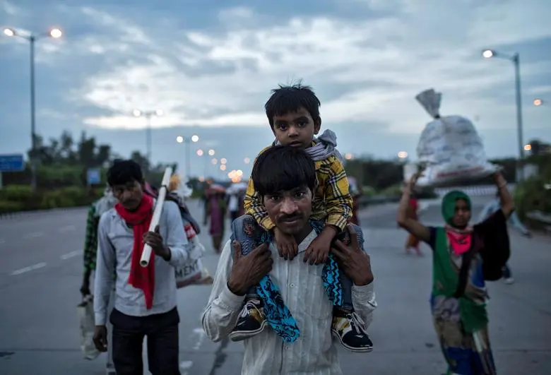

### 

 

### ਸ਼ਾਮ ਦਾ ਰੰਗ

ਸ਼ਾਮ ਦਾ ਰੰਗ ਫਿਰ ਪੁਰਾਣਾ ਹੈ ਜਾ ਰਹੇ ਨੇ ਬਸਤੀਆਂ ਨੂੰ ਫੁਟਪਾਥ ਜਾ ਰਹੀ ਝੀਲ ਕੋਈ ਦਫਤਰੋਂ ਨੌਕਰੀ ਤੋਂ ਲੈ ਜਵਾਬ ਪੀ ਰਹੀ ਏ ਝੀਲ ਕੋਈ ਜਲ ਦੀ ਪਿਆਸ

ਤੁਰ ਪਿਆ ਏ ਸ਼ਹਿਰ ਕੁਝ ਪਿੰਡਾਂ ਦੇ ਰਾਹ ਸੁੱਟ ਕੇ ਕੋਈ ਜਾ ਰਿਹਾ ਸਾਰੀ ਕਮਾਈ

ਹੂੰਝਦਾ ਕੋਈ ਆ ਰਿਹਾ ਧੋਤੀ ਦੇ ਨਾਲ ਕਮਜ਼ੋਰ ਪਸ਼ੂਆਂ ਦੇ ਪਿੰਡੇ ਤੋਂ ਆਰਾਂ ਦਾ ਖ਼ੂਨ ਸ਼ਾਮ ਦਾ ਰੰਗ ਫਿਰ ਪੁਰਾਣਾ ਹੈ

### ਲੰਮਾ ਲਾਰਾ

ਛੱਡ ਤੁਰੇ ਹਨ ਇਕ ਹੋਰ ਗ਼ੈਰਾਂ ਦੀ ਜ਼ਮੀਨ ਛੱਜਾਂ ਵਾਲੇ ਜਾ ਰਿਹਾ ਏ ਲੰਮਾ ਲਾਰਾ ਝਿੜਕਾਂ ਦੇ ਭੰਡਾਰ ਲੱਦੀ ਲੰਮੇ ਸਾਇਆਂ ਦੇ ਨਾਲ ਨਾਲ ਗਧਿਆਂ ਤੇ ਬੈਠੇ ਨੇ ਜੁਆਕ

ਪਿਉਆਂ ਦੇ ਹੱਥ ਵਿਚ ਕੁੱਤੇ ਹਨ ਮਾਵਾਂ ਦੀ ਪਿੱਠ ਪਿੱਛੇ ਬੰਨ੍ਹੇ ਪਤੀਲੇ ਹਨ ਪਤੀਲਿਆਂ 'ਚ ਮਾਵਾਂ ਦੇ ਪੁੱਤ ਸੁੱਤੇ ਹਨ

ਜਾ ਰਿਹਾ ਏ ਲੰਮਾ ਲਾਰਾ ਮੋਢਿਆਂ 'ਤੇ ਚੁੱਕੀ ਕੁੱਲੀਆਂ ਦੇ ਬਾਂਸ ਇਹ ਭੁੱਖਾਂ ਦੇ ਮਾਰੇ ਕੌਣ ਆਰੀਆ ਹਨ? ਇਹ ਜਾ ਰਹੇ ਹਨ ਰੋਕਣ ਕਿਸ ਭਾਰਤ ਦੀ ਜ਼ਮੀਨ?

ਨੌਜਵਾਨਾਂ ਨੂੰ ਕੁੱਤੇ ਪਿਆਰੇ ਹਨ ਉਹ ਕਿੱਥੇ ਪਾਲਣ ਮਹਿਲਾਂ ਦੇ ਚਿਹਰਿਆਂ ਦਾ ਪਿਆਰ?

ਉਹ ਭੁੱਖਾਂ ਦੇ ਸ਼ਿਕਾਰ ਛੱਡ ਤੁਰੇ ਹਨ ਇਕ ਹੋਰ ਗੈਰਾਂ ਦੀ ਜ਼ਮੀਨ

ਜਾ ਰਿਹਾ ਏ ਲੰਮਾ ਲਾਰਾ ਇਹਨੂੰ ਕੀ ਪਤਾ ਹੈ? ਕਿੰਨੇ ਕੁ ਬੰਨ੍ਹੇ ਕੀਲਿਆਂ ਦੇ ਨਾਲ ਜਾਲੇ ਜਾਂਦੇ ਨੇ ਰੋਜ਼ ਲੋਕ ਜੋ ਛੱਡ ਵੀ ਸਕਦੇ ਨਹੀਂ ਬਸਤੀਆਂ ਨੂੰ ਕਿਸੇ ਰੋਜ਼

ਜਾ ਰਿਹਾ ਹੈ ਨਾਲ ਨਾਲ ਬਸਤੀ ਦੇ ਰੁੱਖਾਂ ਦਾ ਸਾਇਆ ਫੜ ਰਿਹਾ ਹੈ ਓਦਰੇ ਪਸ਼ੂਆਂ ਦੇ ਪੈਰ ਓਦਰੇ ਪਿਆਰਾਂ ਦੇ ਪੈਰ

ਜਾ ਰਿਹਾ ਏ ਲੰਮਾ ਲਾਰਾ ਜਾ ਰਿਹਾ ਏ ਲੰਮਾ ਲਾਰਾ ਹਰ ਜਗ੍ਹਾ

**The shades of evening**

The shades of evening like many before The pavement are heading for settlements The lake turns back from offices thrown out of work The lake is drinking its thirst Some city has set off on the road to the village Throwing off all wages someone is leaving Someone comes wiping on his dhoti the blood of weak animals on his goad The shades of evening like many before

**The long caravan**

Leaving behind another's land Loaded with the humiliation of rebukes the long caravan moves on along with the lengthening shadows of evening Children on donkeys's backs, fathers cradling dogs in their arms Mothers carrying cauldrons on their backs their children sleeping in those cauldrons The long caravan moves on carrying on their shoulders the bamboo of their huts Who are these starving Aryans which India's land are they headed to occupy Dogs are dear to young men fancying loving faces in palaces is not for them These starving ones have left behind yet another's land The long caravan moves on

\*

Photograph: A migrant worker carries his son as they walk along a road with others to return to their village, during a 21-day nationwide lockdown to limit the spreading of coronavirus disease (COVID-19), in New Delhi, India, March 26, 2020.  Courtesy [REUTERS/Danish Siddiqui ](https://in.reuters.com/news/picture/india-under-coronavirus-lockdown-idINRTS3759U)

Poetry by [Lal Singh Dil](https://parchanve.wordpress.com/category/authors/lal-singh-dil/),  one of the major revolutionary Punjabi poets emerging out of the Naxalite (Maoist-Leninist) Movement in the Indian Punjab towards the late sixties of the 20th century.

Translations by[Nirupma Dutt,](https://parchanve.wordpress.com/category/authors/nirupma-dutt/) She has translated Lal Singh Dil's poetry and memoirs in the book ['Poet of the Revolution: The Memoirs of Lal Singh Dil'](https://www.goodreads.com/book/show/21214907-poet-of-the-revolution)

_Crossposted from [https://parchanve.wordpress.com/2020/03/29/the-long-caravan/](https://parchanve.wordpress.com/2020/03/29/the-long-caravan/)_

---
### Comments:
#### [Sukhpreet Singh]( "ADVOCATESUKHGILL188@GMAIL.COM") - <time datetime="2020-06-07 07:54:18">Jun 0, 2020</time>

ਅੱਜ ਦੇ ਸਮੇਂ ਤੇ ਬਹੁਤ ਹੀ ਢੁਕਵੀਂ ਕਵਿਤਾ

