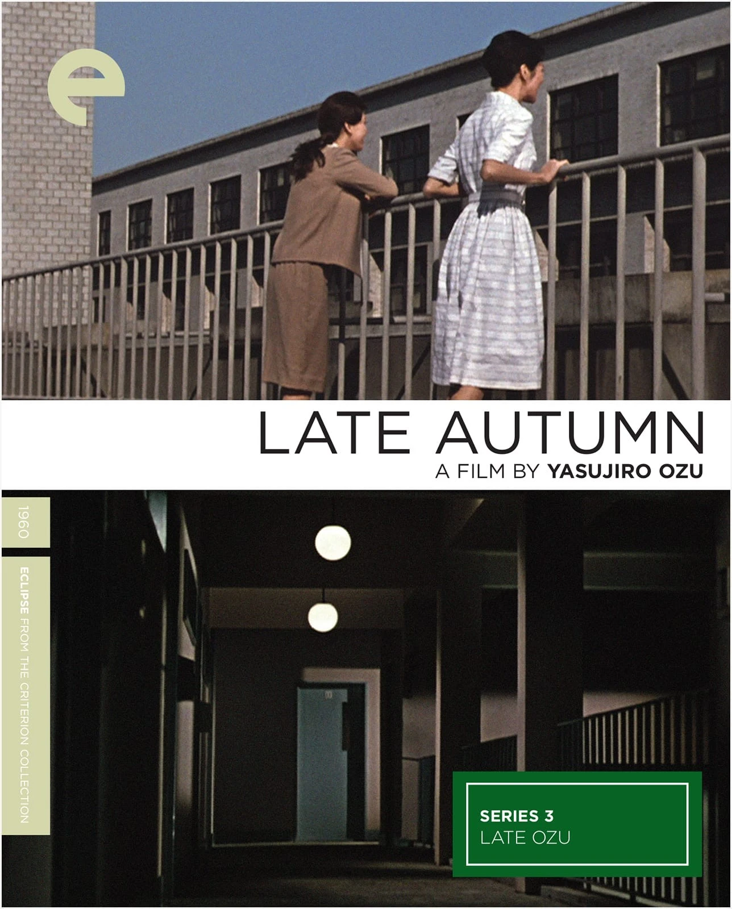

> In _Transcendental Style in Film: Ozu, Bresson, Dreyer_, I compare Ozu with Bresson. They are both minimalists, and they are both concerned with the Other. But East is East and West is West. You can’t go too far in comparing them before you run into some contradictions. Shinto and Christianity present such different concepts of the Wholly Other, you have to almost step back from culture to see that they’re really alike. Christian transcendence implies sacrifice, redemption, transformation. Whereas in Shintoism, the concept of the transcendental implies acceptance emerging.
> 
> So films evoking the Other in these opposing cultures will have to be different. If you compare Martin LaSalle (the young man in Bresson’s _Pickpocket_) with Setsuko Hara, a lot of what’s going on is the same. It’s the same physical attitude. The same restrained emotion. The same cutting pattern. But one is Eastern, and one is Western, I guess. And I think Bresson felt that he had to push you away even further, whereas with Ozu he was working from a tradition of pushing people away. And as Ozu said about an earlier film, _Late Autumn_: “People complicate the simplest things. Life, which seems complex, suddenly reveals itself as very simple. I wanted to show that in this film. There was something else, too. If needing to show drama in a film, the actors laugh or cry. But this is only explanation. A director can really show what he wants without resorting to an appeal to the emotions. I want to make people feel without resorting to drama. And it’s very difficult. In _Late Autumn_, I think I was really successful. But the results are still far from perfect.”
> 
> This may sound familiar. It sounds very much like Bresson. They both understand the power of withholding. And it is tricky with Bresson because there’s a thin line you have to walk when you’re pushing the audience away while you want them to come toward you. It’s not unlike the power of withholding in _any_ relationship. Playing hard to get or unfeeling may make you seem kind of mysterious and intriguing to people, but it also may drive them away. And so you have to learn how to withhold something in a way that makes the other person really want to come toward you, and in movies it’s not much different.

\- _On Yasujiro Ozu_ By Paul Schrader, [Film Comment ](https://www.filmcomment.com/blog/paul-schrader-on-yasujiro-ozu/)

\--

Following this essay, we watched the two films and had a discussion. These are some pointers to explore from some of the some broad themes we touched upon:

Bresson's Pickpocket as a meditation on hands-- hands as a tool for theft, hands for prayer.

https://www.youtube.com/watch?v=uk\_yKYhBjKA

Ozu's films are more like a painting in terms of composition. He used music. His films had a polyphony of voices unlike Pickpocket's interiority of  one man. All Ozu's characters were given importance and worked in a harmony to achieve a sense of truth or resolution. Ozu’s films also had a lot of different kinds of characters, and sounds (such as trains, every day conversations, movement)

Ozu has more composition, stillness, movement becomes defined around that stillness-- the camera remains as people go about their daily chores, a frame of a train returning and a shot of the house we visited this morning brings us to a change of time, and often a lot has changed in the lives in this timeframe as well.

Bresson has more movement, orchestration, fragmentation. The camera not only moves but breaks the whole into parts. The scenes where the pickpocket learns how to, well, pick a pocket more skillfully, it almost feels like a dance, an orchestration of the hands achieving a new skill. The hands must also become more 'agile' or nimble to achieve this.

Ozu: lack of plot, the same story comes to us in different ways-- the daughter from Late Spring is the mother in Late Autumn, a circularity of feeling is transferred from one story to another. In each film some idea of 'truth' (not a literal truth, but as essence of life) comes through acceptance. Acceptance of loss, death must turn into a celebration of life-- is this the Eastern/ oriental spirituality that was being touched upon in the essay?

In Bresson, a sense of feeling or the way out of numbness comes through faith. A man who must resort to being a pickpocket because society has failed him, suddenly wants to 'feel' again.

Ozu and Bresson, some binaries: Faith/ materiality Wholeness vs, fragmentedness simplicity vs complexity universal truth vs an individual sense of realization

In Ozu, the sense of truth comes in an everyday act. Characters come to a sense of truth, a passing of time, the peeling of an apple is suddenly not just an act of uncovering the fruit, it becomes an act of uncovering the truth-- the absence of the daughter must come to be accepted and everyday movements and habits must be readjusted to this new truth.

The folding of clothes is like the folding of chapter, a turning of the page to go further in the book.

In the journey of the pickpocket, there is a meditation. The agency of change or realisation is led by an event, a series of happenings. Plot, occurence in not incidental, like it is in Ozu, it becomes very important to the character's transformation.

Ozu has a space for the feminine, there are also middle class characters

While Bresson, Kurosawa have characters from all walks of life, but often the masculine takes the centrestage in the narrative

\-  Diti Pujara's notes from a Hangout call with Kiran Rajhans, Shashank Walia and Jasdeep Singh on 25 April 2020

_Crossposted from [https://jasdeepsingh.wordpress.com/2020/05/03/notes-on-ozu-and-bresson/](https://jasdeepsingh.wordpress.com/2020/05/03/notes-on-ozu-and-bresson/)_