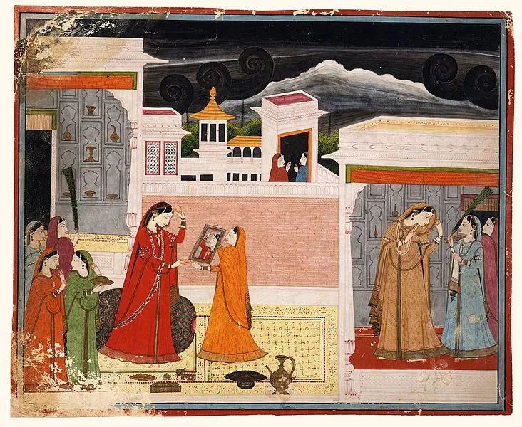

  

ਆਖ਼ਰ ਪਛੋਤਾਵੇਂਗੀ ਕੁੜੀਏ,  
ਉਠਿ ਹੁਣ ਢੋਲ ਮਨਾਇ ਲੈ ਨੀਂ  
ਰਹਾਉ।  
  
ਸੂਹੇ ਸਾਵੇ ਲਾਲ ਬਾਣੇ,  
ਕਰਿ ਲੈ ਕੁੜੀਏ ਮਨ ਦੇ ਭਾਣੇ,  
ਇਕੁ ਘੜੀ ਸ਼ਹੁ ਮੂਲ ਨ ਭਾਣੇ,  
ਜਾਸਨਿ ਰੰਗ ਵਟਾਇ।1।  
  
ਕਿਥੇ ਨੀ ਤੇਰੇ ਨਾਲਿ ਦੇ ਹਾਣੀ,  
ਕੱਲਰ ਵਿਚਿ ਸਭ ਜਾਇ ਸਮਾਣੀ,  
ਕਿਥੇ ਹੀ ਤੇਰੀ ਉਹ ਜਵਾਨੀ,  
ਕਿਥੇ ਤੇਰੇ ਹੁਸਨ ਹਵਾਇ।2।  
  
ਕਿਥੇ ਨੀ ਤੇਰੇ ਤੁਰਕੀ ਤਾਜ਼ੀ,  
ਸਾਂਈਂ ਬਿਨੁ ਸਭ ਕੂੜੀ ਬਾਜ਼ੀ,  
ਕਿਥੇ ਨੀ ਤੇਰਾ ਸੁਇਨਾ ਰੁਪਾ,  
ਹੋਏ ਖ਼ਾਕ ਸੁਆਹਿ।3।  
  
ਕਿਥੇ ਨੀ ਤੇਰੇ ਮਾਣਿਕ ਮੋਤੀ,  
ਅਹੁ ਜੰਜ ਤੇਰੀ ਆਇ ਖਲੋਤੀ,  
ਕਹੈ ਹੁਸੈਨ ਫ਼ਕੀਰ ਨਿਮਾਣਾ,  
ਪਉ ਸਾਂਈਂ ਦੇ ਰਾਹਿ।4।

आख़र पछोतावेंगी कुड़ीए,  
उठि हुन ढोल मनाय लै नीं  
रहाउ।  
  
सूहे सावे लाल बाणे,  
करि लै कुड़ीए मन दे भाणे,  
इकु घड़ी शहु मूल न भाणे,  
जासनि रंग वटाय ।1।  
  
किथे नी तेरे नालि दे हाणी,  
कल्लर विचि सभ जाय समाणी,  
किथे ही तेरी उह जवानी,  
किथे तेरे हुसन हवाय ।2।  
  
किथे नी तेरे तुरकी ताज़ी,  
सांईं बिनु सभ कूड़ी बाज़ी,  
किथे नी तेरा सुइना रुपा,  
होए ख़ाक सुआह ।3।  
  
किथे नी तेरे माणिक मोती,  
अहु जंज तेरी आइ खलोती,  
कहै हुसैन फ़कीर निमाणा,  
पउ सांईं दे राह ।4।

آخر پچھوتاوینگی کڑیئے،  
اٹھِ ہن ڈھول منائِ لے نیں  
رہاؤ۔  
  
سوہے ساوے لال بانے،  
کرِ لے کڑیئے من دے بھانے،  
اکُ گھڑی شہہ مول ن بھانے،  
جاسنِ رنگ وٹائ ۔1۔  
  
کتھے نی تیرے نالِ دے ہانی،  
کلر وچِ سبھ جائ سمانی،  
کتھے ہی تیری اوہ جوانی،  
کتھے تیرے حسن ہوائ ۔2۔  
  
کتھے نی تیرے ترکی تازی،  
سانئیں بنُ سبھ کوڑی بازی،  
کتھے نی تیرا سوئنا رپا،  
ہوئے خاک سوآہِ ۔3۔  
  
کتھے نی تیرے مانک موتی،  
اہُ جنج تیری آئِ کھلوتی،  
کہےَ حسین فقیر نمانا،  
پؤ سانئیں دے راہِ ۔4۔

  

https://soundcloud.com/saminahasansyed/uth-hun-dhol-mana-sangat-gavan-shah-hussain-composition-najm-hosain-syed

  
Picture Courtesy: Damayanti Looks in the Mirror, Folio from Nala-Damayanti. Kangra, circa 1790.

_Crossposted from [https://sayshussain.wordpress.com/2020/05/10/uth-hun-dhol-mana/](https://sayshussain.wordpress.com/2020/05/10/uth-hun-dhol-mana/)_