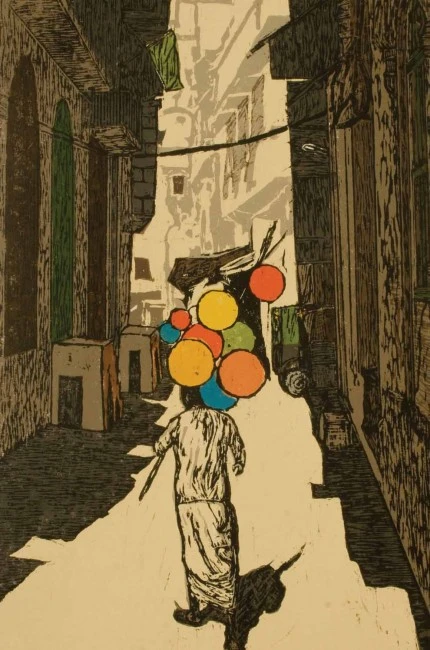

_Kucha Pirsherazi Inside Mori Gate. Woodcut. Mehboob Ali_  

ਸੱਜਣਾ, ਅਸਾਂ ਮੋਰੀਓਂ ਲੰਘ ਪਇਆ ਸੇ ।  
ਭਲਾ ਹੋਇਆ ਗੁੜ ਮੱਖੀਆਂ ਖਾਧਾ,  
ਅਸੀਂ ਭਿਣ ਭਿਣਾਟੋਂ ਛੁਟਿਆ ਸੇ  
।ਰਹਾਉ।  
  
ਢੰਡ ਪੁਰਾਣੀ ਕੁੱਤਿਆਂ ਲੱਕੀ,  
ਅਸੀਂ ਸਰਵਰ ਮਾਹਿ ਧੋਤਿਆ ਸੇ  
।1।  
  
ਕਹੈ ਹੁਸੈਨ ਫ਼ਕੀਰ ਸਾਈਂ ਦਾ,  
ਅਸੀਂ ਟੱਪਣ ਟੱਪ ਨਿਕਲਿਆ ਸੇ  
।2।

सज्जणा, असीं मोरीयों लंघ पया से ।  
भला होया गुड़ मक्खियां खाधा,  
असीं भिन भिणाटों छुट्या से  
।रहाउ।  
  
ढंड पुरानी कुत्त्यां लक्की,  
असीं सरवर माह धोत्या से  
।1।  
  
कहै हुसैन फ़कीर साईं दा,  
असीं टप्पन टप्प निकल्या से  
।2।

سجنا، اسیں موریؤں لنگھ پیاسے ۔  
بھلا ہویا گڑ مکھیاں کھادھا،  
اسیں بھن بھناٹوں چھٹیاسے  
۔رہاؤ۔  
  
ڈھنڈ پرانی کتیاں لکی،  
اسیں سرور ماہِ دھوتیاسے  
۔1۔  
  
کہےَ حسین فقیر سائیں دا،  
اسیں ٹپن ٹپّ نکلیاسے  
۔2۔

ਢੰਡ (Dhandh) : ਨਦੀ ਦਾ ਵਹਿੰਦਾ ਪਾਣੀ ਸੁੱਕ ਜਾਣ ਤੇ ਵਹਿਣ ਵਿਚ ਪਾਣੀ ਦਾ ਭਰਿਆ ਟੋਇਆ

Mis**Translation and** Mis**Reading:**

Sweatheart, I have crossed the narrow alley.  
  
The flies devoured the jaggery, good riddance.  
I am free from their buzz |Pause|

The dogs lick at the puddles of a dead rivulet  
I have cleaned/bathed at the lake (full of fresh water). |1|

Says Hussain, the fakir of the sayeen  
I jumped and crossed over. |2|  

Shah Hussain uses this metaphor of passing through a narrow path (Raah Ishq da Suee da nakka, dhagha hoveN taaN jaanve) and importance of having the flexibility. Anything which is sweet like jaggrey also attracts flies or intrusions of the others. As the sweet thing, a possession is over, the intruders leave too. (Malamati way of being socially distant?)  
  
The pariah dogs are buzzing around puddle of a waste water, I who has taken a bath in clean water of the _sarovar_. Jumped over it.

**Najam Hussain Syed's Essay:**

Punjabi text:

https://www.scribd.com/document/459856562/Sajjna-Asin-MorioN

Nastaliq text:  
[http://apnaorg.com/books/najam-books/sach-sada-abadi/book.php?fldr=book](http://apnaorg.com/books/najam-books/sach-sada-abadi/book.php?fldr=book)

  
Audio:

https://soundcloud.com/saminahasansyed/sach-sada-abadi-karna-chapter-05-sajna-morio-langh-pyasy

**Sung by Ayesha Ali:**

https://soundcloud.com/singh-jasdeep/sajjna-asin-morion-langh-paye-se

Painting Courtesy: _[Lahore woodcut](https://fountainink.in/photostory/lahore-woodcut)_, Photo Story in Fountain Ink magazine.

_Crossposted from [https://sayshussain.wordpress.com/2020/05/05/sajjna-asan-morion-langh-payia-se/](https://sayshussain.wordpress.com/2020/05/05/sajjna-asan-morion-langh-payia-se/)_