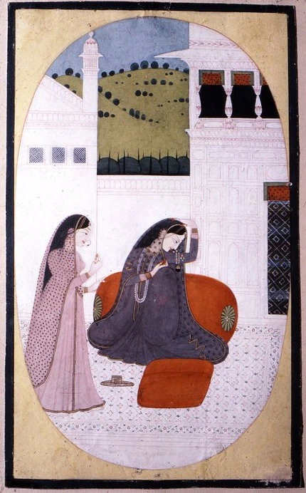

ਕੀਤੀ ਹਾਂ ਇਸ਼ਕ ਅਟੇਰਨ ਸਈਓ  
ਕੀਤੀ ਹਾਂ ਇਸ਼ਕ ਅਟੇਰਨ  
|ਰਹਾਓ|  
  
ਆਤਨ ਬੈਠੀ ਬਹਿਣ ਨਾ ਸੁਝਦਾ  
ਰਹਿ ਗਿਆ ਚਰਖਾ ਫੇਰਨ |1|  
  
ਦੁੱਖਾਂ ਦੀ ਰੋਟੀ ਸੂਲ਼ਾਂ ਦਾ ਸਾਲਨ  
ਬਿਰਹੀਂ ਪਾਇਆ ਪੈਰਨ |2|  
  
ਜਿਨ ਲੱਗੀਆਂ ਸੋ ਮੂਲ ਨਾ ਮੁੜੀਆਂ  
ਮੁਸ਼ਕਲ ਹੋਇਆ ਫੇਰਨ |3|  
  
ਕਹੈ ਹੁਸੈਨ ਫਕੀਰ ਸਾਈਂ ਦਾ  
ਵਿਸਰ ਗਿਆ ਮੈਂ ਤੇਰਨ |4|

कीती हां इशक् अटेरन् सईओ  
कीती हां इशक् अटेरन्  
|रहाओ|  
  
आतन् बैठी बहिण् ना सुझदा  
रहि गिआ चरखा फेरन् |1|  
  
दुक्खां दी रोटी सूळां दा सालन्  
बिरहीं पाइआ पैरन् |2|  
  
जिन् लग्गीआं सो मूल् ना मुड़ीआं  
मुशकल् होइआ फेरन् |3|  
  
कहै हुसैन् फकीर् साईं दा  
विसर् गिआ मैं तेरन् |4|

کیتی ہاں عشقَ اٹیرن سئیؤ  
کیتی ہاں عشقَ اٹیرن  
|رہاؤ|  
  
آتن بیٹھی بہن نہ سجھدا  
|رہِ گیا چرکھا پھیرن |1  
  
دکھاں دی روٹی سولاں دا سالن  
|برہیں پایا پیرن |2  
  
جن لگیاں سو مول نہ مڑیاں  
|مشکل ہویا پھیرن |3  
  
کہےَ حسین فقیر سائیں دا  
|وسر گیا میں تیرن |4

  

**Glossary**

**ਅਟੇਰਨ Ateran:** niddy-noddy, a tool used to make skeins from yarn. It consists of a central bar, with crossbars at each end, offset from each other by 90°. The central bar is generally carved to make it easier to hold.

**[ਆਤਨ](https://dsalsrv04.uchicago.edu/cgi-bin/app/singh_query.py?qs=%E0%A8%86%E0%A8%A4%E0%A8%A8&searchhws=yes)  ÁTAN** _s. m_. (_M_.) A party of women collected to spin thread together; a Spinning Bee:—_átan dí khiṭ bhaj gaí_. The spinning party broke up:—_átan dí rann ná kár ná kamm_. A woman at a spinning- party is not of the slightest use. (Proverb, on the way women waste their time at spinning parties):—_átan vich sahelíyáṇ nit kheḍiṉ te haseṇ; maiṇkúṇ bájh tauṇ dost de rátíṇ ḍiháṇ nahíṇ chaiṉ_. In spinning parties the girls are always playing and laughing; without you, friend, I have no rest by night or day.

**ਫੇਰਨ: [ਫੇਰ](https://dsalsrv04.uchicago.edu/cgi-bin/app/singh_query.py?qs=%E0%A8%AB%E0%A9%87%E0%A8%B0&searchhws=yes) PHER ਫੇਰ** _s. m_. A circuit, circumference, change, turn; difficulty, perplexity;—_ad_. Again, then:—_pher deṉá, v. a_. To impart a circular motion to; to give back, to turn:—_pher gher, s. m_. Circuit, going round and round, going backward and forward; pretence, deception;—_her pher, s. m_. The same as _Pher:—pher laiṉá, v. a_. To take back:—_pher wichch áuṉá, v. n_. To be involved into difficulties.

**ਸੂਲ Sool**: Thorn

**ਸਾਲਣ Saalan**: Salty dish/curry

**ਪੈਰਨ** **Pairan**: Feet

\*\*\*

Painting: Unknown artist, **Proshita-patika Nayika**, between circa 1800 and circa 1820, Opaque watercolor on paper, 9 5/8 x 5 13/16 in. (24.4 x 14.8 cm), Brooklyn Museum

_Crossposted from [https://sayshussain.wordpress.com/2020/05/18/keeti-ha-ishq-ateran/](https://sayshussain.wordpress.com/2020/05/18/keeti-ha-ishq-ateran/)_