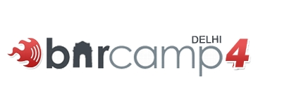

After being postponed 2 times , The Delhi Barcamp 4 started at [Amity](http://www.amity.edu/) audi quite well as scheduled. All credit to Piyush and volunteers the people behind it.

I reached the venue much early and met this guy [Nilesh](http://nileshtrivedi.in/blog/) and IITK and IIML product , He has just started a startup and runs a music school and he was to [perform](http://blog.barcampdelhi.com/barcampers-music-band-lets-rock/) in the evening beer party .

Then the event started in a formal way , But by an amazing personality [Mr. Talwant Singh](http://www.linkedin.com/pub/3/785/572) , A Judge by profession who has used IT in the district courts to evolutionarily automating the processes of District Courts, A first by some one in Government Sector. No wonder he blogs for [cyber security](http://cybercases.blogspot.com/).

He presented a good talk and said build something that **works and is simple to use** even for an illiterate person.

Then it was talk on entrepreneurship incubation my Amity ppl, Then we moved to the presentation halls. First interesting talk was by [chahiye](http://chahiye.info/) guys (one of the main sponsors) . The presntation was a bit over crowded by the American names but the emphasis was on **building something that adds value.**

Nirat Bhatnagar said there are two ways to make a difference :

*   start a business and make profit only
*   start an NGO with no profit no loss.

But there is middle path also , to put ethics in you business , to do something that adds value to society.

Then a nice talk by [two young guys](http://www.fizzyapps.com/) on building facebook apps. They had built a cool Gift sharing app [iGift](http://www.facebook.com/add.php?api_key=89ed4bf98681c9ee5b790027d08bed8f) in their summer training.

Another session was by [Alabot](http://www.alabot.com/) guys , there product is really cool , it uses [NLP](http://en.wikipedia.org/wiki/Natural_language_processing) and sits as middleware to give results for any query from different sources. The talk was more market oriented more then telling how it was built . There was demo for getting air ticket from chennai to banglore. from IM and it provided awesome results.

In the mean time i met my twitter frnd [Mayank Dhingra](http://twitter.com/mayankdhingra) , He is working some really cool stuff at a startup that works in Mobile and Python . Then the guys frm quite famous [slideshare](http://www.slideshare.net/) , [Arun](http://twitter.com/simplyarun) and [Gaurav](http://twitter.com/gauravgupta).

Then it was lunch . After lunch Guneet from chaahiye told about developing web apps with [salesforce](http://www.salesforce.com/).

and Demo by [RouteGuru](http://www.routeguru.com/) folks .

The the last talk was by two _firangs_ Nick and Charlie from UK and Germany . They out sourced themselves to India for yet another startup for yet another [Rails](http://www.rubyonrails.org/) app [Entrip](http://www.entrip.com/) . This talk was pick of the barcamp in terms of demo and the work they had done . Entrip is mashup of Google Maps , flickr facebook and many other api's to show travel trips by frequent travllers on a map .

The two presentation i really liked were by [prashant](http://www.knowprashant.blogspot.com/) on weird topic East Internet company , he elaborated how the History of expeditions lead to colonies and Wat will happen with the internet .

Get the [East Internet Company](http://www.slideshare.net/pacificleo/in-search-of-east-internet-company/) [presentation](http://www.slideshare.net/pacificleo/in-search-of-east-internet-company/) here.

The other presentation was by [Akshatt](http://twitter.com/akshatt) on [Folksonomy](http://en.wikipedia.org/wiki/Folksonomy) the term given to social collaboration over Internet . The power of contribution/sharing can do wonders. Get the [Folksonomy presentation](http://is.gd/hPW) here .

There was quiz to go and a beer party later , but i had to leave as i had been offred lift to gurgaon by another startupper from [Masplantaz](http://www.masplantiz.com/). He is working on some product on [Rails](http://www.rubyonrails.org/) . Wish i hear another startup success story.:)

And Yes i got the free T-Shirt  which says **" I want to change the world but they don't provide the source code "**

This was my first [barcamp](http://barcamp.org/). I wanted to hear about [python](http://www.python.org/)/[django](http://www.djangoproject.com/) stuff . But it was Rails and Entrepreneurship all the way .

My Takeways from the Barcamp were:

**One should build some thing that is simple and that adds value.**

Check out the [Barcamp Pics at Flickr](http://www.flickr.com/photos/tags/bcd4/).

_Crossposted from [https://jasdeepsingh.wordpress.com/2008/05/19/delhi-barcamp-4-take-aways/](https://jasdeepsingh.wordpress.com/2008/05/19/delhi-barcamp-4-take-aways/)_

---
### Comments:
#### [Nilesh Trivedi](http://nileshtrivedi.in "nilesh.tr@gmail.com") - <time datetime="2008-05-20 06:32:07">May 2, 2008</time>

Awesome roundup ! :-) cheers nilesh

#### [Piyush](http://silicontryst.wordpress.com "piyush.gupta@routeguru.com") - <time datetime="2008-05-21 19:28:58">May 3, 2008</time>

Appreciate this detailed post event blogging. Good to get connected to an enthusiast.

#### [Arun](http://twitter.com/simplyarun "arun@simplyarun.com") - <time datetime="2008-05-23 08:03:27">May 5, 2008</time>

Good summary!

#### [Jasdeep](http://jasdeepsingh.wordpress.com/ "jsbhangra@gmail.com") - <time datetime="2008-05-23 09:25:11">May 5, 2008</time>

@nilesh @piyush @arun Thanks for appreciation guys. Looking forward for future meetups. Cheers !

#### [harmeet](http://harmeet.co.cc "harmeetsinghsidhu@gmail.com") - <time datetime="2008-05-29 15:33:53">May 4, 2008</time>

I want to change the world but the don’t provide the source code awesome line..

#### [Delhi Barcamp5 - Sprouted ! &laquo; /home/jasdeep](http://jasdeepsingh.wordpress.com/2008/10/10/delhi-barcamp-5/ "") - <time datetime="2008-10-10 10:47:49">Oct 5, 2008</time>

\[...\] 10, 2008 in IndiaTags: barcamp, delhi, delhibarcamp5 The Delhi Barcamp4 was quite an eye opener and great learning experience for me as it was first Barcamp. To quote from \[...\]

