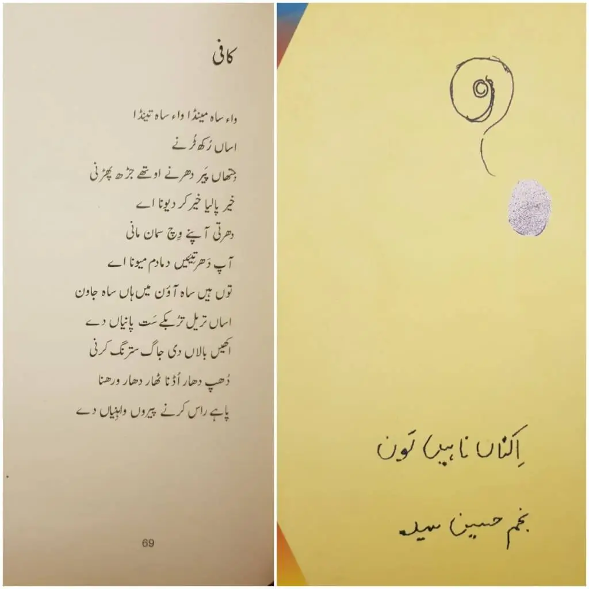

ਕਾਫ਼ੀ

ਵਾਅ ਸਾਹ ਮੈਂਡਾ ਵਾਅ ਸਾਹ ਤੈਂਡਾ  
ਅਸਾਂ ਰੁਖ ਟੁਰਨੇ  
ਜਿੱਥਾਂ ਪੈਰ ਧਰਨੇ ਉਥੇ ਜੜ ਫੜਨੀ  
ਖ਼ੈਰ ਪਾਲਿਆ ਖ਼ੈਰ ਕਰ ਦੇਵਨਾ ਏ  
ਧਰਤੀ ਆਪਣੇ ਵਿਚ ਸਮਾਨ ਮਾਣੀ  
ਆਪ ਧਰਤੀਏਂ ਦਮਾ ਦਮ ਮੇਵਨਾ ਏ  
ਤੂੰ ਹੇਂ ਸਾਹ ਆਵਣ ਮੈਂ ਹਾਂ ਸਾਹ ਜਾਵਣ  
ਅਸਾਂ ਤ੍ਰੇਲ ਤ੍ਰੁਬਕੇ ਸਤ ਪਾਣੀਆਂ ਦੇ  
ਅੱਖੀਂ ਬਾਲਾਂ ਦੀ ਜਾਗ ਸਤਰੰਗ ਕਰਨੀ  
ਧੁਪ ਧਾਰ ਉਡਨਾ ਠਾਰ ਧਾਰ ਵਰ੍ਹਨਾ  
ਪਾਹੇ ਰਾਸ ਕਰਨੇ ਪੈਰੋਂ ਵਾਹਣੀਆਂ ਦੇ.

\- ਨਜਮ ਹੁਸੈਨ ਸੱਯਦ

_Crossposted from [https://jasdeepsingh.wordpress.com/2020/05/26/kafi-najm-hussain-syed/](https://jasdeepsingh.wordpress.com/2020/05/26/kafi-najm-hussain-syed/)_