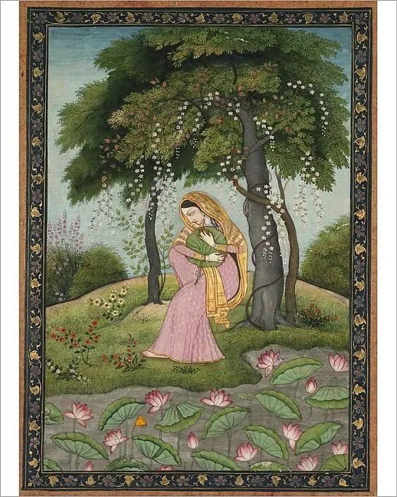

ਮੈਂ ਭੀ ਝੋਕ ਰਾਂਝਣ ਦੀ ਜਾਣਾ,  
ਨਾਲਿ ਮੇਰੇ ਕੋਈ ਚੱਲੇ।ਰਹਾਉ।  
  
ਪੈਰੀਆਂ ਪਉਂਦੀ ਮਿਨਤਾਂ ਕਰਦੀ,  
ਜਾਣਾ ਤਾਂ ਪਇਆ ਇਕੱਲੇ।1।  
  
ਮੈਂ ਭੀ ਝੋਕ ਰਾਂਝਣ ਦੀ ਜਾਣਾ,  
ਨਾਲਿ ਮੇਰੇ ਕੋਈ ਚੱਲੇ  
  
ਨੈਂ ਭੀ ਡੂੰਘੀ ਤੁਲ੍ਹਾ ਪੁਰਾਣਾ,  
ਸ਼ੀਹਾਂ ਤਾਂ ਪੱਤਣ ਮੱਲੇ।2।  
  
ਮੈਂ ਭੀ ਝੋਕ ਰਾਂਝਣ ਦੀ ਜਾਣਾ,  
ਨਾਲਿ ਮੇਰੇ ਕੋਈ ਚੱਲੇ  
  
ਜੇ ਕੋਈ ਖ਼ਬਰ ਮਿਤਰਾਂ ਦੀ ਲਿਆਵੇ,  
ਮੈਂ ਹਥਿ ਦੇ ਦੇਨੀਆਂ ਛੱਲੇ।3।  
  
ਮੈਂ ਭੀ ਝੋਕ ਰਾਂਝਣ ਦੀ ਜਾਣਾ,  
ਨਾਲਿ ਮੇਰੇ ਕੋਈ ਚੱਲੇ  
  
ਰਾਤੀਂ ਦਰਦ ਦਿਹੇਂ ਦਰਮਾਂਦੀ,  
ਘਾਉ ਮਿਤਰਾਂ ਦੇ ਅੱਲੇ।4।  
  
ਮੈਂ ਭੀ ਝੋਕ ਰਾਂਝਣ ਦੀ ਜਾਣਾ,  
ਨਾਲਿ ਮੇਰੇ ਕੋਈ ਚੱਲੇ  
  
ਰਾਂਝਾ ਯਾਰ ਤਬੀਬ ਸੁਣੀਂਦਾ,  
ਮੈਂ ਤਨ ਦਰਦ ਅਵੱਲੇ।5।  
  
ਮੈਂ ਭੀ ਝੋਕ ਰਾਂਝਣ ਦੀ ਜਾਣਾ,  
ਨਾਲਿ ਮੇਰੇ ਕੋਈ ਚੱਲੇ  
  
ਕਹੈ ਹੁਸੈਨ ਫ਼ਕੀਰ ਨਿਮਾਣਾ,  
ਸਾਈਂ ਸੁਨੇਹੜੇ ਘੱਲੇ।6।  
  
ਮੈਂ ਭੀ ਝੋਕ ਰਾਂਝਣ ਦੀ ਜਾਣਾ,  
ਨਾਲਿ ਮੇਰੇ ਕੋਈ ਚੱਲੇ

میں بھی جھوک رانجھن دی جانا،  
نالِ میرے کوئی چلے ۔رہاؤ۔  
  
پیریاں پؤندی منتاں کردی،  
جانا تاں پیا اکلے ۔1۔  
  
میں بھی جھوک رانجھن دی جانا،  
نالِ میرے کوئی چلے  
  
نیں بھی ڈونگھی تلھا پرانا،  
شیہاں تاں پتن ملے ۔2۔  
  
میں بھی جھوک رانجھن دی جانا،  
نالِ میرے کوئی چلے  
  
جے کوئی خبر متراں دی لیاوے،  
میں ہتھِ دے دینیاں چھلے ۔3۔  
  
میں بھی جھوک رانجھن دی جانا،  
نالِ میرے کوئی چلے  
  
راتیں درد دہیں درماندی،  
گھاؤ متراں دے الے ۔4۔  
  
میں بھی جھوک رانجھن دی جانا،  
نالِ میرے کوئی چلے  
  
رانجھا یار طبیب سنیندا،  
میں تن درد اولے ۔5۔  
  
میں بھی جھوک رانجھن دی جانا،  
نالِ میرے کوئی چلے  
  
کہےَ حسین فقیر نمانا،  
سائیں سنیہڑے گھلے ۔6۔  
  
میں بھی جھوک رانجھن دی جانا،  
نالِ میرے کوئی چلے

### Translation:

**Main bhi jhok ranjhan di janan,  
Naal meray koi challey.**  
Travelers, I too have to go  
to the place of my beloved,  
Is there anyone who will go with me?

**Pairan pawondi, mintan kardi,  
Janan tan peya ikalay.**  
I have begged many to accompany me,  
And now I set out alone.

**Nain bhi doongi, Tilla purana,  
Sheenhan taan patan mallay.**  
The river is deep and the shaky bridge creaks,  
As people step on it,  
And the ferry is a known haunt of tigers.

**Ratain dard, Deenhan darman si,  
Ghao mitran de allhay.**  
During long nights I have been tortured  
by my raw wounds.

**Ranjhan yaar, Tabeeb sadeenda,  
Main tan dard awallay.**  
I have heard in his lonely hut  
knows the sure remedy.

**Kahay Hussain Faqeer nimanan,  
Sayeen snhorey ghallay.**  
Humble begger Hussain says:  
O God, send me a message  
(invitation to come to you)

Courtesy: [Sufi Poetry](https://sufipoetry.wordpress.com/2009/11/04/jhok-ranjhan/)

### Renditions:

https://www.youtube.com/watch?v=QsbLZrwlAXM

Pathanay Khan  

**Illustration**: Virhini Nayika, Love-Torn Heroine , c. 1800. Creator: Unknown Courtesy [MediaStoreHouse.com](https://www.pinterest.com/pin/739786676277210361/)  

_Crossposted from [https://sayshussain.wordpress.com/2020/06/01/main-bhi-jhok-ranjhan-di-jaana/](https://sayshussain.wordpress.com/2020/06/01/main-bhi-jhok-ranjhan-di-jaana/)_