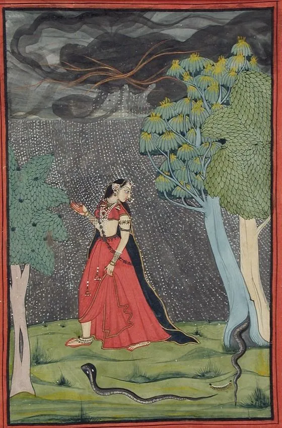

**ਮਿੱਤਰਾਂ ਦੀ ਮਿਜਮਾਨੀਂ ਖ਼ਾਤਰ**  
  
ਮਿੱਤਰਾਂ ਦੀ ਮਿਜਮਾਨੀਂ ਖ਼ਾਤਰ,  
ਦਿਲ ਦਾ ਲਹੂ ਛਾਣੀਦਾ ।1।ਰਹਾਉ।  
  
ਕੱਢਿ ਕਲੇਜਾ ਕੀਤਮ ਬੇਰੇ,  
ਸੋ ਭੀ ਲਾਇਕ ਨਾਹੀਂ ਤੇਰੇ,  
ਹੋਰ ਤਉਫ਼ੀਕੁ ਨਹੀਂ ਕਿਛੁ ਮੇਰੇ,  
ਪੀਉ ਕਟੋਰਾ ਪਾਣੀ ਦਾ ।1।  
  
ਮਿੱਤਰਾਂ ਦੀ ਮਿਜਮਾਨੀਂ ਖ਼ਾਤਰ,  
ਦਿਲ ਦਾ ਲਹੂ ਛਾਣੀਦਾ  
  
ਮਿੱਤਰਾਂ ਲਿਖ ਕਿਤਾਬਤ ਭੇਜੀ,  
ਲੱਗਾ ਬਾਣ ਫਿਰਾਂ ਤੜਫੇਂਦੀ,  
ਤਨ ਵਿਚਿ ਤਾਕਤ ਰਹੀ ਨ ਮੂਲੇ,  
ਰੋ ਰੋ ਹਰਫ਼ ਪਛਾਣੀਦਾ ।2।  
  
ਮਿੱਤਰਾਂ ਦੀ ਮਿਜਮਾਨੀਂ ਖ਼ਾਤਰ,  
ਦਿਲ ਦਾ ਲਹੂ ਛਾਣੀਦਾ  
  
ਤਨ ਮਨ ਅਪੁਣਾ ਪੁਰਜ਼ੇ ਕੀਤਾ,  
ਤੈਨੂੰ ਮਿਹਰ ਨ ਆਈਆ ਮੀਤਾ,  
ਅਸਾਨੂੰ ਹੋਰ ਉਜ਼ਰ ਨ ਕੋਈ,  
ਚਾਰਾ ਕਿਆ ਨਿਮਾਣੀ ਦਾ ।3।  
  
ਮਿੱਤਰਾਂ ਦੀ ਮਿਜਮਾਨੀਂ ਖ਼ਾਤਰ,  
ਦਿਲ ਦਾ ਲਹੂ ਛਾਣੀਦਾ  
  
ਕਹੈ ਹੁਸੈਨ ਫ਼ਕੀਰ ਨਿਮਾਣਾ,  
ਤੈ ਬਾਝਹੁ ਕੋਈ ਹੋਰ ਨ ਜਾਣਾ,  
ਤੂੰ ਹੀ ਦਾਨਾ ਤੂੰ ਹੀ ਬੀਨਾ,  
ਤੂੰਹੇਂ ਤਾਣਿ ਨਿਤਾਣੀ ਦਾ ।4।  
  
ਮਿੱਤਰਾਂ ਦੀ ਮਿਜਮਾਨੀਂ ਖ਼ਾਤਰ,  
ਦਿਲ ਦਾ ਲਹੂ ਛਾਣੀਦਾ

**متراں دی مجمانیں خاطر  
**  
متراں دی مجمانیں خاطر،  
دل دا لہو چھانیدا ۔1۔رہاؤ۔  
  
کڈھِ کلیجہ کیتم بیرے،  
سو بھی لایق ناہیں تیرے،  
ہور تؤفیکُ نہیں کچھ میرے،  
پیؤُ کٹورا پانی دا ۔1۔  
  
متراں دی مجمانیں خاطر  
دل دا لہو چھانیدا  
  
متراں لکھ کتابت بھیجی،  
لگا بان پھراں تڑپھیندی،  
تن وچِ طاقت رہی ن مولے،  
رو رو حرف پچھانیدا ۔2۔  
  
متراں دی مجمانیں خاطر  
دل دا لہو چھانیدا  
  
تن من اپنا پرزے کیتا،  
تینوں مہر ن آئیا میتا،  
اسانوں ہور عذر ن کوئی،  
چارہ کیا نمانی دا ۔3۔  
  
متراں دی مجمانیں خاطر  
دل دا لہو چھانیدا  
  
کہےَ حسین فقیر نمانا،  
تے باجھہُ کوئی ہور ن جانا،  
توں ہی دانا توں ہی بینا،  
تونہیں تانِ نتانی دا ۔4۔  
  
متراں دی مجمانیں خاطر  
دل دا لہو چھانیدا

ਮਿਜ਼ਮਾਨੀ: ਮੇਜ਼ਬਾਨੀ

ਬੇਰੇ: ਟੁਕੜੇ

ਉਜ਼ਰ : ਬਹਾਨਾ, ਹੀਲਾ, ਦਲੀਲ, ਰੁਕਾਵਟ, ਕਾਮਯਾਬੀ , ਆਸ ਪੂਰੀ ਹੋਣੀ

\--

The experience of love is unique and inexpressible.

\-Megha

Iqrar is the ultimate concern in the path of beloved. Like Farid galiye chikkad door ghar.

\-Sumail

ਕੀ ਕਰਦਾ ਨੀ ਕੀ ਕਰਦਾ

ਫਰੀਦ: ਰੱਤ

ਕਲੇਜਾ : bardashat, endurance

\-Abbas

**Alternative Text:**

**ਮਿਤਰਾਂ ਦੀ ਮਿਜਮਾਨੀ ਕਾਰਨ  
**  
ਮਿਤਰਾਂ ਦੀ ਮਿਜਮਾਨੀ ਕਾਰਨ,  
ਦਿਲ ਦਾ ਲੋਹੂ ਛਾਣੀਦਾ ।ਰਹਾਉ।  
  
ਕਾਢ ਕਲੇਜਾ ਕੀਤਾ ਬੇਰੇ,  
ਸੋ ਭੀ ਨਾਹੀਂ ਲਾਇਕ ਤੇਰੇ,  
ਹੋਰ ਤੁਫ਼ੀਕ ਨਹੀਂ ਕੁਛ ਮੇਰੇ,  
ਇਕ ਕਟੋਰਾ ਪਾਣੀ ਦਾ ।1।  
  
ਮਿਤਰਾਂ ਦੀ ਮਿਜਮਾਨੀ ਕਾਰਨ,  
ਦਿਲ ਦਾ ਲੋਹੂ ਛਾਣੀਦਾ  
  
ਸੇਜ ਸੁਤੀ ਨੈਣੀਂ ਨੀਂਦ ਨ ਆਵੈ,  
ਜ਼ਾਲਮ ਬਿਰਹੋਂ ਆਣ ਸਤਾਵੈ,  
ਲਿਖਾਂ ਕਿਤਾਬ ਭੇਜਾਂ ਦਰ ਤੇਰੈ,  
ਦਿਲ ਦਾ ਹਰਫ ਪਛਾਣੀਦਾ ।2।  
  
ਮਿਤਰਾਂ ਦੀ ਮਿਜਮਾਨੀ ਕਾਰਨ,  
ਦਿਲ ਦਾ ਲੋਹੂ ਛਾਣੀਦਾ  
  
ਰਾਤੀਂ ਦਰਦ ਦਿਹੈਂ ਦਰਮਾਤੀ,  
ਹੁਣ ਨੈਣਾਂ ਦੀ ਲਾਈਆ ਕਾਤੀ,  
ਕਦੀਂ ਤੇ ਮੁੜ ਕੇ ਪਾਵਹੁ ਝਾਤੀ,  
ਦੇਖੋ ਹਾਲ ਨਿਮਾਣੀ ਦਾ ।3।  
  
ਮਿਤਰਾਂ ਦੀ ਮਿਜਮਾਨੀ ਕਾਰਨ,  
ਦਿਲ ਦਾ ਲੋਹੂ ਛਾਣੀਦਾ  
  
ਜਿਉਂ ਭਾਵੈ ਤਿਉਂ ਕਰੈ ਪਿਆਰਾ,  
ਇਨ੍ਹਾਂ ਲਗਆਂ ਦਾ ਪੰਥ ਨਿਆਰਾ,  
ਰਾਤੀਂ ਦਿਹੈ ਧਿਆਨ ਤੁਹਾਰਾ,  
ਜਿਉਂ ਭਾਵੈ ਤਿਉਂ ਤਾਰੀਦਾ ।4।  
  
ਮਿਤਰਾਂ ਦੀ ਮਿਜਮਾਨੀ ਕਾਰਨ,  
ਦਿਲ ਦਾ ਲੋਹੂ ਛਾਣੀਦਾ  
  
ਤੇਰੇ ਕਾਰਣ ਮੈਂ ਫਿਰਾਂ ਅਜ਼ਾਦੀ,  
ਜੰਗਲ ਢੂੰਡਿਆ ਮੈਂ ਪੈਰ ਪਿਆਦੀ,  
ਰੋ ਰੋ ਨੈਣ ਕਰਨ ਫਰਯਾਦੀ,  
ਕੇਹਾ ਦੋਸ਼ ਨਿਮਾਣੀ ਦਾ ।5।  
  
ਮਿਤਰਾਂ ਦੀ ਮਿਜਮਾਨੀ ਕਾਰਨ,  
ਦਿਲ ਦਾ ਲੋਹੂ ਛਾਣੀਦਾ  
  
ਦੁਖਾਂ ਸੂਲਾਂ ਰਲ ਕੀਤਾ ਏਕਾ,  
ਨ ਕੋਈ ਸਹੁਰਾ ਨ ਕੋਈ ਪੇਕਾ,  
ਆਸ ਰਹੀ ਹੁਣ ਤੇਰੀ ਏਕਾ,  
ਪੱਲਾ ਪਕੜ ਇਆਣੀ ਦਾ ।6।  
  
ਮਿਤਰਾਂ ਦੀ ਮਿਜਮਾਨੀ ਕਾਰਨ,  
ਦਿਲ ਦਾ ਲੋਹੂ ਛਾਣੀਦਾ  
  
ਕਹੈ ਹੁਸੈਨ ਫ਼ਕੀਰ ਕਰਾਰੀ,  
ਦਰਦਵੰਦਾਂ ਦੀ ਰੀਤ ਨਿਆਰੀ,  
ਏਹਾ ਵੇਦਨ ਮੈਂ ਤਨ ਭਾਰੀ,  
ਅੱਗੈ ਸੱਚ ਪਛਾਣੀਦਾ ।7।  
  
ਮਿਤਰਾਂ ਦੀ ਮਿਜਮਾਨੀ ਕਾਰਨ,  
ਦਿਲ ਦਾ ਲੋਹੂ ਛਾਣੀਦਾ

**متراں دی مجمانی کارن**  
  
متراں دی مجمانی کارن،  
دل دا لوہو چھانیدا ۔رہاؤ۔  
  
کاڈھ کلیجہ کیتا بیرے،  
سو بھی ناہیں لایق تیرے،  
ہور توفیق نہیں کچھ میرے،  
اک کٹورا پانی دا ۔1۔  
  
متراں دی مجمانی کارن  
دل دا لوہو چھانیدا  
  
سیج ستی نینیں نیند ن آوے،  
ظالم برہوں آن ستاوے،  
لکھاں کتاب بھیجاں در تیرے،  
دل دا حرف پچھانیدا ۔2۔  
  
متراں دی مجمانی کارن  
دل دا لوہو چھانیدا  
  
راتیں درد دہیں درماتی،  
ہن نیناں دی لائیا کاتی،  
کدیں تے مڑ کے پاوہُ جھاتی،  
دیکھو حالَ نمانی دا ۔3۔  
  
متراں دی مجمانی کارن  
دل دا لوہو چھانیدا  
  
جیوں بھاوے تؤں کرے پیارا،  
ایہناں لگاں دا پنتھ نیارا،  
راتیں دہے دھیان تہارا،  
جیوں بھاوے تؤں تاریدا ۔4۔  
  
متراں دی مجمانی کارن  
دل دا لوہو چھانیدا  
  
تیرے کارن میں پھراں آزادی،  
جنگل ڈھونڈیا میں پیر پیادی،  
رو رو نین کرن پھریادی،  
کیہا دوش نمانی دا ۔5۔  
  
متراں دی مجمانی کارن  
دل دا لوہو چھانیدا  
  
دکھاں سولاں رل کیتا ایکا،  
ن کوئی سہرا ن کوئی پیکا،  
آس رہی ہن تیری ایکا،  
پلہ پکڑ ایانی دا ۔6۔  
  
متراں دی مجمانی کارن  
دل دا لوہو چھانیدا  
  
کہےَ حسین فقیر قراری،  
دردونداں دی ریت نیاری،  
ایہا ویدن میں تن بھاری،  
اگے سچ پچھانیدا ۔7۔  
  
متراں دی مجمانی کارن  
دل دا لوہو چھانیدا

  
**Painting:**  
The Eager Heroine on Her Way to Meet Her Lover out of Love (Kama Abhisarika Nayika)  
Attributed to Mola Ram (India, 1743-1833 (?))  
India, Uttaranchal, Garhwal, early 19th century  
Drawings; watercolors  
Opaque watercolor, gold, and ink on paper  
Image: 9 x 5 3/4 in. (22.86 x 14.6 cm); Sheet: 11 1/2 x 8 1/8 in. (29.21 x 20.64 cm)  
Courtesy [Los Angeles County Museum of Art](https://collections.lacma.org/node/198428)

_Crossposted from [https://sayshussain.wordpress.com/2020/06/10/mitran-di-mijmani-khatar/](https://sayshussain.wordpress.com/2020/06/10/mitran-di-mijmani-khatar/)_