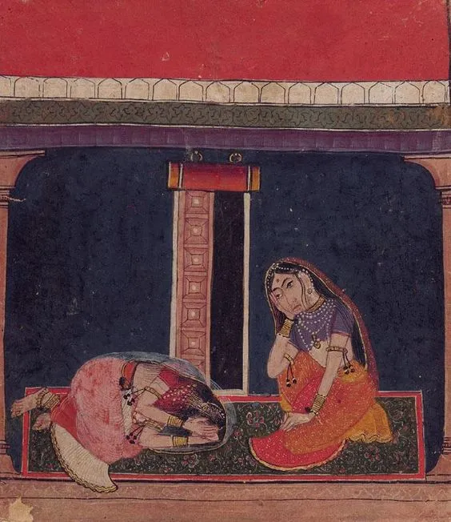

Andhryali Ragini, Baghl (Arki), circa 1700  

ਮਾਏਂ ਨੀਂ ਮੈਂ ਕੈਨੂੰ ਆਖਾਂ,  
ਦਰਦੁ ਵਿਛੋੜੇ ਦਾ ਹਾਲਿ ।1।ਰਹਾਉ।  
  
ਧੂੰਆਂ ਧੁਖੇ ਮੇਰੇ ਮੁਰਸ਼ਦਿ ਵਾਲਾ,  
ਜਾਂ ਫੋਲਾਂ ਤਾਂ ਲਾਲ ।1।  
  
ਮਾਏਂ ਨੀਂ ਮੈਂ ਕੈਨੂੰ ਆਖਾਂ,  
ਦਰਦੁ ਵਿਛੋੜੇ ਦਾ ਹਾਲਿ  
  
ਸੂਲਾਂ ਮਾਰ ਦਿਵਾਨੀ ਕੀਤੀ,  
ਬਿਰਹੁੰ ਪਇਆ ਸਾਡੇ ਖ਼ਿਆਲ ।2।  
  
ਮਾਏਂ ਨੀਂ ਮੈਂ ਕੈਨੂੰ ਆਖਾਂ,  
ਦਰਦੁ ਵਿਛੋੜੇ ਦਾ ਹਾਲਿ  
  
ਦੁਖਾਂ ਦੀ ਰੋਟੀ ਸੂਲਾਂ ਦਾ ਸਾਲਣੁ,  
ਆਹੀਂ ਦਾ ਬਾਲਣੁ ਬਾਲਿ ।3।  
  
ਮਾਏਂ ਨੀਂ ਮੈਂ ਕੈਨੂੰ ਆਖਾਂ,  
ਦਰਦੁ ਵਿਛੋੜੇ ਦਾ ਹਾਲਿ  
  
ਜੰਗਲਿ ਬੇਲੇ ਫਿਰਾਂ ਢੂੰਢੇਂਦੀ,  
ਅਜੇ ਨ ਪਾਇਓ ਲਾਲ ।4।  
  
ਮਾਏਂ ਨੀਂ ਮੈਂ ਕੈਨੂੰ ਆਖਾਂ,  
ਦਰਦੁ ਵਿਛੋੜੇ ਦਾ ਹਾਲਿ  
  
ਕਹੈ ਹੁਸੈਨ ਫ਼ਕੀਰ ਨਿਮਾਣਾ,  
ਸ਼ਹੁ ਮਿਲੇ ਤਾਂ ਥੀਵਾਂ ਨਿਹਾਲਿ ।5।  
  
ਮਾਏਂ ਨੀਂ ਮੈਂ ਕੈਨੂੰ ਆਖਾਂ,  
ਦਰਦੁ ਵਿਛੋੜੇ ਦਾ ਹਾਲਿ

مائیں نیں میں کینوں آکھاں،  
دردُ وچھوڑے دا حالِ ۔1۔رہاؤ۔  
  
دھوآں دھکھے میرے مرشدِ والا،  
جاں پھولاں تاں لال ۔1۔  
  
مائیں نیں میں کینوں آکھاں،  
دردُ وچھوڑے دا حالِ  
  
سولاں مار دوانی کیتی،  
برہں پیا ساڈے خیال ۔2۔  
  
مائیں نیں میں کینوں آکھاں،  
دردُ وچھوڑے دا حالِ  
  
دکھاں دی روٹی سولاں دا سالنُ،  
آہیں دا بالنُ بالِ ۔3۔  
  
مائیں نیں میں کینوں آکھاں،  
دردُ وچھوڑے دا حالِ  
  
جنگلِ بیلے پھراں ڈھونڈھیندی،  
اجے ن پائیو لال ۔4۔  
  
مائیں نیں میں کینوں آکھاں،  
دردُ وچھوڑے دا حالِ  
  
کہےَ حسین فقیر نمانا،  
شہہ ملے تاں تھیواں نہالِ ۔5۔  
  
مائیں نیں میں کینوں آکھاں،  
دردُ وچھوڑے دا حالِ

_Crossposted from [https://sayshussain.wordpress.com/2020/06/23/maye-ni-main-keehnu-aakhan/](https://sayshussain.wordpress.com/2020/06/23/maye-ni-main-keehnu-aakhan/)_