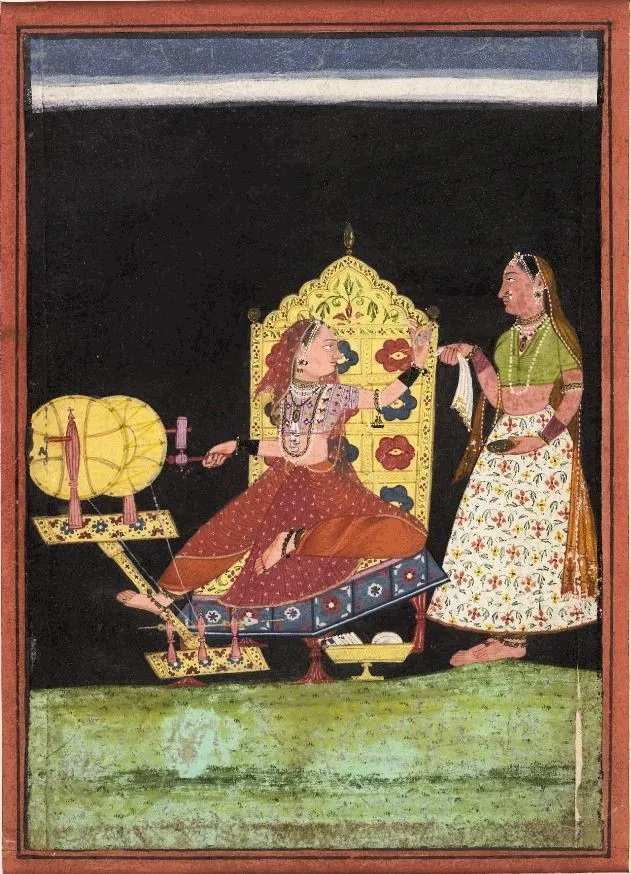

Ragini. A lady at her spinning- wheel turns to her attendant. Devangari script. Bilaspur Style. 1690-1700 Punjab Hills, India  
  

ਚਰਖਾ ਮੇਰਾ ਰੰਗਲੜਾ ਰੰਗ ਲਾਲੁ  
।ਰਹਾਉ।  
  
ਜੇਵਡੁ ਚਰਖਾ ਤੇਵਡੁ ਮੁੰਨੇ,  
ਆਵਣ ਕਹਿ ਗਇਆ, ਬਾਰਾਂ ਪੁੰਨੇ,  
ਸਾਈਂ ਕਾਰਨ ਲੋਇਨ ਰੁੰਨੇ,  
ਰੋਇ ਵੰਞਾਇਆ ਹਾਲੁ ।1।  
  
ਚਰਖਾ ਮੇਰਾ ਰੰਗਲੜਾ ਰੰਗ ਲਾਲ  
  
ਜੇਵਡੁ ਚਰਖਾ ਤੇਵਡੁ ਘੁਮਾਇਣ,  
ਸਭੇ ਆਈਆਂ ਸੀਸ ਗੁੰਦਾਇਣ,  
ਕਾਈ ਨ ਆਈਆ ਹਾਲ ਵੰਡਾਇਣ,  
ਹੁਣ ਕਾਈ ਨ ਚਲਦੀ ਨਾਲੁ ।2।  
  
ਚਰਖਾ ਮੇਰਾ ਰੰਗਲੜਾ ਰੰਗ ਲਾਲ  
  
ਵੱਛੇ ਖਾਧਾ ਗੋੜ੍ਹਾ ਵਾੜਾ,  
ਸਭੋ ਲੜਦਾ ਵੇੜਾ ਪਾੜਾ,  
ਮੈਂ ਕੀ ਫੇੜਿਆ ਵੇਹੜੇ ਦਾ ਨੀਂ,  
ਸਭ ਪਈਆਂ ਮੇਰੇ ਖਿਆਲੁ 3।  
  
ਚਰਖਾ ਮੇਰਾ ਰੰਗਲੜਾ ਰੰਗ ਲਾਲ  
  
ਜੇਵਡੁ ਚਰਖਾ ਤੇਵਡੁ ਪੱਛੀ,  
ਮਾਪਿਆਂ ਮੇਰਿਆਂ ਸਿਰ ਤੇ ਰੱਖੀ,  
ਕਹੈ ਹੁਸੈਨ ਫ਼ਕੀਰ ਸਾਈਂ ਦਾ,  
ਹਰ ਦਮ ਨਾਮ ਸਮਾਲੁ ।4।  
  
ਚਰਖਾ ਮੇਰਾ ਰੰਗਲੜਾ ਰੰਗ ਲਾਲ

चरखा मेरा रंगलड़ा रंग लालु  
।रहाउ।  
  
जेवडु चरखा तेवडु मुन्ने,  
आवण कह गया, बारां पुन्ने,  
साईं कारन लोइन रुन्ने,  
रोइ वंञायआ हालु ।1।  
  
चरखा मेरा रंगलड़ा रंग लाल  
  
जेवडु चरखा तेवडु घुमायण,  
सभे आईआं सीस गुन्दायण,  
काई न आईआ हाल वंडायण,  
हुन काई न चलदी नालु ।2।  
  
चरखा मेरा रंगलड़ा रंग लाल  
  
वच्छे खाधा गोढ़ा वाड़ा,  
सभो लड़दा वेड़ा पाड़ा,  
मैं की फेड़्या वेहड़े दा नीं,  
सभ पईआं मेरे ख्यालु ।3।  
  
चरखा मेरा रंगलड़ा रंग लाल  
  
जेवडु चरखा तेवडु पच्छी,  
माप्यां मेर्यां सिर ते रक्खी,  
कहै हुसैन फ़कीर साईं दा,  
हर दम नाम समालु ।4।  
  
चरखा मेरा रंगलड़ा रंग लाल

چرکھا میرا رنگلڑا رنگ لالُ  
۔رہاؤ۔  
  
جیوڈُ چرکھا تیوڈُ منے،  
ہن کہہ گیا، باراں پنے،  
سائیں کارن لوئن رنے،  
روئِ وننجایا حالُ ۔1۔  
  
چرکھا میرا رنگلڑا رنگ لال  
  
جیوڈُ چرکھا تیوڈُ گھمائن،  
سبھے آئیاں سیس گندائن،  
کائی ن آئیا حالَ ونڈائن،  
ہن کائی ن چلدی نالُ ۔2۔  
  
چرکھا میرا رنگلڑا رنگ لال  
  
وچھے کھادھا گوڑھا واڑا،  
سبھو لڑدا ویڑا پاڑا،  
میں کی پھیڑیا ویہڑے دا نیں،  
سبھ پئیاں میرے خیالُ 3۔  
  
چرکھا میرا رنگلڑا رنگ لال  
  
جیوڈُ چرکھا تیوڈُ پچھی،  
ماپیاں میریاں سر تے رکھی،  
کہےَ حسین فقیر سائیں دا،  
ہر دم نام سمالُ ۔4۔  
  
چرکھا میرا رنگلڑا رنگ لال

### **G**lossary

**_Rahao. Refrain:_**  
  
Charkha: s.m: A spinning wheel; a real; the axis of a pulley; awater mill or a well; a potter’s wheel, a lathe, the celestial globe or orb; the sphere of the heavens; sky; circular motion; turn; fortune, chance.

Rangrhla: s.m: Coloured, with colour, from rang: s.m. Colour; colouring matter; pigment; paint; dye; colour; tint; hue; complexion; beauty; bloom; expression, countenance, apperarance, aspect; fashion, style; character, nature; mood, mode, manner, method; kind, sort; state, condition, dramatic exhibition, theatre, stage; dancing; singing; acting; sport, enterainment, amusement, merriment, pleasure, enjoyment; - a field of battle.

Laal: adj. Red, red hot; inflamed; - s.m. Enraged; - beloved, draling, dear, precious, - dumb; - s.m. An infant boy, a son; a darling, a pet; - a proper name; - an auspicious colour; color; colour of affirmation of marriage; colour personified; - a ruby.

**_Stanza 1. Line 1:_**

Vadd: adj.: Large, beg, great, immense, huge, grand, noble, high, exalted, eminent; grown up, ole, seniour, elder; superior, supreme, principle; grave, serious; vital, essential, important.

Mannae: s.m. The wooden uprights or posts for supporting a spinning wheel, the structure in which a spindle in installed.

**_Stanza 1. Line 2_**:

Baaraan: adj. Twelve \[12 was the count for a limit, such as a dozen twelve men in a troop, twelve Buddhas, twelve months in a year, twelve years in a generation (ten in the west)\]

Punnae: Have been completed, tec.; from punna: adj. Completed received; reached; - died.

**_Stanza 1. Line 3:_**

Saain: s.m. Master, husband, lord, God; a tittle of faqeers; - father.

Kaaran: adv. Or postpn. For the reason, because (of), on account (of), for the safke (of). S.m Causes, motive, purpose, reason, principle, ground, source, basis; occasion; account, sake, behalf; - action; agency; - father.

Loyan: s.m. Eyes

Runnae: v.n. Cried, wept.

**_Stanza 1. Line 4:_**

Vanjaaya haal (you made me) lose my state or ‘I’; (I) became distraught.

_**Stanza 2. Line 1:**_

Ghumaayan: s.m. The handle of a spinning wheel, the big wheel of a spinning wheel.

**_Stanza 2. Line 2:_**

Sees: s.m. Head; - supplication.

Gundaayan: For kneading, etc; from gundaana: v.t. To cause to knead; - to have plaits or braids made; to have plaits made or weaving done; to have garlands made.

**_Stanza 2. Line 3:_**

Kaee: indef. Pron. Any , anyone, anybody; someone, somebody, some, a few; - in any degree, at all; - unity (as abbreviation of ikaaee)

**_Stanza 3. Line 3:_**

Vacchae: poss. Of vaccha: s.m. The calf of a cow or buffalo while suckling (up to one or two years old); - (met.) a fool, young and brutish, a half – conscious person.

Gohra: s.m. A ball or bunch of carded cotton; the cotton picked from one cotton flower; one handful or ball or cotton used for spinning; - a cord or rope for typing the legs of an animal; a fetter; tether; - a paper-mache basket used for keeping balls of cotton for spinning.

Vaara: s.m. Fence, hedge, outer boundry or enclosure (of any kind); line, border, rim, margin, edge; the full cotton plant; any plant used for making a hedge; the edge of a weapon or tool; a line or row (of soldiers); front; front rank; stock.

**_Stanza 3. Line 2._**

Larda: Fight, etc.; from larna: v.n. To quarrel, fight, come to fisticuffs (with); quarrelsome discussion.

Verha: s.m. Countryard, court, yard, area, quadrangle; inclosed space adjoining a house.

Paara: s.m. Quarater of a town, district, ward; cluster of huts apart from the village to which they belong, hamlet; boundry of a field; neighborhood.

**_Stanza 3. Line 3:_**

Phaeiya: Injured, did mischief to, spoilt, etc.; from phaerna: v.t. To injure, to spoil, to do mischief, to cause a loss to, to (adversely) change from its original situation or position.

**_Stanza 3. Line 4:_**

Paiyyaan maerae khyaal: Are obsessed against me, from khyaal paean: v.n. To go after someone obsessively, to behave with extreme rundeness or incivility (towards), to insult, treat with indignity; to be possessed by an evil spirit.

**_Stanza 4. Line 1:_**

Pacchi: s.f. basket (made with leaves of date palms, &c., or shavings of stalks); bird; skin of sugarcane; arrow; injury.

**_Stanza 4. Line 3:_**

Faqeer: s.m. One who lives in poverty \[commended in the Quraan (35:16), and Hadith, Prophet Muhammad (m.p.b.u.h.) said, “Poverty is my pride”\]. Poverty signifies, (a) material impoverishment deliberately sought which aims at being liberated from the temptation and possession of material things so that one can foucs on ceaseless inner struggle; (b) it connotes every virtue which the seeker in the way of God embraces, as through povery, meaning ceasing to be self-centred, one can become a channel for God’s grace and the submitted lover of the Divine Beloved; - categories of faqeers known as malaamati (self-repreoaching) or qalander (who abandon all wordly relations) are usually itinerant darvaeshes who reject conventional motes and mock the patterned life that pertained to the khaanqaah-mazaar (convent-tomb) complexs or shrines. These faqeers are spiritual ecstatics who are also social eccentrics; - one who lives in faqar (pious poverty); - a mystic lover of God; - one who has purged himself of egotism, lust, anger, greed, delusion (including self-delusion), pride, etc., a devotee; - a religious mendicant; a beggar.

**_Stanza 4. Line 4:_**

Naam: s.m. Name, (usually means God).

Samhaal: v.t. To remember, to bring to mind; to repeat.

###   
Translation

Coloured is my spinning wheel, red dyed

If big the spinning wheel, big its uprights  
He said in twelve periods we’d reunite  
Because of the lord, se the weeping eye’s plight  
Crying so, my self mortified

Coloured is my spinining wheel, red dyed

If big the spinning wheel, big its revolution  
To have heads braided, all came of their own volition  
No one came joys, sorrows to apportion  
No one walks alongside

Coloured is my spinning wheel, red dyed

The calf munched the cotton stock  
Quarrels with all, in the countryard runs amok  
What mischief in the courtyard did I unlock?  
I’m the obsession of everyone’s broadside

Coloured is my spinning wheel, red dyed

If big the spinning wheel, big the basket  
On my head parents put the casket  
Says Husayn the Lord’s devotee  
Every moment with the Name abide

Coloured is my spinning wheel, red dyed

\*\*\*

Courtesy [http://www.wichaar.com/news/172/ARTICLE/3396/2008-03-08.html](http://www.wichaar.com/news/172/ARTICLE/3396/2008-03-08.html)

_Crossposted from [https://sayshussain.wordpress.com/2020/05/26/charkha-mera-ranglarha-rang-laal/](https://sayshussain.wordpress.com/2020/05/26/charkha-mera-ranglarha-rang-laal/)_