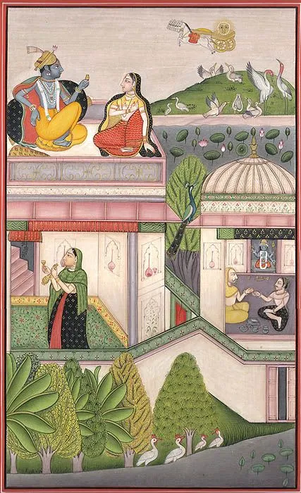

ਜੇਤੀ ਜੇਤੀ ਦੁਨੀਆਂ ਰਾਮ ਜੀ,  
– ਤੇਰੇ ਕੋਲੋਂ ਮੰਗਦੀ ।ਰਹਾਉ।  
  
ਕੂੰਡਾ ਦੇਈਂ ਸੋਟਾ ਦੇਈਂ,  
ਕੋਠੀ ਦੇਈਂ ਭੰਗ ਦੀ ।  
  
ਜੇਤੀ ਜੇਤੀ ਦੁਨੀਆਂ ਰਾਮ ਜੀ,  
– ਤੇਰੇ ਕੋਲੋਂ ਮੰਗਦੀ  
  
ਸਾਫ਼ੀ ਦੇਈਂ ਮਿਰਚਾਂ ਦੇਈਂ,  
ਬੇ-ਮਿਨਤੀ ਦੇਈਂ ਰੰਗ ਦੀ ।  
  
ਜੇਤੀ ਜੇਤੀ ਦੁਨੀਆਂ ਰਾਮ ਜੀ,  
– ਤੇਰੇ ਕੋਲੋਂ ਮੰਗਦੀ  
  
ਪੋਸਤ ਦੇਈਂ ਬਾਟੀ ਦੇਈਂ,  
ਚਾਟੀ ਦੇਈਂ ਖੰਡ ਦੀ ।  
  
ਜੇਤੀ ਜੇਤੀ ਦੁਨੀਆਂ ਰਾਮ ਜੀ,  
– ਤੇਰੇ ਕੋਲੋਂ ਮੰਗਦੀ  
  
ਗਿਆਨ ਦੇਈਂ ਧਿਆਨ ਦੇਈਂ,  
ਮਹਿਮਾ ਸਾਧੂ ਸੰਗ ਦੀ ।  
  
ਜੇਤੀ ਜੇਤੀ ਦੁਨੀਆਂ ਰਾਮ ਜੀ,  
– ਤੇਰੇ ਕੋਲੋਂ ਮੰਗਦੀ  
  
ਸ਼ਾਹ ਹੁਸੈਨ ਫ਼ਕੀਰ ਸਾਂਈਂ ਦਾ,  
ਇਹ ਦੁਆਇ ਮਲੰਗ ਦੀ ।  
  
ਜੇਤੀ ਜੇਤੀ ਦੁਨੀਆਂ ਰਾਮ ਜੀ,  
– ਤੇਰੇ ਕੋਲੋਂ ਮੰਗਦੀ

जेती जेती दुनियां राम जी,  
– तेरे कोलों मंगदी ।रहाउ।  
  
कूंडा देईं सोटा देईं,  
कोठी देईं भंग दी ।  
  
जेती जेती दुनियां राम जी,  
– तेरे कोलों मंगदी  
  
साफ़ी देईं मिरचां देईं,  
बे-मिनती देईं रंग दी ।  
  
जेती जेती दुनियां राम जी,  
– तेरे कोलों मंगदी  
  
पोसत देईं बाटी देईं,  
चाटी देईं खंड दी ।  
  
जेती जेती दुनियां राम जी,  
– तेरे कोलों मंगदी  
  
ग्यान देईं ध्यान देईं,  
महमा साधू संग दी ।  
  
जेती जेती दुनियां राम जी,  
– तेरे कोलों मंगदी  
  
शाह हुसैन फ़कीर सांईं दा,  
इह दुआइ मलंग दी ।  
  
जेती जेती दुनियां राम जी,  
– तेरे कोलों मंगदी

جیتی جیتی دنیاں رام جی،  
– تیرے کولوں منگدی ۔رہاؤ۔  
  
کونڈا دیئیں سوٹا دیئیں،  
کوٹھی دیئیں بھنگ دی ۔  
  
جیتی جیتی دنیاں رام جی،  
– تیرے کولوں منگدی  
  
صافی دیئیں مرچاں دیئیں،  
بے-منتی دیئیں رنگ دی ۔  
  
جیتی جیتی دنیاں رام جی،  
– تیرے کولوں منگدی  
  
پوست دیئیں باٹی دیئیں،  
چاٹی دیئیں کھنڈ دی ۔  
  
جیتی جیتی دنیاں رام جی،  
– تیرے کولوں منگدی  
  
گیان دیئیں دھیان دیئیں،  
مہما سادھو سنگ دی ۔  
  
جیتی جیتی دنیاں رام جی،  
– تیرے کولوں منگدی  
  
شاہ حسین فقیر سانئیں دا،  
ایہہ دعائِ ملنگ دی ۔  
  
جیتی جیتی دنیاں رام جی،  
– تیرے کولوں منگدی

https://www.youtube.com/watch?v=kCJiOxxrsGo

Rendition by Madan Gopal Singh

**Painting:**  
Baramasa: The Month of Agahan  
Water Color on Paper  
Artist: Navneet Parikh  
8.0" X 13.0"

Courtesy: [Exotic India Art](https://www.exoticindiaart.com/product/paintings/baramasa-month-of-agahan-HK30/)

_Crossposted from [https://sayshussain.wordpress.com/2020/07/08/jeti-jeti-dunia-teri-ram-ji/](https://sayshussain.wordpress.com/2020/07/08/jeti-jeti-dunia-teri-ram-ji/)_