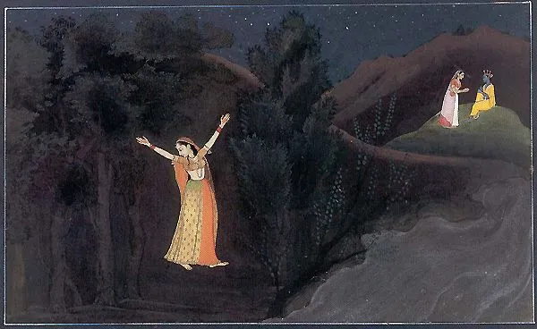

ਐਂਵੇ ਗੁਜਰੀ ਰਾਤਿ,  
ਖੇਡਣਿ ਨਾ ਥੀਆ ।ਰਹਾਉ।  
  
ਸਭੇ ਜਾਤੀ ਵੱਡੀਆਂ,  
ਨਿਆਣੀ ਫ਼ਕੀਰਾਂ ਦੀ ਜਾਤਿ ।1।  
  
ਖੇਡਿ ਘਿੰਨੋ ਖਿਡਾਇ ਘਿੰਨੋ,  
ਥੀ ਗਈ ਪਰਭਾਤਿ ।2।  
  
ਖੜਾ ਪੁਕਾਰੇ ਪਾਤਣੀ  
ਬੇੜਾ ਕਪਰ ਵਾਤ ।3।  
  
ਸ਼ਾਹ ਹੁਸੈਨ ਦੀ ਆਜਜ਼ੀ,  
ਕਾਛ (ਕਾਫ਼) ਕੁਹਾੜੇ ਵਾਤਿ ।4।

एंवैं गुजरी राति,  
खेडनि ना थिया ।रहाउ।  
  
सभे जाती वड्डियां,  
निआनी फ़कीरां दी जाति ।1।  
  
खेडि घिन्नो खिडाय घिन्नो,  
थी गई परभाति ।2।  
  
खड़ा पुकारे पातणी  
बेड़ा कपर वात ।3।  
  
शाह हुसैन दी आजज़ी,  
काछ (काफ़) कुहाड़े वाति ।4।

ایویں گزری راتِ،  
کھیڈنِ نہ تھیا ۔رہاؤ۔  
  
سبھے جاتی وڈیاں،  
نانی فقیراں دی جاتِ ۔1۔  
  
کھیڈِ گھنو کھڈائ گھنو،  
تھی گئی پربھاتِ ۔2۔  
  
کھڑا پکارے پاتنی  
بیڑا کپر وات ۔3۔  
  
شاہ حسین دی عاجزی،  
کاچھ (قاف) کہاڑے واتِ ۔4۔

ਘਿੰਨੋ/ ਘਿੱਨੋਂ: ਲੈਣਾ, ਪਕੜਨਾ, ਗ੍ਰਹਿਣ  
ਕਪਰ ਵਾਤ: [ਦਰਿਆ ਦਾ ਉੱਚਾ ਕੰਢਾ, ਜਿਸ ਨਾਲ ਖਹਿ ਕੇ ਟੁੱਟਣ ਦਾ ਡਰ ਹੁੰਦਾ ਹੈ](https://punjabipedia.org/topic.aspx?txt=%E0%A8%95%E0%A8%AA%E0%A8%B0)

Ghinno: to partake  
Kapar vaat: Higher bank of the river, hitting which the boat can get damaged

**Translation**:

The night went away and I could not play the game (of love?) |Pause|

Every other community is higher in station, like elders  
the community of the faqirs is lower, like children. |1|  
  
I/We played and made the others play (games like the children play? or the beautiful love games?)  
and the day broke. |2|

I/He calls out at the riverbank  
as his boat is mired at the dangerous bank |3|

Shah Hussain's humbleness  
is like an axe / is under an axe.|4|  

  
**Najam Hussain Syed's Essay**:

Punjabi text:  
https://www.scribd.com/document/459771723/Ainve-Gujri-Raat

Nastaliq text:  
[http://apnaorg.com/books/najam-books/sach-sada-abadi/book.php?fldr=book](http://apnaorg.com/books/najam-books/sach-sada-abadi/book.php?fldr=book)

Audiobook:

https://soundcloud.com/saminahasansyed/sach-sada-abadi-karna-chapter-03-awy-guzri-raat-khedan-na-thya

### Composition:

https://soundcloud.com/saminahasansyed/ainven-guzri-raat-khedan-nathiya-shah-hussain-by-samina-hasan-syed?in=saminahasansyed/sets/shah-hussain

_Crossposted from [https://sayshussain.wordpress.com/2020/05/04/ainve-gujri-raat/](https://sayshussain.wordpress.com/2020/05/04/ainve-gujri-raat/)_